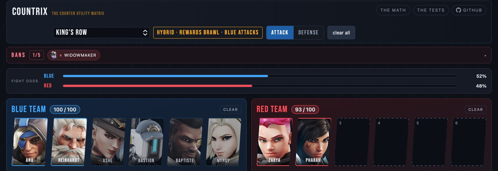
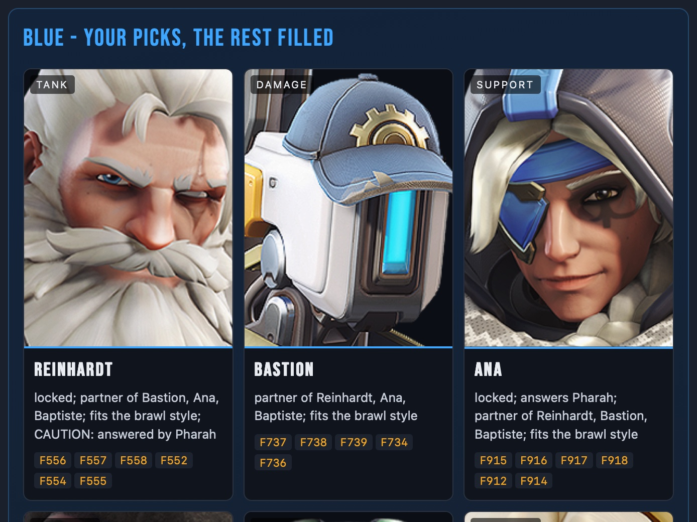
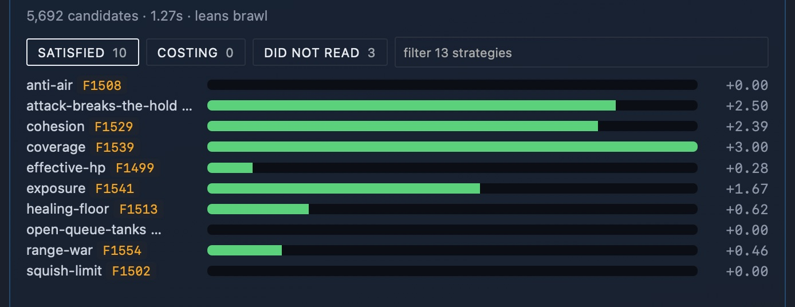
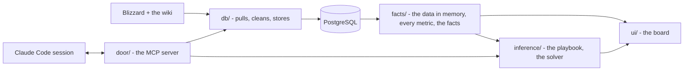

# Countrix

[](https://github.com/mmikol/countrix/actions/workflows/ci.yml)


The Overwatch 2 team composition that counters the one in front of you.
Countrix keeps hero kits, maps, counters and per-map win rates in PostgreSQL,
turns a draft into numbered facts, and finds the highest-scoring six under a
playbook of markdown strategy files a person can read and tune. Every reason it
gives cites a fact.



*King's Row, blue on attack, two picks a side, Widowmaker banned. The solver
fills blue's six around Ana and Reinhardt. Each badge is a side's six as a share
of the best six it could field here: blue's fill is its best, 100; red's two
picks reach 92. The fight odds split those two shares and are not a win
probability. The screenshots run the reference playbook ([below](#quick-start))
without its two rules that read Blizzard's published win rates, and the cards
hide the rate figures: Blizzard licenses those for personal use only.*

## What it does

- **Pulls the game.** Blizzard's hero pages and win rates, the Overwatch wiki's
  kits, maps, counters and synergies - cached, rate-limited, no API keys.
- **Turns a draft into facts.** Map, side, bans and both teams' picks become
  numbered facts (F1, F2, ...): a hero on this map, against each enemy, beside
  each ally, the six against the six.
- **Solves the comp.** A deterministic search enumerates the sixes each role's
  strongest heroes allow, then climbs by local search over the whole roster.
  A default engine scores every candidate on its win rates on the map, the
  wiki's synergies and its counters to the other side - the wiki's, and
  where the wiki says nothing, answers derived from the two kits and named
  on the board with the mechanism that fired; the playbook's
  constraints and heuristics adjust that score. The best six comes back with
  the alternatives and why.
- **Records what was played.** Each map played is entered by hand - both
  sixes, the bans, the side and the result - from the board's record tab or a
  Claude Code session, checked against the roster and the queue's limits. The
  playbook and these matches are the only data a person writes.
- **Serves it three ways.** A web board, an HTTP inference service and an MCP
  (Model Context Protocol) server, the tool interface a Claude Code session
  uses to draft comps and tune the playbook. The solver is arithmetic; the board
  never calls a model.



*Why these six: each pick's reasons, each cited to a numbered fact.*



*How they scored: 5,692 candidates in 1.3 s, one bar per strategy, each with
the fact it read. A limit that holds adds nothing; what a six gives up shows
under costing.*

## How it works



Three layers over one database, each a package, and a test fails any import that
reaches up a layer. Every write goes through one door, the MCP server, the
sentry's quarantine rename aside. Every metric is defined once, so the number
on the board and the number the solver maximises come from the same function.
The playbook is markdown: each strategy is a file with a few lines of
frontmatter, and the solver reads nothing else.

## Engineering

- **940 tests, 97% line coverage** with the database built, against a 75%
  floor. CI runs ruff, mypy and the database-free suite, held to 78%, on every
  push to main and every pull request.
- **The search is held to brute force.** A CI gate enumerates every legal six
  on six small synthetic boards and fails unless the search returns the true
  maximum.
- **Deterministic parallel search.** A process pool splits each board, and the
  pooled and single-process answers are pinned to agree exactly.
- **Typed throughout.** mypy checks every source module in CI; records that
  cross a module boundary are dataclasses, NamedTuples or TypedDicts.
- **One door for writes.** 36 MCP tools over stdio, HTTP or in-process, each
  schema-checked and audited; the query tool runs as a read-only database login.
- **Hardened containers.** Five services share one image and run unprivileged
  on a read-only root with every capability dropped; PostgreSQL keeps the five
  it needs to start. Every port binds to loopback, and every HTTP server refuses
  a foreign Host or Origin. A sentry quarantines a strategy file whose prose
  reads like an injected instruction and flags the same in the scraped text.
- **Tested documentation.** Relative links resolve, every setting is documented,
  and the generated schema, tool and catalog references match a fresh render.

About 18,000 lines of Python and 14,000 of tests. Python 3.12, PostgreSQL 16,
psycopg, requests and beautifulsoup4 for the scrapers, the standard library's
HTTP server with no web framework, plain JavaScript with no build step, Docker
Compose.

## Quick start

You need [Docker](https://www.docker.com/products/docker-desktop/) with Compose
v2 and Python 3.12.

```bash
git clone https://github.com/mmikol/countrix.git && cd countrix
python3.12 -m venv .venv && .venv/bin/pip install -r requirements.txt
echo COUNTRIX_STRATEGIES=tests/fixtures/playbook >> .env   # the reference playbook
.venv/bin/python orchestrator.py up
```

Then open **http://localhost:8017**. The first start builds the image, then the
database from the sources, about ten minutes at a polite pace; later starts
reuse the database.

The reference playbook is the one the tests prove the solver against. Leave out
the `echo` line and the board runs the shipped playbook: six assumptions in
prose that score nothing while its rules are rebuilt, so the default engine
alone scores the sixes, on their win rates, synergies and counters.

| | |
| --- | --- |
| the board | http://localhost:8017 |
| the inference service | http://localhost:8019 |
| the MCP server | http://localhost:8020/mcp |
| PostgreSQL | localhost:5433 (`./docker-db <command>` points a host command at it) |

```bash
.venv/bin/python orchestrator.py status    # what is running, how fresh the data is
.venv/bin/python orchestrator.py refresh   # refetch every source now
.venv/bin/python orchestrator.py test      # the test suite inside the image
.venv/bin/python orchestrator.py down      # stop everything; the database volume stays
```

Without Docker, an embedded PostgreSQL (`pgserver`, macOS and Linux x86_64)
holds the database:

```bash
.venv/bin/python -m door.mcp call db_rebuild   # build the database
.venv/bin/python -m ui.board                   # the board, http://localhost:8017
```

## Development

```bash
.venv/bin/ruff check db facts inference door ui tests scripts orchestrator.py
.venv/bin/python -m mypy db facts inference door ui orchestrator.py scripts
.venv/bin/python -m pytest -q --cov                                     # the full suite, 75% floor
COUNTRIX_NO_DATABASE=1 .venv/bin/python -m pytest -q --cov --cov-fail-under=78   # what CI runs
```

Open the repo in [Claude Code](https://claude.com/claude-code) and the skills
are there: `/comp` drafts a comp with cited reasons, `/tune` and `/strategy`
edit the playbook through the door, `/record` logs a map you played,
`/heroes`, `/maps` and `/patches` keep the data current, `/maintain` runs the
checks and keeps the docs current.
[CLAUDE.md](CLAUDE.md) is the guide a session reads first. A bare
`orchestrator.py` is `up` followed by the refresh agents: headless Claude Code
sessions on the `/refresh` skill that refetch the sources and may tune the
playbook. Without the `claude` CLI it stops after `up` and says what it skipped.

## Documentation

- [docs/architecture.md](docs/architecture.md) - the layers, the folders, the settings, the skills, the scope
- [docs/db.md](docs/db.md) - the data layer: the sources, the schema, the refresh
- [docs/inference.md](docs/inference.md) - the playbook format, the solver, the tuning loop
- [docs/ui.md](docs/ui.md) - the board: its pages and endpoints, the math page (the objective, with the code's constants) and the tests page (what is proven and what is not)
- [docs/mcp.md](docs/mcp.md) - the two MCP servers and every tool
- [docs/security.md](docs/security.md) - the threat model and what stands in the way

## License

Copyright (c) 2026 Miliano Mikol. [PolyForm Strict License 1.0.0](LICENSE):
noncommercial use only, no redistribution, no changes or new works; anything
else needs a separate written license. The game data, hero portraits and
artwork belong to Blizzard Entertainment and the Overwatch wiki's contributors.
Countrix is a fan project, not affiliated with or endorsed by Blizzard.
