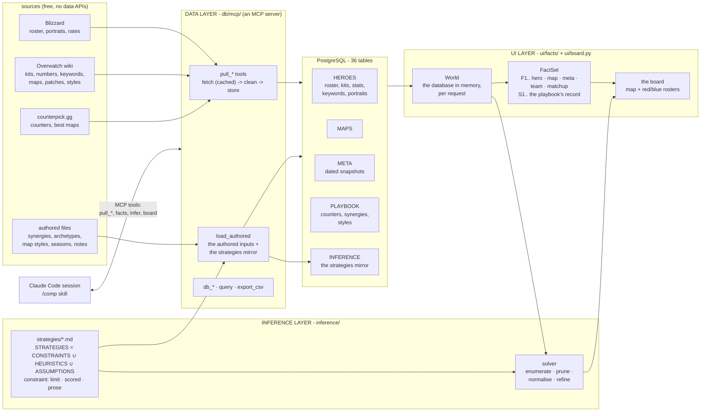
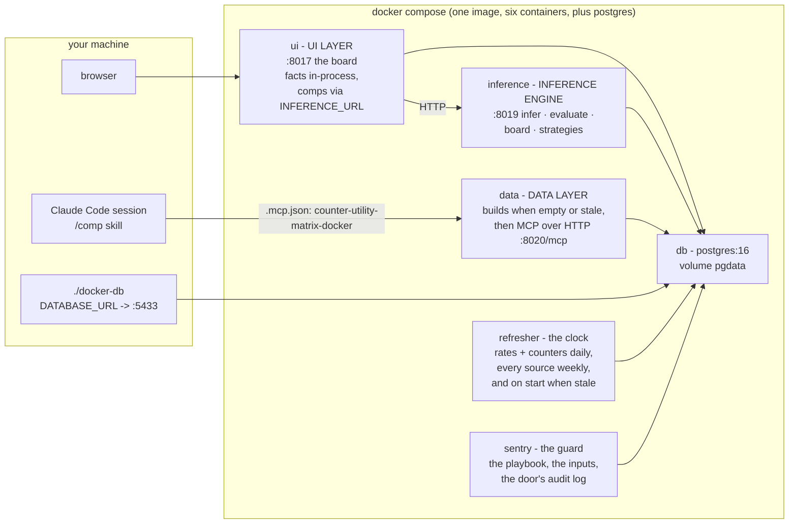

# How it fits together

Three layers over one database, each a folder at the root, each with its own document in `docs/`.

```
DATA           = HEROES ∪ MAPS ∪ META              the tables, as pulled and set
for each domain D in { HEROES, MAPS, META }:
  INDEPENDENT(D) = ⋃ facts(s)      over each selection s in D    s alone: its own row
  DEPENDENT(D)   = ⋃ facts(s ⋈ t)  over the other selections t   s joined with t, in D or beyond
  FACTS(D)       = INDEPENDENT(D) ∪ DEPENDENT(D)
FACTS          = FACTS(HEROES) ∪ FACTS(MAPS) ∪ FACTS(META)
FACTS(D) ∩ FACTS(E) = the joins of D with E: what only their intersection can say
STRATEGIES     = CONSTRAINTS ∪ HEURISTICS ∪ ASSUMPTIONS   the playbook: markdown files
COMP           = ARGMAX[ STRATEGIES( FACTS ) ]            the solver searches, the agent argues
```

Everything is free to run - no accounts, no keys, no API billing. The
board is a local page and the solver is deterministic; the model work
(comps in chat, strategies inferred from prose, the refresh that re-fits
the weights) runs in Claude Code on your subscription, before a game,
never during one.

## The folders

| folder | what it is | read |
| --- | --- | --- |
| `db/` | **DATA LAYER** - pulls every source, cleans it, stores it; the MCP server that is the one door to everything; the schema, its migrations and the embedded cluster | [db.md](db.md) |
| `ui/` | **UI LAYER** - the board (map, sides, bans, red and blue rosters) and the facts behind it: the World, the metrics registry, the FactSet | [ui.md](ui.md) |
| `inference/` | **INFERENCE LAYER** - the playbook of constraints and heuristics in markdown, the solver, the tuning loop, the deriver | [inference.md](inference.md) |
| `tests/` | one folder per layer: `tests/db`, `tests/ui`, `tests/inference`, and `tests/fixtures/playbook/` - nineteen of the former shipped rules, kept as the reference playbook every kind and form of strategy is proven against while `inference/strategies/` holds the user's own rules; `pytest -q` runs them, skipping what needs a built database when there is none | |
| `.claude/skills/` | what a Claude Code session can do here: `/up`, `/comp`, `/tune`, `/strategy`, `/patches`, `/heroes`, `/maps`, `/refresh`, `/maintain` | [skills.md](skills.md) |
| `pm/` | `backlog.md`: what is worth doing next, why and at what cost, in payoff order - the maintainer skill keeps it current | |
| `.github/workflows/` | `ci.yml`: lint, and the tests that need no built database | |
| `.cache-blizzard/` `.cache-wiki/` `.cache-counterpick/` | the page caches (gitignored): every build after the first costs almost no requests | |

How they fit:



The data layer owns the writes to Postgres and the playbook. The UI
layer reads (its one write, a heuristic's weight stored from the board,
is handed to the data layer's `tune` tool),
turns every table into facts, and computes every metric in one place
(`ui/facts/compute.py`) so the number on the board and the number the
solver scores are the same function. The inference layer reads the facts,
never the tables.

The equation the whole repo serves - the name is the definition, and the
math page heads it "The Counter Utility Matrix":

```
DATA           = HEROES ∪ MAPS ∪ META              the tables, as pulled and set
for each domain D in { HEROES, MAPS, META }:
  INDEPENDENT(D) = ⋃ facts(s)      over each selection s in D    s alone: its own row
  DEPENDENT(D)   = ⋃ facts(s ⋈ t)  over the other selections t   s joined with t, in D or beyond
  FACTS(D)       = INDEPENDENT(D) ∪ DEPENDENT(D)
FACTS          = FACTS(HEROES) ∪ FACTS(MAPS) ∪ FACTS(META)
FACTS(D) ∩ FACTS(E) = the joins of D with E: what only their intersection can say
STRATEGIES     = CONSTRAINTS ∪ HEURISTICS ∪ ASSUMPTIONS   the playbook: markdown files
COMP           = ARGMAX[ STRATEGIES( FACTS ) ]            the solver searches, the agent argues
```

The data layer owns DATA; the UI layer's fact engine owns FACTS - the
independent variables read one table each, the dependent ones are joins
across the selections; the inference layer owns STRATEGIES and the argmax.

DATA is the authoritative data: the heroes, maps and meta domains as the
sources report them. FACTS is what the fact engine derives from it for one
board, and every domain yields two kinds. An independent fact belongs to
one selection and no other changes it: a hero's kit, rates and style, the
map's mode and what it rewards, the meta's vintage - its own row. A
dependent fact is the selection joined with others (⋈: the rows of two
tables that meet on a key; the tables themselves share no rows, so DATA
is their union and every intersection is a join), and a join belongs to
every domain it touches, so the dependent facts are where the domains'
fact sets intersect: the hero on this map (`heroes ⋈ map_meta ⋈ maps`,
HEROES ∩ MAPS ∩ META), the hero against each enemy and beside each ally
(`heroes ⋈ counters ⋈ heroes`, `heroes ⋈ synergies ⋈ heroes`), the map's
leaders and how the picks fit its style, the team as one thing (the six
joined and aggregated), the matchup (the twelve compared), the bans (a
banned hero joined with both teams' counters). Every selection added
opens new joins, and the engine derives every fact they support; the
numbers the strategies read are the dependent ones. STRATEGIES are the
playbook, `inference/strategies/`, of exactly three kinds of file: a *constraint*
is a limit (`require`, hard unless soft), a scored adjustment
(`bonus`/`penalty` while `when` holds) or prose the agent holds a comp to;
a *heuristic* weighs a metric, maximised or minimised; an *assumption* is
prose taken as given, shown and never scored. The tuning log is not a
term: it is the history of the weights. The UI layer numbers the facts
F1.. and carries the playbook's record (the archetypes, the catalog's
shape) below them as S1.. so both are citable and neither is mistaken for
the other, or for the strategies themselves.
`STRATEGIES( FACTS )` is the score the solver maximises; the
inference agent (a Claude Code session on the `/comp` skill) reads the same
facts and the same strategies and reconciles them where arithmetic cannot -
a stated problem, a lobby's habits, a patch the rates predate.

## The files

| file | purpose |
| --- | --- |
| `orchestrator.py` | the end-to-end run. `python orchestrator.py` brings the stack up (the data container pulls and ingests when the database is empty or stale), runs the agents headless on the `/refresh` skill (refresh, derive draft strategies, re-fit the weights, regenerate the docs), and leaves the app running. Verbs: `run` (default) · `up` · `agents` · `status` · `refresh` · `test` · `down` |
| `compose.yaml` | one container per layer from one image: `db` (PostgreSQL 16), `data` (builds the database, then the MCP server over HTTP), `inference` (the engine as a service), `ui` (the board), `refresher` (the daily clock), `sentry` (the guard). Every container is unprivileged on a read-only root with no capabilities; every published port binds to 127.0.0.1. Bind mounts keep the caches, `db/raw`, `db/data/authored`, `inference/strategies` and `docs` on the host, so tuning, authoring and regenerating need no rebuild |
| `Dockerfile` | the one image, run as an unprivileged user (uid 1000, or `COUNTER_MATRIX_UID`/`GID` from `.env` on a Linux host whose checkout is owned by someone else); `docker-entrypoint.sh` takes the role as its argument and, for `data`, builds the database when it is empty or its schema is behind the migrations |
| `docker-db` | run any host command against the compose database: `./docker-db .venv/bin/python -m db.mcp call infer '{"map": "Ilios"}'` |
| `.mcp.json` | registers the two MCP servers a Claude Code session sees: `counter-utility-matrix` (stdio, the local cluster) and `counter-utility-matrix-docker` (HTTP, the stack's database) - [mcp.md](mcp.md) |
| `requirements.txt` | psycopg, requests, beautifulsoup4, pytest, pytest-cov, ruff, and pgserver (the embedded PostgreSQL a local build uses) |
| `pyproject.toml` | ruff's rules (line length 100); the coverage bar, 75% where a database exists |
| `pytest.ini` | the `invariant` marker for tests that need a built database |
| `SECURITY.md` | the terms - you run it at your own risk, no security commitment from the author - and how to report a vulnerability privately; the measures themselves are in [security.md](security.md) |
| `LICENSE` | PolyForm Strict 1.0.0: noncommercial use only, no redistribution, no changes or new works; anything else needs a separate license from the author |
| `.gitignore` `.dockerignore` | the caches, the cluster, the mirror, the venv, `.env` |

## Deployment



The containers share one network; only `data` and `refresher` ever open
a connection out. [security.md](security.md) has the rest of the measures.

`docker-entrypoint.sh` takes the role as its argument (`data`,
`inference`, `ui`, `refresh`, `sentry`); the others wait until the data layer reports
the database current, and compose's healthchecks order the start the same
way. Bind mounts keep the page caches, `db/raw`, `db/data/authored` and
`inference/strategies/` on the host, so tuning a strategy or authoring a
synergy needs no image rebuild.

Local-only works identically: without `DATABASE_URL`, everything runs in
one process against the embedded pgserver cluster at `db/psql/cluster` - the
MCP server over stdio, the board with the engine in-process - same tools,
same facts, same strategies.

## The skills

Open the repo in a [Claude Code](https://claude.com/claude-code) session
and the `.claude/skills/` are yours; each is a playbook over the MCP tools.
One line each here; [skills.md](skills.md) documents them, [mcp.md](mcp.md)
the servers and every tool.

| skill | does |
| --- | --- |
| `/up` | brings the stack up and current, and proves it: URLs, health, the rates' capture date |
| `/comp` | "comp for King's Row, they have Zarya and Pharah, I'm on Ana": calls `infer` and `facts`, argues against the solver's optimum under the prose constraints, answers with `[F#]` citations |
| `/tune` | changes a weight, a dial or an expression through `tune` |
| `/strategy` | asks for a name, a kind and prose, infers the frontmatter and stores the strategy through `add_strategy` |
| `/patches` | pulls the patch list, and when a patch shipped since the capture refetches what it changes: rates, kits, Blizzard's text |
| `/heroes` | adds or refreshes heroes: Blizzard's roster, the wiki's kits, the announced heroes ahead of release, counters |
| `/maps` | adds or refreshes maps and names the ones without an authored playstyle note |
| `/refresh` | the agents' run, the one `orchestrator.py agents` executes headless: refresh, derive drafts, re-infer with restraint, regenerate, report |
| `/maintain` | the repo's maintainer: lint and tests three ways, docs current, stale names, dead code, layout, security posture, a report |

No API key, no per-token bill: the skills run on your subscription.

## Scope, honestly

Open Queue Competitive is the target; no source publishes Open Queue rates,
so META is Competitive Role Queue on console (Americas), stated on every
snapshot fact rather than assumed away. Rates carry the patch and season
they were captured under, and the board warns when patches shipped since.
Judgements (counters, synergies, playstyles) are tier- and region-agnostic
by design, and a table is a table: every row carries its source, and that
is the only distinction drawn between measured, judged and hand-written
data. Players are assumed to play optimally - the central assumption,
named in [inference/strategies/optimal-play.md](../inference/strategies/optimal-play.md).
