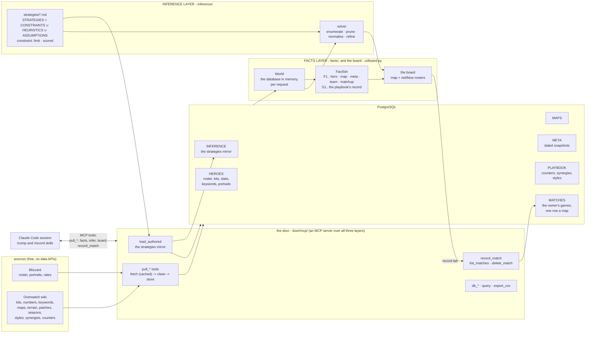
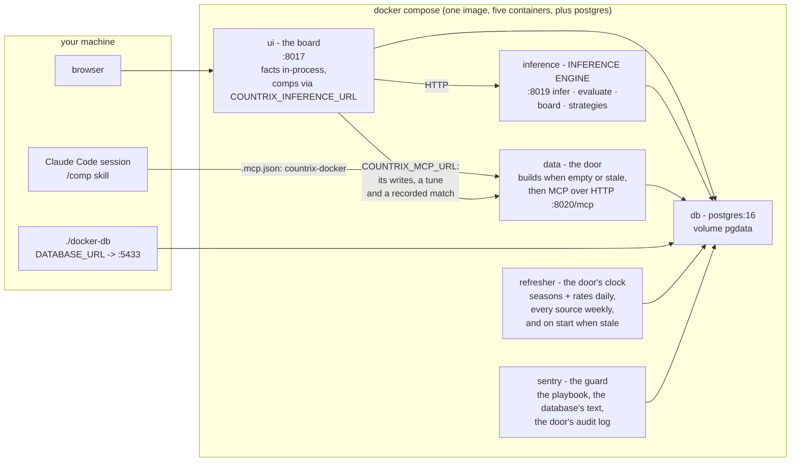

# How it fits together

Three layers over one database, each a folder at the root: `db/` (DATA),
`facts/` (FACTS) and `inference/` (STRATEGIES and the argmax). `db/` and
`inference/` each have a document in `docs/`; `facts/` has its package
docstring, and no doc. `ui/` is the board over them, and `door/` stands
over all three. Imports run db <- facts <- inference <- door, and
`tests/test_docs.py` holds that; `ui/` sits on top and may import any layer.

```
DATA           = HEROES ∪ MAPS ∪ META              the tables, as pulled and set
for each domain D in { HEROES, MAPS, META }:
  INDEPENDENT(D) = ⋃ facts(s)      over each selection s in D    s alone: its own row
  DEPENDENT(D)   = ⋃ facts(s ⋈ t)  over the other selections t   s joined with t, in D or beyond
  FACTS(D)       = INDEPENDENT(D) ∪ DEPENDENT(D)
FACTS          = FACTS(HEROES) ∪ FACTS(MAPS) ∪ FACTS(META)
FACTS(D) ∩ FACTS(E) = the joins of D with E: what only their intersection can say
STRATEGIES     = CONSTRAINTS ∪ HEURISTICS ∪ ASSUMPTIONS   the playbook: markdown files
COMP           = ARGMAX[ STRATEGIES( FACTS ) ]            the solver searches, the agent argues
```

Two inputs are the user's, and every other table is pulled from Blizzard
or the wiki: the strategies, which the solver reads, and the matches the
owner records - one row a map played, with both sixes, the bans, blue's
side and blue's result, blue always the owner's team. A match comes in by
hand through the door's `record_match`, from the board's record tab or the
`/record` skill, and carries the `user` source the strategies carry.

No accounts, no keys, no API billing. The board is a local page and the
solver is deterministic; the model work (comps in chat, strategies
inferred from prose, the refresh that tunes with a reason) runs in Claude
Code on your subscription, and the board never calls a model.

## The folders

| folder | what it is | read |
| --- | --- | --- |
| `db/` | **DATA LAYER** - `data/` and `psql/` pull every source, clean it and store it, with the schema, its migrations and the embedded cluster; `web.py` is what the three HTTP servers share, from the Host-and-Origin guard to the one MCP client; `matches.py` is the one writer of the recorded matches. The bottom of the import graph: it imports nothing above it, and the layers over it read Postgres directly, over `db.psql.default_dsn()` | [db.md](db.md) |
| `facts/` | **FACTS LAYER** - everything the database knows about a board: the World (the database in memory), the metrics registry, the FactSet. It imports only `db`; the solver, the deriver, the door and the board read the same numbers through it | [`facts/__init__.py`](../facts/__init__.py) |
| `inference/` | **INFERENCE LAYER** - the playbook of constraints, heuristics and assumptions in markdown, the solver, the tuning loop, the deriver | [inference.md](inference.md) |
| `door/` | **THE DOOR** over all three layers - `mcp/`, the MCP server and its tools, under which every write runs, the sentry's quarantine rename aside; `refresh.py`, the clock that runs the tools daily and weekly; `sentry.py`, the guard over the playbook, the database's free text and the door's audit log | [mcp.md](mcp.md) |
| `ui/` | **THE BOARD** - the page (map, sides, bans, red and blue rosters) over the facts layer's facts and the inference layer's answer: `board.py`, `pages.py` and `static/`, the only presentation code | [ui.md](ui.md) |
| `tests/` | one folder per layer beside the root files' tests, with `synthetic.py`, a World of twelve released heroes, one announced hero and three maps built by hand, so a test works out its expected values with no database, `scratch.py`, a scratch database on the test server holding that World's roster, where the recorded-match tests write instead of the built database, and `tests/fixtures/playbook/`, the reference playbook of every kind and form of strategy that the solver tests run on in place of `inference/strategies/` | |
| `.claude/skills/` | the skills a Claude Code session runs here, one `SKILL.md` each | [The skills](#the-skills) |
| `pm/` | `backlog.md`: what is worth doing next, why and at what cost, in payoff order; the maintainer skill keeps it current | |
| `scripts/` | the recorders of the proven fixtures, run from the repo root as `.venv/bin/python -m scripts.<name>`: `optimal` writes `tests/fixtures/optimal.json`, the proven maxima the dormant real-World gate re-solves, and `reach` writes `tests/fixtures/reach.json`, a board per released hero | |
| `.github/workflows/` | `ci.yml`: lint, the types (mypy) and the tests that need no built database, held to 78% coverage, on pushes to `main` and on pull requests | |
| `.cache-blizzard/` `.cache-wiki/` | the page caches (gitignored): every build after the first costs almost no requests | |

How they fit:



The door gates every write to Postgres or the playbook, the sentry's
quarantine rename aside, and the layers read Postgres directly
([mcp.md](mcp.md)).

## The files

| file | purpose |
| --- | --- |
| `orchestrator.py` | the end-to-end run. `.venv/bin/python orchestrator.py` brings the stack up (the data container pulls and ingests when the database is empty or stale), runs the agents headless on the `/refresh` skill, and leaves the app running. Verbs: `run` (default) · `up` · `agents` · `status` · `refresh` · `test` · `down` |
| `compose.yaml` | one container per role from one image: `db` (PostgreSQL 16), `data` (the door: builds the database, then serves every MCP tool over HTTP), `inference` (the engine as a service), `ui` (the board), `refresher` (the door's clock), `sentry` (the guard). The five app containers run unprivileged on a read-only root with every capability dropped and memory and process limits; `db` keeps the five capabilities the postgres image needs to start as root, with no read-only root and no limits. Every port is published on 127.0.0.1 only. Bind mounts keep the caches, `db/raw`, `inference/strategies` and `docs` on the host, so tuning, authoring and regenerating need no rebuild |
| `Dockerfile` | the one image, run as an unprivileged user (uid 1000, or `COUNTRIX_UID`/`GID` from `.env` on a Linux host whose checkout is owned by someone else); `docker-entrypoint.sh` takes the role as its argument and, for `data`, builds the database when it is empty, unfilled or behind the migrations |
| `docker-db` | run any host command against the compose database: `./docker-db .venv/bin/python -m door.mcp call infer '{"map": "Ilios"}'`; `orchestrator.py up` derives the stack's pending drafts through it |
| `.mcp.json` | registers the two MCP servers a Claude Code session sees: `countrix` (stdio, the local cluster) and `countrix-docker` (HTTP, the stack's database) - [mcp.md](mcp.md) |
| `requirements.txt` | psycopg, requests, beautifulsoup4 and pgserver pinned (pgserver is the embedded PostgreSQL a host build uses; the image and CI filter it out, since neither starts a cluster), then pytest and pytest-cov, and ruff and mypy pinned, since a new release of either finds new errors in unchanged code. CI and a local check run ruff and mypy; the image leaves them out |
| `pyproject.toml` | ruff's rules (line length 100; outside the tests, an import sits in the module's import block); mypy's, which hold every function in `db`, `facts`, `inference`, `door`, `ui`, `scripts` and `orchestrator.py` to full annotations; the coverage bar, 75% where a database exists |
| `pytest.ini` | the `invariant` marker for tests that need a built database |
| `CLAUDE.md` | what a Claude Code session reads before it changes code: the commands, the layers in brief, what the tests hold a change to, the house rules and style |
| `SECURITY.md` | the terms - you run it at your own risk, no security commitment from the author - and how to report a vulnerability privately; the measures themselves are in [security.md](security.md) |
| `LICENSE` | PolyForm Strict 1.0.0: noncommercial use only, no redistribution, no changes or new works; anything else needs a separate license from the author |
| `.gitignore` `.dockerignore` | the caches, the cluster, the mirror, the venv, `.env` |

## Deployment



The containers share one network; only `data` and `refresher` ever open a
connection out. `docker-entrypoint.sh` takes the role as its argument
(`data`, `inference`, `ui`, `refresh`, `sentry`). Readiness has one
definition, `db.psql.schema.state`: empty, stale (a migration the ledger
lacks), unfilled (no heroes) or current. The entrypoint asks it through
`python -m db.psql.schema`; `inference`, `ui` and `refresh` wait for
current, up to the data healthcheck's 900 s, then exit. The data
container's `/health` carries the state: compose's healthcheck holds
`data` unhealthy until it is current, and `depends_on` starts `inference`,
`ui` and `refresher` only then. `orchestrator.py` waits only for a first
reply and reports the state in its verdict. [security.md](security.md) has
the rest of the measures.

Settings, from the environment or `.env` (the refresh times are in [db.md](db.md)).
Each is read where it is used, so a change takes effect on the next call -
except where a server listens (the UI and inference host and port), the MCP
server's token, `COUNTRIX_WORKERS` (read when the pool starts), the refresh
clock and the sentry interval, which are read once at start:

| setting | default | meaning |
| --- | --- | --- |
| `COUNTRIX_STRATEGIES` | empty | a playbook folder other than `inference/strategies/`, relative to the repo root or absolute |
| `COUNTRIX_WORKERS` | `max(6, min(cores, 12))` | the solver's worker processes |
| `COUNTRIX_PARALLEL` | `1` | `0`: every board in one process |
| `COUNTRIX_UI_HOST`, `COUNTRIX_UI_PORT` | `127.0.0.1`, `8017` | where the board listens |
| `COUNTRIX_READ_ONLY` | `1` | the board writes nothing: a slider's weight is the session's own, and the record tab says how to record; `0` brings back *store* and the record tab's result buttons |
| `COUNTRIX_INFERENCE_HOST`, `COUNTRIX_INFERENCE_PORT` | `127.0.0.1`, `8019` | where the inference service listens |
| `COUNTRIX_INFERENCE_URL` | unset | the inference service the board delegates to; its handlers run in the board's process when unset. http or https: any other scheme stops the board at launch |
| `COUNTRIX_MCP_TOKEN` | unset | bearer token the MCP server requires over HTTP |
| `COUNTRIX_AUDIT` | `db/raw/audit.jsonl` | the MCP server's audit log |
| `COUNTRIX_SENTRY_EVERY` | `30` | seconds between sentry sweeps |
| `COUNTRIX_CLAUDE` | `claude` on `PATH`, else `~/.local/bin/claude` | the CLI the agents and `derive` run |
| `COUNTRIX_MCP_URL` | unset | the MCP server the board's writes go to, a `tune` and a `record_match`; in-process through the same registry when unset. http or https, like the inference URL |
| `COUNTRIX_REPO_URL` | `https://github.com/mmikol/countrix` | the repository the board's header links to |
| `DATABASE_URL` | unset | the PostgreSQL to use. Unset, the embedded pgserver cluster at `db/psql/cluster`, which `db_init` or `db_rebuild` builds: the local run, on the same tools, facts and strategies as the stack. With neither, `NoDatabaseError` |

## The skills

Open the repo in a [Claude Code](https://claude.com/claude-code) session
and the `.claude/skills/` are yours: type `/name`, or say what you want
and a skill's description matches it. Each `.claude/skills/<name>/SKILL.md`
holds the whole playbook; [mcp.md](mcp.md) has the servers and every tool.

| skill | does | when |
| --- | --- | --- |
| `/up` | brings the stack up and current, and proves it: health, a board solved through the service, the URLs, the rates' capture date | before a game |
| `/comp` | "comp for King's Row, they have Zarya and Pharah, I'm on Ana": calls `infer` and `facts`, argues against the solver's optimum under the assumptions, answers with `[F#]` citations | during |
| `/tune` | changes a weight, a dial or an expression through `tune` | between games |
| `/strategy` | asks for a name, a kind and prose, infers the frontmatter and stores the strategy through `add_strategy` | when you learn something |
| `/patches` | pulls the patch list and, when a patch shipped since the capture, refetches what it changes: rates, kits, Blizzard's text | when a patch drops |
| `/heroes` | adds or refreshes heroes: Blizzard's roster, the wiki's kits, styles and synergies, the announced heroes ahead of release, counters | when the roster moves |
| `/maps` | adds or refreshes maps: the pool, modes and stages, their terrain, the per-map rates, the style each map rewards | when the pool moves |
| `/record` | "we won King's Row on attack, they ran dive": reads the map, the side, the result, both sixes and the bans back against the roster, then stores the map through `record_match`; `list_matches` and `delete_match` fix one entered wrong | after each map |
| `/refresh` | the agents' run: refresh, complete drafts, re-infer with restraint, regenerate, report | when `orchestrator.py agents` runs; the refresher container refreshes the data daily without it |
| `/maintain` | the repo's maintainer: lint, types and tests three ways, docs current, stale names, dead code, layout, security posture, a report | after changes |
| `/desloppify` | the desloppify harness's own skill, as `update-skill` writes it (CLAUDE.md): scores the code and drives the cleanup loop | when you ask for a score |

## The scope

6v6 Open Queue Competitive is the target: six picks a side in any mix of
roles, at most two tanks. No source publishes Open Queue rates, so META
is Competitive Role Queue on console (Americas), and every snapshot fact
says so. Rates carry the patch and season they were captured under, and
the board warns when patches shipped since. Judgements (counters,
synergies, playstyles) are tier- and region-agnostic by design, and a
table is a table: every row carries its source, and that is the only
distinction drawn between measured, judged and hand-written data. Two
inputs are hand-written: the strategies and the recorded matches. The
owner plays on console, so a match is entered by hand, never logged by
the game. Players are assumed to play optimally
([players-play-optimally.md](../inference/strategies/players-play-optimally.md)),
so a strategy encodes the game, never a lobby's habits.
