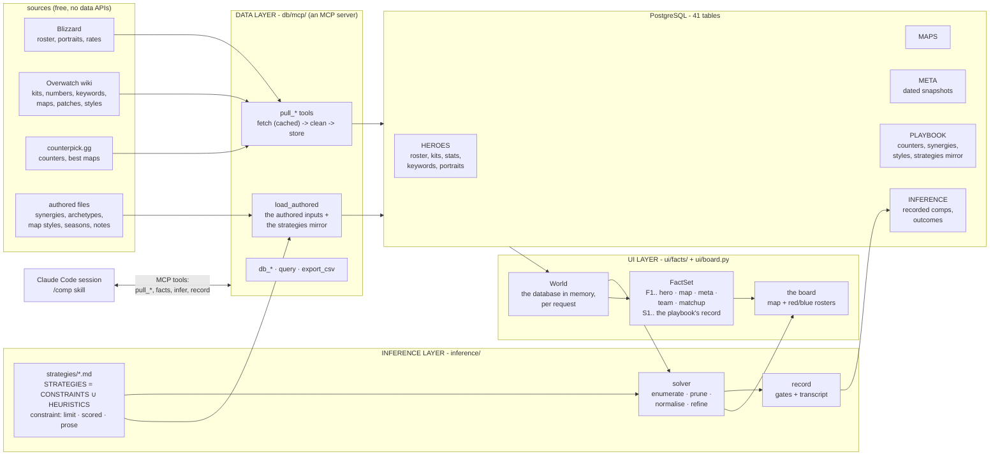
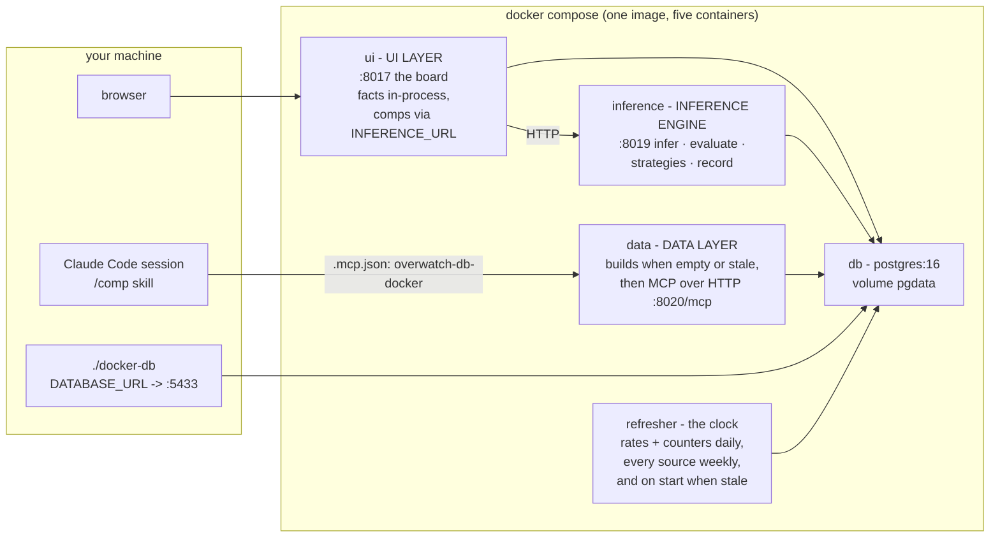

# How it fits together

Three layers over one database, each a folder at the root, each with its own document in `docs/`.

```
FACTS      = HEROES ∪ MAPS ∪ META             the data layer's term: pulled from the sources and set
STRATEGIES = CONSTRAINTS ∪ HEURISTICS         the inference layer's: a markdown playbook, tuned by history
COMP       = ARGMAX[ STRATEGIES( FACTS ) ]    what the board shows: the solver searches, the agent argues
```

Everything is free to run - no accounts, no keys, no API billing. The
board is a local page and the solver is deterministic; the model work
(comps in chat, strategies inferred from prose, the refresh that re-fits
the weights) runs in Claude Code on your subscription, before a game,
never during one.

## The folders

| folder | what it is | read |
| --- | --- | --- |
| `db/` | **DATA LAYER** - pulls every source, cleans it, stores it; the MCP server that is the one door to everything; the schema, its migrations and the embedded cluster | [db.md](db.md) |
| `ui/` | **UI LAYER** - the board (map, sides, bans, red and blue rosters) and the facts behind it: the World, the metrics registry, the FactSet | [ui.md](ui.md) |
| `inference/` | **INFERENCE LAYER** - the playbook of constraints and heuristics in markdown, the solver, the tuning loop, the deriver | [inference.md](inference.md) |
| `tests/` | one folder per layer: `tests/db`, `tests/ui`, `tests/inference`; `pytest -q` runs them, skipping what needs a built database when there is none | |
| `.claude/skills/` | what a Claude Code session can do here: `/up`, `/comp`, `/outcome`, `/tune`, `/strategy`, `/refresh` | [skills.md](skills.md) |
| `.github/workflows/` | `ci.yml`: lint, and the tests that need no built database | |
| `.cache-blizzard/` `.cache-wiki/` `.cache-counterpick/` | the page caches (gitignored): every build after the first costs almost no requests | |

How they fit:



The data layer owns the writes to Postgres. The UI layer only reads,
turns every table into facts, and computes every metric in one place
(`ui/facts/compute.py`) so the number on the board and the number the
solver scores are the same function. The inference layer reads the facts,
never the tables.

The equation the whole repo serves:

```
FACTS      = HEROES ∪ MAPS ∪ META             the authoritative data: pulled from the sources and set
STRATEGIES = CONSTRAINTS ∪ HEURISTICS         the playbook: markdown files, tuned by what history shows
COMP       = ARGMAX[ STRATEGIES( FACTS ) ]    constraints limit, adjust or instruct; heuristics weigh;
                                              the agent argues
```

FACTS are the authoritative data: the heroes, maps and meta domains as the
sources report them, restricted to one board. The union, not the
intersection - a hero is not a map; the joins between the domains (a hero
on a map, a hero against a hero) are the pairwise facts. STRATEGIES are the
playbook, `inference/strategies/`, of exactly two kinds of file: a *constraint*
is a limit (`require`, hard unless soft), a scored adjustment
(`bonus`/`penalty` while `when` holds) or prose the agent holds a comp to;
a *heuristic* weighs a metric, maximised or minimised. History (recorded
outcomes, the tuning log) is not a term: it tunes the weights. The user
layer numbers the facts F1.. and carries the playbook's record (archetypes,
past decisions, outcomes) below them as S1.. so both are citable and
neither is mistaken for the other, or for the constraints and heuristics themselves.
`STRATEGIES( FACTS )` is the score the solver maximises; the
inference agent (a Claude Code session on the `/comp` skill) reads the same
facts and the same strategies and reconciles them where arithmetic cannot -
a stated problem, a lobby's habits, a patch the rates predate.

## The files

| file | purpose |
| --- | --- |
| `orchestrator.py` | the end-to-end run. `python orchestrator.py` brings the stack up (the data container pulls and ingests when the database is empty or stale), runs the agents headless on the `/refresh` skill (refresh, derive draft strategies, re-fit the weights, regenerate the docs), and leaves the app running. Verbs: `run` (default) · `up` · `agents` · `status` · `refresh` · `test` · `down` |
| `compose.yaml` | one container per layer from one image: `db` (PostgreSQL 16), `data` (builds the database, then the MCP server over HTTP), `inference` (the engine as a service), `ui` (the board), `refresher` (the daily clock). Every published port binds to 127.0.0.1. Bind mounts keep the caches, `db/raw`, `db/data/authored` and `inference/strategies` on the host, so tuning or authoring needs no rebuild |
| `Dockerfile` | the one image; `docker-entrypoint.sh` takes the role as its argument and, for `data`, builds the database when it is empty or its schema is behind the migrations |
| `docker-db` | run any host command against the compose database: `./docker-db .venv/bin/python -m db.mcp call infer '{"map": "Ilios"}'` |
| `.mcp.json` | registers the two MCP servers a Claude Code session sees: `overwatch-db` (stdio, the local cluster) and `overwatch-db-docker` (HTTP, the stack's database) - [mcp.md](mcp.md) |
| `requirements.txt` | psycopg, requests, beautifulsoup4, pytest, pyflakes, and pgserver (the embedded PostgreSQL a local build uses) |
| `pytest.ini` | the `invariant` marker for tests that need a built database |
| `.gitignore` `.dockerignore` | the caches, the cluster, the mirror, the venv |

## Deployment



`docker-entrypoint.sh` takes the role as its argument (`data`,
`inference`, `ui`); `inference` and `ui` wait until the data layer reports
the database current, and compose's healthchecks order the start the same
way. Bind mounts keep the page caches, `db/raw`, `db/data/authored` and
`inference/strategies/` on the host, so tuning a strategy or authoring a
synergy needs no image rebuild.

Local-only works identically: without `DATABASE_URL`, everything runs in
one process against the embedded pgserver cluster at `db/psql/cluster` - the
MCP server over stdio, the board with the engine in-process - same tools,
same facts, same strategies.

## The skills

Open the repo in a [Claude Code](https://claude.com/claude-code) session
and the `.claude/skills/` are yours; each is a playbook over the MCP tools.
One line each here; [skills.md](skills.md) documents them, [mcp.md](mcp.md)
the servers and every tool.

| skill | does |
| --- | --- |
| `/up` | brings the stack up and current, and proves it: URLs, health, the rates' capture date |
| `/comp` | "comp for King's Row, they have Zarya and Pharah, I'm on Ana": calls `infer` and `facts`, argues against the solver's optimum under the prose constraints, answers with `[F#]` citations, records the result |
| `/outcome` | records how a match went, so the fit can learn from it |
| `/tune` | changes a weight, a dial or an expression through `tune`, or fits the weights to recorded outcomes through `fit_weights` |
| `/strategy` | asks for a name, a kind and prose, infers the frontmatter and stores the strategy through `add_strategy` |
| `/refresh` | the agents' run, the one `orchestrator.py agents` executes headless: refresh, derive drafts, re-fit, re-infer with restraint, regenerate, report |

No API key, no per-token bill: the skills run on your subscription.

## Scope, honestly

Open Queue Competitive is the target; no source publishes Open Queue rates,
so META is Competitive Role Queue on console (Americas), stated on every
snapshot fact rather than assumed away. Rates carry the patch and season
they were captured under, and the board warns when patches shipped since.
Judgements (counters, synergies, playstyles) are tier- and region-agnostic
by design, and a table is a table: every row carries its source, and that
is the only distinction drawn between measured, judged and hand-written
data. Players are assumed to play optimally - the central assumption,
named in [inference/strategies/optimal-play.md](../inference/strategies/optimal-play.md).
