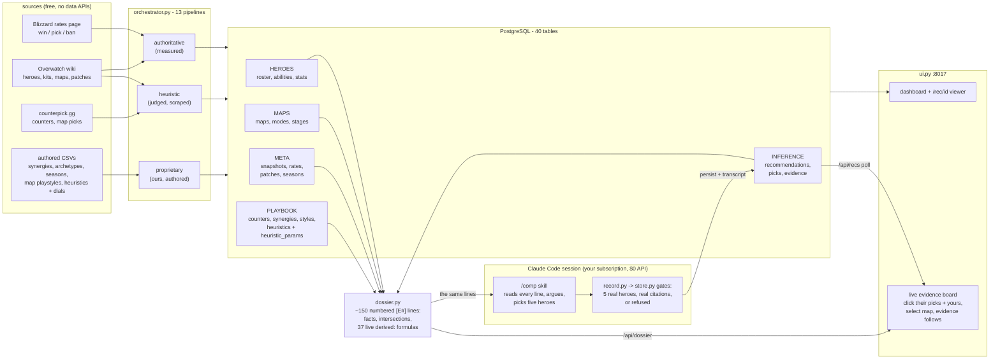
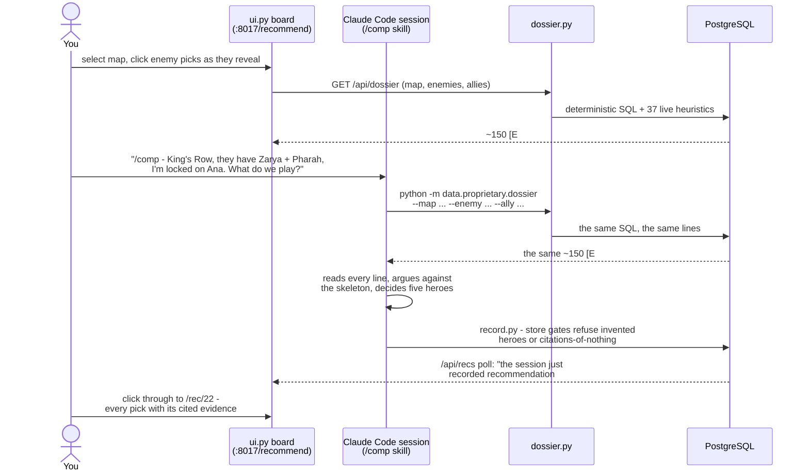
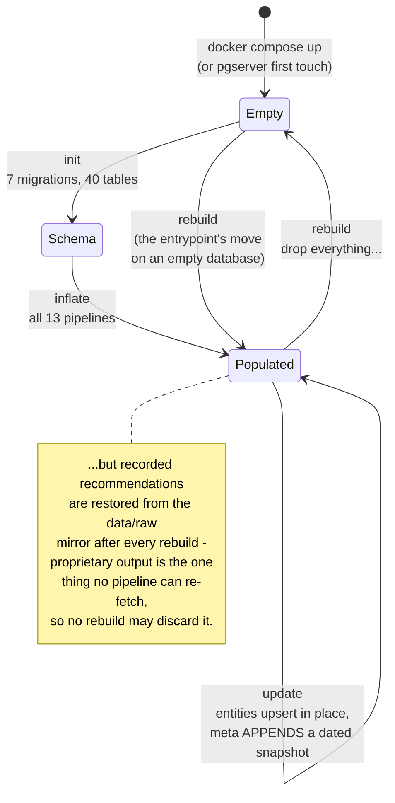
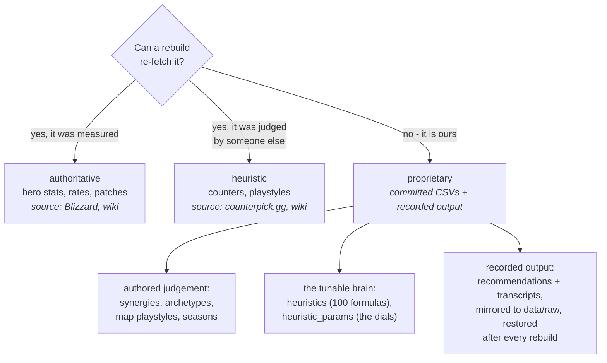
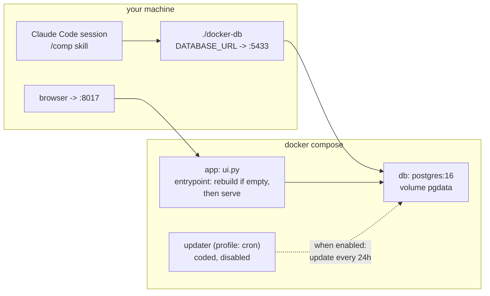

# How it all fits together

Four pictures: the whole machine, one game played with it, the life of the
database, and where every kind of data lives. All diagrams render on GitHub.

## The whole machine

Scrapers fill Postgres; the dossier turns Postgres into numbered evidence;
a Claude Code session (the `/comp` skill) reads that evidence and decides;
the decision is gated, recorded, and becomes evidence for next time. The
UI is a window onto the same pipeline — it computes nothing of its own.



The equation the whole repo serves:

```
COUNTER = MAX[ HEROES ∩ MAPS ∩ META ]
```

The database supplies the three sets, the playbook supplies the judgement,
the heuristics catalog supplies the arithmetic, and the session supplies
the argument. Claude never generates evidence — it only cites what the
deterministic SQL produced.

## One game, played with it



The board and the skill are two windows onto one dossier: what you see on
`/recommend` is exactly what the model reads — nothing more, nothing less.

## The life of the database



Each verb refuses the state it is not for and names the verb you wanted.
`update` is the default and the cron updater's verb (coded, disabled
behind the compose profile `cron`). Every meta update appends a snapshot
delineated by **patch and season**, so the series accumulates and
`derived:trend` has something to difference.

## Where every kind of data lives



The dials in `heuristic_params` are why the playbook is a *brain* and not
a config file: edit a threshold in the CSV, re-run the loader, and the
next dossier — board or skill, host or Docker — computes with it. No code
change, no redeploy. The full catalog with every formula is
[heuristics.md](heuristics.md).

## Deployment shapes



Local-only works identically: without `DATABASE_URL`, everything falls
back to the embedded pgserver cluster at `db/cluster` — same code, same
verbs, same evidence.
