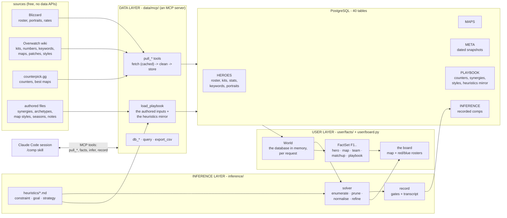
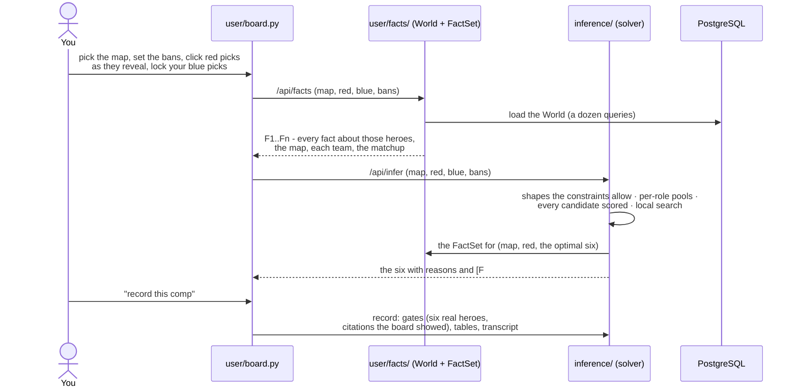
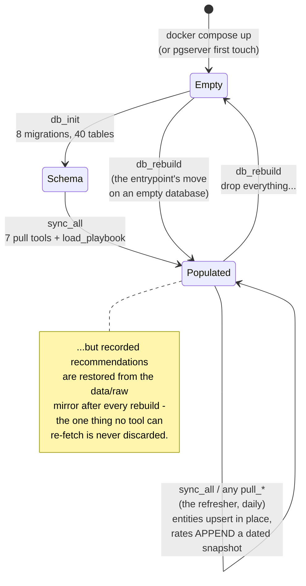
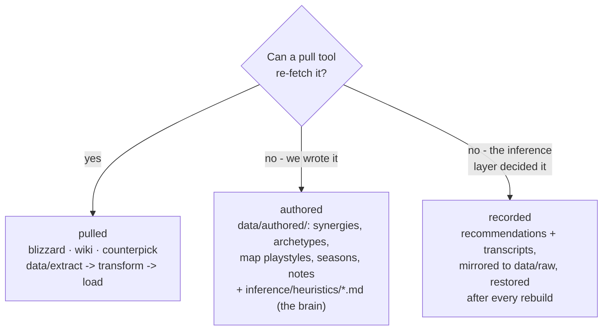
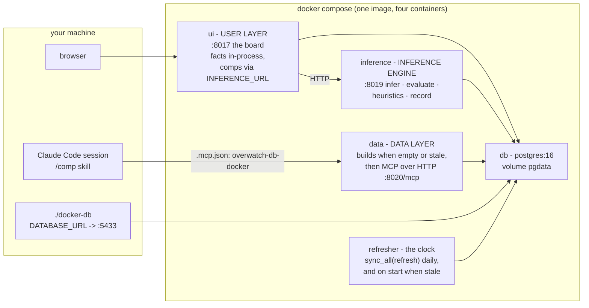

# How it all fits together

Three layers over one database, and the door between them.

## The three layers



The data layer owns the writes to Postgres. The user layer only reads,
turns every table into facts, and computes every metric in one place
(`user/facts/compute.py`) so the number on the board and the number the
solver scores are the same function. The inference layer reads the facts,
never the tables.

The equation the whole repo serves:

```
FACTS = HEROES ∪ MAPS ∪ META ∪ PLAYBOOK ∪ HISTORY     the whole database, for one board
COMP  = ARGMAX[ STRATEGIES( FACTS ) ]                  constraints prune, goals weigh,
                                                       strategies adjust; the agent argues
```

`STRATEGIES( FACTS )` is the score the solver maximises; the inference
agent (a Claude Code session on the `/comp` skill) reads the same facts and
the same strategies and reconciles them where arithmetic cannot - a stated
problem, a lobby's habits, a patch the rates predate.

## One click on the board



With six blue picks locked the same endpoint evaluates your six against
the field the solver would have searched, and says where it ranks.

## The life of the database



`python -m data.orchestrator <verb>` drives the same tools without a session;
Docker's `data` container runs `rebuild` on an empty or stale database and
the `refresher` container runs `sync_all` with refresh on once a day (and
on start when the cached pages are older than a day). A page that fails
to refetch keeps its cached copy, so a bad day at a source degrades to
yesterday's numbers rather than an empty table.

## Where every kind of data lives

Any data in the database is just data: every row carries its `source_id`,
and that is the only distinction the schema draws. What differs is how a
row gets there - and therefore what a rebuild can and cannot recover.



## Deployment: one container per layer



`docker-entrypoint.sh` takes the role as its argument (`data`,
`inference`, `ui`); `inference` and `ui` wait until the data layer reports
the database current, and compose's healthchecks order the start the same
way. Bind mounts keep the page caches, `data/raw`, `data/authored` and
`inference/heuristics/` on the host, so tuning a heuristic or authoring a
synergy needs no image rebuild.

Local-only works identically: without `DATABASE_URL`, everything runs in
one process against the embedded pgserver cluster at `data/db/cluster` - the
MCP server over stdio, the board with the engine in-process - same tools,
same facts, same heuristics.
