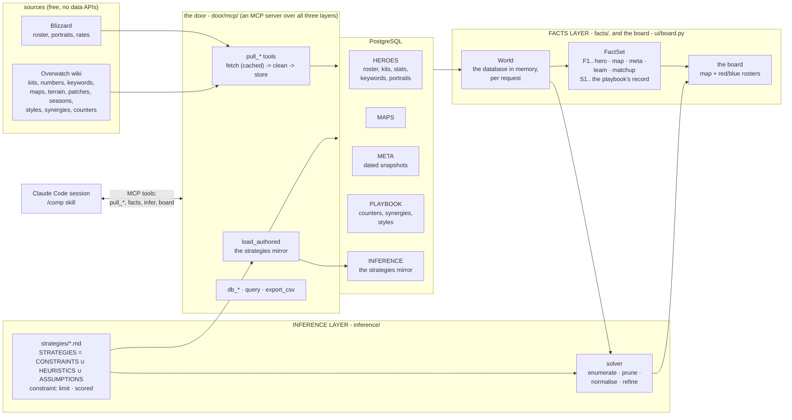
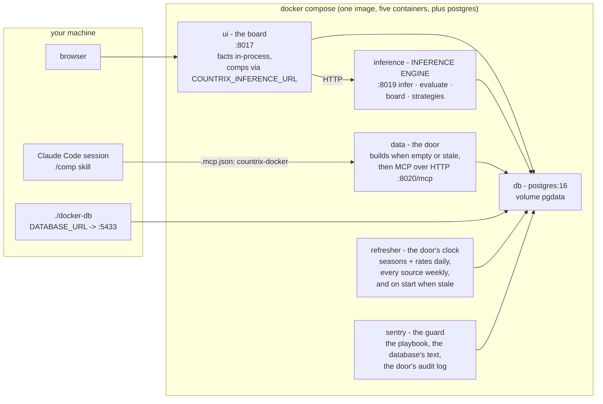

# How it fits together

Three layers over one database, each a folder at the root with its own
document in `docs/`: `db/` (DATA), `facts/` (FACTS) and `inference/`
(STRATEGIES and the argmax). `ui/` is the board over them, and `door/`
stands over all three. Imports run db <- facts <- inference <- door <- ui,
and `tests/test_docs.py` holds that.

```
DATA           = HEROES ∪ MAPS ∪ META              the tables, as pulled and set
for each domain D in { HEROES, MAPS, META }:
  INDEPENDENT(D) = ⋃ facts(s)      over each selection s in D    s alone: its own row
  DEPENDENT(D)   = ⋃ facts(s ⋈ t)  over the other selections t   s joined with t, in D or beyond
  FACTS(D)       = INDEPENDENT(D) ∪ DEPENDENT(D)
FACTS          = FACTS(HEROES) ∪ FACTS(MAPS) ∪ FACTS(META)
FACTS(D) ∩ FACTS(E) = the joins of D with E: what only their intersection can say
STRATEGIES     = CONSTRAINTS ∪ HEURISTICS ∪ ASSUMPTIONS   the playbook: markdown files
COMP           = ARGMAX[ STRATEGIES( FACTS ) ]            the solver searches, the agent argues
```

No accounts, no keys, no API billing. The board is a local page and the
solver is deterministic; the model work (comps in chat, strategies
inferred from prose, the refresh that tunes with a reason) runs in Claude
Code on your subscription, before a game, never during one.

## The folders

| folder | what it is | read |
| --- | --- | --- |
| `db/` | **DATA LAYER** - `data/` and `psql/` pull every source, clean it and store it, with the schema, its migrations and the embedded cluster. A wiki stat is stored as measurements beside its original text (`data/wiki/kits/measurements.py`); the facts layer's `facts/kit.py` reads a kit's combat numbers off both at read time, so a misread wording is fixed there and needs no re-pull. The bottom of the import graph: it imports nothing above it, and the layers over it read Postgres directly, over `db.psql.default_dsn()` | [db.md](db.md) |
| `facts/` | **FACTS LAYER** - everything the database knows about a board: the World (the database in memory), the metrics registry, the FactSet. It imports only `db`; the solver, the deriver, the door and the board read the same numbers through it | [facts.md](facts.md) |
| `inference/` | **INFERENCE LAYER** - the playbook of constraints, heuristics and assumptions in markdown, the solver, the tuning loop, the deriver | [inference.md](inference.md) |
| `door/` | **THE DOOR** over all three layers - `mcp/`, the MCP server and its tools, under which every write runs, the sentry's quarantine rename aside; `refresh.py`, the clock that runs the tools daily and weekly; `sentry.py`, the guard over the playbook, the database's free text and the door's audit log | [mcp.md](mcp.md) |
| `ui/` | **THE BOARD** - the page (map, sides, bans, red and blue rosters) over the facts layer's facts and the inference layer's answer: `board.py`, `pages.py` and `static/`, the only presentation code | [ui.md](ui.md) |
| `tests/` | one folder per layer (`tests/db`, `tests/facts`, `tests/inference`, `tests/door`, and `tests/ui` for the board; `tests/db` holds the Blizzard and wiki tests in `blizzard/` and `wiki/`, `tests/door` the door's in `mcp/` beside the refresher's and the sentry's), the root files' tests beside them (`test_docs.py`, and `test_orchestrator.py` with its `_verdict`, `_agents` and `_http` siblings), `synthetic.py`, a World of twelve invented heroes and three maps built by hand and served fresh to each test by the `synthetic_world` fixture in `tests/conftest.py`, which the metric, derivation, facts, solver and board tests work their expected values from with no database, and `tests/fixtures/playbook/`, the reference playbook every kind and form of strategy is proven against while `inference/strategies/` holds the user's assumptions (its rules were emptied on purpose and are being rebuilt by hand; `inference/README.md` is the record). `.venv/bin/python -m pytest -q` runs them, skipping what needs a built database when there is none | |
| `.claude/skills/` | what a Claude Code session can do here: `/up`, `/comp`, `/tune`, `/strategy`, `/patches`, `/heroes`, `/maps`, `/refresh`, `/maintain`; and `/desloppify`, the cleanup harness's own skill, as `update-skill` writes it (CLAUDE.md) | [skills.md](skills.md) |
| `pm/` | `backlog.md`: what is worth doing next, why and at what cost, in payoff order; the maintainer skill keeps it current | |
| `scripts/` | the recorders of the proven fixtures, run from the repo root as modules. `optimal` (`.venv/bin/python -m scripts.optimal`) records the true maximum of proven boards into `tests/fixtures/optimal.json`, which `tests/inference/test_optimal.py` re-solves - the real-World gate, dormant while it skips; the regression gate on the search that runs on every change is `test_the_search_reaches_the_enumerated_maximum` in `tests/inference/test_solver.py`, a full enumeration of six synthetic boards. It reads the brute force's `.jsonl` output from the paths in `OPTIMAL_SOURCES`, which live outside the repo. `reach` (`.venv/bin/python -m scripts.reach`) records a board per released hero into `tests/fixtures/reach.json`. Each fixture records the digest of the playbook it was proved under. The gate skips while the shipped playbook scores nothing, fails with "recorded under a different playbook" under any other playbook that scores, and holds out banned boards (`OPTIMAL_STALE_BANNED`) until the backlog's re-prove lands. Run after a deliberate change to the objective, and say in the commit why every number moved | |
| `.github/workflows/` | `ci.yml`: lint, the types (mypy) and the tests that need no built database, held to 78% coverage, on pushes to `main` and on pull requests | |
| `.cache-blizzard/` `.cache-wiki/` | the page caches (gitignored): every build after the first costs almost no requests | |

How they fit:



The door gates every write: a write to Postgres or the playbook runs
under one of its tools (`door/mcp`), and the sentry's quarantine rename of
a bad strategy file (`door/sentry.py`) is the one write outside it. The
code that writes lives with what it writes - the pulls in `db/data`, the
`strategies` table in `inference.catalog.mirror`, the playbook's files in
`inference.tune` (`tune`, `add`, `complete`), which `inference/derive.py`
also calls inside a `derive_strategies` or `load_authored` run the door
started. The facts layer reads, turns every table into facts, and
defines every metric once (`facts/team.py` the team's, `facts/compute.py`
the rest, and `compute.registry()` gathers them), so the number on the
board and the number the solver scores are the same function. The
board's one write, a heuristic's weight stored from its slider, is off by
default (`COUNTRIX_READ_ONLY`) and, when turned on, is a `tune` call
through the door. The inference layer reads the tables through the World
(`facts.tables.load`, once per request on the service's `/board`,
`/infer` and `/evaluate`), and its health check counts the heroes
directly.

The equation divides the layers. The data layer owns DATA. The facts
layer owns FACTS: per domain, the independent facts (a selection's
own row - a hero's kit, rates and style; the map's mode and styles; the
meta's vintage) and the dependent ones (that selection joined with
others: the hero on this map, against each enemy, beside each ally, the
six aggregated, the twelve compared, a banned hero against both teams'
counters). The inference layer owns STRATEGIES - three kinds of file: a
*constraint* (a limit, hard unless soft, or a scored adjustment while a
condition holds), a *heuristic* (a metric weighed, maximised or
minimised), an *assumption* (prose taken as given, never scored) - and
the argmax. The solver maximises `STRATEGIES( FACTS )`; the agent (a
Claude Code session on `/comp`) reads the same facts and strategies and
reconciles them where arithmetic cannot. Facts are numbered F1.., the
playbook's record below them S1.., so both are citable and neither is
mistaken for the other.

## The files

| file | purpose |
| --- | --- |
| `orchestrator.py` | the end-to-end run. `.venv/bin/python orchestrator.py` brings the stack up (the data container pulls and ingests when the database is empty or stale), runs the agents headless on the `/refresh` skill, and leaves the app running. Verbs: `run` (default) · `up` · `agents` · `status` · `refresh` · `test` · `down` |
| `compose.yaml` | one container per role from one image: `db` (PostgreSQL 16), `data` (the door: builds the database, then serves every MCP tool over HTTP), `inference` (the engine as a service), `ui` (the board), `refresher` (the door's clock), `sentry` (the guard). Every container is unprivileged on a read-only root with no capabilities; every published port binds to 127.0.0.1 and nothing is published ([deploy.md](deploy.md)). Bind mounts keep the caches, `db/raw`, `inference/strategies` and `docs` on the host, so tuning, authoring and regenerating need no rebuild |
| `Dockerfile` | the one image, run as an unprivileged user (uid 1000, or `COUNTRIX_UID`/`GID` from `.env` on a Linux host whose checkout is owned by someone else); `docker-entrypoint.sh` takes the role as its argument and, for `data`, builds the database when it is empty, unfilled or behind the migrations |
| `docker-db` | run any host command against the compose database: `./docker-db .venv/bin/python -m door.mcp call infer '{"map": "Ilios"}'` |
| `.mcp.json` | registers the two MCP servers a Claude Code session sees: `countrix` (stdio, the local cluster) and `countrix-docker` (HTTP, the stack's database) - [mcp.md](mcp.md) |
| `requirements.txt` | psycopg, requests, beautifulsoup4 and pgserver pinned (pgserver is the embedded PostgreSQL a host build uses; the image and CI filter it out, since neither starts a cluster), then pytest and pytest-cov, and ruff and mypy pinned, since a new release of either finds new errors in unchanged code; the image also drops ruff and mypy, which only CI runs |
| `pyproject.toml` | ruff's rules (line length 100; outside the tests, an import sits in the module's import block); mypy's, which hold every function in `db`, `facts`, `inference`, `door`, `ui`, `scripts` and `orchestrator.py` to full annotations; the coverage bar, 75% where a database exists |
| `pytest.ini` | the `invariant` marker for tests that need a built database |
| `CLAUDE.md` | what a Claude Code session reads before it changes code: the commands, the layers in brief, what the tests hold a change to, the house rules and style |
| `SECURITY.md` | the terms - you run it at your own risk, no security commitment from the author - and how to report a vulnerability privately; the measures themselves are in [security.md](security.md) |
| `LICENSE` | PolyForm Strict 1.0.0: noncommercial use only, no redistribution, no changes or new works; anything else needs a separate license from the author |
| `.gitignore` `.dockerignore` | the caches, the cluster, the mirror, the venv, `.env` |

## Deployment



The containers share one network; only `data` and `refresher` ever open a
connection out. `docker-entrypoint.sh` takes the role as its argument
(`data`, `inference`, `ui`, `refresh`, `sentry`). Readiness has one
definition, `db.psql.schema.state`: empty, stale (a migration the ledger
lacks), unfilled (no heroes) or current. The entrypoint asks it through
`python -m db.psql.schema`; `inference`, `ui` and `refresh` wait for
current, up to the data healthcheck's 900 s, then exit. The data
container's `/health` carries the state, and compose's healthcheck and
`orchestrator.py` wait on it. [security.md](security.md) has the rest of
the measures.

Settings, from the environment or `.env` (the refresh times are in [db.md](db.md)).
Each is read where it is used, so a change takes effect on the next call -
except where a server listens (the UI and inference host and port), the MCP
server's token, `COUNTRIX_WORKERS` (read when the pool starts), the refresh
clock and the sentry interval, which are read once at start:

| setting | default | meaning |
| --- | --- | --- |
| `COUNTRIX_STRATEGIES` | empty | a playbook folder other than `inference/strategies/`, relative to the repo root or absolute |
| `COUNTRIX_WORKERS` | `max(6, min(cores, 12))` | the solver's worker processes |
| `COUNTRIX_PARALLEL` | `1` | `0`: every board in one process |
| `COUNTRIX_UI_HOST`, `COUNTRIX_UI_PORT` | `127.0.0.1`, `8017` | where the board listens |
| `COUNTRIX_READ_ONLY` | `1` | the board writes nothing: a slider's weight is the session's own; `0` brings back *store* |
| `COUNTRIX_INFERENCE_HOST`, `COUNTRIX_INFERENCE_PORT` | `127.0.0.1`, `8019` | where the inference service listens |
| `COUNTRIX_INFERENCE_URL` | unset | the inference service the board delegates to; the engine runs in-process when unset. http or https: any other scheme stops the board at launch |
| `COUNTRIX_MCP_TOKEN` | unset | bearer token the MCP server requires over HTTP |
| `COUNTRIX_AUDIT` | `db/raw/audit.jsonl` | the MCP server's audit log |
| `COUNTRIX_SENTRY_EVERY` | `30` | seconds between sentry sweeps |
| `COUNTRIX_CLAUDE` | the `claude` on `PATH` | the CLI the agents and `derive` run |
| `COUNTRIX_MCP_URL` | unset | the MCP server the board's one write goes to; in-process through the same registry when unset. http or https, like the inference URL |
| `COUNTRIX_REPO_URL` | `https://github.com/mmikol/countrix` | the repository the board's header links to |
| `DATABASE_URL` | unset | the PostgreSQL to use; the embedded cluster at `db/psql/cluster` when unset, built by `db_rebuild`; with neither, `NoDatabaseError` |

Local-only works identically: without `DATABASE_URL`, everything runs in
one process against the embedded pgserver cluster at `db/psql/cluster` -
the MCP server over stdio, the board with the engine in-process - same
tools, same facts, same strategies.

## The skills

Open the repo in a [Claude Code](https://claude.com/claude-code) session
and the `.claude/skills/` are yours; each is a playbook over the MCP
tools. [skills.md](skills.md) documents them, [mcp.md](mcp.md) the
servers and every tool.

| skill | does |
| --- | --- |
| `/up` | brings the stack up and current, and proves it: URLs, health, the rates' capture date |
| `/comp` | "comp for King's Row, they have Zarya and Pharah, I'm on Ana": calls `infer` and `facts`, argues against the solver's optimum under the assumptions, answers with `[F#]` citations |
| `/tune` | changes a weight, a dial or an expression through `tune` |
| `/strategy` | asks for a name, a kind and prose, infers the frontmatter and stores the strategy through `add_strategy` |
| `/patches` | pulls the patch list and, when a patch shipped since the capture, refetches what it changes: rates, kits, Blizzard's text |
| `/heroes` | adds or refreshes heroes: Blizzard's roster, the wiki's kits, styles and synergies, the announced heroes ahead of release, counters |
| `/maps` | adds or refreshes maps: the pool, modes and stages, their terrain, the per-map rates, the style each map's rates reward |
| `/refresh` | the agents' run, the one `orchestrator.py agents` executes headless: refresh, complete drafts, re-infer with restraint, regenerate, report |
| `/maintain` | the repo's maintainer: lint, types and tests three ways, docs current, stale names, dead code, layout, security posture, a report |

The skills run on your subscription; no API key, no per-token bill.

## Scope, honestly

6v6 Open Queue Competitive is the target: six picks a side in any mix of
roles, at most two tanks. No source publishes Open Queue rates, so META
is Competitive Role Queue on console (Americas), stated on every snapshot
fact rather than assumed away. Rates carry the patch and season they were
captured under, and the board warns when patches shipped since.
Judgements (counters, synergies, playstyles) are tier- and
region-agnostic by design, and a table is a table: every row carries its
source, and that is the only distinction drawn between measured, judged
and hand-written data. Only the strategies are hand-written. Players are assumed to play optimally - the ground
rule every skill holds a comp to ([skills.md](skills.md)), so a strategy
encodes the game, never a lobby's habits.
