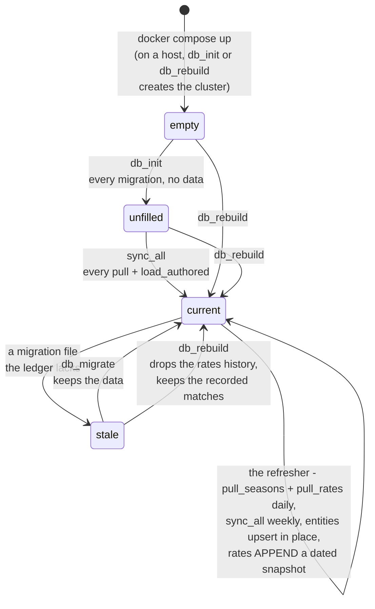
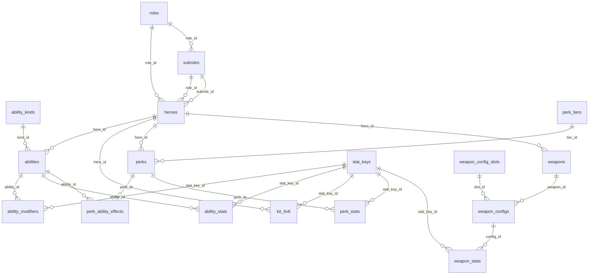
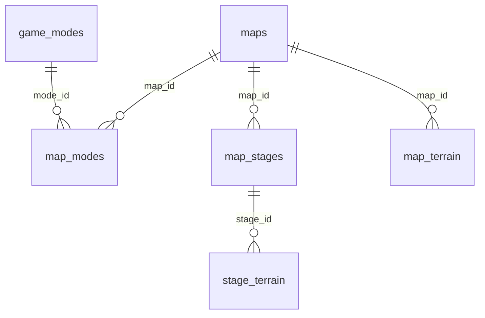
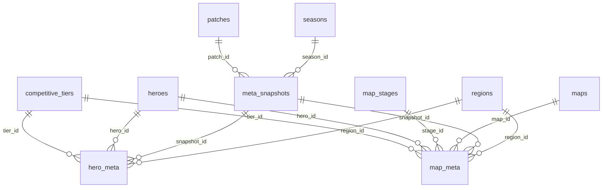
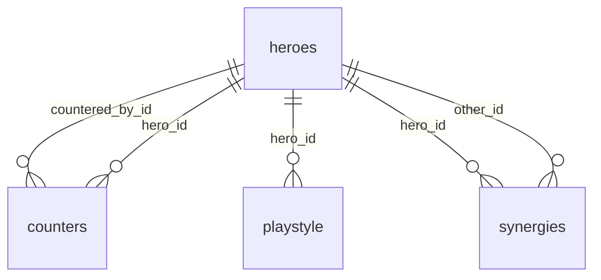
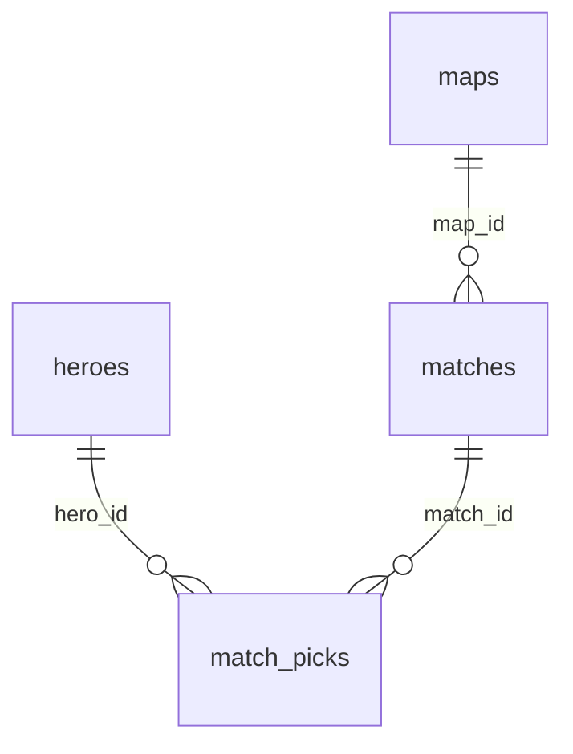

# The DATA LAYER - `db/`

Pull every source, clean it and store it in Postgres. This layer owns
`DATA = HEROES ∪ MAPS ∪ META`: the tables a board's facts are derived
from. Every row carries a `source_id`, and that is the only distinction
drawn between what was measured, what was judged and what was written by
hand. Two inputs are written by hand, and carry the `user` source: the
strategies ([inference.md](inference.md)) and the matches the owner
records, one row a map played (`matches`, `match_picks`). Every other table
is pulled from Blizzard or the wiki.

**One door.** Every write runs under a door tool ([mcp.md](mcp.md)); a
read opens its own connection through `db.psql.default_dsn()`.

```bash
.venv/bin/python -m door.mcp list                        # the tools
.venv/bin/python -m door.mcp call db_rebuild             # build from scratch
.venv/bin/python -m door.mcp call sync_all               # update everything
.venv/bin/python -m door.mcp call pull_rates '{"refresh": true}'
```

## Layout

```
db/
  __init__.py        where things live, and the scope; the package's map
  web.py             what the three HTTP servers share, the JSON reader and the MCP client
  matches.py         the one writer of the owner's recorded matches
  data/              the sources, page to table
    blizzard/        overwatch.blizzard.com
    wiki/            overwatch.fandom.com
      kits/          the heroes pull's kit pipeline
    fetch.py         the page cache, its freshness policy and the request loop
    names.py         matching hero, map and ability names across sources
  psql/              the database: where it is, the schema, the ledger
    migrations/      the schema as a sequence
    cluster/         the embedded Postgres a local build creates (gitignored)
  raw/               one CSV per table, the mirror (exported, gitignored)
```

### What the layer shares

| file | purpose |
| --- | --- |
| `__init__.py` | what the whole layer agrees on: the paths, the `sources` row (`Source`), `ROLES` in `role_id` order, the seeded ability kinds and perk tiers, the rates scope (console, controller, Americas), `Refusal`, the one error a caller can fix, `Log`, and `embed`, which rewrites a generated doc section |
| `data/__init__.py` | `PullSummary`, what every pull's `run()` returns, and `ArticlePullSummary`, which adds the pages that would not fetch |
| `data/fetch.py` | the page cache, its freshness and the one request loop: `cached_get`, `cached`, `request` under a `RequestPolicy`, and `PullContext`, what a pull's `run()` takes beside its connection |
| `data/names.py` | one hero, map or ability across sources: `name_key`, `hero_key` through `RENAMED`, `slug`, `ability_key` and `index` |
| `web.py` | what the three HTTP servers share: the Host and Origin guard, the reply to a request that raised, `read_json`, and `call_tool`, the door's HTTP client; its docstring holds the relay's status map |
| `matches.py` | the one writer of `matches` and `match_picks`: `store` takes a match by id - the map's, each hero's - and `delete` removes one with its picks. The door's `record_match` and `delete_match` call it, and `db_rebuild`, which keeps the matches across its drop; `facts/matches.py` reads them back |

### `data/` - one package per source

| module | writes | runs after |
| --- | --- | --- |
| `blizzard/heroes.py` - `pull_heroes` | `roles`, `subroles`, `heroes`, `abilities`, `perks` | nothing: it runs first |
| `wiki/heroes.py` - `pull_kits` | `abilities`, `ability_stats`, `ability_modifiers`, `weapons`, `weapon_configs`, `weapon_stats`, `perks`, `perk_stats`, `perk_ability_effects`, `stat_keys`, `heroes`, `kit_6v6` | `pull_heroes` |
| `wiki/maps.py` - `pull_maps` | `game_modes`, `maps`, `map_modes`, `map_stages` | - |
| `wiki/terrain.py` - `pull_terrain` | `map_terrain`, `stage_terrain` | `pull_maps` |
| `wiki/patches.py` - `pull_patches` | `patches` | - |
| `wiki/seasons.py` - `pull_seasons` | `seasons`, and each `meta_snapshots` row's season | - |
| `blizzard/meta.py` - `pull_rates` | `regions`, `competitive_tiers`, `meta_snapshots`, `hero_meta`, `map_meta` | `pull_heroes`, `pull_maps`, `pull_patches`, `pull_seasons` |
| `wiki/playstyles.py` - `pull_playstyles` | `playstyle` | `pull_heroes` |
| `wiki/synergies.py` - `pull_synergies` | `synergies` | `pull_heroes` |
| `wiki/matchups.py` - `pull_counters` | `counters` | `pull_heroes` |

`wiki/kits/` is the kit pipeline `pull_kits` runs; `wiki/markup.py` and
`wiki/matchup_tables.py` read the wiki's markup and store nothing. Each
package's `__init__.py` maps its modules, and each module's docstring
says what it reads.

### `psql/` - the database

| file | purpose |
| --- | --- |
| `__init__.py` | where the database is: `default_dsn` resolves `DATABASE_URL`, else the embedded cluster at `db/psql/cluster` once one is built, and never creates one; `boot`, for `db_init` and `db_rebuild` alone, creates it; with neither, `NoDatabaseError`. Its docstring maps the helpers every writer needs |
| `schema.py` | the migrations and the `schema_migrations` ledger; `state` (empty, stale, unfilled or current), which `python -m db.psql.schema` prints for the container entrypoint; `rebuild`; `generate_docs`, the two sections at the end of this document, each table described by the `--` block above its `CREATE TABLE` or a later `COMMENT ON TABLE` |
| `migrations/` | The schema as a sequence, one file per step: `001` sources and the foundation, `002` heroes, `003` maps, `004` meta, `005` playbook, `006` inference, `007` the three layers, `008` the ledger, `009` and `014` the tables that recorded matches, added and dropped again, `010` constraints and heuristics (the `strategies` table), `011` and `012` the `matrix_reader` login the `query` tool connects as, with the dynamic-SQL functions withdrawn from `PUBLIC`, `013` the assumption kind, `015` announced heroes, `016` the playbook each `strategies` row was mirrored from, `017` that column's comment, `018` `map_playstyle` and `comp_archetypes` dropped, `seasons` and `synergies` pulled from the wiki, `019` `map_strategy` and the third source's rates, snapshots and `sources` row dropped, `counters` pulled from the wiki, `020` `map_terrain`, the terrain features each map's wiki article names, `021` `stage_terrain`, with every Hybrid map's two phases and an Escort map's named stretches stored as stages, `022` the `strategies.playbook` comment under the Countrix name, `023` the columns nothing read dropped - `raw_value` on the three stat tables, `patches.platform` and `url`, `subroles.icon_url`, `stat_keys.label` and `unit`, `roles.name`, `024` `matches` and `match_picks`, the owner's recorded games, one row a map with both sixes and the bans, under the `user` source, `025` the 6v6 kit beside the 5v5 one: `heroes.health_6v6`, `shield_6v6` and `armor_6v6`, and `kit_6v6`, each 6v6 line of a hero's article. A statement in an applied migration is never edited; a change is a new file, and a populated database catches up with `db_migrate`. The `--` prose above each `CREATE TABLE` is the data dictionary's text, and is kept current. |
| `cluster/` | the embedded Postgres `db_init` or `db_rebuild` creates through pgserver (gitignored); a reader starts it on first touch and never creates it. The compose stack runs its own Postgres, the `db` service, which the host reaches through `./docker-db` |

### `raw/` - the mirror

One CSV per table, exported by `export_csv` after every sync, plus
`EXPORT.json` naming the database that exported it. Gitignored. The
parity tests read it, and skip themselves when the mirror came from the
other database.

## The order of a build

`sync_all` runs the pulls in dependency order - `blizzard.heroes`,
`wiki.heroes`, `wiki.maps`, `wiki.terrain`, `wiki.patches`, `wiki.seasons`,
`blizzard.meta`, `wiki.playstyles`, `wiki.synergies`, `wiki.matchups` -
then `load_authored`, then `export_csv`. Entity tables refresh in place;
each rates pull appends a dated snapshot, the series the trend facts
difference. The page caches (`.cache-blizzard/`, `.cache-wiki/` at the
repo root) make every build after the first cost almost no requests.



`db_rebuild` drops every table, reapplies the migrations and runs
`sync_all`, whatever the state. The owner's recorded matches are the one
thing no source gives back, so it keeps them: they go to
`db/raw/kept-matches.json` before the drop and come back by name once
`sync_all` has refilled the roster, each under its own id. A rebuild that
fails leaves the file for the next one, and a match whose map or hero the
roster no longer names stays in it. Docker's `data` container asks
`python -m db.psql.schema` for the state (`schema.state`), runs
`db_rebuild` on anything but current, then serves the door. `db_status`
and the door's `/health` report the same state, which the inference, ui
and refresher containers wait on.

## Keeping it fresh

The `refresher` container runs the door's clock, `door/refresh.py`: once
a day `pull_seasons` and `pull_rates` (a new dated snapshot), then the
strategies mirror and `raw/`, or `sync_all` with refresh on in their place
once the wiki cache is older than `COUNTRIX_REFRESH_FULL_DAYS`. A page
that fails to refetch keeps its cached copy and is listed under `stale`;
a rates pull that read one stamps no snapshot and replies
`pull_rates: nothing stored; stale: N`.

| setting | default | meaning |
| --- | --- | --- |
| `COUNTRIX_REFRESH_AT` | `05:00` | daily time, in the container's `TZ` (UTC unless set) |
| `COUNTRIX_REFRESH_MAX_AGE_HOURS` | `20` | refresh on start when the cache is older than this |
| `COUNTRIX_REFRESH_FULL_DAYS` | `7` | refetch every source (not just the daily set) when the wiki cache is older than this |

## Widening the meta's granularity

This concerns the rates tables, `hero_meta` and `map_meta`. Hero kits,
weapons, maps and modes have no such dimensions: a cooldown is a cooldown
in every region, on every platform, at every rank. The playbook tables
(`counters`, `synergies`, `playstyle`) carry no tier or region column by
design: a judgement is a current read of the game, not a measurement of a
population.

Every dimension below has its column, so widening one is an edit to
`pull_rates` and a refetch; a new dimension is a new migration, never an
edit to `psql/migrations/004_meta.sql`. The rows already stored are data:
`pull_rates` appends a dated snapshot and deletes nothing, so `db_migrate`
keeps the series and `db_rebuild` drops it.

| dimension | column exists? | populated today | to widen it |
| --- | --- | --- | --- |
| tier - `hero_meta` | yes | 9 ranks | already there |
| tier - `map_meta` | yes | all-ranks only | restore the inner loop; ×9 requests |
| region - `hero_meta` | yes | Americas | drop the region pin; ×3 requests |
| region - `map_meta` | yes | Americas | drop the region pin; ×3 requests |
| platform | as `meta_snapshots.platform` | Console | fetch `input=PC` too; ×2 requests |
| input device | as `meta_snapshots.input` | controller | the same filter as platform (see below) |
| map stage | `map_stages` | stage list loaded | a source with per-stage rates (see below) |

**Platform and input device are one filter.** Blizzard's rates page sends
`input=PC` or `input=Console` and labels the two Mouse & Keyboard and
Controller. A snapshot records both readings of the one pin, `platform`
console and `input` controller (`db.PLATFORM`, `db.INPUT_DEVICE`). No
source splits a platform by device.

**Map stages exist; per-stage rates do not.** `map_stages` holds the
wiki's stages - a Control map's three, a Flashpoint map's five points, a
Hybrid map's two phases, an Escort map's named stretches - but Blizzard's
map filter stops at whole maps, so every `map_meta` row keeps `stage_id`
NULL, the whole map. `map_meta` is `UNIQUE NULLS NOT DISTINCT`: Postgres
treats NULLs as distinct by default, which would let the same hero, map
and rank be inserted over and over.

**The request count is the real ceiling.** The dimensions compose
multiplicatively, and the source refuses long sweeps. `map_meta` at full
granularity:

```
30 maps × 9 ranks × 3 regions × 2 platforms = 1,620 requests
```

The rates endpoint began answering `504 Gateway Time-out` partway through
a **280**-request sweep, and then closed connections outright. 1,620 is
not reachable in one pass at any polite rate. The page cache makes it
tractable: it is permanent and keyed by the full query, so granularity
widens one dimension at a time across many runs, each resuming from what
is on disk. Widen first along the dimension that separates the numbers
most: `hero_meta` carries every tier, so a query over it says how far one
hero's rates move up the ladder - the spread each map's all-ranks figure
averages away. The rates are Blizzard's, for personal use, so this
document quotes none of them.

## The schema

Generated from the live database by
`.venv/bin/python -m door.mcp call db_docs`; the two sections between the
markers are rewritten in place, the rest of this document is written by
hand.

### Entity relationship diagrams

<!-- generated:erd -->
Six domains. Three hold the data the sources are pulled for: which
hero (HEROES), on which map (MAPS), performing how well (META).
Every domain
yields independent facts (a selection's own row) and dependent ones
(the selection joined with others: map_meta is heroes ⋈ maps ⋈ meta,
counters and synergies are heroes ⋈ heroes), and a join belongs to
every domain it touches. Two are the playbook's record: the
judgements pulled from the wiki (PLAYBOOK) and the mirror of the
strategies that the inference layer solves with (INFERENCE). The last
is the owner's record of the games played, one row a map (MATCHES).
The strategies and the recorded matches are the two inputs a user
writes; every other table is pulled. The composition is the argmax of
the strategies - the constraints, heuristics and assumptions in
inference/strategies/ - over the facts.

```
DATA        = HEROES ∪ MAPS ∪ META
FACTS(D)    = INDEPENDENT(D) ∪ DEPENDENT(D)   for each domain D: its rows; its joins
FACTS       = FACTS(HEROES) ∪ FACTS(MAPS) ∪ FACTS(META)
STRATEGIES  = CONSTRAINTS ∪ HEURISTICS ∪ ASSUMPTIONS
COMP        = ARGMAX[ STRATEGIES( FACTS ) ]
```

Every table but `sources` and `schema_migrations` also carries
`source_id` -> `sources` and a `cao` timestamp. Those edges are left off -
they would connect `sources` to 36 tables and obscure everything else.

#### HEROES



#### MAPS



#### META



#### PLAYBOOK



#### INFERENCE

```mermaid
erDiagram
```

#### MATCHES



#### The whole database

```mermaid
erDiagram
    abilities ||--o{ ability_modifiers : "ability_id"
    abilities ||--o{ ability_stats : "ability_id"
    abilities ||--o{ perk_ability_effects : "ability_id"
    ability_kinds ||--o{ abilities : "kind_id"
    competitive_tiers ||--o{ hero_meta : "tier_id"
    competitive_tiers ||--o{ map_meta : "tier_id"
    game_modes ||--o{ map_modes : "mode_id"
    heroes ||--o{ abilities : "hero_id"
    heroes ||--o{ counters : "countered_by_id"
    heroes ||--o{ counters : "hero_id"
    heroes ||--o{ hero_meta : "hero_id"
    heroes ||--o{ kit_6v6 : "hero_id"
    heroes ||--o{ map_meta : "hero_id"
    heroes ||--o{ match_picks : "hero_id"
    heroes ||--o{ perks : "hero_id"
    heroes ||--o{ playstyle : "hero_id"
    heroes ||--o{ synergies : "hero_id"
    heroes ||--o{ synergies : "other_id"
    heroes ||--o{ weapons : "hero_id"
    map_stages ||--o{ map_meta : "stage_id"
    map_stages ||--o{ stage_terrain : "stage_id"
    maps ||--o{ map_meta : "map_id"
    maps ||--o{ map_modes : "map_id"
    maps ||--o{ map_stages : "map_id"
    maps ||--o{ map_terrain : "map_id"
    maps ||--o{ matches : "map_id"
    matches ||--o{ match_picks : "match_id"
    meta_snapshots ||--o{ hero_meta : "snapshot_id"
    meta_snapshots ||--o{ map_meta : "snapshot_id"
    patches ||--o{ meta_snapshots : "patch_id"
    perk_tiers ||--o{ perks : "tier_id"
    perks ||--o{ perk_ability_effects : "perk_id"
    perks ||--o{ perk_stats : "perk_id"
    regions ||--o{ hero_meta : "region_id"
    regions ||--o{ map_meta : "region_id"
    roles ||--o{ heroes : "role_id"
    roles ||--o{ subroles : "role_id"
    seasons ||--o{ meta_snapshots : "season_id"
    stat_keys ||--o{ ability_modifiers : "stat_key_id"
    stat_keys ||--o{ ability_stats : "stat_key_id"
    stat_keys ||--o{ kit_6v6 : "stat_key_id"
    stat_keys ||--o{ perk_stats : "stat_key_id"
    stat_keys ||--o{ weapon_stats : "stat_key_id"
    subroles ||--o{ heroes : "role_id"
    subroles ||--o{ heroes : "subrole_id"
    weapon_config_slots ||--o{ weapon_configs : "slot_id"
    weapon_configs ||--o{ weapon_stats : "config_id"
    weapons ||--o{ weapon_configs : "weapon_id"
```


<!-- /generated:erd -->

### Data dictionary

<!-- generated:dictionary -->
Generated from the live schema (`.venv/bin/python -m door.mcp call db_docs`).

Two columns are omitted from the lists below: `source_id` (which source the
row came from, see `sources`) and `cao` - "current as of", when that row
was read. Every table but `sources` and `schema_migrations` carries both;
`sources` carries `cao` alone and `schema_migrations` neither.

| domain | tables |
| --- | --- |
| **foundation** | `schema_migrations` · `sources` |
| **HEROES** | `abilities` · `ability_kinds` · `ability_modifiers` · `ability_stats` · `heroes` · `kit_6v6` · `perk_ability_effects` · `perk_stats` · `perk_tiers` · `perks` · `roles` · `stat_keys` · `subroles` · `weapon_config_slots` · `weapon_configs` · `weapon_stats` · `weapons` |
| **MAPS** | `game_modes` · `map_modes` · `map_stages` · `map_terrain` · `maps` · `stage_terrain` |
| **META** | `competitive_tiers` · `hero_meta` · `map_meta` · `meta_snapshots` · `patches` · `regions` · `seasons` |
| **PLAYBOOK** | `counters` · `playstyle` · `synergies` |
| **INFERENCE** | `strategies` |
| **MATCHES** | `match_picks` · `matches` |


#### `abilities`

*HEROES · `002_heroes.sql`*

kind_id is NULL until pull_kits sets it. Blizzard's markup labels neither weapons nor ultimates, and its ordering does not identify them either, so nothing is guessed at scrape time.

| column | type | null | references |
| --- | --- | --- | --- |
| `ability_id` | integer | no |  |
| `hero_id` | integer | no | `heroes.hero_id` |
| `kind_id` | smallint | yes | `ability_kinds.kind_id` |
| `name` | text | no |  |
| `description` | text | no |  |
| `position` | smallint | no |  |
| `keywords` | text | yes |  |

#### `ability_kinds`

*HEROES · `002_heroes.sql`*

| column | type | null | references |
| --- | --- | --- | --- |
| `kind_id` | smallint | no |  |
| `code` | text | no |  |

#### `ability_modifiers`

*HEROES · `002_heroes.sql`*

affects names the quantity scaled, so a query can find every effect on outgoing damage without knowing which stat it was published under. damage_dealt · damage_taken · healing_received · healing_dealt · movement_speed magnitude is a signed percentage: +50 amplifies, -45 reduces.

| column | type | null | references |
| --- | --- | --- | --- |
| `modifier_id` | integer | no |  |
| `ability_id` | integer | no | `abilities.ability_id` |
| `stat_key_id` | integer | no | `stat_keys.stat_key_id` |
| `affects` | text | no |  |
| `applies_to` | text | yes |  |
| `magnitude` | numeric | no |  |
| `unit` | text | no |  |

#### `ability_stats`

*HEROES · `002_heroes.sql`*

One row per measurement, not per stat. A wiki value like "0.67 shots/s (max charge); 3.33 shots/s (min charge)" becomes two rows sharing a stat_key, separated by condition. Units are split into the unit on top and the unit underneath, so nothing has to parse a "/" to know what a number means. denominator_value carries the magnitude underneath - 1 for a plain rate, or the window a burst spans: "125 m/s" is 125 meters / seconds over 1, "1.25 shots/s" 1.25 shots / seconds over 1, "75 over 0.59 seconds" 75 hp / seconds over 0.59, and "14 seconds" 14 seconds with no unit underneath. A rate is therefore always value / denominator_value per unit_denominator. value is NULL where the measurement is not numeric (shot types, "partial"). value_text keeps the text each measurement was read from, so anything the parser misreads stays recoverable; the wiki markup behind it stays in the page cache. weapon_stats and perk_stats hold the same measurements for a weapon's firing config and for a perk.

| column | type | null | references |
| --- | --- | --- | --- |
| `ability_stat_id` | integer | no |  |
| `ability_id` | integer | no | `abilities.ability_id` |
| `stat_key_id` | integer | no | `stat_keys.stat_key_id` |
| `value` | numeric | yes |  |
| `unit_numerator` | text | yes |  |
| `unit_denominator` | text | yes |  |
| `denominator_value` | numeric | yes |  |
| `condition` | text | yes |  |
| `value_text` | text | no |  |

#### `competitive_tiers`

*META · `004_meta.sql`*

'all' is a real member of the tier dimension: it is the unfiltered figure the page reports, and keeping it as a row avoids a nullable dimension key. Region has no such member. Everything here is the Americas, so an "all regions" row would be a second population mixed in beside it. Bronze through Champion, plus the "All Tiers" aggregate the source reports alongside them. rank_order follows the source's own ordering.

| column | type | null | references |
| --- | --- | --- | --- |
| `tier_id` | integer | no |  |
| `code` | text | no |  |
| `name` | text | no |  |
| `rank_order` | smallint | no |  |

#### `counters`

*PLAYBOOK · `005_playbook.sql`*

Who answers whom: one row means countered_by_id answers hero_id. Pulled from the Match-Up column of every hero's wiki article (pull_counters): each written cell is read from the article hero's seat as a verdict - the other hero answers this one, this one answers the other, or neither - and a verdict either way becomes one directed edge. A pair the two articles contradict on gets no edge. Reloaded whole.

| column | type | null | references |
| --- | --- | --- | --- |
| `hero_id` | integer | no | `heroes.hero_id` |
| `countered_by_id` | integer | no | `heroes.hero_id` |

#### `game_modes`

*MAPS · `003_maps.sql`*

| column | type | null | references |
| --- | --- | --- | --- |
| `mode_id` | integer | no |  |
| `code` | text | no |  |
| `name` | text | no |  |

#### `hero_meta`

*META · `004_meta.sql`*

Rates by region and tier. All rates are percentages as published (47.9 means 47.9%). These rows are across all maps.

| column | type | null | references |
| --- | --- | --- | --- |
| `hero_meta_id` | integer | no |  |
| `snapshot_id` | integer | no | `meta_snapshots.snapshot_id` |
| `hero_id` | integer | no | `heroes.hero_id` |
| `region_id` | integer | no | `regions.region_id` |
| `tier_id` | integer | no | `competitive_tiers.tier_id` |
| `win_rate` | numeric | yes |  |
| `pick_rate` | numeric | yes |  |
| `ban_rate` | numeric | yes |  |

#### `heroes`

*HEROES · `002_heroes.sql`*

The composite foreign key makes it impossible to pair a hero with a subrole belonging to a different role than the hero's own. health, shield and armor are the hero's own pool in 5v5, all in hp. Blizzard publishes none of them, so pull_kits fills them in; a hero with no shield or armor leaves those NULL rather than storing a zero the source never states. health_6v6, shield_6v6 and armor_6v6 are the same pool in 6v6 where the article's infobox gives one, NULL where it gives none and the 5v5 figure stands; a value that is not a whole number is rejected, never stored.

| column | type | null | references |
| --- | --- | --- | --- |
| `hero_id` | integer | no |  |
| `slug` | text | no |  |
| `name` | text | no |  |
| `role_id` | integer | no | `roles.role_id` |
| `subrole_id` | integer | no | `subroles.subrole_id` |
| `health` | smallint | yes |  |
| `shield` | smallint | yes |  |
| `armor` | smallint | yes |  |
| `portrait_url` | text | yes |  |
| `status` | text | no |  |
| `release_date` | date | yes |  |
| `health_6v6` | smallint | yes |  |
| `shield_6v6` | smallint | yes |  |
| `armor_6v6` | smallint | yes |  |

#### `kit_6v6`

*HEROES · `025_kit_6v6.sql`*

The 6v6 lines of each hero's kit: one row per line of the 6v6_details field an Ability_details block carries (pull_kits). piece is the block's ability name as the wiki writes it - an ability, a weapon or a perk of the hero. A line that says a stat increased or was reduced from A to B carries the stat its words name (stat_key_id, NULL where the pull maps none), from_value A and to_value B, a multiplier the wiki writes 2.5x held as the kit holds it, a percent (250). Any other line carries its words alone. A line whose figures do not parse is rejected, never stored. The 5v5 rows are left as they are; facts/kit_format.py moves a stat row from A to B when the format in force is 6v6. Reloaded whole with the kits.

| column | type | null | references |
| --- | --- | --- | --- |
| `kit_6v6_id` | integer | no |  |
| `hero_id` | integer | no | `heroes.hero_id` |
| `piece` | text | no |  |
| `stat_key_id` | integer | yes | `stat_keys.stat_key_id` |
| `from_value` | numeric | yes |  |
| `to_value` | numeric | yes |  |
| `value_text` | text | no |  |

#### `map_meta`

*META · `004_meta.sql`*

Rates per map. The source's filters compose, so a hero's rates on King's Row in Bronze are a different figure from its rates on King's Row overall, and both are published; only the whole-map figure is pulled, under tier_id 'all', which keeps the dimension key non-nullable. Region is carried but not swept: every row is the Americas. Widening either is a loop, not a migration - map x tier alone is about 270 requests against a source that refuses long sweeps.

| column | type | null | references |
| --- | --- | --- | --- |
| `map_meta_id` | integer | no |  |
| `snapshot_id` | integer | no | `meta_snapshots.snapshot_id` |
| `hero_id` | integer | no | `heroes.hero_id` |
| `map_id` | integer | no | `maps.map_id` |
| `tier_id` | integer | no | `competitive_tiers.tier_id` |
| `region_id` | integer | no | `regions.region_id` |
| `stage_id` | integer | yes | `map_stages.stage_id` |
| `win_rate` | numeric | yes |  |
| `pick_rate` | numeric | yes |  |
| `ban_rate` | numeric | yes |  |

#### `map_modes`

*MAPS · `003_maps.sql`*

One row per playable combination: the maps and modes of Standard Play, the competitive rotation (pull_maps). Every map belongs to one mode today, so this holds one row per map. It is many-to-many anyway: a map can be re-released under a second mode, and the degenerate join costs nothing.

| column | type | null | references |
| --- | --- | --- | --- |
| `map_id` | integer | no | `maps.map_id` |
| `mode_id` | integer | no | `game_modes.mode_id` |

#### `map_stages`

*MAPS · `003_maps.sql`*

Stages within a map, in play order (pull_maps). Control maps: the three stages of the Gameplay section's list (Ilios: Lighthouse, Well, Ruins). Flashpoint maps: the five points of the same list. Hybrid maps: the two phases the wiki's Hybrid article names, Assault (the capture point) then Escort (the payload). Escort maps: the stretches of the route, only where the map's article names them - the Gameplay subsections its opening lists (Havana: City Streets, Distillery, Sea Fort). Push maps: none. No source publishes per-stage rates, so map_meta.stage_id stays NULL.

| column | type | null | references |
| --- | --- | --- | --- |
| `stage_id` | integer | no |  |
| `map_id` | integer | no | `maps.map_id` |
| `position` | smallint | no |  |
| `name` | text | no |  |

#### `map_terrain`

*MAPS · `020_map_terrain.sql`*

A map's terrain, counted in its wiki article (pull_terrain). The sections about the ground and how it is played are kept - gameplay, strategy, the per-stage subsections, a rework's changes, the infobox's terrain line - and the lore, place-name lists and media are dropped. Each feature has one pattern (db/data/wiki/terrain.py): chokes, interiors, high_ground, flanks, sightlines, open_ground, hazards, cover. A map whose article has text holds all eight rows, zeros included; a map whose article has under 60 words of kept text holds none. Reloaded whole.

| column | type | null | references |
| --- | --- | --- | --- |
| `map_id` | integer | no | `maps.map_id` |
| `feature` | text | no |  |
| `mentions` | integer | no |  |
| `per_thousand` | numeric | no |  |

#### `maps`

*MAPS · `003_maps.sql`*

| column | type | null | references |
| --- | --- | --- | --- |
| `map_id` | integer | no |  |
| `name` | text | no |  |

#### `match_picks`

*MATCHES · `024_matches.sql`*

Both sixes and the bans of a recorded match. team is blue (the owner's), red or ban; position orders a team's heroes as they were entered, from 1. A six is the six on the field longest, so a hero swapped in late is not in it. A hero holds one seat a team, and may play for both teams.

| column | type | null | references |
| --- | --- | --- | --- |
| `match_id` | integer | no | `matches.match_id` |
| `team` | text | no |  |
| `position` | smallint | no |  |
| `hero_id` | integer | no | `heroes.hero_id` |

#### `matches`

*MATCHES · `024_matches.sql`*

The owner's recorded games, one row a map, written by record_match. blue is always the owner's team, so side and result are blue's: side is attack or defense on an Escort or Hybrid map and '' on a map without sides, result is win, loss or draw. played_on is the day the map was played. playbook_digest is catalog.playbook_digest of the playbook in force when the match was recorded, so a reader can tell which rules the board scored under. note is the owner's own line, '' when there is none.

| column | type | null | references |
| --- | --- | --- | --- |
| `match_id` | integer | no |  |
| `played_on` | date | no |  |
| `map_id` | integer | no | `maps.map_id` |
| `side` | text | no |  |
| `result` | text | no |  |
| `playbook_digest` | text | no |  |
| `note` | text | no |  |

#### `meta_snapshots`

*META · `004_meta.sql`*

| column | type | null | references |
| --- | --- | --- | --- |
| `snapshot_id` | integer | no |  |
| `captured_at` | timestamp with time zone | no |  |
| `queue` | text | no |  |
| `platform` | text | no |  |
| `input` | text | yes |  |
| `patch_id` | integer | yes | `patches.patch_id` |
| `season_id` | integer | yes | `seasons.season_id` |

#### `patches`

*META · `004_meta.sql`*

The game versions the meta moves with. A win rate is true of a patch, so a snapshot records which patch was live when it was captured. Pulled from the wiki's Patches cargo table (pull_patches); name is the wiki's own page name, since Blizzard ships most balance patches unversioned.

| column | type | null | references |
| --- | --- | --- | --- |
| `patch_id` | integer | no |  |
| `name` | text | no |  |
| `released` | date | no |  |

#### `perk_ability_effects`

*HEROES · `002_heroes.sql`*

| column | type | null | references |
| --- | --- | --- | --- |
| `perk_id` | integer | no | `perks.perk_id` |
| `ability_id` | integer | no | `abilities.ability_id` |

#### `perk_stats`

*HEROES · `002_heroes.sql`*

| column | type | null | references |
| --- | --- | --- | --- |
| `perk_stat_id` | integer | no |  |
| `perk_id` | integer | no | `perks.perk_id` |
| `stat_key_id` | integer | no | `stat_keys.stat_key_id` |
| `value` | numeric | yes |  |
| `unit_numerator` | text | yes |  |
| `unit_denominator` | text | yes |  |
| `denominator_value` | numeric | yes |  |
| `condition` | text | yes |  |
| `value_text` | text | no |  |

#### `perk_tiers`

*HEROES · `002_heroes.sql`*

| column | type | null | references |
| --- | --- | --- | --- |
| `tier_id` | smallint | no |  |
| `code` | text | no |  |
| `name` | text | no |  |
| `unlock_level` | smallint | no |  |

#### `perks`

*HEROES · `002_heroes.sql`*

| column | type | null | references |
| --- | --- | --- | --- |
| `perk_id` | integer | no |  |
| `hero_id` | integer | no | `heroes.hero_id` |
| `tier_id` | smallint | no | `perk_tiers.tier_id` |
| `name` | text | no |  |
| `description` | text | no |  |
| `position` | smallint | no |  |

#### `playstyle`

*PLAYBOOK · `005_playbook.sql`*

Which playstyle a hero belongs to, straight from the wiki's team composition page. The style vocabulary (dive, brawl, poke) is whatever the page says, kept as text rather than a three-row lookup table: the page is the vocabulary, and a new style there should load, not break.

| column | type | null | references |
| --- | --- | --- | --- |
| `hero_id` | integer | no | `heroes.hero_id` |
| `style` | text | no |  |

#### `regions`

*META · `004_meta.sql`*

| column | type | null | references |
| --- | --- | --- | --- |
| `region_id` | integer | no |  |
| `code` | text | no |  |
| `name` | text | no |  |

#### `roles`

*HEROES · `002_heroes.sql`*

| column | type | null | references |
| --- | --- | --- | --- |
| `role_id` | integer | no |  |
| `code` | text | no |  |
| `icon_url` | text | yes |  |

#### `schema_migrations`

*foundation · `008_schema_migrations.sql`*

| column | type | null | references |
| --- | --- | --- | --- |
| `filename` | text | no |  |
| `applied_at` | timestamp with time zone | no |  |

#### `seasons`

*META · `004_meta.sql`*

Seasons: the coarser delineator. A patch tweaks numbers; a season swaps the hero pool and map rotation, so a snapshot records both. Pulled from the wiki's Season pages (pull_seasons): every season that has started, with its start date; note is the wiki subpage it came from. Reloaded whole; every rates snapshot is restamped with its season.

| column | type | null | references |
| --- | --- | --- | --- |
| `season_id` | integer | no |  |
| `name` | text | no |  |
| `started` | date | no |  |
| `note` | text | yes |  |

#### `sources`

*foundation · `001_initial_schema.sql`*

| column | type | null | references |
| --- | --- | --- | --- |
| `code` | text | no |  |
| `name` | text | no |  |
| `url` | text | no |  |

#### `stage_terrain`

*MAPS · `021_stage_terrain.sql`*

A stage's terrain, counted in the map's wiki article (pull_terrain) with map_terrain's features and patterns. A stage's text: every kept section under a heading that names the stage, and every paragraph or list item elsewhere that names it and no other stage. A Hybrid phase's text: every Assault or Escort section, attack and defense together; where the article names the route's stretches, the first is the capture point's and the rest the payload's. A stage with 20 words of text or more holds all eight rows, zeros included; a stage with less holds none. Reloaded whole with map_terrain.

| column | type | null | references |
| --- | --- | --- | --- |
| `stage_id` | integer | no | `map_stages.stage_id` |
| `feature` | text | no |  |
| `mentions` | integer | no |  |
| `per_thousand` | numeric | no |  |

#### `stat_keys`

*HEROES · `002_heroes.sql`*

The stat vocabulary: one row per stat code a kit carries, added by pull_kits and never reloaded. A value with no unit of its own is read in its stat's unit from STAT_UNITS in db/data/wiki/kits/kit_store.py ("damage = 90" is 90 hp), stored as the measurement's unit_numerator.

| column | type | null | references |
| --- | --- | --- | --- |
| `stat_key_id` | integer | no |  |
| `code` | text | no |  |

#### `strategies`

*INFERENCE · `010_constraints_and_heuristics.sql`*

The mirror of the playbook: one row per markdown file in inference/strategies/ - its kind (constraint | heuristic | assumption, the last added by 013), the frontmatter a machine scores by (metric, direction, weight, expressions, params) and the prose body a person argues with. Reloaded whole by load_authored so a recommendation can cite the ids it was scored under; the files remain the truth.

| column | type | null | references |
| --- | --- | --- | --- |
| `strategy_id` | text | no |  |
| `name` | text | no |  |
| `kind` | text | no |  |
| `category` | text | no |  |
| `direction` | text | yes |  |
| `metric` | text | yes |  |
| `weight` | numeric | yes |  |
| `expression` | text | yes |  |
| `params` | text | yes |  |
| `body` | text | no |  |
| `playbook` | text | no |  |

#### `subroles`

*HEROES · `002_heroes.sql`*

The ten subroles, each belonging to exactly one role, each carrying the passive it grants (e.g. "Tactician: Store excess ultimate charge.").

| column | type | null | references |
| --- | --- | --- | --- |
| `subrole_id` | integer | no |  |
| `role_id` | integer | no | `roles.role_id` |
| `code` | text | no |  |
| `name` | text | no |  |
| `passive_description` | text | no |  |

#### `synergies`

*PLAYBOOK · `005_playbook.sql`*

Which heroes work WITH which. Pulled from the Team Synergy column of the "Match-Ups and Team Synergy" section of every released hero's wiki article (pull_synergies). A cell is a claim unless it is a placeholder, rated below GOOD or MIRROR, or unrated and saying there is no synergy. score is 2 when both articles claim the pair, 1 when one does; note is the advice's first sentence, cut to a clause under 120 characters. No snapshot, region or tier: a judgement has no population behind it. Reloaded whole. Bidirectional, unlike counters. Synergy is a property of the PAIR: if Mei works with Tracer then Tracer works with Mei - one fact, one row. A counter is an arrow: Mei answering Tracer says nothing about the reverse. So each pair is stored once, lower hero_id first (a CHECK holds it), and read from either side.

| column | type | null | references |
| --- | --- | --- | --- |
| `hero_id` | integer | no | `heroes.hero_id` |
| `other_id` | integer | no | `heroes.hero_id` |
| `score` | smallint | yes |  |
| `note` | text | yes |  |

#### `weapon_config_slots`

*HEROES · `002_heroes.sql`*

| column | type | null | references |
| --- | --- | --- | --- |
| `slot_id` | smallint | no |  |
| `code` | text | no |  |

#### `weapon_configs`

*HEROES · `002_heroes.sql`*

weapon_type lives here rather than on the weapon because it varies by config: Ana's Biotic Rifle is a projectile from the hip and hitscan in ADS.

| column | type | null | references |
| --- | --- | --- | --- |
| `config_id` | integer | no |  |
| `weapon_id` | integer | no | `weapons.weapon_id` |
| `slot_id` | smallint | no | `weapon_config_slots.slot_id` |
| `name` | text | no |  |
| `weapon_type` | text | yes |  |
| `position` | smallint | no |  |
| `keywords` | text | yes |  |

#### `weapon_stats`

*HEROES · `002_heroes.sql`*

| column | type | null | references |
| --- | --- | --- | --- |
| `weapon_stat_id` | integer | no |  |
| `config_id` | integer | no | `weapon_configs.config_id` |
| `stat_key_id` | integer | no | `stat_keys.stat_key_id` |
| `value` | numeric | yes |  |
| `unit_numerator` | text | yes |  |
| `unit_denominator` | text | yes |  |
| `denominator_value` | numeric | yes |  |
| `condition` | text | yes |  |
| `value_text` | text | no |  |

#### `weapons`

*HEROES · `002_heroes.sql`*

One row per weapon. A weapon's firing modes are configs, not weapons: Ana carries one Biotic Rifle, fired from the hip or down the sights.

| column | type | null | references |
| --- | --- | --- | --- |
| `weapon_id` | integer | no |  |
| `hero_id` | integer | no | `heroes.hero_id` |
| `name` | text | no |  |
| `position` | smallint | no |  |
<!-- /generated:dictionary -->
