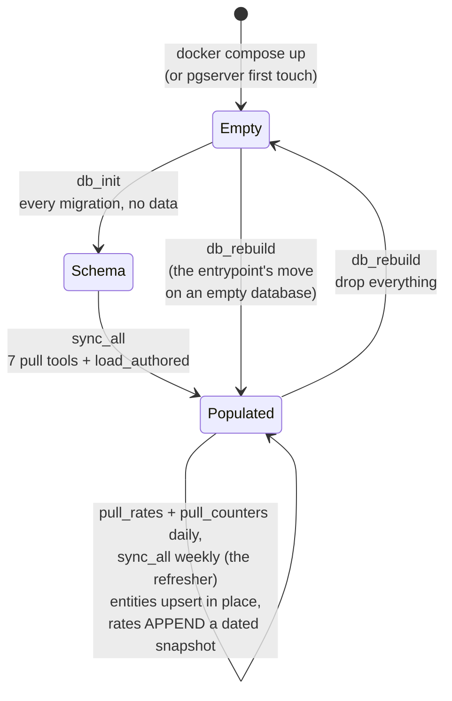
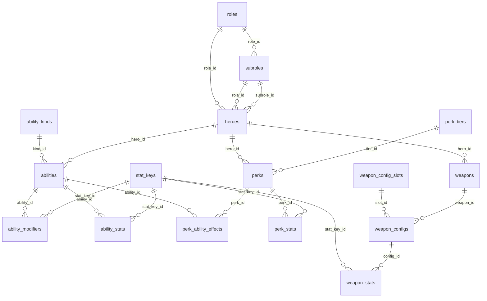
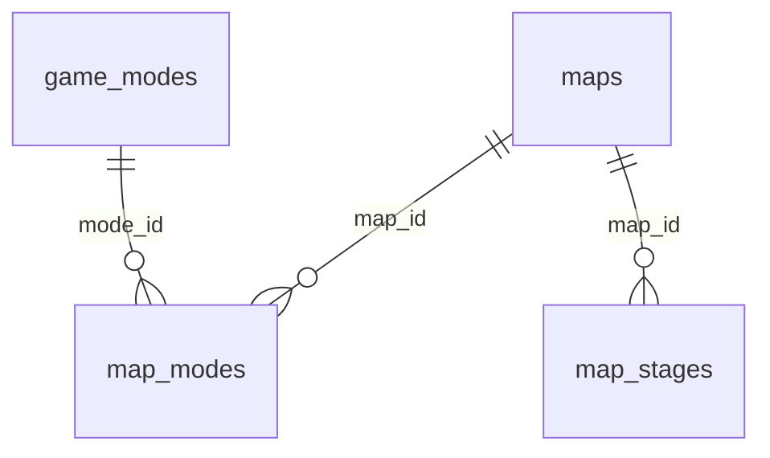
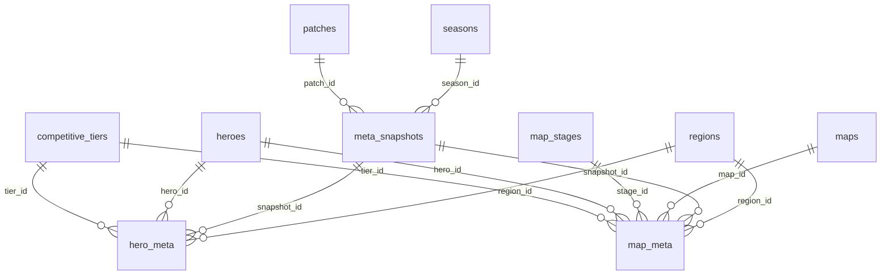
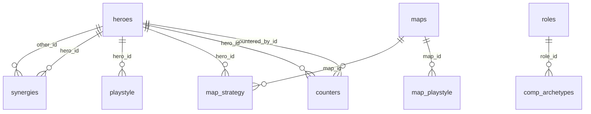
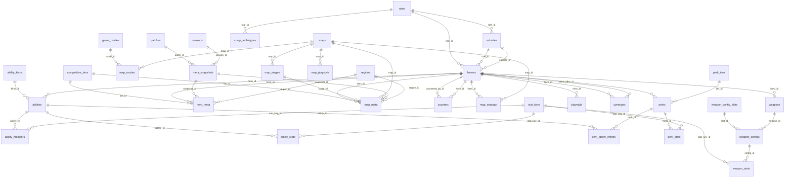

# The DATA LAYER - `db/`

Pull every source, clean it, store it in Postgres, and serve the tools
that do so. This layer owns `DATA = HEROES ∪ MAPS ∪ META`: what the
sources say about the heroes, the maps and the meta, pulled and set - the
tables a board's facts are derived from. Any data in the database is just
data: every row carries a `source_id`, and that is the only distinction
drawn between what was measured, what was judged and what was written by
hand.

**One door.** The MCP tools in `mcp/tools.py` are the only way in. A
Claude Code session calls them over MCP, the `refresher` container calls
them in-process, Docker's entrypoint calls them to build the database, and
a shell calls them the same way:

```bash
.venv/bin/python -m db.mcp list                        # the tools
.venv/bin/python -m db.mcp call db_rebuild             # build from scratch
.venv/bin/python -m db.mcp call sync_all               # update everything
.venv/bin/python -m db.mcp call pull_rates '{"refresh": true}'
```

The root's `orchestrator.py` drives the same tools for the whole stack;
there is no per-module script to keep in step with them.

## Layout

```
db/
  __init__.py        where things live, and the scope; the package's map
  refresh.py         the daily refresh (the refresher container's process)
  sentry.py          the guard (the sentry container's process)
  mcp/               the MCP server and the tools - the one door
  data/              the sources, page to table
    blizzard/        overwatch.blizzard.com
    wiki/            overwatch.fandom.com
    counterpick/     counterpick.gg
    authored/        the inputs we write by hand, and their loader
    fetch.py         the page cache and its freshness policy
    names.py         matching hero, map and ability names across sources
  psql/              the database: where it is, the schema, the ledger
    migrations/      the schema as a sequence
    cluster/         the embedded Postgres a local build creates (gitignored)
  raw/               one CSV per table, the mirror (exported, gitignored)
```

### What the layer shares

| file | purpose |
| --- | --- |
| `__init__.py` | What the whole layer agrees on, declared once: where the repo, the caches, the authored inputs and the mirror live, and the scope every rates snapshot is pinned to - console, controller, Americas. |
| `data/fetch.py` | `cached_get`: one page, from the cache if it is there and fresh. `set_max_age`: the freshness policy - a build keeps every cached page, a refresh refetches them, and a page that fails to refetch keeps its cached copy. `session`: a requests session that says who we are. `prepare_cache`: the cache directory a tool hands a pull. |
| `data/names.py` | `name_key` recognises the same hero or map across sites ("Lúcio", "Lucio"; "D.Va", "DVa") by folding accents and punctuation. `ability_key` recognises the same ability across Blizzard and the wiki by dropping one trailing parenthetical. |
| `sentry.py` | The guard. Every thirty seconds: every strategy file must load through the catalog and read like a strategy, or it is quarantined (`.md.quarantined`); instruction-like text in the authored CSVs and the database's free text is flagged; the door's audit log is tallied. Its report, `raw/sentry.json`, is what `orchestrator.py status` prints; `python -m db.sentry --once` is one pass from a shell. |
| `refresh.py` | The clock: the daily refresh below, and the full one once the wiki cache is a week old. |

### `data/` - one package per source

Each source package owns the whole path from page to table. Its
`__init__.py` names the endpoints, the `sources` row its pages become and,
for the wiki, the client that talks to the MediaWiki endpoint. Each domain
module is one `run(connection, cache_dir, session, log)` the tools call:
fetch (cached), extract the values from the markup, normalise them, store
them.

| package | module | stores |
| --- | --- | --- |
| `blizzard/` | `heroes.py` | the roster: heroes, roles, subroles, portraits and icons, ability and perk text. Runs first; everything links to heroes. Blizzard publishes prose and no numbers. |
| | `meta.py` | win, pick and ban rates as a dated snapshot, sliced by skill tier and by map. Competitive Role Queue (the page offers no Open Queue), console, Americas - all recorded on the snapshot. |
| `wiki/` | `heroes.py` | hero kits from the Cargo Abilities table: weapons and their firing configs, abilities, perks, keywords, and every stat as a measurement. Also the announced heroes: a Cargo hero the roster lacks whose article is marked upcoming gets a row (role, subrole, health, release day, status `announced`) so its kit loads ahead of release; Blizzard listing it later flips the status to released. Supplements the interaction flags from article wikitext. Runs after `blizzard.heroes`. |
| | `maps.py` | maps, game modes and stages from the Maps article's Standard Play section. |
| | `patches.py` | game versions from the Patches cargo table; snapshots link to the patch current at capture. Runs before the rates pulls. |
| | `playstyles.py` | the team-composition playstyles (dive, brawl, poke) and the heroes listed under each. |
| | `markup.py` | reading the wiki's two markups - Cargo's rendered HTML and article wikitext - and the tidying both need; the link pattern. |
| | `measurements.py` | a stat value ("75 over 0.59 seconds", "10 - 20 meters", a yes/no glyph) into value, unit, window and condition. |
| | `weapons.py` | the wiki's one-entry-per-firing-mode list grouped into weapons and their configs. |
| | `modifiers.py` | what a buff scales and who it lands on, recovered from the value's wording and the ability's keywords. |
| `counterpick/` | `heroes.py` | who counters whom, best maps, and the site's own win and pick rates as their own snapshot (a different population from Blizzard's). Runs after `wiki.maps` and `blizzard.meta`. |

### `mcp/` - the door

The servers, the transport and the full tool reference are in
[mcp.md](mcp.md).

| file | purpose |
| --- | --- |
| `server.py` | A dependency-free MCP server: JSON-RPC over stdio, and the same surface over Streamable HTTP (`POST /mcp`, `GET /health`). `initialize`, `tools/list`, `tools/call`, `resources/*`. Dependency-free so the door has nothing to audit but its own few hundred lines. |
| `tools.py` | The tools. `pull_*` (one source and domain each), `load_authored`, `sync_all`; the database's life (`db_status`, `db_init`, `db_migrate`, `db_rebuild`, `export_csv`, `db_docs`, read-only `query`); and, through the same door, the UI and inference layers' tools (`roster`, `facts`, `infer`, `evaluate`, `board`, `strategies`, `metrics`, `add_strategy`, `infer_strategy`, `derive_strategies`, `tune`, `tuning_log`). The strategies are also served as `strategy://` resources. |
| `__main__.py` | `python -m db.mcp` serves over stdio (what `.mcp.json` launches); `--http HOST:PORT` serves over HTTP (the `data` container); `list` and `call NAME [JSON]` are the shell. |

### `psql/` - the database

| file | purpose |
| --- | --- |
| `__init__.py` | Where the database is (`DATABASE_URL`, or the embedded cluster at `db/psql/cluster`); how a source registers the `sources` row its rows carry; how names look up ids; what a capture is stamped with (now, the current patch and season); the CSV export and its `EXPORT.json` mark naming the database it came from. Knows no particular source or table. |
| `schema.py` | Applies migrations and records them in the `schema_migrations` ledger; `pending` says which files the database has not seen; `rebuild` drops everything and reapplies; `generate_docs` writes the ER diagrams and the data dictionary at the end of this document from the live schema. |
| `migrations/` | The schema as a sequence, one file per step: `001` sources and the foundation, `002` heroes, `003` maps, `004` meta, `005` playbook, `006` inference, `007` the three layers, `008` the ledger, `009` outcomes (dropped by `014`), `010` constraints and heuristics (the `strategies` table), `011` and `012` the `matrix_reader` login the `query` tool connects as, with the dynamic-SQL functions withdrawn from `PUBLIC`, `013` the assumption kind, `014` the recorded tables dropped, `015` announced heroes, `016` the playbook each `strategies` row was mirrored from. A migration is never edited once applied; a change is a new file, and a populated database catches up with `db_migrate`. |
| `cluster/` | The embedded Postgres cluster `pgserver` creates on first touch (gitignored). The compose stack uses its own `postgres` container instead, reachable from the host through `./docker-db`. |

### `data/authored/` - what we write

Everything else in the database is fetched by a pull tool. These files are
written by hand and nothing under `authored/` is written by the code, so
they are committed, loaded whole-truth by `load_authored`, and never
discarded by a rebuild. The loader is this folder's own `__init__.py`; it
declares the `sources` row they become, as every source package does, and
a malformed row or an unknown name is a loud error.

- `synergies.csv` - `hero,other,score,note`: one PAIR per row, written once
  in either order, stored once. The note is the reasoning the board shows;
  `team.synergy_score` counts the pairs.
- `archetypes.csv` - `style,role,slots,note`: what a six-stack of each
  playstyle looks like (2-2-2 by default).
- `map_playstyle.csv` - `map,style,score,note`: what kind of fight each map
  rewards (1-3). `map.style_top` reads the top style; the game plan reads
  the note.
- `seasons.csv` - `name,started,note`: the coarse delineator of rates
  snapshots; loading recomputes `season_id` on every snapshot.

There are no free-form notes here. A note that should shape a comp is an
assumption in [`inference/strategies/`](../inference/strategies/) - the
playbook holds constraints, heuristics and assumptions, and nothing else -
where it is shown on the board, read by the `/comp` session, and tuned
and logged with the rest.

### `raw/` - the mirror

One CSV per table, exported by `export_csv` after every sync, plus
`EXPORT.json` naming the database that exported it. Gitignored. The
parity tests read it, and skip themselves when the mirror came from the
other database.

## The order of a build

`sync_all` runs the pulls in dependency order - `blizzard.heroes`,
`wiki.heroes`, `wiki.maps`, `wiki.patches`, `blizzard.meta`,
`wiki.playstyles`, `counterpick.heroes` - then `load_authored`, then
`export_csv`. Entity tables refresh in place; each rates pull appends a
dated snapshot, the series the trend facts difference. The page caches
(`.cache-blizzard/`, `.cache-wiki/`, `.cache-counterpick/` at the repo
root) make every build after the first cost almost no requests.



Docker's `data` container runs `db_rebuild` on an empty, unfilled or stale
database, then serves the door.

## Keeping it fresh

The `refresher` container refreshes the database once a day, so the board
is ready when a game starts. The daily refresh refetches what moves day to
day - the rates (a new dated snapshot) and counterpick's counters - then
re-mirrors the authored inputs and the strategies and re-exports `raw/`.
Once the wiki cache is older than `COUNTER_MATRIX_REFRESH_FULL_DAYS` it
runs `sync_all` with refresh on: every page of every source, hero pages
and articles included. It also refreshes on start when the cached pages
are older than `COUNTER_MATRIX_REFRESH_MAX_AGE_HOURS`. A page that fails
to fetch keeps its cached copy, so a flaky source degrades to yesterday's
numbers rather than an empty table; the board's header shows the capture
date and warns when patches shipped since.

| setting | default | meaning |
| --- | --- | --- |
| `COUNTER_MATRIX_REFRESH_AT` | `05:00` | daily time, in the container's `TZ` (UTC unless set) |
| `COUNTER_MATRIX_REFRESH_MAX_AGE_HOURS` | `20` | refresh on start when the cache is older than this |
| `COUNTER_MATRIX_REFRESH_FULL_DAYS` | `7` | refetch every source (not just rates and counters) when the wiki cache is older than this |

Set them in the environment or a `.env` file next to `compose.yaml`. The
same refresh from a shell, against whichever database `DATABASE_URL` names:

```bash
.venv/bin/python -m db.refresh --now        # once, now (the daily set; --full for every source)
.venv/bin/python -m db.refresh              # the daily loop
.venv/bin/python -m db.mcp call sync_all '{"refresh": true}'
```

## Widening the meta's granularity

This concerns the *fact* tables - the ones holding rates and playbook
rows. Hero kits, weapons, maps and modes have no such dimensions: a
cooldown is a cooldown in every region, on every platform, at every rank.

**A rebuild drops the database and reapplies the migrations from
scratch,** and the migrations ledger makes the Docker entrypoint do the
same the moment the files change. Adding a dimension is never a data
migration - there is no data to migrate. It is an edit to
`psql/migrations/004_meta.sql`, an edit to `pull_rates`, and a refetch.
The schema is not the constraint; the request count is, and it is
multiplicative.

| dimension | column exists? | populated today | to widen it |
| --- | --- | --- | --- |
| tier - `hero_meta` | yes | 9 ranks | already there |
| tier - `map_meta` | yes | all-ranks only | restore the inner loop; ×9 requests |
| region - `hero_meta` | yes | Americas | drop the region pin; ×3 requests |
| region - `map_meta` | yes | Americas | drop the region pin; ×3 requests |
| platform | as `meta_snapshots.platform` | Console | fetch `input=PC` too; ×2 requests |
| input device | yes | controller (entailed by console) | a source that splits PC by device (see below) |
| map stage | `map_stages` 36 rows | stage list loaded | a source with per-stage rates (see below) |
| any - PLAYBOOK tables | deliberately none | - | judgements are tier- and region-agnostic by design: a current read of the game, not a measurement of a population. Dimensioned numbers live in META |

Every dimension has a column; what is missing is data to put in one.
The columns carry the value that used to be implicit: `map_meta.region_id`
says Americas, the playbook tables say all-ranks, `meta_snapshots.input`
says controller. Two are not merely unfetched:

**Input device is not the same as platform**, and only one of them is
published. Blizzard's filter offers `PC` and `Console` - a platform. It
says nothing about whether that player held a controller or a mouse, and
both platforms support both. `meta_snapshots.input` therefore carries the
one value the pin entails - `controller`, because the project pins
console - and a real split would need a source that separates the two;
none of the three does.

**Map stages exist; per-stage rates do not.** The stage list is loaded -
36 stages across the ten Control and Flashpoint maps, read from each map's
wiki article - so `map_stages` is populated and `map_meta.stage_id` has a
real vocabulary to point at. No source reports rates *per stage*:
Blizzard's map filter stops at whole maps, so every `map_meta` row keeps
`stage_id` NULL. NULL means the whole map, so `map_meta` uses
`UNIQUE NULLS NOT DISTINCT`; Postgres treats NULLs as distinct by default,
which would let the same hero, map and rank be inserted over and over.

**The request count is the real ceiling.** The dimensions compose
multiplicatively, and the source refuses long sweeps. `map_meta` at full
granularity:

```
30 maps × 9 ranks × 3 regions × 2 platforms = 1,620 requests
```

The rates endpoint began answering `504 Gateway Time-out` partway through
a **280**-request sweep, and then closed connections outright. 1,620 is
not reachable in one pass at any polite rate. What makes it tractable is
that the page cache is permanent and keyed by the full query, so
granularity can be widened one dimension at a time across many runs, each
resuming from what is already on disk. Widen first along whichever
dimension separates the numbers most; rank is the evidence-backed answer:
Widowmaker swings about fifteen points between Bronze and Grandmaster on
a single map, which the all-ranks figure averages away.

Safe to assume: adding a dimension never invalidates existing rows,
because none survive a run; every fact table already carries
`snapshot_id`, so a dimension that belongs to the whole capture (platform,
queue) can be added to `meta_snapshots` without touching the fact tables;
`map_meta` rows already carry `tier_id`, set to the all-ranks tier, so
restoring rank granularity there needs no migration.

## The schema

Generated from the live database by `python -m db.mcp call db_docs`; the
two sections between the markers are rewritten in place, the rest of this
document is written by hand.

### Entity relationship diagrams

<!-- generated:erd -->
Five domains. Three are the authoritative data the sources are pulled
for - which hero (HEROES), on which map (MAPS), performing how well
(META) - the DATA a board's facts are derived from. Every domain
yields independent facts (a selection's own row) and dependent ones
(the selection joined with others: map_meta is heroes ⋈ maps ⋈ meta,
counters and synergies are heroes ⋈ heroes), and a join belongs to
every domain it touches. The other two are the
playbook's record: the authored inputs (PLAYBOOK) and the mirror of the
strategies the inference layer solves with (INFERENCE). The composition is
the argmax of the strategies - the constraints, heuristics and assumptions
in inference/strategies/ - over the facts.

```
DATA        = HEROES ∪ MAPS ∪ META
FACTS(D)    = INDEPENDENT(D) ∪ DEPENDENT(D)   for each domain D: its rows; its joins
FACTS       = FACTS(HEROES) ∪ FACTS(MAPS) ∪ FACTS(META)
STRATEGIES  = CONSTRAINTS ∪ HEURISTICS ∪ ASSUMPTIONS
COMP        = ARGMAX[ STRATEGIES( FACTS ) ]
```

Every table also carries `source_id` → `sources` and a `cao` timestamp.
Those edges are left off - they would connect `sources` to all 36 tables
and obscure everything else.

#### HEROES



#### MAPS



#### META



#### PLAYBOOK



#### INFERENCE

```mermaid
erDiagram
```

#### The whole database


<!-- /generated:erd -->

### Data dictionary

<!-- generated:dictionary -->
Generated from the live schema (`python -m db.mcp call db_docs`).

Every table carries two columns omitted from the lists below, because they
are on all of them: `source_id` (which source the row came from, see
`sources`) and `cao` — "current as of", when that row was read.

| domain | tables |
| --- | --- |
| **foundation** | `schema_migrations` · `sources` |
| **HEROES** | `abilities` · `ability_kinds` · `ability_modifiers` · `ability_stats` · `heroes` · `perk_ability_effects` · `perk_stats` · `perk_tiers` · `perks` · `roles` · `stat_keys` · `subroles` · `weapon_config_slots` · `weapon_configs` · `weapon_stats` · `weapons` |
| **MAPS** | `game_modes` · `map_modes` · `map_stages` · `maps` |
| **META** | `competitive_tiers` · `hero_meta` · `map_meta` · `meta_snapshots` · `patches` · `regions` · `seasons` |
| **PLAYBOOK** | `comp_archetypes` · `counters` · `map_playstyle` · `map_strategy` · `playstyle` · `synergies` |
| **INFERENCE** | `strategies` |


#### `abilities`

*HEROES · `002_heroes.sql`*

kind_id is NULL until pull_kits sets it. Blizzard's markup labels neither weapons nor ultimates, and its ordering does not identify them either, so nothing is guessed at scrape time.

| column | type | null | references |
| --- | --- | --- | --- |
| `ability_id` | integer | no |  |
| `hero_id` | integer | no | `heroes.hero_id` |
| `kind_id` | smallint | yes | `ability_kinds.kind_id` |
| `name` | text | no |  |
| `description` | text | no |  |
| `position` | smallint | no |  |
| `keywords` | text | yes |  |

#### `ability_kinds`

*HEROES · `002_heroes.sql`*

| column | type | null | references |
| --- | --- | --- | --- |
| `kind_id` | smallint | no |  |
| `code` | text | no |  |

#### `ability_modifiers`

*HEROES · `002_heroes.sql`*

affects names the quantity scaled, so a query can find every effect on outgoing damage without knowing which stat it was published under. damage_dealt · damage_taken · healing_received · healing_dealt · movement_speed magnitude is a signed percentage: +50 amplifies, -45 reduces.

| column | type | null | references |
| --- | --- | --- | --- |
| `modifier_id` | integer | no |  |
| `ability_id` | integer | no | `abilities.ability_id` |
| `stat_key_id` | integer | no | `stat_keys.stat_key_id` |
| `affects` | text | no |  |
| `applies_to` | text | yes |  |
| `magnitude` | numeric | no |  |
| `unit` | text | no |  |

#### `ability_stats`

*HEROES · `002_heroes.sql`*

One row per measurement, not per stat. A wiki value like "0.67 shots/s (max charge); 3.33 shots/s (min charge)" becomes two rows sharing a stat_key, separated by `condition`. Units are split into the unit on top and the unit underneath, so nothing has to parse a "/" to know what a number means. denominator_value carries the magnitude underneath - 1 for a plain rate, or the window a burst spans: "125 m/s"              -> 125,  meters  / seconds,  denominator_value 1 "1.25 shots/s"         -> 1.25, shots   / seconds,  denominator_value 1 "75 over 0.59 seconds" -> 75,   hp      / seconds,  denominator_value 0.59 "14 seconds"           -> 14,   seconds / NULL A rate is therefore always value / denominator_value per unit_denominator. value is NULL where the measurement is not numeric (shot types, "partial"). value_text and raw_value always keep the source strings, so anything the parser misreads stays recoverable.

| column | type | null | references |
| --- | --- | --- | --- |
| `ability_stat_id` | integer | no |  |
| `ability_id` | integer | no | `abilities.ability_id` |
| `stat_key_id` | integer | no | `stat_keys.stat_key_id` |
| `value` | numeric | yes |  |
| `unit_numerator` | text | yes |  |
| `unit_denominator` | text | yes |  |
| `denominator_value` | numeric | yes |  |
| `condition` | text | yes |  |
| `value_text` | text | no |  |
| `raw_value` | text | no |  |

#### `comp_archetypes`

*PLAYBOOK · `005_playbook.sql`*

What a composition IS, by archetype: the role shape a playstyle wants. playstyle tags heroes; this defines the comp those heroes assemble into - dive wants one engage tank, two flankers who arrive with him, two mobile supports. Authored in db/data/authored/archetypes.csv; the style vocabulary follows the playstyle table by convention. slots describe the standard 1-2-2 shape; Open Queue may flex them, and note says with whom.

| column | type | null | references |
| --- | --- | --- | --- |
| `style` | text | no |  |
| `role_id` | integer | no | `roles.role_id` |
| `slots` | smallint | no |  |
| `note` | text | yes |  |

#### `competitive_tiers`

*META · `004_meta.sql`*

'all' is a real member of the tier dimension: it is the unfiltered figure the page reports, and keeping it as a row avoids a nullable dimension key. Region has no such member. Everything here is the Americas, so an "all regions" row would be a second population mixed in beside it. Bronze through Champion, plus the "All Tiers" aggregate the source reports alongside them. rank_order follows the source's own ordering.

| column | type | null | references |
| --- | --- | --- | --- |
| `tier_id` | integer | no |  |
| `code` | text | no |  |
| `name` | text | no |  |
| `rank_order` | smallint | no |  |

#### `counters`

*PLAYBOOK · `005_playbook.sql`*

Who answers whom: one row means countered_by_id answers hero_id. The source publishes two directional columns per hero - "countered by" and "counters" - but they are one claim seen from either side: "X counters Y" IS "Y countered by X". The loader normalises both into this one direction and keeps the union, so a pairing the source lists on only one hero's row (about a third of them) still loads, and one it lists on both collapses to a single row. Beware the source's own naming: its field called `counters` is displayed as "Countered by". The loader follows the columns as labelled and explained by their tooltips, not the field names.

| column | type | null | references |
| --- | --- | --- | --- |
| `hero_id` | integer | no | `heroes.hero_id` |
| `countered_by_id` | integer | no | `heroes.hero_id` |

#### `game_modes`

*MAPS · `003_maps.sql`*

| column | type | null | references |
| --- | --- | --- | --- |
| `mode_id` | integer | no |  |
| `code` | text | no |  |
| `name` | text | no |  |

#### `hero_meta`

*META · `004_meta.sql`*

Rates by region and tier. All rates are percentages as published (47.9 means 47.9%). These rows are across all maps.

| column | type | null | references |
| --- | --- | --- | --- |
| `hero_meta_id` | integer | no |  |
| `snapshot_id` | integer | no | `meta_snapshots.snapshot_id` |
| `hero_id` | integer | no | `heroes.hero_id` |
| `region_id` | integer | no | `regions.region_id` |
| `tier_id` | integer | no | `competitive_tiers.tier_id` |
| `win_rate` | numeric | yes |  |
| `pick_rate` | numeric | yes |  |
| `ban_rate` | numeric | yes |  |

#### `heroes`

*HEROES · `002_heroes.sql`*

The composite foreign key makes it impossible to pair a hero with a subrole belonging to a different role than the hero's own. health, shield and armor are the hero's own pool, all in hp. Blizzard publishes none of them, so pull_kits fills them in; a hero with no shield or armor leaves those NULL rather than storing a zero the source never states.

| column | type | null | references |
| --- | --- | --- | --- |
| `hero_id` | integer | no |  |
| `slug` | text | no |  |
| `name` | text | no |  |
| `role_id` | integer | no | `roles.role_id` |
| `subrole_id` | integer | no | `subroles.subrole_id` |
| `health` | smallint | yes |  |
| `shield` | smallint | yes |  |
| `armor` | smallint | yes |  |
| `portrait_url` | text | yes |  |
| `status` | text | no |  |
| `release_date` | date | yes |  |

#### `map_meta`

*META · `004_meta.sql`*

Rates per map. The source's filters compose, so a hero's rates on King's Row in Bronze are a different figure from its rates on King's Row overall, and both are published; only the whole-map figure is pulled, under tier_id 'all', which keeps the dimension key non-nullable. Region is carried but not swept: every row is the Americas. Widening either is a loop, not a migration - map x tier alone is about 270 requests against a source that refuses long sweeps.

| column | type | null | references |
| --- | --- | --- | --- |
| `map_meta_id` | integer | no |  |
| `snapshot_id` | integer | no | `meta_snapshots.snapshot_id` |
| `hero_id` | integer | no | `heroes.hero_id` |
| `map_id` | integer | no | `maps.map_id` |
| `tier_id` | integer | no | `competitive_tiers.tier_id` |
| `region_id` | integer | no | `regions.region_id` |
| `stage_id` | integer | yes | `map_stages.stage_id` |
| `win_rate` | numeric | yes |  |
| `pick_rate` | numeric | yes |  |
| `ban_rate` | numeric | yes |  |

#### `map_modes`

*MAPS · `003_maps.sql`*

One row per playable combination: this table is the set of matches that can actually be drawn in Open Queue Competitive. Every map currently belongs to exactly one mode, so today this holds one row per map. It is modelled many-to-many anyway because that is what the domain allows - a map can be re-released under a second mode - and because a degenerate join here costs nothing.

| column | type | null | references |
| --- | --- | --- | --- |
| `map_id` | integer | no | `maps.map_id` |
| `mode_id` | integer | no | `game_modes.mode_id` |

#### `map_playstyle`

*PLAYBOOK · `005_playbook.sql`*

Which playstyle suits which map: the bridge between MAPS and the playbook. map_strategy picks heroes for a map; this says what KIND of fight the map rewards, which is what a comp is built around. Authored in db/data/authored/map_playstyle.csv, same score scale as synergies.

| column | type | null | references |
| --- | --- | --- | --- |
| `map_id` | integer | no | `maps.map_id` |
| `style` | text | no |  |
| `score` | smallint | yes |  |
| `note` | text | yes |  |

#### `map_stages`

*MAPS · `003_maps.sql`*

Stages within a map: Ilios' Well, Lighthouse and Ruins. Loaded from each map's own article for the Control and Flashpoint maps, which play their rounds on submaps; the other modes have none. No source publishes per-stage rates, so map_meta.stage_id stays NULL - the vocabulary is here for when one does.

| column | type | null | references |
| --- | --- | --- | --- |
| `stage_id` | integer | no |  |
| `map_id` | integer | no | `maps.map_id` |
| `position` | smallint | no |  |
| `name` | text | no |  |

#### `map_strategy`

*PLAYBOOK · `005_playbook.sql`*

The maps a hero is strongest on, best first. The source ranks them but publishes no per-map figure, so position is the whole of what it says.

| column | type | null | references |
| --- | --- | --- | --- |
| `hero_id` | integer | no | `heroes.hero_id` |
| `map_id` | integer | no | `maps.map_id` |
| `position` | smallint | no |  |

#### `maps`

*MAPS · `003_maps.sql`*

| column | type | null | references |
| --- | --- | --- | --- |
| `map_id` | integer | no |  |
| `name` | text | no |  |

#### `meta_snapshots`

*META · `004_meta.sql`*

| column | type | null | references |
| --- | --- | --- | --- |
| `snapshot_id` | integer | no |  |
| `captured_at` | timestamp with time zone | no |  |
| `queue` | text | no |  |
| `platform` | text | no |  |
| `input` | text | yes |  |
| `patch_id` | integer | yes | `patches.patch_id` |
| `season_id` | integer | yes | `seasons.season_id` |

#### `patches`

*META · `004_meta.sql`*

| column | type | null | references |
| --- | --- | --- | --- |
| `patch_id` | integer | no |  |
| `name` | text | no |  |
| `released` | date | no |  |
| `platform` | text | yes |  |
| `url` | text | yes |  |

#### `perk_ability_effects`

*HEROES · `002_heroes.sql`*

| column | type | null | references |
| --- | --- | --- | --- |
| `perk_id` | integer | no | `perks.perk_id` |
| `ability_id` | integer | no | `abilities.ability_id` |

#### `perk_stats`

*HEROES · `002_heroes.sql`*

| column | type | null | references |
| --- | --- | --- | --- |
| `perk_stat_id` | integer | no |  |
| `perk_id` | integer | no | `perks.perk_id` |
| `stat_key_id` | integer | no | `stat_keys.stat_key_id` |
| `value` | numeric | yes |  |
| `unit_numerator` | text | yes |  |
| `unit_denominator` | text | yes |  |
| `denominator_value` | numeric | yes |  |
| `condition` | text | yes |  |
| `value_text` | text | no |  |
| `raw_value` | text | no |  |

#### `perk_tiers`

*HEROES · `002_heroes.sql`*

| column | type | null | references |
| --- | --- | --- | --- |
| `tier_id` | smallint | no |  |
| `code` | text | no |  |
| `name` | text | no |  |
| `unlock_level` | smallint | no |  |

#### `perks`

*HEROES · `002_heroes.sql`*

| column | type | null | references |
| --- | --- | --- | --- |
| `perk_id` | integer | no |  |
| `hero_id` | integer | no | `heroes.hero_id` |
| `tier_id` | smallint | no | `perk_tiers.tier_id` |
| `name` | text | no |  |
| `description` | text | no |  |
| `position` | smallint | no |  |

#### `playstyle`

*PLAYBOOK · `005_playbook.sql`*

Which playstyle a hero belongs to, straight from the wiki's team composition page. The style vocabulary (dive, brawl, poke) is whatever the page says, kept as text rather than a three-row lookup table: the page is the vocabulary, and a new style there should load, not break.

| column | type | null | references |
| --- | --- | --- | --- |
| `hero_id` | integer | no | `heroes.hero_id` |
| `style` | text | no |  |

#### `regions`

*META · `004_meta.sql`*

| column | type | null | references |
| --- | --- | --- | --- |
| `region_id` | integer | no |  |
| `code` | text | no |  |
| `name` | text | no |  |

#### `roles`

*HEROES · `002_heroes.sql`*

| column | type | null | references |
| --- | --- | --- | --- |
| `role_id` | integer | no |  |
| `code` | text | no |  |
| `name` | text | no |  |
| `icon_url` | text | yes |  |

#### `schema_migrations`

*foundation · `008_schema_migrations.sql`*

| column | type | null | references |
| --- | --- | --- | --- |
| `filename` | text | no |  |
| `applied_at` | timestamp with time zone | no |  |

#### `seasons`

*META · `004_meta.sql`*

The game versions the meta moves with. A win rate is true of a patch, so a snapshot records which patch was live when it was captured - that is what makes an accumulated series interpretable ("these rates predate the nerf"). Scraped from the wiki's Patches cargo table; name is the wiki's own page name, since Blizzard ships most balance patches unversioned. Seasons: the coarser delineator. A patch tweaks numbers; a season swaps the hero pool and map rotation, so a snapshot records both. Authored in db/data/authored/seasons.csv rather than scraped: the wiki's season pages are lore articles, and its current-era page carries no dates at all.

| column | type | null | references |
| --- | --- | --- | --- |
| `season_id` | integer | no |  |
| `name` | text | no |  |
| `started` | date | no |  |
| `note` | text | yes |  |

#### `sources`

*foundation · `001_initial_schema.sql`*

| column | type | null | references |
| --- | --- | --- | --- |
| `code` | text | no |  |
| `name` | text | no |  |
| `url` | text | no |  |

#### `stat_keys`

*HEROES · `002_heroes.sql`*

The stat vocabulary. `unit` is the canonical unit for the stat, used when a value carries no unit of its own ("damage = 90" is 90 hp).

| column | type | null | references |
| --- | --- | --- | --- |
| `stat_key_id` | integer | no |  |
| `code` | text | no |  |
| `label` | text | no |  |
| `unit` | text | yes |  |

#### `strategies`

*INFERENCE · `010_constraints_and_heuristics.sql`*

The mirror of the playbook: one row per markdown file in inference/strategies/ - its kind (constraint | heuristic | assumption, the last added by 013), the frontmatter a machine scores by (metric, direction, weight, expressions, params) and the prose body a person argues with. Reloaded whole by load_authored so a recommendation can cite the ids it was scored under; the files remain the truth.

| column | type | null | references |
| --- | --- | --- | --- |
| `strategy_id` | text | no |  |
| `name` | text | no |  |
| `kind` | text | no |  |
| `category` | text | no |  |
| `direction` | text | yes |  |
| `metric` | text | yes |  |
| `weight` | numeric | yes |  |
| `expression` | text | yes |  |
| `params` | text | yes |  |
| `body` | text | no |  |
| `playbook` | text | no |  |

#### `subroles`

*HEROES · `002_heroes.sql`*

The ten subroles, each belonging to exactly one role, each carrying the passive it grants (e.g. "Tactician: Store excess ultimate charge.").

| column | type | null | references |
| --- | --- | --- | --- |
| `subrole_id` | integer | no |  |
| `role_id` | integer | no | `roles.role_id` |
| `code` | text | no |  |
| `name` | text | no |  |
| `passive_description` | text | no |  |
| `icon_url` | text | yes |  |

#### `synergies`

*PLAYBOOK · `005_playbook.sql`*

Which heroes work WITH which. Proprietary, not scraped: hand-authored in db/data/authored/synergies.csv. No snapshot, region or tier, because an authored judgement has no population behind it. Bidirectional, unlike counters. Synergy is a property of the PAIR: if Mei works with Tracer then Tracer works with Mei - one fact, one row. A counter is an arrow: Mei answering Tracer says nothing about the reverse. So this table stores each pair once, in canonical order (lower hero_id first, enforced below), and a query reads it from either side. score is whatever scale the author keeps consistently; note carries the reasoning, which is the part a model actually wants.

| column | type | null | references |
| --- | --- | --- | --- |
| `hero_id` | integer | no | `heroes.hero_id` |
| `other_id` | integer | no | `heroes.hero_id` |
| `score` | smallint | yes |  |
| `note` | text | yes |  |

#### `weapon_config_slots`

*HEROES · `002_heroes.sql`*

| column | type | null | references |
| --- | --- | --- | --- |
| `slot_id` | smallint | no |  |
| `code` | text | no |  |

#### `weapon_configs`

*HEROES · `002_heroes.sql`*

weapon_type lives here rather than on the weapon because it varies by config: Ana's Biotic Rifle is a projectile from the hip and hitscan in ADS.

| column | type | null | references |
| --- | --- | --- | --- |
| `config_id` | integer | no |  |
| `weapon_id` | integer | no | `weapons.weapon_id` |
| `slot_id` | smallint | no | `weapon_config_slots.slot_id` |
| `name` | text | no |  |
| `weapon_type` | text | yes |  |
| `position` | smallint | no |  |
| `keywords` | text | yes |  |

#### `weapon_stats`

*HEROES · `002_heroes.sql`*

| column | type | null | references |
| --- | --- | --- | --- |
| `weapon_stat_id` | integer | no |  |
| `config_id` | integer | no | `weapon_configs.config_id` |
| `stat_key_id` | integer | no | `stat_keys.stat_key_id` |
| `value` | numeric | yes |  |
| `unit_numerator` | text | yes |  |
| `unit_denominator` | text | yes |  |
| `denominator_value` | numeric | yes |  |
| `condition` | text | yes |  |
| `value_text` | text | no |  |
| `raw_value` | text | no |  |

#### `weapons`

*HEROES · `002_heroes.sql`*

One row per weapon. A weapon's firing modes are configs, not weapons: Ana carries one Biotic Rifle, fired from the hip or down the sights.

| column | type | null | references |
| --- | --- | --- | --- |
| `weapon_id` | integer | no |  |
| `hero_id` | integer | no | `heroes.hero_id` |
| `name` | text | no |  |
| `position` | smallint | no |  |
<!-- /generated:dictionary -->
