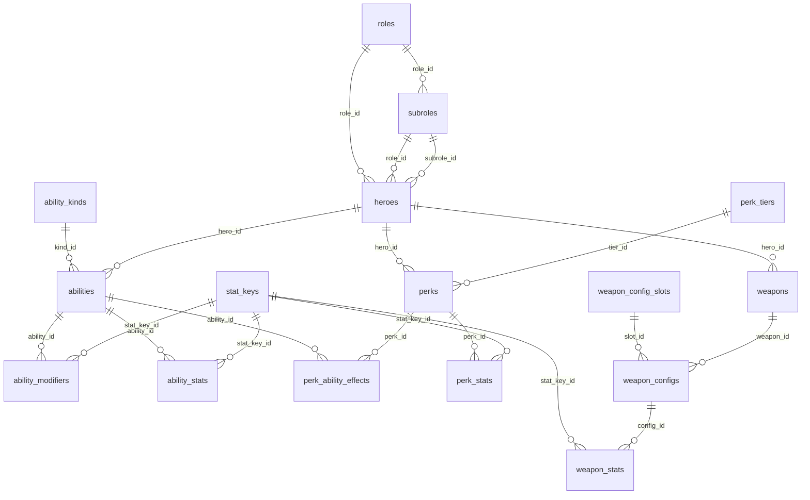
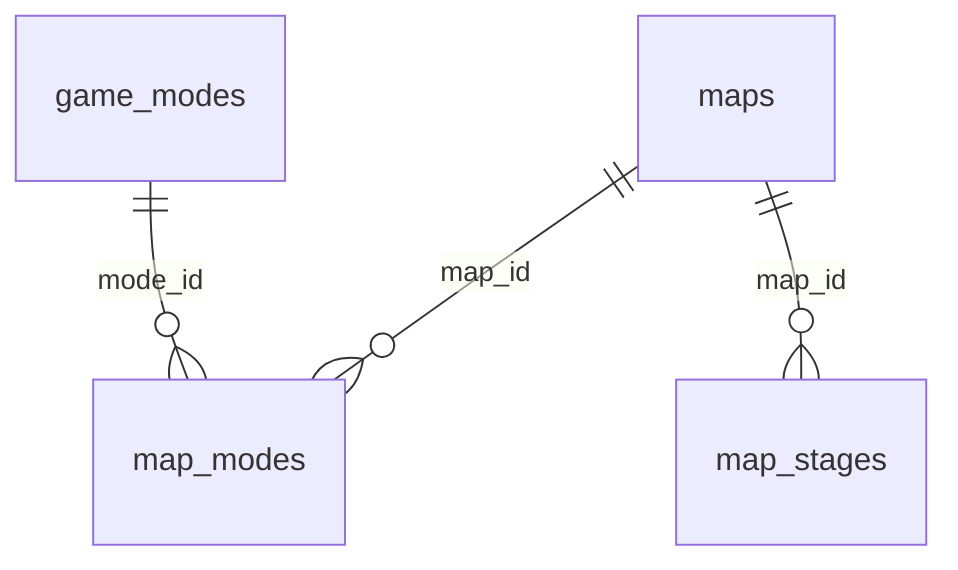
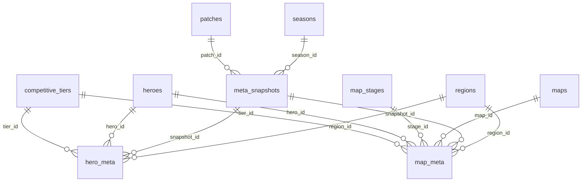
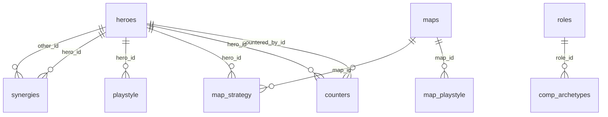
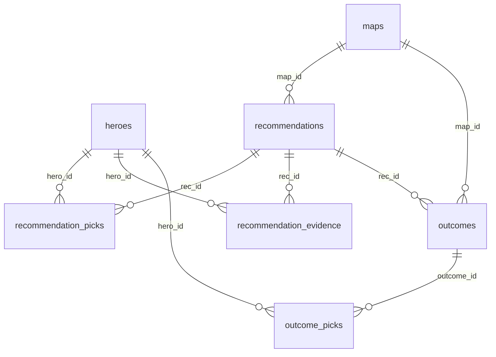

# Entity relationship diagram

Five domains. Three are the authoritative data the sources are pulled
for - which hero (HEROES), on which map (MAPS), performing how well
(META) - and become the FACTS of a board. The other two are the strategy
side: what was authored (PLAYBOOK) and what the inference layer decided
and what came of it (INFERENCE). The composition is the argmax of the
strategies over the facts.

```
FACTS      = HEROES ∪ MAPS ∪ META
STRATEGIES = HEURISTICS ∪ PLAYBOOK ∪ HISTORY
COMP       = ARGMAX[ STRATEGIES( FACTS ) ]
```

Every table also carries `source_id` → `sources` and a `cao` timestamp.
Those edges are left off - they would connect `sources` to all 42 tables
and obscure everything else.

## HEROES



## MAPS



## META



## PLAYBOOK



## INFERENCE



## The whole database

```mermaid
erDiagram
    abilities ||--o{ ability_modifiers : "ability_id"
    abilities ||--o{ ability_stats : "ability_id"
    abilities ||--o{ perk_ability_effects : "ability_id"
    ability_kinds ||--o{ abilities : "kind_id"
    competitive_tiers ||--o{ hero_meta : "tier_id"
    competitive_tiers ||--o{ map_meta : "tier_id"
    game_modes ||--o{ map_modes : "mode_id"
    heroes ||--o{ abilities : "hero_id"
    heroes ||--o{ counters : "countered_by_id"
    heroes ||--o{ counters : "hero_id"
    heroes ||--o{ hero_meta : "hero_id"
    heroes ||--o{ map_meta : "hero_id"
    heroes ||--o{ map_strategy : "hero_id"
    heroes ||--o{ outcome_picks : "hero_id"
    heroes ||--o{ perks : "hero_id"
    heroes ||--o{ playstyle : "hero_id"
    heroes ||--o{ recommendation_evidence : "hero_id"
    heroes ||--o{ recommendation_picks : "hero_id"
    heroes ||--o{ synergies : "hero_id"
    heroes ||--o{ synergies : "other_id"
    heroes ||--o{ weapons : "hero_id"
    map_stages ||--o{ map_meta : "stage_id"
    maps ||--o{ map_meta : "map_id"
    maps ||--o{ map_modes : "map_id"
    maps ||--o{ map_playstyle : "map_id"
    maps ||--o{ map_stages : "map_id"
    maps ||--o{ map_strategy : "map_id"
    maps ||--o{ outcomes : "map_id"
    maps ||--o{ recommendations : "map_id"
    meta_snapshots ||--o{ hero_meta : "snapshot_id"
    meta_snapshots ||--o{ map_meta : "snapshot_id"
    outcomes ||--o{ outcome_picks : "outcome_id"
    patches ||--o{ meta_snapshots : "patch_id"
    perk_tiers ||--o{ perks : "tier_id"
    perks ||--o{ perk_ability_effects : "perk_id"
    perks ||--o{ perk_stats : "perk_id"
    recommendations ||--o{ outcomes : "rec_id"
    recommendations ||--o{ recommendation_evidence : "rec_id"
    recommendations ||--o{ recommendation_picks : "rec_id"
    regions ||--o{ hero_meta : "region_id"
    regions ||--o{ map_meta : "region_id"
    roles ||--o{ comp_archetypes : "role_id"
    roles ||--o{ heroes : "role_id"
    roles ||--o{ subroles : "role_id"
    seasons ||--o{ meta_snapshots : "season_id"
    stat_keys ||--o{ ability_modifiers : "stat_key_id"
    stat_keys ||--o{ ability_stats : "stat_key_id"
    stat_keys ||--o{ perk_stats : "stat_key_id"
    stat_keys ||--o{ weapon_stats : "stat_key_id"
    subroles ||--o{ heroes : "role_id"
    subroles ||--o{ heroes : "subrole_id"
    weapon_config_slots ||--o{ weapon_configs : "slot_id"
    weapon_configs ||--o{ weapon_stats : "config_id"
    weapons ||--o{ weapon_configs : "weapon_id"
```


