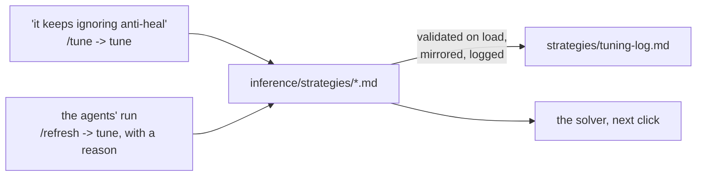

# The INFERENCE LAYER - `inference/`

Facts in, the optimal composition out. The layer owns the right-hand
side of the equation in [architecture.md](architecture.md):

```
STRATEGIES = CONSTRAINTS ∪ HEURISTICS ∪ ASSUMPTIONS   the playbook: markdown files in strategies/
COMP       = ARGMAX[ STRATEGIES( FACTS ) ]  the solver searches; the agent argues
```

Two things infer:

- **The solver**: deterministic arithmetic. It reads the strategy files'
  frontmatter, scores every candidate six with the facts layer's metrics,
  and returns the best. No model, no API, no randomness beyond a seeded
  reference sample. It cannot read prose.
- **The agent**: a Claude Code session on the `/comp` skill. It reads the
  same facts and the prose of the same strategies and reconciles them
  where arithmetic cannot. It runs when you ask it to, never on its own,
  on your subscription.

## How a strategy file works

Drop a markdown file into `strategies/` and it is live: the solver reads
the directory on every call, the board's playbook panel shows it, the
`strategies` tool and the `strategy://` resources serve it, and
`load_authored` mirrors it into the `strategies` table so the database
knows the catalog's shape. The frontmatter is the whole contract:

```markdown
---
name: Answer every revealed enemy
kind: heuristic                 # constraint | heuristic | assumption
category: matchup
direction: maximize             # heuristics: maximize | minimize
metric: team.coverage_share     # a key from the metrics registry
weight: 3
when: enemy.size >= 1           # optional guard, either kind
---
# Answer every revealed enemy
The share of revealed enemies at least one of our picks answers...
```

| kind | form | frontmatter | what the solver does |
| --- | --- | --- | --- |
| heuristic | | `metric`, `direction`, `weight` | normalises the metric to [0, 1] against a seeded sample of legal sixes for the board (flipped for minimize) and adds `weight x norm`; guarded on the six's own state (`team.*`, or a `matchup.*` key blue decides) it is a need and adds `weight x (norm - 1)` - met it costs nothing, unmet its weight - and the needs on one guard are scaled to cost `NEED_BUDGET` (2) together at most; bounds come from the reference sixes the guard holds on, and with no spread there a reward reads 0.5 and a need costs nothing |
| constraint | limit | `require: <expr>`, optionally `soft: true` + `penalty: <number>` | discards a candidate that fails (a soft one subtracts the penalty) |
| constraint | scored | `bonus: <expr>` and/or `penalty: <expr>`, optionally `when` | adds `weight x (bonus - penalty)` while `when` holds |
| assumption | | nothing - prose by definition | nothing: what the solver takes as given and the agent holds a comp to; shown on the board and read by the session |
| constraint or heuristic | draft | name, kind and prose only | nothing yet: shown and served, ignored by the solver, until `/strategy` infers the rest or turns it into an assumption |

A strategy's prose is three sentences at most (`add_strategy` refuses
more): the claim, why and when, what is measured.

**The solver never infers a formula or a weight from prose; a model does**
- the `/strategy` skill on command, or the engine on its own through
`derive.py`. The skill takes three things - a name, a kind, and up to
three sentences of what the strategy means - reads the vocabulary
(`metrics`) and the catalog for the house style, decides the frontmatter
(a heuristic's metric, direction and weight; a constraint's `require`, or
its `when`, `bonus`, `penalty` and `params`; or `kind: assumption` when
nothing is measurable), and stores the file through `add_strategy`, which
validates it against the catalog before it exists, mirrors it into the
`strategies` table, and logs it with a reason that quotes the prose. A
file you drop in yourself with only a name, a kind and prose loads as a
*draft*: the board and the `strategies` tool show it, `infer` results list
it as not yet scored, and `/strategy` completes it through
`infer_strategy`.

**The engine derives drafts on its own, on the subscription.** `derive.py`
asks Claude Code in print mode (`claude -p`, from a neutral directory, no
project settings, no tools) for one JSON answer - the same inference the
skill does, headless - and stores it through the same validated path,
sending the catalog's objection back once if the first answer is refused.
It runs wherever the claude CLI is signed in, which is the host:
`load_authored` derives pending drafts before it mirrors, `orchestrator.py
up` and `status` derive them and re-mirror the stack's database, and the
`derive_strategies` tool does it on demand. Inside the containers the CLI
is absent, so drafts stay pending until the host runs. No API key
anywhere. Sign the CLI in once with `claude login`; until then the engine
says so and leaves the draft as it was.

Expressions are a whitelist, compiled once and validated against the
metrics registry when the catalog loads: the `team`, `enemy`, `matchup`,
`map`, `world` and `params` sections, arithmetic, comparisons, `and`,
`or`, `not`, `x if c else y`, and `min`, `max`, `abs`, `round`, `len`,
`int`, `float`, `bool`. A key that is not in the registry, or a
`params.NAME` not declared under `params:`, is refused at load, so a typo
never scores silently. `params:` (an indented block of NAME: number) are
the dials an expression reads as `params.NAME`.

The catalog - every file, and the full vocabulary a strategy may
reference - is generated into the end of this document.

## How the weights move



Weights do not learn on their own: no match signal is recorded, and the
backlog holds what learning would take. The board's sliders (under each
heuristic in the playbook tab) override a weight for one board at a time -
`weight=<id>:<0..10>` on `/board`, `weights` on the `board` tool - and
the file is untouched until the slider's *store*, which is a `tune` call;
every result names the weights it was scored under. One path changes a
file, logged in `strategies/tuning-log.md` with a reason and who asked:
**`tune`**, one validated frontmatter edit - `weight` (0..10),
`direction`, `soft`, `when`, `require`, `bonus`, `penalty`, `metric`, or a
`params.NAME` dial. The edited file is loaded through the catalog before
it is written, so an invalid change never lands. The `/tune` skill is the
conversational front: "it keeps ignoring anti-heal" becomes a `tune` call
and a re-run of the board to show the effect.

## Layout

```
inference/
  __init__.py      the package's map
  README.md        a citation for every strategy: the community threads a rule
                   was drawn from, or the user's word for an assumption
  strategies/      the playbook: one markdown file per constraint, heuristic
                   or assumption, and tuning-log.md
  catalog.py       reads, validates and mirrors the strategy files
  expr.py          the expression language the frontmatter uses
  solver.py        enumerate, prune, normalise, score, refine
  engine.py        infer(), evaluate(), board(): the solver plus citations
  reach.py         a board on which a hero is the optimal pick
  tune.py          one validated, logged edit to a strategy file; add and complete
  derive.py        the engine asking the model for a draft's frontmatter
  serve.py         the HTTP service the compose stack's ui container calls
```

| file | purpose |
| --- | --- |
| `catalog.py` | Parses each file's frontmatter (a flat dialect plus one `params:` block), builds a `Strategy` with `kind`, `form`, compiled expressions and validation against the metrics registry, orders the catalog (constraints - limits, then scored - heuristics, assumptions), mirrors it into the `strategies` table, and writes the catalog at the end of this document. |
| `expr.py` | A safe subset of Python expressions: the AST is checked once, compiled, and evaluated over a scope whose missing keys read as zero, so a metric that does not apply to a board never crashes a score. |
| `solver.py` | For a board: every role shape the hard limits allow around the locked picks; per-role pools of released heroes (an announced hero waits for its release) ranked by standing (a hero's mean score across the reference sixes it is in, plus 0.5 per locked partner), the prior breaking ties and ranking alone when nothing has scored; every candidate prepared (namespace, limit check, raw metric values), scored with the frozen bounds and slimmed to its score and tie-break, so a search of thousands holds only verdicts; local search from the best six sixes and the best of every shape, swapping any open slot for any same-role released hero on the roster; the winners hydrated again with their breakdown. The bounds come from a seeded reference sample of legal sixes for that map, side, enemy and bans, so `infer`, `evaluate` and the current comp share one scale and a score means the same thing across calls. |
| `engine.py` | `infer` (the optimal six around the locked picks), `evaluate` (a full six ranked against the field), `current` (the picks as they stand, partial or full), and `board`: at any stage of a draft, blue's optimal as the counter to red's selection, red's optimal as their counter to blue's, both current comps scored on those scales, blue's picks against red's best counter, blue's locked picks with the empty slots filled, red's likely starting comp, the fight odds, the game plan in prose, and the shapes the playbook's limits allow. Its four searches - blue's optimal, red's counter, the fill, the countered case - are each split across a pool of spawned workers in four rounds: the reference sample, the sample again for each hero's standing (its mean score across the reference sixes it is in, which ranks each role's pool of six), the enumeration, then the ranking and the local search from the best six sixes and the best of every shape. Only verdicts cross (hero ids, score, tie-break) and slices partition their round, so the answer does not depend on the split. The pool is `max(6, min(cores, 12))` workers; `COUNTER_MATRIX_WORKERS` overrides; `COUNTER_MATRIX_PARALLEL=0`, a single core or a caller-supplied catalog keeps it in one process; a dead worker means that board runs sequentially and the pool is rebuilt. Each result carries the picks with reasons and `[F#]` citations into the board's FactSet, the score breakdown per strategy, alternatives, and the assumptions as "ground rules to reconcile against". |
| `reach.py` | Every hero is the right pick somewhere: for a hero, a board that suits it (its maps, a red it answers, a side, the match's bans spent on the rivals holding its seat) on which it is in the optimal six, or the closest it came. The `reach` tool runs it; `tests/fixtures/reach.json` records a board per released hero and the suite checks none is lost. A hero no board seats is one the facts or the strategies cannot see. |
| `tune.py` | `tune(id, field, value, reason)`: one frontmatter edit; `add(id, name, kind, prose, fields, reason)`: a new file from what the user gave and what `/strategy` inferred; `complete(id, fields, reason)`: a draft's frontmatter in one step. Each is validated by loading the catalog with the new text, then written, re-mirrored and logged. |
| `derive.py` | `derive()`: for every draft, the prompt (the three inputs, the vocabulary, one finished file of each form for style), `claude -p` on the subscription, the JSON answer through `tune.complete`, one retry carrying the catalog's objection; at most ten drafts a run. `available()` says whether the CLI is here. |
| `serve.py` | `/board`, `/infer`, `/evaluate`, `/strategies`, `/health` - the same functions, over HTTP, for a board that runs in another container. |

## The skills

`/strategy`, `/comp`, `/tune` and `/up` are this layer's; [skills.md](skills.md)
documents them and [mcp.md](mcp.md) the tools they run on (`infer`,
`evaluate`, `board`, `facts`, `strategies`, `metrics`, `add_strategy`,
`infer_strategy`, `derive_strategies`, `tune`, `tuning_log`), which is what
makes a session and the board see the same numbers.

## The catalog

<!-- generated:catalog -->
244 files in `inference/strategies/`: 45 constraints (1 limits, 44 scored), 194 heuristics and 5 assumptions. Regenerated by `python -m db.mcp call db_docs`.

#### Constraints

##### The queue allows two tanks (`queue-allows-two-tanks`, shape, limit)

`require team.tanks <= 2` (hard)

Open Queue caps a team at two tanks, so a six never fields a third. Read from the picks' roles: at most two tanks.

##### Bring a one-shot (`bring-a-one-shot`, damage, scored)

weight 1; bonus `min(team.one_shots, 1) * 0.5`

A comp carries one pick whose single hit kills a 250-pool target. Widowmaker, Hanzo and Zenyatta get value that steady damage never does, since steady damage is healed while the burst is not. The first pick whose biggest ranged hit kills a 250-pool hero is rewarded 0.5, and further ones add nothing.

##### Press a thin heal line (`press-thin-heal-lines`, damage, scored)

weight 1; when `enemy.hps_floor <= params.THIN_HEAL and enemy.supports >= 2`; bonus `max(0, min((team.dps_floor - params.PRESS_FLOOR) / 100, 2)) * 0.5`
params: PRESS_FLOOR=500, THIN_HEAL=100

Two light healers such as Lúcio and Mercy or Brigitte and Zenyatta cannot keep a team standing under sustained fire, and the community calls that pairing the worst backline to play into high damage. Against such a red our floor damage is the number that converts, because nothing they have heals it back. Rewarded half a unit per 100 of our summed per-second damage past 500, one unit at most, while red has 2 or more supports and their summed sustained healing is at or under 100 per second.

##### Barriers block the burst (`barriers-block-burst`, durability, scored)

weight 1; when `enemy.one_shots >= 1`; bonus `min(team.barrier_count, 2) * 0.5`

A barrier is the one kind of sustain that stops a hit before it lands, so against hits too big to heal a comp wants something to hide behind. Reinhardt's and Sigma's barriers eat the headshot that no heal would have beaten. Read only while red fields a ranged hit that kills a 250-pool hero, and rewarded per barrier pick, two at most.

##### Counter-pick on this map only (`answers-that-fit-map`, map, scored)

weight 1; when `map.known == 1 and enemy.size >= 1 and team.map_offmap == 0`; bonus `matchup.coverage_share * params.FIT_ANSWERS`
params: FIT_ANSWERS=0.5

An answer that runs under its own baseline on this map is a swap into a throw pick, so coverage is worth more once no pick of the six is off-map. The community's example is the tank who swaps to Zarya on Numbani, a map they call bad for her, because red has the D.Va she is said to counter. Coverage share earns up to 0.5 points on a known map once red reveals a pick and no pick of the six runs 2.5 points or more under its own baseline there.

##### Control points have edges (`control-points-have-edges`, map, scored)

weight 1; when `map.mode == 'Control'`; bonus `min(max(team.cc_count - params.BOOP_FLOOR, 0), params.BOOP_CAP) * 0.5`
params: BOOP_CAP=3, BOOP_FLOOR=2

Control stages are built around drops, the well on Ilios, the sanctum pit on Nepal, the edges of Lijiang Tower, and a knockback or a pull turns a full-health enemy into a kill. Roadhog hooking into the well and Lúcio booping on Lighthouse are the community's Control examples, and Orisa is named as good on maps with environmental hazards. Each pick with crowd control beyond the second earns half a point on a Control map, up to 3 picks.

##### Dive maps need peel (`dive-maps-need-peel`, map, scored)

weight 0.5; when `map.style_top == 'dive'`; bonus `max(min(team.cc_count + team.invuln - params.PEEL_FLOOR, params.PEEL_CAP), 0) * 0.5`
params: PEEL_CAP=3, PEEL_FLOOR=3

On a map whose geometry lets the enemy land on the backline from above, the supports need a tool that makes the landing a mistake. The same six needs barely any peel on Circuit Royal and more than can be provided on Ilios: distance substitutes for peel on a poke map and nothing does on a dive map. Crowd-control picks and invulnerability picks are counted separately, so a pick with both counts twice; each count beyond three earns 0.25 where the map rewards dive, 0.75 at most.

##### A hard choke needs a barrier (`hard-choke-needs-barrier`, map, scored)

weight 1; when `map.style_top == 'brawl'`; bonus `min(team.barrier_hp / params.CHOKE_BARRIER, 1) * params.PER_BARRIER`
params: CHOKE_BARRIER=1000, PER_BARRIER=0.75

A hard choke is crossed behind a barrier or not at all, and a map whose fights are chokes is a map where one barrier is worth a pick. The community's list of the places a shield is needed is a list of hard chokes, King's Row first point, Eichenwalde third, Havana first and third, and the maps left off it have long sightlines instead. Barrier health earns up to 0.75 points where the map rewards brawl, in full at 1000, and more adds nothing.

##### High ground looks over a barrier (`high-ground-over-barrier`, map, scored)

weight 1; when `map.style_top == 'dive'`; penalty `min(team.barrier_hp / params.BARRIER_HP, params.BARRIER_CAP) * 0.5`
params: BARRIER_CAP=2, BARRIER_HP=1000

A barrier faces one way and the enemy on the high ground above it shoots past it, so on a map built around high ground a barrier tank is a slow pick paying for a tool that does not work. Reinhardt is named as ineffective on Numbani's first two points for the high ground around them. Each 1000 of barrier health costs half a point where the map rewards dive, up to 2000.

##### Lean the way the map leans (`lean-with-the-map`, map, scored)

weight 1; when `map.known >= 1 and map.style_top != '' and team.style_lean != '' and team.style_lean != map.style_top and team.style_fit <= 0.5`; penalty `params.MISMATCH_PENALTY`
params: MISMATCH_PENALTY=1

A comp committed to a style the map does not reward pays for it every fight. Damage supports and snipers thrive where poke dominates and peel is cheap, and die where a brawl map lets red walk onto them. The penalty of 1 point lands when the picks' majority style differs from the map's rewarded style and no more than half the picks carry the map's style.

##### Map lift beats the ladder rate (`map-lift-beats-ladder`, map, scored)

weight 1; when `map.known == 1 and team.map_win_mean > team.win_mean`; bonus `min((team.map_win_mean - team.win_mean) / params.LIFT_STEP, 2) * 0.5`
params: LIFT_STEP=2

A hero winning more on this map than on the ladder has something in the kit that this ground rewards. The community's map-synergy measure is the map win rate minus the patch baseline: a nerfed hero at 43 percent overall who still pulls 49 percent on Dorado has structural synergy with Dorado. It earns half a point per 2 points of mean lift of the six's map win rate over its ladder win rate, up to 4 points of lift.

##### Popular here and losing here (`popular-here-losing-here`, map, scored)

weight 1; when `map.known == 1 and team.map_win_mean < params.TRAP_WIN`; penalty `min(max(team.map_pick_mass - params.MASS_FLOOR, 0) / params.MASS_SPAN, 1) * 0.5`
params: MASS_FLOOR=40, MASS_SPAN=40, TRAP_WIN=48

A six of heroes the map's lobby picks heavily but loses with is a six of trap picks. The map's pick rate is the crowd's belief about the map and its win rate is the result, and where the two disagree the result is the one to trust. It charges up to half a point as the six's summed pick rate on the map runs from 40 to 80, while the mean win rate on the map is under 48.

##### Popular here and winning here (`popular-here-winning-here`, map, scored)

weight 1; when `map.known == 1 and team.map_win_mean >= params.GOOD_WIN`; bonus `min(max(team.map_pick_mass - params.MASS_FLOOR, 0) / params.MASS_SPAN, 1) * 0.5`
params: GOOD_WIN=50, MASS_FLOOR=40, MASS_SPAN=40

A six the map's lobby both picks heavily and wins with is a six the map has already tested. Zenyatta is picked 16.4 percent on King's Row against 11 to 12 on the Flashpoint maps, and the pick rate is the sample behind the win. It earns up to half a point as the six's summed map pick rate runs from 40 to 80, while the mean win rate on the map is at or over 50.

##### Stages ask for both reaches (`stages-want-both-reaches`, map, scored)

weight 1; when `map.stages >= 3`; bonus `(0.25 if team.range_max >= params.LONG_GUN else 0) + min(team.melee, 1) * 0.5`
params: LONG_GUN=50

A Control or Flashpoint map is 3 or 5 different stages with one six for all of them, and the stages disagree about range. Nepal's Sanctum needs a ranged tank to pressure snipers across long sightlines while its Shrine is melee-range combat on small stairs. It earns a quarter point for a longest range at or over the dial, 50 m by default, and half a point for a melee pick, on maps with 3 or more stages.

##### Symmetrical modes race to the centre (`symmetrical-race-centre`, map, scored)

weight 1; when `map.known == 1 and map.sided == 0`; bonus `min(team.mobility_count, params.MOBILE_CAP) * 0.25`
params: MOBILE_CAP=5

On Control, Push and Flashpoint both teams leave spawn at once and the first to the strong positions in the neutral centre holds them. Mobile heroes are called vital in symmetrical modes, Flashpoint is said to punish low mobility outright, and a Push flanker gets back to the team because of mobility. Each pick with a movement or evasive ability earns a quarter point on a symmetrical map, up to 5 picks.

##### Two off-map picks, wrong comp (`two-off-map-picks`, map, scored)

weight 1; when `map.known == 1 and team.map_offmap >= params.OFFMAP`; penalty `1`
params: OFFMAP=2

One pick running under its own baseline on a map is a matchup, two is a comp built for a different map. A kit's affinity for a map's geometry survives patches, so a second pick running 2.5 points or more under its baseline here means the comp is fighting the ground as well as the enemy. It charges a flat point while two or more picks run under their own baseline on this map.

##### Brawl beats dive (`brawl-beats-dive`, matchup, scored)

weight 1; when `team.style_lean == 'brawl' and matchup.style_lean_red == 'dive'`; bonus `params.EDGE`
params: EDGE=1

A brawl lean against a dive lean is the favourable side of the triangle. The dive trades durability for mobility and has seconds before its cooldowns end, and a ball that stays together with crowd control and sustain gives the dive nothing to land on. The bonus lands while brawl is our majority style and dive is red's.

##### Crowd control halts close fighters (`cc-halts-close-fighters`, matchup, scored)

weight 0.5; when `enemy.size >= 1 and matchup.style_lean_red == 'brawl'`; bonus `max(0, team.cc_count - params.CC_BASE) * 0.5`
params: CC_BASE=3

A brawl red has to walk into ours to do anything, and every stun, hinder, whip and hook on the six is one more way to stop the walk. Reinhardt, Mauga, Junker Queen and Roadhog are all listed as countered by crowd control and anti-heal rather than by damage, because the tool lands the moment they commit. Read while a majority of red's picks are brawl heroes, and rewarded 0.25 per pick with crowd control beyond three, 0.75 at most.

##### Contest a dive red (`contest-a-dive-red`, matchup, scored)

weight 1; when `matchup.style_lean_red == 'dive'`; penalty `max(0, enemy.size - team.coverage) * params.PER_HEAD`
params: PER_HEAD=0.4

Against a red whose majority plays dive, every red pick our six cannot answer is a diver who runs the lobby. The call against a full dive is to contest their tank at the least, and a good Doomfist or Wrecking Ball is either countered or left to run over the whole lobby. 0.4 of a point is taken for every revealed red pick that no pick of ours answers, while a majority of red's picks are dive heroes.

##### Saves blunt a full dive (`dive-into-saves`, matchup, scored)

weight 1; when `team.style_lean == 'dive' and enemy.invuln >= params.SAVES`; penalty `min(enemy.invuln, 4) * 0.5`
params: SAVES=2

A dive six that commits into a backline holding invulnerabilities burns its cooldowns and dies in the open. Each invulnerability on red is one full dive that lands on nothing, so the more of them red fields the more a dive lean costs. The penalty lands while dive is the majority style and 2 or more red picks hold an invulnerability, half a point per pick up to 4.

##### Dive the pocket (`dive-the-pocket`, matchup, scored)

weight 1; when `enemy.dmg_amp >= 2`; bonus `min(team.mobility_count, params.MOBILE_CAP) * 0.5`
params: MOBILE_CAP=5

A red team built around two amplifiers, a Mercy beam and a Nano say, is answered by reaching the amplifier rather than out-shooting the target. Nano is played around by diving the Ana, and the flex player losing to a pocketed hitscan is told the fix is a tank that walks up, both of which take movement tools. Read while 2 or more red picks amplify damage, and rewarded per pick of ours with a movement or evasive ability, five at most.

##### Outmanoeuvre a static red (`outmanoeuvre-a-static-red`, matchup, scored)

weight 1; when `enemy.size >= 3 and enemy.mobility_count <= 3`; bonus `min(team.mobility_count, params.MOBILE_CAP) * 0.5`
params: MOBILE_CAP=5

A red team with few movement tools cannot follow a pick that goes in and out, so mobility on our side is worth more against a bunker than against a dive. The bunker thread's answer to Bastion and Torbjörn is that their comp is immobile and has problems with anything that can leave. Read while at least 3 red picks are revealed and 3 or fewer carry a movement tool, and rewarded per pick of ours with one, five at most.

##### Poke beats brawl (`poke-beats-brawl`, matchup, scored)

weight 1; when `team.style_lean == 'poke' and matchup.style_lean_red == 'brawl'`; bonus `params.EDGE`
params: EDGE=0.5

A poke lean against a brawl lean is the favourable side of the triangle. The brawl has to cross open ground to reach anyone and lacks the range to make the crossing cheap. The bonus lands while poke is our majority style and brawl is red's.

##### Two counters playable, three not (`two-counters-playable`, matchup, scored)

weight 0.5; when `enemy.size >= 1`; penalty `max(0, team.exposure_edges - team.exposed_count - params.FREE) * 0.375`
params: FREE=1

A pick plays into one or two counters, and every counter past the second on the same pick makes it unplayable. Players say they play well into about two counters but beyond that there is only so much yin to go around, that supposed counters do not work unless they are chained, and that heroes go from amazing to feed when their opponents play two or more counters. Counters past the first on each pick are summed over the six, one of them is free (a dial), and each other costs 0.375 of a point times the rule's weight (0.5): a pick into three counters pays once, and so do two picks into two each.

##### Every unanswered enemy costs (`unanswered-enemy-costs`, matchup, scored)

weight 0.8; when `enemy.size >= 1`; penalty `max(0, enemy.size - team.coverage) * 0.5`

The one agreed reason to swap is an enemy on a hero that needs a counter when the team holds none, an aerial Pharah into Reaper and Symmetra being the stock example. Each revealed enemy that no pick of ours answers is one such gap. Every revealed enemy outside every pick's counter list costs half a point times the rule's weight (0.8, so 0.4).

##### A ban breaks a built comp (`ban-breaks-built-comp`, meta, scored)

weight 1; when `map.bans == 0 and team.max_ban_rate >= params.MAGNET and team.synergy_edges >= 1`; penalty `min(team.synergy_edges, params.EDGE_CAP) * 0.25`
params: EDGE_CAP=2, MAGNET=30

A comp that leans on its partners loses more than one pick when its keystone is banned, because every authored pair that ran through that hero goes with it. Rein comps and Sigma-Mizuki comps rely on specific heroes, so the more pairs a six has documented, the more one ban takes down. While the highest ban rate on the six reaches the dial, 30 percent by default, a quarter point per synergy pair among the picks is charged, up to two pairs, read before the match's bans are made.

##### Below fifty is losing ground (`below-fifty-is-losing`, meta, scored)

weight 1; when `team.win_mean < params.EVEN`; penalty `min(params.EVEN - team.win_mean, 4) * 0.5`
params: EVEN=49.5

A six whose mean win rate sits under fifty is losing on the ladder before the board is read. Every properly ranked player sits at an even record, so a rate below the line says the kit drags its players under, and a six of them compounds it. Each point the six's mean all-ranks win rate falls short of the dial, 49.5 by default, the ladder's pick-weighted mean, costs half a point, capped at four points short.

##### A coin-flip lineup is no plan (`coin-flip-lineup`, meta, scored)

weight 1; when `map.bans == 0 and team.availability < params.COINFLIP`; penalty `1.0`
params: COINFLIP=0.5

A six that reaches the match intact less than half the time is a plan for some other lobby. Two ban magnets on one six multiply their odds against each other, so even moderate ban rates stack into a lineup that usually loses a piece at the ban screen. It charges a flat point while the chance every pick survives the ban screen is under the dial, one half by default, read before the match's bans are made.

##### Popular winners are the meta (`popular-winners-are-meta`, meta, scored)

weight 1; when `team.win_mean >= params.EVEN`; bonus `min(team.pick_mass / params.MASS_UNIT, 2) * 0.5`
params: EVEN=50.5, MASS_UNIT=50

The meta is what wins and gets picked at once. A winning rate on a deep sample is the ladder's verdict and a winning rate on a shallow one is a rumour, so pick rate is worth counting only once the six is on the winning side of even. While the six's mean win rate is at or above the dial, 50.5 by default, half a point per fifty points of summed pick rate is added, capped at one point.

##### Half a comp each way fails (`commit-to-one-style`, shape, scored)

weight 1; when `team.size >= 4 and team.style_lean == ''`; penalty `params.HYBRID_PENALTY`
params: HYBRID_PENALTY=1.5

A six with no majority playstyle fights as two half-teams. A brawl tank in front of a poke backline cannot peel what is dove and cannot swing on what is far away, so nobody's kit is used at its range. 1.5 points are charged once four or more picks are locked and no style is carried by a strict majority of them.

##### Four damage is a quick-play comp (`four-damage-quick-play`, shape, scored)

weight 1; when `team.damage >= 4`; penalty `2`

Four damage picks leave a six with no second tank or no second support, and usually both. The game is unplayable outside very specific comps at four damage, because two roles are each asked to do a job built for two people, and the fourth damage pick adds pressure the comp cannot survive long enough to use. It charges two flat points once four or more damage picks are on the six.

##### Four supports is unproven ground (`four-supports-unproven`, shape, scored)

weight 1; when `team.supports >= 4`; penalty `(team.supports - 3) * params.PER_SUPPORT`
params: PER_SUPPORT=0.8

Two tanks with three supports is a strong six; a fourth support is unproven and a fifth leaves one pick to make the space and take the fights. Comps of four or five healers appear in the community only as anecdotes that got shut down once the enemy adjusted, so the playbook charges for them rather than forbidding them. Each support past three costs 0.8 points.

##### A solo tank cannot dive (`solo-tank-cannot-dive`, shape, scored)

weight 1; when `team.tanks <= 1 and team.style_lean == 'dive' and team.size >= 4`; penalty `1`

The dive tank leaves the front to jump the backline, and with no second tank the front is empty the moment they go. It charges a flat point once four or more picks are locked with a dive majority and at most one tank.

##### Solo tank plus solo heal throws (`solo-tank-solo-heal`, shape, scored)

weight 1; when `team.tanks <= 1 and team.supports <= 1 and team.size >= 4`; penalty `2`

The lone tank cannot hold the front without an off-tank to cover the angle, and the lone healer cannot keep that tank and the backline alive at once. Each is the enemy's first target. It charges two flat points once four or more picks are locked with at most one tank and at most one support.

##### A third heavy healer overheals (`third-healer-overheals`, shape, scored)

weight 1; when `team.supports >= 3 and team.hps_ratio >= params.OVERHEAL`; penalty `0.75`
params: OVERHEAL=1.6

A third support who is also a heavy healer stacks sustain past what any front line can spend. Two heavy healers already clear the roster's two-support bench, so a third turns the slot a damage pick would have used into healing that tops off targets nobody was pressuring. It charges three quarters of a point while three or more supports are on the six and the support line's sustained healing reaches the dial, 1.6 times the two-support bench by default.

##### Three supports need both tanks (`three-supports-both-tanks`, shape, scored)

weight 1; when `team.supports >= 3 and team.tanks < 2`; penalty `1.5`

The comps that ran three supports ran three tanks in front of them, because extra sustain is worth nothing without a front that can spend it. With tanks capped at two, a third support without the second tank is a backline with nothing to sustain. It charges a flat point and a half while three or more supports sit behind fewer than two tanks.

##### Two barriers at most (`two-barriers-at-most`, shape, scored)

weight 1; penalty `max(0, team.barrier_count - 2) * 0.5`

A third barrier on the six is mitigation that nobody shoots through, and the community remembers double shield and does not want it back. In 6v6 the extra tank slot adds more damage than mitigation most of the time. Every barrier pick past the second costs half a point, with no guard.

##### Field two damage picks (`two-damage-minimum`, shape, scored)

weight 1; when `team.size >= 4`; penalty `max(0, params.MIN_DAMAGE - team.damage) * 1.2`
params: MIN_DAMAGE=2

A six needs at least two damage picks, because damage heroes make the pressure that lets a tank take space and that stops red from pushing. Supports can deal damage but cannot focus it or sustain it through their cooldown gaps the way a damage kit does. The penalty grows by 1.2 per damage pick short of two, once four or more picks are locked.

##### Two supports hold a six (`two-supports-hold`, shape, scored)

weight 1; when `team.size >= 4`; bonus `min(team.supports, 2) * params.PER_SUPPORT`
params: PER_SUPPORT=1

A six wants two supports, because one healer cannot keep a front line and a backline alive at once and has no partner to cover the moment they are forced out. Two supports split the front and the flank the way two tanks split the front and the angle. One point per support up to two is added once four or more picks are locked.

##### Two tanks hold the front (`two-tanks-up-front`, shape, scored)

weight 1; when `team.size >= 4`; bonus `min(team.tanks, 2) * params.PER_TANK`; penalty `('TANKLESS' in team.shape_flags) * params.PER_TANK`
params: PER_TANK=1

In 6v6 two tanks hold the front and the off angle at once: one takes the space and the other forces the flank away from the backline. A comp with no tank has nobody to walk behind, and one tank alone has to choose between the front and the angle every fight. Scored as one per tank up to two, and one more against a tankless six, once four or more picks are locked.

##### Three supports cannot break a hold (`three-supports-cannot-attack`, side, scored)

weight 1; when `map.side == 'attack' and team.supports >= 3`; penalty `params.THIRD_SUPPORT`
params: THIRD_SUPPORT=0.5

A third support keeps the six alive at the choke and no closer to the point, because a hold is broken by damage. The community calls two tanks and four supports fine on defence and trash at attacking, and says a choke is impossible to break without the damage roster. It charges half a point, 0.5 by default, on the attacking side while the six carries 3 or more supports.

##### Every six wants one cleanse (`one-cleanse-every-six`, sustain, scored)

weight 1; when `team.team_cleanse < 1`; penalty `0.5`

A cleanse fits any composition because what it undoes, anti-heal, sleep, hack and burn, is somewhere on every red team's kit list. Kiriko is played in every kind of comp with every kind of tank for that reason. It charges half a point while no pick on the six has a cleanse that lands on a teammate: Protection Suzu, Life Grip, Transcendence or Projected Barrier.

##### Two light healers lose fights (`two-light-healers-lose`, sustain, scored)

weight 1; when `team.supports >= 2`; penalty `max(0, params.HEAL_MARGIN - team.hps_ratio) * 3`
params: HEAL_MARGIN=0.7

Two supports who both heal lightly cannot hold anyone alive under fire. Lúcio, Brigitte, Mizuki and Zenyatta bring utility and a trickle, so one of the two has to be a heavy healer. The support line's summed sustained healing is read against the roster's two-support bench, and every tenth it falls short of 0.7 of that bench is charged 0.3.

##### Synergy that also answers (`synergy-that-answers`, synergy, scored)

weight 1; when `enemy.size >= 3 and matchup.coverage_share >= 0.66`; bonus `min(team.synergy_edges, params.PAIR_CAP) * 0.25`
params: PAIR_CAP=4

A documented pair earns its place when the six around it also answers red. A tournament's Sigma comp existed to shut down one tank's dive comps and fell off hard once red stopped fielding that tank. Each authored pair earns a quarter point, up to four pairs, while at least two thirds of three or more revealed red picks are answered.

##### A thin map sample is noise (`thin-map-sample-noise`, uncertainty, scored)

weight 1; when `map.known == 1 and team.map_pick_mass < params.THIN_MAP_MASS`; penalty `0.5`
params: THIN_MAP_MASS=40

A map win rate built on a few games is noise, and a six of rarely-picked heroes on this map is a six whose map figures cannot be trusted. Pick rate is the sample behind the win rate. It charges half a point while the six's summed pick rate on the map is under the dial, 40 by default.

#### Heuristics

##### Amplify the damage (`amplify-the-damage`, damage)

`maximize team.dmg_amp` - picks that amplify someone's damage. weight 0.75

A pick that multiplies a teammate's damage adds a kill threat without adding a gun. Mercy's beam, Zenyatta's discord and Ana's nano turn a target that was surviving into one that is not. Picks that amplify someone's damage are counted.

##### Area damage punishes grouping (`area-damage-punishes-grouping`, damage)

`maximize team.aoe_damage` - kit pieces that damage an area. weight 0.5; when `matchup.style_lean_red == 'brawl'`

Damage that hits an area is worth more than its number against a team that stands together. A brawl line holds by grouping, and splash from Junkrat and Ashe's dynamite punishes it while single-target damage picks one target and gets healed. Kit pieces that damage an area are counted across the six, read while red's majority style is brawl.

##### Big hits beat armor (`big-hits-beat-armor`, damage)

`maximize team.burst_max` - the biggest single hit on the team, a headshot where one counts. weight 0.5; when `enemy.armor_total >= 400`

Against an armored red, one big hit keeps its value where a stream of small ones loses half. Armor removes a flat 7 from each instance of damage up to half of it, so a Hanzo arrow or a Roadhog hook combo lands almost whole on Orisa or D.Va while Reaper's pellets and Mauga's minigun rounds are cut in two. The biggest single damage figure on the six is measured, read while red fields 400 or more summed armor.

##### Brawl maps stack win conditions (`brawl-maps-stack-ults`, damage)

`maximize team.dmg_ults` - ultimates that carry a damage figure. weight 0.5; when `map.style_top == 'brawl'`

A brawl map decides its fights in the commit, and the six that carries more fight-winning ultimates into the commit wins more of them. Poke is played on the maps where it can win before the neutral ends and so needs to stack fewer teamfight win conditions, and brawl maps ask the opposite. Ultimates carrying a damage figure are counted, read where the map rewards brawl.

##### Brawl splashes the scrum (`brawl-splashes-the-scrum`, damage)

`maximize team.aoe_damage` - kit pieces that damage an area. weight 0.25, a need; when `team.style_lean == 'brawl'`

A brawl six fights where both teams stand within arm's reach, and area damage hits everything in that press without aiming at any of it. Junkrat and Venture (4 pieces each) and Wuyang (3) carry the most area damage among brawl picks; Reinhardt carries 1. Measured as kit pieces that damage an area, read only while brawl is the majority style.

##### Brawl swings at melee (`brawl-swings-melee`, damage)

`maximize team.melee` - picks with a melee weapon. weight 0.5, a need; when `team.style_lean == 'brawl'`

A brawl six earns its damage and its ultimate charge at arm's length, and a melee weapon is the one that cannot miss there. Reinhardt's hammer and Brigitte's flail do their full damage at exactly the range the brawl closes to. Measured as picks with a melee weapon, read only while brawl is the majority style.

##### Bunkers fall to ultimates (`bunkers-fall-to-ultimates`, damage)

`maximize team.ult_damage_total` - summed max damage across the team's damage ultimates. weight 0.25; when `enemy.barrier_count >= 2`

A red with two barriers is beaten by the ultimates that go around or through them, not by shooting the barriers. Dragonstrike and Death Blossom pass through or around a barrier; the summed figure also counts Deadeye and Self-Destruct, which a barrier blocks. Measured as the summed maximum damage across our damage ultimates, read while 2 or more red picks carry a barrier.

##### Burst over their big save (`burst-over-big-save`, damage)

`maximize matchup.burst_vs_heal` - blue's biggest hit minus red's biggest single save. weight 0.25; when `enemy.heal_peak_max >= 100`

When red carries a single heal of 100 or more, the damage that kills is the hit that lands before it. Healing a critical target from under 20 percent back over 65 percent undoes any 120-damage rocket, and nobody heals a Widowmaker headshot. Measured as our biggest single hit minus red's biggest single heal, read while red's biggest single heal is 100 or more.

##### Burst the enemy who fights alone (`burst-the-isolated-enemy`, damage)

`maximize team.burst_max` - the biggest single hit on the team, a headshot where one counts. weight 0.25; when `enemy.isolated_count >= 2`

A red pick with no documented partner is the one nobody on their side is built to save, and a big single hit removes it before help arrives. Compositions split the opponent and focus down the isolated target, which is how a red whose damage heroes do not synergise with one another or with their tank is beaten. Measured as the biggest single damage figure on our six, while red fields two or more picks with no authored partner.

##### Chew a fat red faster (`chew-fat-red-faster`, damage)

`minimize matchup.chew_time_ours` - seconds of blue's floor damage to chew red's pool (999 if unknown). weight 0.5; when `enemy.pool_total >= 2000`

When red fields a fat six, the comp that chews through that pool fastest ends its fights before red's ultimates come up. Bastion holds 115 damage per second and Reaper 153, so against 2,000 or more summed hit points steady damage turns a tank line into kills. Measured as the seconds of our floor damage needed to chew red's pool, lower being better, read while red's summed pool is 2,000 or more.

##### Damage seals the kills (`damage-seals-kills`, damage)

`maximize team.dps_floor` - summed published per-second damage figures (a floor: misses and healing ignored). weight 1

A comp needs enough sustained damage to finish what it starts; healing alone holds space but never takes it. A line that pours out healing and little damage bursts nobody down and the enemy walks forward through it, so every damage pick and at least one support has to add pressure. The sum of each pick's held-weapon damage per second, reloads in, is measured, a floor that ignores misses and healing.

##### Damage ultimates punish squishies (`damage-ults-punish-squishies`, damage)

`maximize team.dmg_ults` - ultimates that carry a damage figure. weight 0.25; when `enemy.squish_count >= 4 and enemy.pool_total <= 1800`

When red seats four or more picks at 250 pool or under and 1,800 total pool or less, every damage ultimate on our side ends a fight outright. One good ultimate wins a fight off a single kill, and a full Earthshatter or Blizzard on a squishy backline is a wipe. Ultimates carrying a damage figure are counted, read while red fields four or more squishies on 1,800 pool or less.

##### Dive bursts its target (`dive-bursts-the-target`, damage)

`maximize team.burst_max` - the biggest single hit on the team, a headshot where one counts. weight 0.25, a need; when `team.style_lean == 'dive'`

A dive six kills inside the window its cooldowns buy, so it needs one hit big enough to finish what it lands on. Divers arrive on a target from several angles at once and leave when the movement tools are spent, and a target that survives the collapse walks away healed while the divers sit without cooldowns. Measured as the biggest single damage figure on the team, read only while dive is the majority style.

##### Barriers are a DPS check (`dps-check-on-barriers`, damage)

`maximize team.dps_floor` - summed published per-second damage figures (a floor: misses and healing ignored). weight 0.25; when `matchup.barrier_need >= 1200`

When red fields 1,200 or more barrier HP, every point of per-second damage on the six goes into the shield. A Cassidy shooting through 2,000 HP alone because his Genji and Widowmaker do no shield damage is the check failed. Summed held-weapon damage per second is measured, read while red's barrier HP is 1,200 or more.

##### Grind the brawl down (`grind-down-the-brawl`, damage)

`maximize team.dps_floor` - summed published per-second damage figures (a floor: misses and healing ignored). weight 0.5; when `matchup.style_lean_red == 'brawl'`

A brawl six is the most durable shape in the game, and durable things fall to sustained damage rather than to a single hit. Heroes that pour damage per second into the ball chew through the armor and the healing a brawl walks in behind. Measured as summed held-weapon damage per second, read only while red's majority playstyle is brawl.

##### Hitscan into brawl (`hitscan-into-brawl`, damage)

`maximize team.hitscan` - picks with a hitscan weapon or ability. weight 0.75; when `matchup.style_lean_red == 'brawl'`

Against a brawl the hitscan heroes are the answer, because they land the chip damage at the range a brawl cannot answer from. Brawlers walk forward through it, while dive picks would have to land inside the ball where the brawl is strongest. Measured as picks with a hitscan weapon or ability, read only while red's majority playstyle is brawl.

##### One anti-heal every fight (`one-anti-every-fight`, damage)

`maximize team.antiheal` - picks with anti-heal. weight 0.75

Anti-heal is the only cooldown that turns a target's healing off rather than racing it. A Masters retrospective rates a single landed anti above a Mercy damage boost even from an Ana missing her shots, and the support guide calls it the one support win condition that is not an ultimate. Measured as the count of picks with anti-heal, with no guard.

##### One long gun (`one-long-gun`, damage)

`maximize team.range_max` - the longest range on the team. weight 0.25

A comp carries one pick whose reach opens every sightline the map offers. A long-range threat forces cover from anyone crossing it, and a kit without falloff pokes enemies and barriers from a distance to soften them before the fight. The longest published range on the six is measured.

##### Out-ult their ultimates (`out-ult-their-ults`, damage)

`maximize team.ult_damage_total` - summed max damage across the team's damage ultimates. weight 0.25; when `matchup.ult_threat >= 2000`

When red carries 2,000 or more of summed ultimate damage, the fight goes to whoever spends the bigger ultimate first. Teams that farm ultimates win by pressing Q for full team wipes, and a comp without damage ultimates is left on picks and neutral fights while red's ultimates roll in. Summed maximum damage across our damage ultimates is measured, read while red's summed damage-ultimate ceiling is 2,000 or more.

##### Outdamage a heavy heal line (`outdamage-heavy-heal-line`, damage)

`maximize matchup.dps_diff` - blue damage floor minus red. weight 0.25; when `enemy.hps_floor >= 235`

When red's supports heal at a heavy per-second rate, only a damage floor that clears theirs by a margin turns their healing into wasted resource. Two damage picks outdamage any amount of healing plus mitigation when they hit, and no support outheals a Bastion alone. Measured as our summed per-second damage minus red's, read while red's summed sustained healing is 235 per second or more.

##### Poke amplifies its damage (`poke-boosts-its-damage`, damage)

`maximize team.dmg_amp` - picks that amplify someone's damage. weight 0.25, a need; when `team.style_lean == 'poke'`

A poke six spends the neutral shooting, so every point of damage amplification shows up on every shot of the chip war. Mercy's boost is the enabler of the slow ranged comp, and the poke six is where it is safe to hold. Measured as picks that amplify someone's damage, read only while poke is the majority style.

##### Poke shoots hitscan (`poke-shoots-hitscan`, damage)

`maximize team.hitscan` - picks with a hitscan weapon or ability. weight 0.75, a need; when `team.style_lean == 'poke'`

A poke six chips from range, and at range only a hitscan weapon lands reliably. Projectiles are dodged across a long sightline while Ashe and Soldier: 76 connect on the first frame; 13 of the 28 poke heroes are hitscan. Measured as picks with a hitscan weapon or ability, read only while poke is the majority style.

##### Poke wants a one-shot (`poke-wants-one-shot`, damage)

`maximize team.burst_ranged` - the biggest single hit from a pick that is not melee-only. weight 0.5, a need; when `team.style_lean == 'poke'`

A poke six wins the neutral before the fight closes, and the pick that deletes a target across the sightline is what makes the approach cost. Widowmaker's headshot and Hanzo's arrow do that; chip damage that heals back does not. Measured as the biggest single hit from a pick that is not melee-only, a headshot where one counts, read only while poke is the majority style.

##### Projectiles land on big bodies (`projectiles-hit-big-bodies`, damage)

`maximize team.projectile` - picks whose weapons are projectile. weight 1; when `enemy.size >= 4 and enemy.squish_count <= 3`

A projectile that is hard to land on a 225-pool target is almost guaranteed on a Bastion, a Torbjörn or a tank. The bunker thread names Freja, Sojourn, Echo, Hanzo and Pharah as the picks that do considerable damage there. Measured as the count of picks whose weapons are projectile, read while at least 4 red picks are revealed and 3 or fewer sit at 250 pool or under.

##### Splash answers a tight core (`splash-answers-tight-core`, damage)

`maximize team.aoe_count` - kit pieces tagged area of effect or shockwave. weight 0.5; when `enemy.core_size >= 4`

A red whose picks chain into one synergy core of four or more moves as one group, and area damage hits the whole group at once. GOATS was said to have lost its counter when Pharah and Junkrat lost the splash that could damage several targets at once. Measured as the count of kit pieces on our six tagged area of effect, while red's largest connected synergy group is four or more.

##### Splash over the barriers (`splash-over-barriers`, damage)

`maximize team.aoe_count` - kit pieces tagged area of effect or shockwave. weight 0.25; when `enemy.barrier_count >= 2`

Two barriers on red block what is shot at them and nothing that is lobbed over them, so area damage that arcs is the damage that still reaches the backline. Junkrat tops the count at 5 with Pharah, Venture and Sigma at 4; an Ana is told to splash her grenade above the enemy shields and an Echo to shoot over barriers from height. Measured as kit pieces tagged area of effect across the six, read while red fields 2 or more barrier picks.

##### Sustained pressure baits the saves (`sustained-pressure-baits-saves`, damage)

`minimize matchup.chew_time_ours` - seconds of blue's floor damage to chew red's pool (999 if unknown). weight 0.25; when `enemy.invuln >= 2`

A red with two or more picks that carry an escape or immortality tool, Suzu, Fade, Wraith Form or Cryo-Freeze, cannot be killed in one engage, so the fight goes to whoever spends the saves faster than they come back. That takes a damage floor high enough to force a save every time a pick peeks. Measured as the seconds our floor damage needs to chew red's pool, kept low while 2 or more red picks carry an invulnerability.

##### Ultimates beat heavy healing (`ultimates-beat-heavy-healing`, damage)

`maximize team.ult_damage_total` - summed max damage across the team's damage ultimates. weight 0.25; when `enemy.hps_floor >= 190`

A red whose summed sustained healing per second reaches 190 heals back everything short of a kill in one swing, so its fights are decided by damage ultimates rather than by trading. The community says too much healing makes most damage get outhealed and that against such sustain only burst and ultimates disincentivise the heal line. Measured as the summed maximum damage of our damage ultimates, read while red's summed sustained healing is 190 per second or more.

##### Damage ultimates win fights (`ultimates-win-fights`, damage)

`maximize team.ult_damage_total` - summed max damage across the team's damage ultimates. weight 1

Damage ultimates are the go-buttons that end a fight outright. A team without them wins neutral on picks alone, while a Self-Destruct, a Dragonblade or a Deadeye decides the fight the moment it lands. The summed maximum damage across the six's damage ultimates is measured.

##### Ultimates clear a fat red (`ults-clear-fat-red`, damage)

`maximize team.ult_damage_total` - summed max damage across the team's damage ultimates. weight 0.25; when `enemy.pool_total >= 2050`

Against a red that fields 2,050 or more summed hit points, steady fire does not break the line and the fight waits for ultimates. A bunker of Orisa, Bastion and Torbjörn is broken by waiting for ults to come in. Summed maximum damage across the six's damage ultimates is measured, read while red's summed pool is 2,050 or more.

##### Armor eats hitscan spam (`armor-eats-hitscan-spam`, durability)

`maximize team.armor_total` - summed armor, a form's by its uptime. weight 0.75; when `enemy.hitscan >= 3`

Hitscan guns deal their damage as many small instances, and armor takes 7 off every one of them up to half, so a Soldier: 76, Tracer or Bastion line loses a large share of its output into an armored comp. Three or more hitscan picks on red is the case where armor is worth the most. Measured as our summed armor, read while 3 or more red picks have a hitscan weapon.

##### Armor is extra health (`armor-is-extra-health`, durability)

`maximize team.armor_total` - summed armor, a form's by its uptime. weight 0.5

Armor points are worth more than the health they replace, because every hit into them is reduced before it lands. 100 armor equals about 162 health against ordinary fire, and Brigitte's team-wide armor is why GOATS walked through snipers. Summed armor across the six is measured.

##### Armor shrugs off spam (`armor-shrugs-off-spam`, durability)

`maximize team.armor_share` - armor / pool. weight 0.25

Armor cuts every small hit that lands on it, so the share of a comp's pool that is armor decides how well it walks through rapid fire and spam. A Brigitte-packed or Reinhardt-fronted line shrugs off Tracer, Reaper and turret fire that plain health does not, which is why banning the armor makes damage picks worth fielding again. Armor as a share of the team's total pool is measured.

##### A barrier blocks the big hit (`barrier-blocks-big-hits`, durability)

`maximize team.barrier_count` - picks with a barrier. weight 0.25; when `enemy.one_shots >= 1 and enemy.burst_ranged >= 300`

When red carries a ranged hit of 300 or more, a Widowmaker headshot, no heal arrives in time and the only answer is something that takes the hit instead of a player. Measured as our picks with a barrier, read while red fields a one-shot pick and its biggest single hit from a pick that is not melee-only is 300 or more.

##### A barrier eats projectile spam (`barriers-eat-projectile-spam`, durability)

`maximize team.barrier_count` - picks with a barrier. weight 0.5; when `enemy.projectile >= 5`

Rockets, grenades and arrows are the damage a barrier is best at, because they arrive slowly enough to be blocked and splash on the barrier instead of the backline. Tanks are told to eat the spam against a Pharah or a Junkrat. Measured as the count of picks with a barrier, read while 5 or more red picks carry projectile weapons.

##### Boosted guns two-tap squishies (`boosted-guns-two-tap`, durability)

`minimize team.squish_count` - picks at or under 250 pool. weight 0.5; when `enemy.dmg_amp >= 2`

Two damage amplifiers on red, a Mercy beam, a Discord, a Nano Boost or Baptiste's window, cut the hits needed to kill any pick at 250 or under, and nothing heals a headshot. Against that line the comp wants as few picks at 250 or under as the shape allows. Measured as our picks at or under 250 pool, kept low while 2 or more red picks amplify damage.

##### Bigger ball wins the brawl (`brawl-mirror-pool`, durability)

`maximize matchup.pool_diff` - blue effective HP minus red. weight 0.5, a need; when `team.style_lean == 'brawl' and matchup.style_lean_red == 'brawl'`

When both teams brawl the two balls collide and the one with more health to spend outlasts the other. A tank with enough armor to take the face to face fight but not enough to win it loses the mirror to the one that has more. Measured as our effective health minus red's, read only while both majority playstyles are brawl.

##### Brawl walks in together (`brawl-walks-in-together`, durability)

`maximize team.pool_min` - the weakest pick's pool - focus fire finds the minimum. weight 0.5, a need; when `team.style_lean == 'brawl'`

A brawl six walks into the fight as one, and its weakest pick walks in too. A support or damage pick that cannot take damage in its face is the first body on the floor of every brawl, and a comp built around one is not a brawl comp. Measured as the weakest pick's effective health, read only while brawl is the majority style.

##### Brawl wears armor (`brawl-wears-armor`, durability)

`maximize team.armor_total` - summed armor, a form's by its uptime. weight 0.25, a need; when `team.style_lean == 'brawl'`

A brawl six walks into the enemy's fire and stays there, so it wants the health that fire chews slowest. Armor cuts every small hit at the close range brawl chooses, which is why the tanks that win a face to face fight carry it. Measured as summed armor across the team, read only while brawl is the majority style.

##### An escape beats the one-shot (`escape-beats-one-shot`, durability)

`maximize team.invuln` - picks with an invulnerability or a death-prevention. weight 1; when `enemy.burst_max >= 250`

Against a red team whose biggest hit deletes a squishy outright, the picks that live are the ones with a way out: Recall, Wraith Form, Fade, Translocator or a Suzu on the target. The most-upvoted positioning thread credits games to whether a team brought a disengage, and a hit no heal can answer is when one is needed. Measured as the count of picks with an invulnerability, read while red's biggest single hit is 250 or more.

##### Field more hit points (`field-more-hit-points`, durability)

`maximize team.pool_total` - team effective HP: sum of health + shield + armor, plus a form's armor by its uptime. weight 0.5

More hit points on the six is more damage absorbed before the first death, and the first death decides most fights. Tank-heavy lines win because they stand in the open and survive the poke that sends a 250-pool pick back to spawn, so a low-pool comp has to trade perfectly to match them. Health, shield and armor summed across the six is measured.

##### Heavy fire finds the weakest (`heavy-fire-finds-weakest`, durability)

`maximize team.pool_min` - the weakest pick's pool - focus fire finds the minimum. weight 1; when `enemy.dps_floor >= 635`

Against a red whose damage floor is 635 or more per second, the six is only as durable as its smallest pool, because focus fire lands there first. A pick that walks out of cover is focused from 100 to 0 in two seconds, and a 200 HP hero missing 20 to 60 HP is liable to be deleted for doing its job. The weakest pick's pool is measured, read while red's per-second damage floor is 635 or more.

##### A held point needs its tank (`held-point-needs-tank`, durability)

`maximize team.pool_total` - team effective HP: sum of health + shield + armor, plus a form's armor by its uptime. weight 0.25; when `map.stages >= 3`

On Control and Flashpoint the team holds a point for as long as it can, and losing the tank first on a held point is called a huge disadvantage. Health, shield and armor summed across the six is measured, read on maps with 3 or more stages.

##### Leave nothing diveable (`leave-nothing-diveable`, durability)

`minimize team.squish_count` - picks at or under 250 pool. weight 1; when `matchup.style_lean_red == 'dive'`

A pick at 250 health or under is diveable, and every one on the six is a target red's divers can collapse on inside one set of cooldowns. Measured as picks at or under 250 pool, read only while red's majority playstyle is dive.

##### Outlast a heavy floor (`outlast-heavy-floor`, durability)

`maximize matchup.chew_time_theirs` - seconds of red's floor damage to chew blue's pool. weight 0.5; when `enemy.dps_floor >= 635`

Against a red whose published damage floor is 635 or more per second, the comp that takes longest to chew is the one still on the objective when their ammunition and cooldowns run out. A tank line that shrugs off a Roadhog, a Reaper and a D.Va needs seconds of life rather than one, and a support line will never outheal that output. Measured as the seconds red's floor damage needs to chew our pool, read while red's per-second damage floor is 635 or more.

##### Overhealth answers one-shots (`overhealth-answers-one-shots`, durability)

`maximize team.overhealth_total` - summed peak overhealth a kit can grant. weight 0.5; when `enemy.one_shots >= 1`

When red carries a ranged hit of 250 or more, the picks that survive it are the ones a kit has padded above their base pool. A Widowmaker headshot deletes a 250-pool hero from full, while a Lucio Sound Barrier, a Wuyang Tidal Blast or a Junker Queen shout puts that hero over the line, which is why the community's cure for one-shots is armor or overhealth rather than more healing. Summed peak overhealth the six can grant is measured, read while red fields a one-shot pick.

##### Shield points regrow (`shield-points-regrow`, durability)

`maximize team.shield_total` - summed recharging shields. weight 0.75

A pick whose pool is partly shields gets value beyond its number, because that portion comes back without a healer. Zarya and Sigma outsize their HP pool because waiting out a bubble regenerates half a lifebar, and shield regeneration stacks with the health passive at 30 per second from 3 seconds out of fire. Summed recharging shields across the six are measured.

##### Shields recharge themselves (`shields-recharge-themselves`, durability)

`maximize team.shield_share` - shields / pool. weight 0.5

Shield hit points refill on their own, so the share of a comp's pool that is shield is sustain the heal line never has to pay for. Shields start regenerating 3 seconds after the last hit at 30 per second and stack with the passive regeneration, so Zenyatta, Symmetra, Juno and Domina come back to full behind a corner. Recharging shields as a share of the team's total pool is measured.

##### Snipers want a barrier (`snipers-want-a-barrier`, durability)

`maximize team.barrier_count` - picks with a barrier. weight 0.25; when `enemy.one_shots >= 1`

When red carries a ranged one-shot, every open crossing is a headshot, and the community's stock answer to a Widowmaker is to walk behind a barrier rather than to out-aim her. A barrier pick turns the sightline into a barrier-versus-rifle duel and lets the squishies cross. Measured as our picks with a barrier, read while red fields a pick whose ranged hit kills a 250-pool hero.

##### A solo tank needs armor (`solo-tank-needs-armor`, durability)

`maximize team.armor_total` - summed armor, a form's by its uptime. weight 0.75, a need; when `team.tanks <= 1`

When one tank holds the front alone, the comp needs the armor to stand under focus. Orisa held a solo-tank front through triple damage because she could not be focused down, and armor is the pool type that shrugs off the spam a lone front line eats. The summed armor across the six is read, only while the six carries at most one tank.

##### Brawl maps reward durability (`brawl-maps-reward-durability`, map)

`maximize team.pool_total` - team effective HP: sum of health + shield + armor, plus a form's armor by its uptime. weight 0.5; when `map.style_top == 'brawl'`

In corridors and chokes the fight is decided by who lasts longer in each other's face. A brawl map gives no room to disengage, so the comp with more health, armor and shield to spend up close wins the scrum. Summed effective hit points across the six is the measure, read on maps whose rewarded style is brawl.

##### Bring the map's specialists (`bring-map-specialists`, map)

`maximize team.map_specialists` - picks running 2.5+ points over their own baseline here. weight 0.5; when `map.known == 1`

A hero who runs well above their own average on this map is a specialist worth building around. Some kits fit one map far better than their own average shows, a Widowmaker on Circuit Royal, a Lúcio on Ilios, and the map rates catch the gap. Picks running 2.5 points or more over their own baseline win rate on the selected map are counted.

##### Choke maps reward melee (`choke-maps-reward-melee`, map)

`maximize team.melee` - picks with a melee weapon. weight 0.75; when `map.style_top == 'brawl'`

A brawl map has short sightlines and tight chokes, and the fight happens in someone's face, where a melee weapon does its full damage and a long gun does not. Reinhardt is the community's brawl tank because he swings his hammer at close quarters, and the counterpick lists file King's Row among his best maps. Picks with a melee weapon are counted, read where the map rewards brawl.

##### Chokes reward crowd control (`chokes-reward-crowd-control`, map)

`maximize team.cc_count` - picks with crowd control (stun, sleep, immobilize, hinder, knockback). weight 1; when `map.style_top == 'brawl'`

Where a map funnels both teams into a choke, crowd control decides who gets through it. A stun, a wall or a knockback at a doorway takes a pick out of the fight at the one moment the whole team is committed, and enclosed space leaves nowhere to dodge it. Picks with a crowd-control tool are counted, read on maps whose rewarded style is brawl.

##### Control rewards area effects (`control-area-healing`, map)

`maximize team.aoe_count` - kit pieces tagged area of effect or shockwave. weight 0.25; when `map.mode == 'Control'`

Control fights happen on one point with the whole six stacked on it, so healing and damage that touch an area touch everyone. Lúcio's aura and Junkrat's splash both reach the whole point, and a Lúcio and Brigitte pairing was called too strong on king of the hill. Kit pieces tagged area of effect are counted, read on Control maps.

##### The counterpick lists know their maps (`counterpick-knows-its-maps`, map)

`maximize team.map_strategy_hits` - picks counterpick lists among their best maps here. weight 0.25; when `map.known == 1`

A pick the counterpick lists file under their best maps here belongs in the comp more than one they do not. The lists are crowd-sourced opinion on where each hero excels, and they agree with the rates often enough to break a tie. Picks whose best-maps list names the selected map are counted, a light weight for a judged source.

##### Escort lanes reward the longest gun (`escort-longest-gun`, map)

`maximize team.range_max` - the longest range on the team. weight 0.25; when `map.mode == 'Escort'`

Escort maps run the payload down long lanes, and the pick with the longest reach on the six owns the lane before the fight closes. Every payload route opens onto a long sightline somewhere along the path, which is why the community names Escort as the mode that favours poke and Ashe as a Junkertown pick. The longest published range on the team is the measure, read on Escort maps.

##### Pick into what the map rewards (`fit-the-map-style`, map)

`maximize team.style_fit` - share of picks tagged with the map's rewarded style (0 without a map). weight 2.5; when `map.known == 1`

A six built of the playstyle a map rewards wins the fights that map sets up. The authored map notes tag each map with the style its geometry favours, brawl in corridors and chokes, poke across long sightlines, dive where high ground stacks, and a hero carries the style tags its kit earns. The share of the six tagged with the map's rewarded style is the measure, and it reads as 0 without a map.

##### High ground strands melee (`high-ground-strands-melee`, map)

`minimize team.melee` - picks with a melee weapon. weight 0.25; when `map.style_top == 'dive'`

On a map built around high ground a melee pick has no way to touch an enemy standing above and no quick way up. Reinhardt is named as the tank who suffers most where high ground matters, with nothing to throw at it but a Fire Strike, and brawl's movement tools are said to have no vertical component at all. Picks with a melee weapon are counted, minimised where the map rewards dive.

##### Leave off-map picks at home (`leave-off-map-picks`, map)

`minimize team.map_offmap` - picks running 2.5+ points under their own baseline here. weight 0.25; when `map.known == 1`

A hero running well below its own average here is a liability the rest of the comp carries, and the map rates show the cost before the fight does. Picks running 2.5 points or more under their own baseline win rate on the selected map are counted, and fewer is better.

##### Match red on the map (`red-plays-the-map`, map)

`maximize team.style_fit` - share of picks tagged with the map's rewarded style (0 without a map). weight 0.75; when `enemy.style_fit >= 0.8`

When red has committed to the style the map rewards, every off-style pick of ours meets the map's fight on red's terms. A brawl tank walking out of spawn into full poke on a poke map swaps after the first death or never plays. Measured as the share of our picks tagged with the map's rewarded style, read only while at least four in five of red's picks carry that tag.

##### Short reach fails on poke maps (`short-reach-fails-poke`, map)

`maximize team.range_min` - the shortest longest-range. weight 0.75; when `map.style_top == 'poke'`

On a poke map the pick with the shortest reach is the one who spends the fight unable to shoot back. Beams and shotguns that own a corridor are helpless across a canyon, so a comp is judged there by its shortest longest-range. The smallest of the picks' longest published ranges is the measure, read on maps whose rewarded style is poke.

##### Sightlines want hitscan (`sightlines-want-hitscan`, map)

`maximize team.hitscan` - picks with a hitscan weapon or ability. weight 0.75; when `map.style_top == 'poke'`

Long sightlines belong to hitscan weapons, which land at any distance the map offers while projectiles arc and slow. On a poke map the fight opens at the range where a Soldier: 76, Ashe or Widowmaker is already hitting and a projectile kit is not. Picks with a hitscan weapon or ability are counted, read on maps whose rewarded style is poke.

##### Symmetrical modes leave deployables behind (`symmetrical-leave-deployables`, map)

`minimize team.deployables` - picks with deployables. weight 0.75; when `map.known == 1 and map.sided == 0`

On Control, Push and Flashpoint the fight moves, from the neutral centre to the next point or down the robot's lane, and a deployable set for one position is left behind by the next. Picks with a kit piece tagged deployable are counted, the held barriers of Reinhardt, Brigitte and D.Mon among them, minimised on symmetrical maps.

##### Vertical maps reward fliers (`vertical-maps-reward-fliers`, map)

`maximize team.flyers` - picks that fly or hover. weight 0.25; when `map.style_top == 'dive'`

A map with high ground everywhere rewards the picks that travel between its levels without a staircase. Echo is named as the fill pick for maps with verticality, and the maps with the most high ground are called best for heroes that move easily between low and high ground. Picks that fly or hover are counted, read where the map rewards dive.

##### Win on this ground (`win-on-this-ground`, map)

`maximize team.map_win_mean` - mean win rate on the map (the all-ranks mean without a map). weight 0.25; when `map.known == 1`

A comp that wins on this map is measured by what its picks have already won here. Per-map win rates are the closest measured thing to a hero's fit for the ground, and they catch what the geometry notes miss, a long walk back, a well, a bridge. The mean of the six's win rates on the selected map is the measure, read only while a map is set.

##### Amplify damage into thin healing (`amplify-thin-heals`, matchup)

`maximize team.dmg_amp` - picks that amplify someone's damage. weight 0.5; when `enemy.size >= 5 and enemy.supports >= 1 and enemy.hps_ratio < 0.8`

When red's supports heal below the roster's bench, their tanks are outdamaged before they are outhealed. Zenyatta's discord on a tank the enemy cannot heal back ends the tank duel early. Measured as the count of picks that amplify someone's damage, read while red shows 5 or more picks, at least 1 support, and its supports' sustained healing is under 0.8 of the roster's two-support bench.

##### Answer more than they answer (`answer-more-than-exposed`, matchup)

`maximize matchup.net_edges` - blue answer edges minus blue exposure edges. weight 0.75

A comp comes out ahead when its counter edges onto red outnumber red's edges onto it. Each edge is a duel one side opens with a kit advantage, so three edges out against two in is still a winning ledger. Measured as blue's answer edges minus blue's exposure edges from the counters table, 0 until red reveals a pick.

##### Invulnerability answers their ultimates (`answer-their-ults`, matchup)

`maximize matchup.ult_answers` - blue invulnerabilities plus cleanses. weight 0.5; when `matchup.ult_threat >= 1500`

A comp facing heavy damage ultimates survives them with invulnerabilities and cleanses, not with health. A double bomb kills nobody inside a transcendence or under a suzu, and the answer fires once and covers the team. Measured as our invulnerabilities plus cleanses, read while red's summed damage-ultimate ceiling is 1,500 or more.

##### Anti-heal a heavy heal line (`antiheal-heavy-heal-line`, matchup)

`maximize team.antiheal` - picks with anti-heal. weight 0.5; when `enemy.hps_ratio >= 1.25`

Against a support line that heals well above the roster's bench, a landed anti-heal is an instant fight win: 4 seconds without healing turns a pocketed tank into a kill. Moira, Mauga and a double pocket are all played around Ana's grenade, and no damage pick replaces it. Measured as the count of picks with a negative healing modifier, read while red's supports' sustained healing is at least 1.25 times the roster's two-support bench.

##### Anti-heal turns off self-sustain (`antiheal-stops-self-sustain`, matchup)

`maximize team.antiheal` - picks with anti-heal. weight 0.25; when `enemy.lifelines >= 4`

When four or more red picks carry healing, the supports included, Mauga's overdrive, Roadhog's breather and Reaper's leech sit on top of the support line, and anti-heal switches all of it off at once. Ana's grenade on a breathing Roadhog or an overdriving Mauga is the standing example. Measured as our picks with anti-heal, read while 4 or more red picks carry any healing.

##### Answers that survive the ban (`ban-proof-answers`, matchup)

`maximize team.banproof_coverage` - coverage recomputed without the highest-ban answerer. weight 0.25; when `map.bans == 0`

An answer that hangs on one high-ban hero is removed before the match starts: the only counter to a bunker is Sombra and Sombra is permabanned, and a good Mauga bans Ana. Measured as the red picks still answered when our highest-ban-rate answerer is removed from the count, 0 with none revealed, read before the match's bans are made.

##### A barrier blunts their hitscan (`barrier-blunts-hitscan`, matchup)

`maximize team.barrier_hp` - summed barrier health the team fields. weight 0.5; when `enemy.hitscan >= 3`

Hitscan damage has no travel time to dodge, so the soft counter to it is a barrier in the line of fire: a shield tank turns a Widowmaker duel into a shoot-the-barrier duel and gives the squishies safe cover to cross a sightline. Barrier health is how long that cover lasts against sustained hitscan fire. Measured as the summed barrier health the team fields, read while 3 or more red picks have a hitscan weapon.

##### A barrier eats the big ultimate (`barrier-eats-ults`, matchup)

`maximize team.barrier_hp` - summed barrier health the team fields. weight 0.25; when `matchup.ult_threat >= 1500`

Earthshatter, Self-Destruct and a Deadeye all stop at a barrier, and the first counter to a Reinhardt ultimate is a Reinhardt barrier of one's own. Barrier health is what lets that block survive the hit instead of breaking under it. Measured as the summed barrier health the team fields, read while red's summed damage-ultimate ceiling is 1,500 or more.

##### Beams through a dive tank line (`beams-into-dive-line`, matchup)

`maximize team.beam` - picks with a damaging beam. weight 0.75; when `matchup.style_lean_red == 'dive'`

A dive tank line lives on Defense Matrix and the bubble, and a beam is the damage those do not stop. Zarya and beam weapons in general are named as the counter to D.Va, going through the matrix is called the beam's strength, and Hazard's leap is beamed down the same way. Measured as the count of picks with a beam, read while red's majority playstyle is dive.

##### Brawl locks down flankers (`brawl-locks-flankers`, matchup)

`maximize team.cc_count` - picks with crowd control (stun, sleep, immobilize, hinder, knockback). weight 0.75, a need; when `team.style_lean == 'brawl'`

A brawl six wins by denying a diver's mobility once it lands, so it needs the stuns, sleeps and knockbacks that pin a flanker inside the ball. Without them the brawl walks forward while Tracer and Genji take the backline apart behind it. Measured as picks with crowd control, read only while brawl is the majority style.

##### Brawl outlasts a dive (`brawl-outlasts-dive`, matchup)

`maximize team.pool_total` - team effective HP: sum of health + shield + armor, plus a form's armor by its uptime. weight 0.5; when `matchup.style_lean_red == 'dive'`

Brawl beats dive: a dive comp trades durability for mobility, so a team that groups up with a big health pool and swings back is not killed in the seconds the dive has before its cooldowns end. Reinhardt with Brigitte and Lúcio gives a Winston dive nothing to land on. Measured as the team's summed effective health, read only while red's majority playstyle is dive.

##### Break a heavy barrier line (`break-heavy-barriers`, matchup)

`maximize team.dps_floor` - summed published per-second damage figures (a floor: misses and healing ignored). weight 0.25; when `matchup.barrier_need >= 1200`

A Reinhardt or Ramattra barrier line only moves when something melts it, and the shield busters are the picks with a high sustained damage figure: Roadhog (155), Reaper (153) and D.Va (146). Damage per second decides whether the barrier is down before their fire finishes ours. Measured as the summed held-weapon damage per second of the team, read while red fields 1200 or more barrier health.

##### Broad answers beat narrow ones (`broad-answers-beat-narrow`, matchup)

`maximize team.answer_edges` - (enemy, pick) counter edges: picks answering enemies. weight 0.25; when `enemy.size >= 3`

A pick that answers several of red's heroes is worth more than one that answers one, and a six built of broad answers holds up when red swaps. Orisa answers Reinhardt, Ramattra and Doomfist at once, 11 heroes in all, while Sierra answers one. Measured as the total of counter edges from our picks onto revealed red picks, once three or more are revealed.

##### Bunkers take two answers (`bunkers-take-two-answers`, matchup)

`maximize team.double_covered` - enemies answered by two or more picks. weight 0.25; when `enemy.mobility_count <= 3 and enemy.barrier_count >= 1`

A red built on sustained damage, Bastion behind a barrier with a turret beside him, is not broken by one counter pick. Without two heroes picked against him the team waits for ults, and the immobile comp still needs its turret destroyed first and its spam heroes flanked. Measured as the count of revealed red picks answered by two or more of ours, while red fields a barrier and three or fewer picks with a movement tool.

##### Burst through their biggest save (`burst-through-heals`, matchup)

`maximize matchup.burst_vs_heal` - blue's biggest hit minus red's biggest single save. weight 0.25; when `matchup.antiheal_need >= world.heal_bench`

Healing that brings a pick from low to full in seconds makes chip damage worthless, so a comp facing a strong heal line needs single hits that outsize the biggest save. A Widowmaker headshot (300) or a Hanzo headshot (250) cannot be healed after the fact. Measured as our biggest single hit minus red's biggest single heal, read while red's support heal peak is at or above the world's heal bench.

##### Crowd control interrupts ultimates (`cc-interrupts-ults`, matchup)

`maximize team.cc_count` - picks with crowd control (stun, sleep, immobilize, hinder, knockback). weight 0.5; when `matchup.ult_threat >= 1800`

A channelled or wound-up ultimate dies to a stun or a sleep on the way out: a sleeping Reaper blossoms nobody and Orisa's javelin ends a charge mid-cast. Against a team whose damage ultimates decide fights, one more hard crowd-control tool is one more chance to cancel the play. Measured as the count of picks with crowd control, read while red's damage-ultimate ceiling is 1,800 or more.

##### Cleanse a crowd-control-heavy red (`cleanse-heavy-crowd-control`, matchup)

`maximize team.team_cleanse` - picks with a cleanse that lands on a teammate. weight 0.5; when `enemy.cc_count >= 5`

A red team stacked with stuns, sleeps, hinders and knockbacks wins by chaining them onto one target, and a cleanse breaks the chain before the follow-up lands. Kiriko is the community's counterpick into a team with a lot of crowd control, and a second cleanse on the six means the second chain fails too. Measured as the count of picks with a cleanse that lands on a teammate, read while 5 or more red picks carry crowd control.

##### Cleanse the counter's tool (`cleanse-the-counters-tool`, matchup)

`maximize team.team_cleanse` - picks with a cleanse that lands on a teammate. weight 0.25, a need; when `team.exposure_edges >= 8`

When counters stack onto the six, a cleanse on a teammate turns the counter's key cooldown into nothing and keeps the countered pick in the fight. Mauga wins against Ana if his team picks Kiriko to cleanse the grenade, and a coordinated stack's own trick is a suzu out the door against the counters thrown at its play. Measured as the count of our picks with a cleanse that lands on a teammate, while eight or more counter edges land on the six.

##### One pick cannot answer a core (`core-takes-two-answers`, matchup)

`maximize team.double_covered` - enemies answered by two or more picks. weight 0.5; when `enemy.core_size >= 3`

Against a red whose picks are documented partners, no single hero counters three others, so the six needs its answers doubled up across several picks. Teams that play together and synergise take several picks to counter, and a tournament's signature comp was met by teams running several counters to one-up it. Measured as the count of revealed red picks answered by two or more of ours, while red's largest synergy group is three or more.

##### A counter comp must be safe (`counter-comp-stays-safe`, matchup)

`minimize matchup.exposure_share` - share of blue answered by red. weight 0.75; when `enemy.size >= 1`

A six assembled to answer most of red's picks is only worth playing if red cannot answer it back. Pro teams stayed on GOATS rather than swap to one of its counters and risk losing a fight to Widowmaker, so a heavy-coverage six is judged on its own exposure. Measured as the share of our picks that some revealed red pick answers, kept low once red reveals a pick.

##### Answered answers are no answers (`countered-answers-are-none`, matchup)

`minimize team.exposure_edges` - (pick, enemy) counter edges: enemies answering picks. weight 0.5; when `enemy.size >= 1`

An answer that red already counters is not an answer: the pick meant to solve one enemy spends the match dodging another. Every counter to GOATS could be shut down by a swap to Widowmaker, and the ladder's version is the swap that counters the enemy tank but is countered by several others on their team. Measured as the total of counter edges from revealed red picks onto ours, kept low once red reveals a pick.

##### Damage slots are the counter-pick slots (`damage-slots-counter-pick`, matchup)

`maximize team.answer_edges` - (enemy, pick) counter edges: picks answering enemies. weight 0.25, a need; when `team.damage >= 3 and enemy.size >= 1`

A damage-heavy six is the six with the most counter-pick options, and it should use them. Damage players have the deepest hero pool and the most flexibility at counter picking, so three damage slots that do not answer the revealed enemy waste it. The count of counter edges from our picks onto their revealed picks is read, only while three or more damage picks are on the six and red has revealed a pick.

##### Deployables stop the flankers (`deployables-stop-flankers`, matchup)

`maximize team.deployables` - picks with deployables. weight 0.5; when `matchup.style_lean_red == 'dive'`

A placed object fights a flanker while the team looks elsewhere: turrets counter flank pressure, a wall cuts the diver off from the target, and a tree or a barrier gives the backline something to stand behind. Symmetra is rated one of the better damage picks in coordinated play for her turrets against flanks, and Torbjörn is the answer offered to a flanking Anran. Measured as the count of picks with deployables, read while a majority of red's picks are dive heroes.

##### Discord the armored tank (`discord-the-armored-tank`, matchup)

`maximize team.dmg_amp` - picks that amplify someone's damage. weight 0.5; when `enemy.armor_total >= 300`

Armor takes the edge off every bullet, and damage amplification puts it back: a Discord on an armored tank is the community's answer to Orisa and Mauga, and the tank-versus-tank brawl goes to whoever is discorded less. Amplification multiplies the damage that armor then subtracts a flat piece from, so the more armor red fields the more a 25 to 50 percent boost is worth. Measured as the count of picks that amplify someone's damage, read while red fields 300 or more armor.

##### A dive finds the weakest pool (`dive-finds-weakest`, matchup)

`maximize team.pool_min` - the weakest pick's pool - focus fire finds the minimum. weight 0.5; when `matchup.style_lean_red == 'dive'`

A dive tank sorts the enemy into diveable and not diveable, and the pick it lands on first is the one with the smallest health pool. A 175 HP Tracer or a 225 HP support is a one-commit kill for a Winston and D.Va pair, so the floor of the team's health matters more than its total against a mobile team. Measured as the smallest effective pool on the team, read while a majority of red's picks are dive heroes.

##### A dive red hunts the exposed (`dive-hunts-the-exposed`, matchup)

`minimize team.exposed_count` - picks answered by at least one enemy. weight 0.5; when `matchup.style_lean_red == 'dive'`

A dive red can reach whichever pick it counters, so an answered pick on our side is a pick that gets jumped every fight. A player known for one hero was hard focused by a dive comp every game while the team rarely helped. Measured as the count of our picks that some revealed red pick answers, while red's majority style is dive.

##### Double hitscan grounds fliers (`double-hitscan-grounds-fliers`, matchup)

`minimize team.flyers` - picks that fly or hover. weight 1; when `enemy.hitscan >= 2 and enemy.range_median >= 30`

A Pharah or Echo in the air has no cover, so two hitscan picks on a red that fights at range turn flight into a liability and the flier gets swapped off within a fight. A Pharah expects to be shot down once the enemy runs double hitscan. Measured as our picks that fly or hover, kept low while 2 or more red picks have a hitscan weapon and red's median reach is 30 m or more.

##### Fly over a projectile team (`fly-over-projectiles`, matchup)

`maximize team.flyers` - picks that fly or hover. weight 1; when `enemy.size >= 5 and enemy.hitscan <= 1`

A Pharah or Echo is contested by hitscan and by almost nothing else, so a red with at most one hitscan pick leaves the air uncontested. Reaper and Symmetra cannot touch an aerial pick at all, and Torbjörn's turret is bombed from a range he cannot answer. Measured as the count of picks that fly or hover, read while 5 or more red picks are revealed and at most 1 has a hitscan weapon or ability.

##### Hitscan answers their fliers (`hitscan-answers-their-fliers`, matchup)

`maximize team.hitscan_reach` - hitscan picks whose weapon publishes a reach of 30 m or more. weight 2; when `matchup.flyers >= 1`

A Pharah or an Echo in the air is contested by hitscan and by almost nothing else: a Reaper and a Symmetra cannot touch an aerial pick at all. Of the 35 counter edges onto the three heroes who stay in the air, 32 come from hitscan heroes, who are 21 of the 53 on the roster. Measured as our hitscan picks whose weapon reaches 30 m or more, read while red fields a pick that flies, tanks aside.

##### An invulnerability survives the dive (`invuln-against-dive`, matchup)

`maximize team.invuln` - picks with an invulnerability or a death-prevention. weight 0.5; when `matchup.style_lean_red == 'dive'`

A diver's burst is timed to land inside one cooldown window, and an invulnerability on the target wastes it: Suzu dodges 120 damage with one press. Measured as the count of picks with an invulnerability, read while red's majority style is dive.

##### Kite a short-range comp (`kite-short-range-comps`, matchup)

`maximize team.range_median` - median of each pick's longest published range. weight 0.25; when `enemy.size >= 5 and enemy.range_max > 0 and enemy.range_max <= 40 and enemy.one_shots == 0`

A red whose longest gun stops at 40 metres has to walk into our fire to deal any, so every extra metre of reach on our side is damage they take for free before the fight starts. Reinhardt has one of the lowest effective ranges in the game and everyone who outranges him holds the advantage until the gap is closed. Measured as the median of each pick's longest published range, read while 5 or more red picks are revealed, red's longest published reach is above 0 and at most 40 metres, and none one-shots at range.

##### Last pick answers what is shown (`last-pick-answers-all`, matchup)

`maximize matchup.coverage_share` - share of red answered by blue. weight 0.5; when `enemy.size >= 5`

With five or six red picks revealed, the last pick in is the counter pick and the six should answer as much of the enemy board as it can. A pick made into a fully revealed six loses nothing to a later swap, so the counters table is read in full. Measured as the share of revealed red picks that at least one of ours answers, while five or more are revealed.

##### Lift the shortest gun (`lift-the-shortest-gun`, matchup)

`maximize team.range_min` - the shortest longest-range. weight 0.25; when `enemy.range_median >= 40`

When red's typical pick reaches 40 m or more, our shortest gun spends the fight unable to trade. Reinhardt has one of the lowest effective ranges in the game and everyone who outranges him has the advantage until the gap is closed. The shortest of the picks' longest published ranges is measured, read while red's median reach is 40 m or more.

##### Match their longest gun (`match-their-longest-gun`, matchup)

`maximize team.range_max` - the longest range on the team. weight 0.25; when `enemy.range_max >= 55`

When red fields a gun that reaches 55 m, our six needs one that reaches as far or the sightline is theirs. A Widowmaker denies open ground to every pick that cannot shoot back, and the mirror swap works because she is then contested at her own range. The longest published range on the six is measured, read while red's longest published reach is 55 m or more.

##### Melee loses to a sniper (`melee-loses-to-snipers`, matchup)

`minimize team.melee` - picks with a melee weapon. weight 0.25; when `enemy.one_shots >= 1`

A melee pick has one of the shortest effective ranges in the game, and a sniper on red has the advantage every second until the gap is closed. The brawl thread's verdict is that everyone who outranges Reinhardt is ahead of him, and the heavy tanks are countered by long-range poke before anything else. Measured as the count of picks with a melee weapon, fewer is better, read while red fields a pick whose ranged hit kills a 250-pool hero.

##### Melee swings through barriers (`melee-swings-through-barriers`, matchup)

`maximize team.melee` - picks with a melee weapon. weight 1; when `enemy.barrier_count >= 2`

A barrier stops bullets and projectiles but not a hammer, a punch or a flail: Reinhardt, Ramattra and Brigitte hit what stands behind a Rein or Sigma barrier. Against a double-barrier red every shooter breaks the barriers first, 2,150 health for Reinhardt and Sigma, while the melee picks are already on the backline. Measured as our picks with a melee weapon, read while 2 or more red picks carry a barrier.

##### No barrier into beams (`no-barrier-into-beams`, matchup)

`minimize team.barrier_count` - picks with a barrier. weight 0.5; when `enemy.beam >= 2`

A barrier helps a beam team: Symmetra charges her beam on it, Zarya's beam passes the matrix, and a Reinhardt holding it up dies faster. The tank thread on beam heroes concludes that Symmetra's whole purpose is being good against shield heroes, and that the shield tank's shield only makes her stronger. Measured as the count of picks with a barrier, fewer is better, read while 2 or more red picks carry a beam.

##### Outrange the brawl (`outrange-the-brawl`, matchup)

`maximize team.range_median` - median of each pick's longest published range. weight 0.5; when `matchup.style_lean_red == 'brawl'`

Poke beats brawl because a brawl has to cross open ground to do anything, and every metre of that crossing is a free shot for the longer reach. Measured as the median of each pick's longest published range, read only while red's majority playstyle is brawl.

##### Outrange them (`outrange-them`, matchup)

`maximize matchup.range_diff` - blue median reach minus red's. weight 0.25; when `enemy.size >= 1`

Whoever outranges the other chooses when the fight starts and takes free damage during the approach. Reinhardt has one of the lowest effective ranges in the game and is behind everyone until the gap is closed, and Ashe loses to a Widowmaker at range because falloff decides the duel before aim does. Measured as our median longest reach minus red's, read once red reveals a pick.

##### Stay out of beam reach (`outside-beam-reach`, matchup)

`maximize team.range_min` - the shortest longest-range. weight 0.25; when `enemy.beam >= 2 and enemy.range_median <= 25`

Beams do not miss, but Zarya's, Symmetra's and Moira's reach 12 to 20 metres, so a comp whose shortest gun outranges them never stands inside one. Tanks asking how to fight laser heroes are told to make distance and let the ranged picks kill her. Measured as the shortest longest-range on our team, read while 2 or more red picks carry a beam and red's median reach is 25 m or less.

##### Peel a dive with crowd control (`peel-against-dive`, matchup)

`maximize team.cc_count` - picks with crowd control (stun, sleep, immobilize, hinder, knockback). weight 1; when `matchup.style_lean_red == 'dive'`

A dive lands on the backline with movement tools, and the answer is crowd control up close: a hinder, a sleep or a hook on the diver ends the engage before the kill. Stuns are useless into a Widowmaker at 60 m and decisive into a Tracer or Doomfist at 5 m. Measured as the count of picks with crowd control, read while red's majority playstyle is dive.

##### Pierce what they hide behind (`pierce-their-barriers`, matchup)

`maximize team.barrier_piercers` - picks whose kit ignores barriers. weight 0.25; when `matchup.barrier_need >= 1200`

Against a comp that holds a choke behind barriers, damage that ignores the barrier reaches the supports standing behind it: Winston's Tesla Cannon and Moira's Biotic Orb pass through the shield, Reinhardt's Fire Strike flies through it, and a hammer or flail swings past it. Measured as the count of picks whose kit ignores barriers, read while red fields 1200 or more barrier health.

##### Two saves outlast the bait (`saves-cycle-against-bait`, matchup)

`maximize team.team_saves` - picks with an invulnerability, death-prevention or cleanse that lands on a teammate. weight 0.5; when `enemy.size >= 1 and enemy.cooldown_median <= 7`

A red team with short cooldowns can bait a save and come back for the kill inside the same fight, so one Suzu or one Immortality Field is not enough. Tanks describe the good backline as one that cycles Suzu and Lamp so that baiting one costs too much to punish. Measured as our picks with an invulnerability, death-prevention or cleanse that lands on a teammate, each pick once, read while red's median cooldown is 7 seconds or less.

##### A sniper must be answered (`sniper-must-be-answered`, matchup)

`maximize team.coverage_share` - coverage / enemies revealed. weight 0.25; when `enemy.one_shots >= 1`

When red holds a ranged one-shot, the six must carry at least one listed answer: a coordinated dive, a flanker or a sniper of our own. A good sniper shuts down an entire team unless someone is dedicated to pressuring her, and taking her down is a team effort against her mobility, her distance and her team peeling for her. Measured as the share of revealed red picks that at least one of ours answers, while red fields a pick whose ranged hit kills a 250-pool hero.

##### Raw strength outlasts counters (`strength-outlasts-counters`, matchup)

`maximize team.win_mean` - mean all-ranks win rate. weight 0.5; when `enemy.size >= 4`

Once red has shown its hand, a hero that wins on the ladder still wins through a bad matchup more often than a counter-pick with a losing record wins through a good one. One-tricks reach the top ranks playing into their counters, because a kit that gets value everywhere keeps most of it against the pick that is supposed to shut it down. The mean all-ranks win rate across the six is read, only once red has revealed four or more picks.

##### Answer their key picks twice (`two-answers-each`, matchup)

`maximize matchup.double_covered` - red picks answered twice over. weight 0.75

An enemy answered by two of our picks stays answered when one answerer is banned, dies first or is busy elsewhere, and a tank like Mauga is never solved by a single counter pick. A whole team counter-picks, not one player. Measured as the count of revealed enemies answered by two or more of our picks, 0 with none revealed.

##### Field picks they cannot answer (`unexposed-picks`, matchup)

`maximize team.safe_count` - picks no enemy answers. weight 0.25

A pick that no revealed enemy is listed as answering plays its own game all match, while an answered one plays around a counter from the first fight. One or two counters on the field do not force a swap, but a six whose picks sit outside every counter list never has to make that call. Measured as the number of picks that no revealed enemy answers in the counters table, which is 0 until red reveals a pick.

##### Walls split a brawl (`walls-split-a-brawl`, matchup)

`maximize team.deployables` - picks with deployables. weight 0.5; when `matchup.style_lean_red == 'brawl'`

A brawl team is dangerous only together, and a deployable wall or barrier splits it. The pro Mei guide's uses for the wall are placing it in front of the enemy brawl comp and cutting one pick off from their team, and the OWL analysis reads Reinhardt's barrier and Mei's wall as the same tool for splitting line of sight. Measured as the count of picks with deployables, read while red's majority playstyle is brawl.

##### Answer the must-ban that slipped through (`answer-the-ban-magnet`, meta)

`maximize team.coverage` - enemies answered by at least one pick. weight 0.25; when `enemy.max_ban_rate >= 30`

When red fields a hero the lobby usually bans, the ban went elsewhere and the six needs an answer to it. A Mauga is answered by the supports swapping to Ana or Zenyatta; a hero left unbanned while the team bans her counter dominates the lobby. Measured as the count of revealed red picks answered by at least one of ours, while red's highest ban rate is 30 percent or more.

##### The meta drifts toward mobility (`meta-drifts-to-mobility`, meta)

`maximize team.mobility_count` - picks with a movement or evasive ability. weight 0.25

Metas drift toward dive as they mature because mobility contests the map's key spaces first. A movement tool lets a pick take the high ground or the off-angle and leave before the trade turns. The count of picks with a movement or evasive ability is read.

##### The meta drifts toward range (`meta-drifts-to-range`, meta)

`maximize team.range_median` - median of each pick's longest published range. weight 0.25

Metas drift toward poke as they mature because long range controls the map's key spaces from safety. The community's read is that poke holds up into both dive and brawl. The median of each pick's longest published range is read, in metres.

##### Never hinge on a ban magnet (`never-hinge-ban-magnet`, meta)

`minimize team.max_ban_rate` - the highest ban rate on the team. weight 0.25; when `map.bans == 0`

A comp built around one hero the lobby bans loses its plan at the ban screen. Meta comps have leaned on one or two keystones, and the most-banned pick on the six is the one most likely to be removed. The highest all-ranks ban rate among the six is read, in percentage points, before the match's bans are made.

##### Documented pairs must survive the bans (`pairs-must-survive-bans`, meta)

`maximize team.availability` - chance every pick survives the ban screen: product of (1 - ban). weight 0.25, a need; when `map.bans == 0 and team.synergy_edges >= 1`

A six built on a documented pair loses the pair, not one pick, when the ban screen removes either half. Reinhardt comps rely on specific heroes and are beaten by banning one of the key components, and GOATS could be gimped by banning Brigitte or Lúcio. Measured as the chance every pick survives the ban screen, the product of one minus each pick's ban rate, while the six holds at least one authored pair, read before the match's bans are made.

##### Pick rate is what lobbies field (`pick-rate-is-field`, meta)

`maximize team.pick_mass` - summed all-ranks pick rate. weight 0.5

A hero the whole ladder picks slots into any six, and its rates rest on a deep sample. Pick rate is the lobby's revealed verdict on which kits fit beside anything. The summed all-ranks pick rate across the six is read.

##### Play what wins right now (`play-what-wins-now`, meta)

`maximize team.win_mean` - mean all-ranks win rate. weight 0.25

A six of heroes that are winning at the latest capture starts ahead of a six of heroes that are losing. The win rate is the game's own record of which kits are ahead of the current patch, and it holds on every map when nothing else about the board is known. The mean all-ranks win rate across the six is read, in percentage points.

##### Survive this map's ban screen (`survive-map-bans`, meta)

`maximize team.map_availability` - the same from this map's ban rates (the all-ranks ban where a map publishes none; equal to availability without a map). weight 0.5; when `map.bans == 0 and map.known == 1`

On a known map the ban screen is the map's own, and a hero that is safe on the ladder can be the first vote here. The map's ban rates replace the all-ranks ones pick by pick. The product of one minus each pick's ban rate on the map is read, before the match's bans are made.

##### Attackers need damage picks (`attackers-need-damage`, shape)

`maximize team.damage` - damage count. weight 0.75; when `map.side == 'attack'`

A choke does not break under healing. A support-heavy six holds the ground it has but cannot take the ground it does not, so it pays on attack over and above what the shape rules charge it everywhere. Damage picks are counted, read on the attacking side.

##### Brawl has no backline (`brawl-has-no-backline`, shape)

`minimize team.range_max` - the longest range on the team. weight 0.75, a need; when `team.style_lean == 'brawl'`

A brawl six balls up and walks in together, and the pick whose reach stretches to a sightline behind the ball is the backline a brawl is not supposed to have. Reinhardt with Mercy, Ana and two hitscan is a poke comp with a brawl tank in front of it, and the tank dies alone. Measured as the longest range on the team, read only while brawl is the majority style.

##### Brawl wins by outlasting (`brawl-outsustains`, shape)

`maximize team.hps_floor` - summed sustained healing onto teammates, hp per second, reloads in. weight 0.25, a need; when `team.style_lean == 'brawl'`

A brawl comp wins the scrum by healing through it: the six ball up at melee range and outlast whatever walks in. Without heavy area healing inside the fight the brawl loses at the close range it chose. Measured as summed sustained healing onto teammates per second, read only while brawl is the majority style.

##### Brawl stacks fight-winning ultimates (`brawl-stacks-win-conditions`, shape)

`maximize team.dmg_ults` - ultimates that carry a damage figure. weight 0.25, a need; when `team.style_lean == 'brawl'`

A brawl comp forces team fights often, so it wants as many fight-winning ultimates as it can farm. Poke can wait for neutral to tilt, but brawl commits every fight and needs a go button when it does. Measured as the count of ultimates carrying a damage figure, read only while brawl is the majority style.

##### A dive comp moves as one (`dive-needs-mobility`, shape)

`maximize team.mobility_count` - picks with a movement or evasive ability. weight 1.25, a need; when `team.style_lean == 'dive'`

A comp that leans dive lives on movement: every pick has to arrive on the target with the tanks and leave when the cooldowns are spent. One immobile pick in a dive six is the straggler red turns around on. Measured as picks with a movement or evasive ability, read only while dive is the majority style.

##### Dive still needs forward healing (`dive-still-needs-heals`, shape)

`maximize team.hps_floor` - summed sustained healing onto teammates, hp per second, reloads in. weight 0.5, a need; when `team.style_lean == 'dive'`

A dive comp that stacks mobile supports with thin healing leaves its divers to trade on health packs. The engage lands with the tanks at the front, so the healing has to travel forward with them or the commit is a feed. Measured as summed sustained healing onto teammates per second, read only while dive is the majority style.

##### Dive takes the high ground (`dive-takes-the-air`, shape)

`maximize team.flyers` - picks that fly or hover. weight 0.5, a need; when `team.style_lean == 'dive'`

A dive six wants picks that climb, because the angles a dive punishes from are above the fight. Vertical mobility is what separates a dive tank from a brawl tank, and a flier reaches the staging ledge and the isolated target without a path along the floor. Measured as picks that fly or hover, read only while dive is the majority style.

##### Every pick should shoot (`everyone-shoots`, shape)

`maximize team.dps_count` - picks whose kit publishes a per-second damage figure. weight 0.25

A comp where every pick can put damage on a target secures kills faster and gives red more angles to clear. A pick with no published damage adds none. Measured as picks whose kit publishes a per-second damage figure.

##### One hitscan, one flex (`one-hitscan-one-flex`, shape)

`maximize team.subrole_diversity` - distinct subroles / size (1.0 = every pick a different job). weight 0.25

A damage line of one hitscan and one flex pick covers both the long sightline and the off-angle, and two of the same job cover one. The same holds across roles, a main and a flex support, an anchor and a diver, because each subrole answers a different part of the map. Distinct subroles divided by picks on the six is read.

##### Poke needs an exit (`poke-gives-ground`, shape)

`maximize team.mobility_count` - picks with a movement or evasive ability. weight 0.5, a need; when `team.style_lean == 'poke'`

A poke six is the weakest comp once the distance is closed, so it gives ground and resets the distance rather than taking the fight. A poke pick with no movement tool cannot give ground. Measured as picks with a movement or evasive ability, read only while poke is the majority style.

##### Poke holds ground behind barriers (`poke-holds-behind-barriers`, shape)

`maximize team.barrier_hp` - summed barrier health the team fields. weight 0.5, a need; when `team.style_lean == 'poke'`

A poke comp holds an angle for the whole poke phase, and barriers are what let it stand in a sightline while it chips. Without barrier health it is forced off its angle by the first burst it takes. Measured as summed barrier health the team fields, read only while poke is the majority style.

##### Poke needs reach (`poke-needs-reach`, shape)

`maximize team.range_median` - median of each pick's longest published range. weight 1, a need; when `team.style_lean == 'poke'`

A poke comp wins the chip war before the fight closes, and it can only chip what it can reach. A short-range pick in a poke six is either idle during the poke phase or walking forward alone. Measured as the median of each pick's longest published range, read only while poke is the majority style.

##### Poke carries no short pick (`poke-no-short-pick`, shape)

`maximize team.range_min` - the shortest longest-range. weight 0.25, a need; when `team.style_lean == 'poke'`

A poke six that carries one short-range pick carries one pick that must walk into the fight the comp is refusing. Measured as the shortest longest-range on the team, read only while poke is the majority style.

##### A solo tank's backline peels itself (`solo-tank-backline-peels`, shape)

`maximize team.cc_count` - picks with crowd control (stun, sleep, immobilize, hinder, knockback). weight 0.75, a need; when `team.tanks <= 1`

With one tank, nobody can leave the front to peel, so the peel has to come from the backline's own kit. In 6v6 the off-tank's job was to turn on the flanker diving the supports, and without one that job falls to a support or damage pick with a stun, a sleep or a knockback. The count of picks with crowd control is read, only while the six carries at most one tank.

##### Third damage picks must be sturdy (`sturdy-third-damage`, shape)

`minimize team.squish_count` - picks at or under 250 pool. weight 0.5, a need; when `team.damage >= 3`

A comp that runs three damage picks gives up a tank or a support, so the extra damage pick has to be one that survives the front it now shares. Three glass cannons behind one tank are three targets red's dive finds first. Measured as picks at or under 250 pool, read only while three or more damage picks are on the six.

##### Three damage picks, three jobs (`three-damage-three-jobs`, shape)

`maximize team.subrole_diversity` - distinct subroles / size (1.0 = every pick a different job). weight 0.25, a need; when `team.damage >= 3`

A damage line of three has to cover three different jobs. Two hitscans or two flex picks doubled up is a terrible comp on most maps and a third of the same job is worse, because each job answers a different angle and range of the map. Distinct subroles divided by picks across the six is read, only while three or more damage picks are on the six.

##### Three supports must still shoot (`three-supports-must-shoot`, shape)

`maximize team.dps_floor` - summed published per-second damage figures (a floor: misses and healing ignored). weight 0.25, a need; when `team.supports >= 3`

A comp that fields three or more supports only works when the supports themselves bring the damage the missing damage pick would have. Healing past the point of need adds nothing. Measured as the summed published per-second damage of the six while three or more supports are picked.

##### Three supports, three flavours (`three-supports-three-flavours`, shape)

`maximize team.subrole_diversity` - distinct subroles / size (1.0 = every pick a different job). weight 0.5, a need; when `team.supports >= 3`

A third support earns its slot only by being a different kind of support from the other two. Healers come in flavours, the heavy healer, the utility pick, the flank support, and a third of a flavour the six already has adds a trickle where the comp needed a new job. Distinct subroles divided by picks across the six is read, only while three or more supports are on the six.

##### Two tanks are two counter targets (`two-tanks-two-targets`, shape)

`minimize team.exposed_count` - picks answered by at least one enemy. weight 0.25, a need; when `team.tanks >= 2`

Counter-swapping lands on tanks more than any other role, so a six with two tanks has two picks red will aim its swaps at. The tank is the most seen player in the match and is countered the most. Measured as the count of our picks that at least one revealed red pick answers, while the six fields two tanks.

##### Attackers arrive with ultimates (`attackers-arrive-with-ults`, side)

`maximize team.ult_damage_total` - summed max damage across the team's damage ultimates. weight 0.5; when `map.side == 'attack'`

Attackers need one won fight to take the point and they choose when to take it, so they arrive with the ultimates the defence has to answer. The community expects the attackers to have ults on the second or third push and to blow them each time the defence sets up. The summed maximum damage across the team's damage ultimates is the measure, read on the attacking side.

##### Attackers bring the answers (`attackers-bring-answers`, side)

`maximize team.coverage` - enemies answered by at least one pick. weight 0.25; when `map.side == 'attack' and enemy.size >= 1`

On attack the six that answers more of red's picks wins the one fight it needs, because attackers can re-pick between fights while a defense that has set up cannot. The community calls rock-paper-scissors matchups horrible for defenders: attackers blow ults and swap to the counter comp each time the defense gets set up. Measured as the count of revealed red picks answered by at least one of ours, on the attacking side of a sided map once red reveals a pick.

##### Attackers bring engage tools (`attackers-bring-engage-tools`, side)

`maximize team.mobility_count` - picks with a movement or evasive ability. weight 0.75; when `map.side == 'attack'`

Attackers have to break a position the defenders chose, and engage tools are how a comp arrives on it instead of walking into it. A jump, a dash or a teleport takes the high ground or the flank the defence is not watching, so the choke is not the only way in. Picks carrying a movement or evasive ability are counted, read on the attacking side of an Escort or Hybrid map.

##### Attackers must make progress (`attackers-make-progress`, side)

`minimize matchup.chew_time_ours` - seconds of blue's floor damage to chew red's pool (999 if unknown). weight 0.25; when `map.side == 'attack' and enemy.size >= 1`

A slow fight that ends even is a loss for the attackers, because only the defence gains from the clock running. Aggression is what pays on Escort attack, and a six that cannot chew through red's pool before the timer does never moves the cart. Seconds of blue's floor damage to chew red's pool is the measure, minimised on the attacking side once red reveals a pick.

##### Defenders set deployables (`defenders-set-deployables`, side)

`maximize team.deployables` - picks with deployables. weight 1; when `map.side == 'defense'`

Defenders arrive first and get to build the ground they hold. Walls, barriers and lamps placed before the attackers reach the choke turn a position into a fortification, and a kit with something to place is worth more when it starts set up than when it has to place under fire. Picks with deployables are counted, barriers and walls among them, read on the defending side of an Escort or Hybrid map.

##### Amplified healing saves more (`amplified-healing`, sustain)

`maximize team.heal_amp` - picks that amplify healing. weight 0.5

A kit that multiplies incoming healing raises the whole heal line for a few seconds at a time. Ana's grenade and Wuyang's Guardian Wave add 50 percent to healing received, and Baptiste's matrix doubles healing dealt through it. Picks that amplify healing are counted.

##### Bench healing into heavy fire (`bench-heals-heavy-fire`, sustain)

`maximize team.hps_ratio` - support sustained healing / the roster's two-support bench. weight 0.5; when `enemy.dps_floor >= 635`

Against a red whose damage floor is heavy, the support line has to heal at or above the roster's bench or the tanks fold under it. Without heals pumped in a pick dies in half a second to the current damage numbers, so into a Roadhog or Reaper floor the pick is Kiriko or Ana over Lucio or Brigitte. Measured as the supports' summed sustained healing over the roster's two-support bench, read while red's per-second damage floor is 635 or more.

##### Big saves for big hits (`big-saves-big-hits`, sustain)

`maximize team.heal_peak_max` - the biggest single heal a teammate can receive. weight 0.5; when `enemy.burst_max >= 300`

When red carries a 300-damage hit, the heal that matters is the one large enough to bring a target back from the edge in one press. A Baptiste or Ana line is picked into high burst because a burst heal undoes a hit that a beam only chases, and Lifeweaver with Brigitte is two weak burst heals into a bursty red. The biggest single heal on the six is measured, read while red's biggest single hit is 300 or more.

##### Brawl brings anti-heal (`brawl-cuts-their-heals`, sustain)

`maximize team.antiheal` - picks with anti-heal. weight 0.25, a need; when `team.style_lean == 'brawl'`

A brawl is a sustain war at close range, and the side whose healing still works at the end of it wins. Junker Queen's wounds and Ana's grenade are the anti-heal a brawl six carries into the ball. Measured as picks with anti-heal, read only while brawl is the majority style.

##### Cheap ultimates need answers (`cheap-ultimates-need-answers`, sustain)

`maximize matchup.ult_answers` - blue invulnerabilities plus cleanses. weight 0.5; when `enemy.ult_cost_mean <= 2200 and enemy.size >= 3`

A red whose ultimates cost 2,200 charge or less on average fires them a fight sooner than a comp of expensive ones, so the invulnerabilities and cleanses that eat an ultimate get used every fight rather than every other. Kiriko negating half the roster's ultimates is the community's example of what that answer count is worth. Measured as our invulnerabilities plus cleanses, read while 3 or more red picks are revealed and their mean ultimate cost is 2,200 or less.

##### Cleanse a loaded ultimate bar (`cleanse-loaded-ult-bars`, sustain)

`maximize team.team_cleanse` - picks with a cleanse that lands on a teammate. weight 0.25; when `matchup.ult_threat >= 1800`

When red's damage ultimates add up to 1,800 or more, the fight that matters is the one where two of them land together, and a cleanse lifts the stun or anti-heal that lands beside them. Kiriko's Suzu is credited with negating half the roster's ultimates for exactly that reason. Measured as our picks with a cleanse that lands on a teammate, read while red's summed ultimate damage is 1,800 or more.

##### Healing beyond the supports (`healing-beyond-supports`, sustain)

`maximize team.lifelines` - picks carrying any healing at all, their own and lifesteal included. weight 0.5

A pick that can heal itself or a neighbour lightens the support line's load. Roadhog, Mauga, Mei and Reaper carry their own sustain, so the supports spend less on them and more on the picks that have none, while a comp whose tanks cannot sustain themselves feeds and drains its healers. The number of picks carrying any healing figure at all, in any role, is measured.

##### Self-heal covers thin support (`lifelines-cover-thin-heals`, sustain)

`maximize team.lifelines` - picks carrying any healing at all, their own and lifesteal included. weight 0.25, a need; when `team.hps_ratio < 0.7`

A six whose supports heal below the roster's bench needs its other picks to carry their own sustain. The CTF guide warns that heal output can be low when tanks have no self-sustain. Measured as the count of picks carrying any healing at all, read while the supports' sustained healing is under 0.7 of the roster's two-support bench.

##### Carry one big burst heal (`peak-single-save`, sustain)

`maximize team.heal_peak_max` - the biggest single heal a teammate can receive. weight 0.75

Every comp wants one support whose single heal is big enough to undo a hit at once. Slow or passive healing tops a target off between fights, while the burst heal is what keeps a tank standing through the stomp: Mercy's Flash Heal gives 120 to a low-health target (60 otherwise), Baptiste 100, Ana 90, Kiriko 80, while Lúcio, Mizuki, Moira, Illari and Zenyatta have no cast heal. The biggest single heal figure on the six is measured.

##### Big saves answer many ultimates (`saves-answer-many-ults`, sustain)

`maximize team.team_saves` - picks with an invulnerability, death-prevention or cleanse that lands on a teammate. weight 0.5; when `enemy.dmg_ults >= 5`

When five or more red picks carry a damage ultimate, at least one fight a round is decided by whether a save meets the stack. Transcendence is the save the community remembers stopping four ultimates at once. Measured as our picks with an invulnerability, death-prevention or cleanse that lands on a teammate, ultimates included, read while 5 or more red picks carry a damage ultimate.

##### Self-heal is effective HP (`self-heal-effective-hp`, sustain)

`maximize team.heal_peak_total` - summed biggest single heal per pick, its own self-heal included. weight 0.75

Every kit that heals adds effective hit points that no enemy sees on the bar. Baptiste's regen burst makes him 350 effective HP in a duel, and Roadhog's Take a Breather returns 450 on top of his pool, so two sixes with the same summed pool are not equally hard to kill. Summed biggest single heal per pick, its own self-heal included, is measured.

##### Self-sufficient under a dive (`self-sufficient-under-dive`, sustain)

`maximize team.lifelines` - picks carrying any healing at all, their own and lifesteal included. weight 0.5; when `matchup.style_lean_red == 'dive'`

A dive lands on the supports first, and the picks that heal themselves keep fighting through the seconds the support line is the target. Measured as the count of picks carrying any healing at all, read while red leans dive.

##### Solo healer, main healer (`solo-heal-main-healer`, sustain)

`maximize team.hps_supports` - summed sustained healing across the supports, hp per second. weight 0.25, a need; when `team.supports == 1`

When one support carries the whole heal line, that support has to be the heavy kind. A light healer alone tops nobody off through focus, which is why Mercy is not a solo healer, while Ana, Baptiste or Kiriko alone can hold the front while the fight is decided. The supports' summed sustained healing is read, which with one support is that support's own rate, only while exactly one support is on the six.

##### A solo healer needs an escape (`solo-healer-needs-escape`, sustain)

`maximize team.mobility_count` - picks with a movement or evasive ability. weight 0.25, a need; when `team.supports <= 1`

A lone support is the enemy's first target every fight, so the comp around them needs the movement to get them out or to pull the dive off them. Two supports can cover each other's cooldown gaps and one cannot. The count of picks with a movement or evasive ability across the six is read, only while the six has at most one support.

##### Supports must heal in chunks (`supports-heal-in-chunks`, sustain)

`maximize team.heal_peak_supports` - summed biggest single heal (one cast, hp) across the supports. weight 0.5

A support line is judged by the size of the save it can put on one teammate, not by its end-of-match total. Lúcio, Brigitte and Mizuki rack up numbers through auras while their single-target heal is never enough on its own, so the line wants one main healer with high burst healing. Summed peak single heal across the supports is measured.

##### Bring sustained healing (`sustained-healing-floor`, sustain)

`maximize team.hps_floor` - summed sustained healing onto teammates, hp per second, reloads in. weight 1

A comp needs healing that runs every second of a fight, not only in bursts. Tanks trade their pool for space and that pool has to be refilled while they hold it. Summed sustained healing onto teammates, hp per second with reloads in, is measured; a pick's own self-healing is left out.

##### Two tanks need real heals (`two-tanks-need-heals`, sustain)

`maximize team.hps_supports` - summed sustained healing across the supports, hp per second. weight 0.25, a need; when `team.tanks >= 2`

A six with two tanks up front takes most of red's damage on those two, and the support line has to keep healing the one being hit. Most damage gets dumped into the Reinhardt, and in GOATS the lack of HPS made it necessary to park the harmony orb on him the whole fight. The supports' summed sustained healing, hp per second, is measured, read while the six seats two tanks.

##### A core answers a core (`core-answers-core`, synergy)

`maximize team.core_size` - largest connected group in the team's synergy graph. weight 0.25; when `enemy.core_size >= 4`

When red's picks chain into one synergy group of four or more, the answer is a connected six of our own, because a comp beats a comp and loose counters get countered. The metas that stuck were mirrors of one interlocking core, and mirroring a structure leaves neither side the compositional edge. Measured as the size of the largest connected group in our synergy graph, while red's largest connected group is four or more.

##### A countered lynchpin sinks the comp (`countered-lynchpin-sinks-comp`, synergy)

`minimize team.exposed_count` - picks answered by at least one enemy. weight 0.25, a need; when `team.exposed_count >= 1`

A six built on documented pairs has a lynchpin, and when red answers that pick the pair swaps apart and the plan goes with it. The example is a comp with Mei as the lynchpin pick into a red that hard counters her, so the counter to one pick is the counter to the whole comp. Measured as the count of our picks that at least one revealed red pick answers, kept low while at least one of ours is answered.

##### Cover the swing with a cleanse (`cover-the-swing`, synergy)

`maximize team.team_cleanse` - picks with a cleanse that lands on a teammate. weight 0.25, a need; when `team.melee >= 1`

A melee pick commits its whole body to every swing, and a stun or a sleep in the middle of it is a dead tank. The off-tank's job with a Reinhardt is to bubble him so he can swing without being stunned, and a Suzu does the same. Measured as the count of picks with a cleanse that lands on a teammate, read while the six carries at least one melee pick.

##### Dive is one connected core (`dive-is-one-core`, synergy)

`maximize team.core_size` - largest connected group in the team's synergy graph. weight 0.5, a need; when `team.style_lean == 'dive'`

A dive six works when its picks chain into one group that jumps together, not as two divers and four spectators. A full dive team built around Winston with Moira, Lúcio, Genji and Tracer is called disgusting, and dive is at its core highly mobile heroes corralling the enemy together. Measured as the size of the largest connected group in our synergy graph, while a strict majority of our picks carry the dive tag.

##### Dive supports must partner the divers (`dive-supports-partner-divers`, synergy)

`minimize team.isolated_count` - picks with no authored partner on the team. weight 0.25, a need; when `team.style_lean == 'dive'`

A dive six needs supports who are documented partners of its divers, or the divers fight forward while the healing stays home. A Winston pick is called wasted beside a support whose kit discourages dive. Measured as the count of our picks with no authored partner on the six, kept low while a strict majority of our picks carry the dive tag.

##### Countered picks need partners (`exposed-picks-need-partners`, synergy)

`maximize team.synergy_density` - synergy edges / possible pairs. weight 0.25, a need; when `team.exposed_count >= 5`

A six with five or more countered picks needs documented pairs among them, since a counterable hero belongs only in a comp that can peel for it or reduce its vulnerability. A Genji who is hard countered by the top picks still works when the comp builds around him. Measured as authored synergy pairs divided by the possible pairs among our picks, while five or more of ours are answered.

##### Flankers catch the pick fighting alone (`flankers-catch-the-loner`, synergy)

`minimize team.isolated_count` - picks with no authored partner on the team. weight 0.25; when `matchup.style_lean_red == 'dive'`

Against a dive red, a pick with no documented partner is the one caught alone and burst down before anyone turns around. A flanker's victim is whoever is caught alone, and the reason lone hitscans cannot answer her is that they cannot burst her down fast enough by themselves. Measured as the count of our picks with no authored partner on the six, kept low while most of red's picks are dive picks.

##### Match their synergy (`match-their-synergy`, synergy)

`maximize team.synergy_edges` - authored synergy pairs among the picks. weight 0.25; when `enemy.synergy_edges >= 2`

When red's picks are documented partners, a six without partners of its own starts the match behind. A comp built from strong synergistic heroes is what makes a metagame in the first place. Measured as the count of authored synergy pairs among our picks, while red carries two or more authored pairs.

##### No pick fights alone (`no-pick-fights-alone`, synergy)

`minimize team.isolated_count` - picks with no authored partner on the team. weight 0.5

A pick with no documented partner on the six fights its own game while the other five fight theirs. A close-range flanker beside four long-range heroes, or a pocket support beside no one who wants a pocket, never plays as a unit. The count of picks with no authored partner on the team is read.

##### One connected core, not two cliques (`one-connected-core`, synergy)

`maximize team.core_size` - largest connected group in the team's synergy graph. weight 0.25

A six whose synergy pairs chain into one group plays one fight, while two separate pairs and two loners play three. The comps that defined a meta were built from one interlocking core, a tank pair and the support who enables both. The size of the largest connected group in the six's synergy graph is read.

##### Play documented partners (`play-documented-partners`, synergy)

`maximize team.synergy_score` - summed synergy scores among the picks. weight 0.75

The strength of a comp is the synergy between its heroes more than any one pick. A nano on the dive tank, speed on the brawl core or a pocket on the flier is an authored pair with a reason. The summed scores of authored synergy pairs among the six are read.

##### Supports work together against dive (`supports-pair-against-dive`, synergy)

`maximize team.synergy_density` - synergy edges / possible pairs. weight 0.25; when `matchup.dive_pressure >= 4`

Against a red with four or more picks that carry a movement tool, the six survives by playing as documented pairs, since supports have tons of options to deal with divers by working together. Peel is only necessary against a full dive comp, and even then the answer is the supports' own tools used together. Measured as authored synergy pairs divided by the possible pairs among our picks, while four or more red picks carry a movement tool.

##### Teamwork answers the uncounterable (`teamwork-answers-uncounterable`, synergy)

`maximize team.synergy_score` - summed synergy scores among the picks. weight 0.25, a need; when `enemy.size >= 1 and matchup.coverage_share < 0.5`

When a red pick has no answer on our six, documented partners are what shuts it down. A tank with no hard counter needs teamwork with the damage heroes, and three threats at once take more than one answerer. Measured as the summed scores of authored synergy pairs among our picks, while under half of the revealed red picks are answered.

##### Two tanks need documented partners (`two-tanks-need-partners`, synergy)

`maximize team.synergy_score` - summed synergy scores among the picks. weight 0.25, a need; when `team.tanks >= 2`

Tanks depend on each other and on synergy with their supports far more than damage heroes do, so a six with two tanks earns more from its documented pairs than one with a lone tank. An off-tank is what solidifies the win condition, bubbling Reinhardt so he can swing or peeling for the backline. Measured as the summed scores of authored synergy pairs among our picks, while the six fields two tanks.

##### Attackers need ultimates back fast (`attackers-ults-back-fast`, tempo)

`minimize team.ult_cost_mean` - mean ultimate charge cost where published. weight 0.25; when `map.side == 'attack'`

The attacking side spends its ultimates on every push and needs them back before the next one, so the six whose ultimates charge cheaply pushes with them more often. The community reads attackers as blowing ults each time the defence sets up and as having them again on the second or third push. The mean ultimate charge cost across the six is the measure, minimised on the attacking side.

##### Cheap ultimates come often (`cheap-ultimates-come-often`, tempo)

`minimize team.ult_cost_mean` - mean ultimate charge cost where published. weight 0.5

An ultimate that costs less charge is on the field more often, and the side with more ultimates in hand wins more fights. Tracer's Pulse Bomb at 1,375 and D.Va's Self-Destruct at 1,700 come back after one won fight, while an expensive ultimate arrives once and has to be perfect. The mean ultimate charge cost across the six, where published, is measured, lower being sooner.

##### Cheap ultimates crack bunkers (`cheap-ults-crack-bunkers`, tempo)

`minimize team.ult_cost_mean` - mean ultimate charge cost where published. weight 0.25; when `matchup.barrier_need >= 1200`

When red fields 1,200 or more barrier HP the fight waits for ultimates, so the six whose ultimates come around soonest breaks the hold first. A comp of cheap, fast-charging ultimates reaches that moment a fight earlier than one built on expensive ones. Mean published ultimate cost across the six is measured, lower being faster, read while red's barrier HP is 1,200 or more.

##### Count the cooldowns (`count-the-cooldowns`, tempo)

`maximize team.cooldown_count` - cooldowns counted. weight 0.5

A six with more abilities on cooldown has more to trade and more to bait, and the fight is decided by who has cooldowns left. A Wrecking Ball that draws a Flashbang, a Sleep Dart and a Biotic Grenade and rolls out has spent one cooldown for three, while a Hazard with his spent loses to any tank. Cooldowns counted across every ability on the six are measured.

##### Cycle ultimates faster than red (`cycle-ults-faster`, tempo)

`minimize team.ult_cost_mean` - mean ultimate charge cost where published. weight 0.25; when `enemy.ult_cost_mean >= 2450 and enemy.size >= 3`

When red's ultimates are expensive, a six whose ultimates are cheap reaches its win conditions a fight earlier. Ultimates charge on a published point cost, so a Pulse Bomb at 1,375 comes around while a Coalescence at 2,700 is still building. Mean published ultimate cost across the six is measured, lower being faster, read while three or more red picks are revealed and their mean cost is 2,450 or more.

##### Dive runs on cooldowns (`dive-cycles-cooldowns`, tempo)

`minimize team.cooldown_median` - median cooldown across every ability on the team. weight 0.5, a need; when `team.style_lean == 'dive'`

A dive six is only as dangerous as its next cooldown, since every engage and every exit is an ability with a timer. Short cooldowns give a diver a second commit before red regains its composure, while long ones leave the six standing in the open waiting to go again. Measured as the median cooldown across every ability on the team, read only while dive is the majority style.

##### Dive is a cooldown war (`dive-is-cooldown-war`, tempo)

`maximize matchup.tempo_diff` - red median cooldown minus blue's (positive: blue cycles faster). weight 0.5; when `matchup.style_lean_red == 'dive' and matchup.dive_pressure >= 4`

When red leans dive and brings four or more movement kits, the fight is a cycle of engages and the side whose abilities return first gets to engage again. A Flashbang spent on the Wrecking Ball cannot be spent on the Genji or Tracer coming in behind him, and an Anran who tries again every cooldown cycle eventually finds the play. Measured as red's median cooldown minus ours, positive when we cycle faster, read while dive is red's majority style and four or more red picks have a movement tool.

##### Match a fast cooldown cycle (`match-fast-cooldown-cycles`, tempo)

`minimize team.cooldown_median` - median cooldown across every ability on the team. weight 0.5; when `enemy.cooldown_median <= 7.5 and enemy.size >= 3`

A red whose median cooldown is 7 and a half seconds or under is back for a second engage before a 12-second answer has returned. The community notes that short cooldowns are what let damage heroes contest angles, because a pick forced out on a long timer has massive downtime. Measured as the median cooldown across our abilities, kept low while 3 or more red picks are revealed and their median cooldown is 7 and a half seconds or under.

##### More buttons than red (`more-buttons-than-red`, tempo)

`maximize team.cooldown_count` - cooldowns counted. weight 0.5; when `enemy.size >= 3 and enemy.cooldown_count >= 2.8 * enemy.size`

When red brings a full count of cooldowns, ours has to match it or the trades run dry first. A Wrecking Ball who baits three enemy cooldowns for one of his puts red at a cooldown disadvantage for the whole engagement. Cooldowns counted across every ability on the six are measured, read while red averages 2.8 cooldowns a pick or more across three or more revealed.

##### Saves outlast a faster tempo (`saves-outlast-fast-tempo`, tempo)

`maximize team.team_saves` - picks with an invulnerability, death-prevention or cleanse that lands on a teammate. weight 0.25, a need; when `enemy.size >= 3 and matchup.tempo_diff <= -2`

A red team that cycles its cooldowns faster than ours spends them in one spike, and a save cast on the target wastes the spike. Transcendence, Suzu and Life Grip are how the lower-tempo composition survives the higher-tempo team's play and wins the fight after it, which the OWL analysis found on King's Row. Measured as the count of picks with an invulnerability, death-prevention or cleanse that lands on a teammate, read while three or more red picks are revealed and red's median cooldown is shorter than ours by 2 seconds or more.

##### Shorter cooldowns, more uptime (`shorter-cooldowns-more-uptime`, tempo)

`minimize team.cooldown_median` - median cooldown across every ability on the team. weight 0.5

A comp whose abilities come back quickly is fighting more of the time. A pick forced off an angle on a long cooldown sits out until it returns, while a short one contests again in seconds. The median cooldown across every ability on the six is measured, lower being faster.

##### Stall tools contest the point (`stall-tools-contest-point`, tempo)

`maximize team.invuln` - picks with an invulnerability or a death-prevention. weight 0.25; when `map.stages >= 3`

On Control and Flashpoint a point is lost the second nobody stands on it, and an invulnerability keeps a body on it through the seconds the rest of the team needs to arrive. Picks with an invulnerability are counted, read on maps with 3 or more stages.

##### A support-heavy six needs uptime (`support-heavy-needs-uptime`, tempo)

`minimize team.cooldown_median` - median cooldown across every ability on the team. weight 0.75, a need; when `team.supports >= 3`

A six seating three or more supports depends on how fast those supports' abilities return. A support forced off an angle has massive downtime and must play safe until her tools are back. The median cooldown across every ability on the six is measured, lower being faster, read while three or more supports are seated.

##### Survive their high-tempo spike (`survive-their-spike`, tempo)

`maximize team.overhealth_total` - summed peak overhealth a kit can grant. weight 0.5; when `enemy.size >= 3 and enemy.cooldown_median >= 9.5`

A comp built on long cooldowns spends them together and is strongest for a few seconds, then weakest until they return, so the team with faster cooldowns wins by living through that spike and striking in the lull. Overhealth absorbs the spike: Sound Barrier, Tidal Blast and Commanding Shout add a pool the burst has to chew through before the real health. Measured as the summed peak overhealth the team's kits can grant, read while three or more red picks are revealed and red's median cooldown is 9.5 seconds or more.

##### Two tanks are two batteries (`two-tanks-two-batteries`, tempo)

`minimize team.ult_cost_mean` - mean ultimate charge cost where published. weight 0.25; when `enemy.tanks >= 2 and enemy.pool_total >= 1000 + 250 * (enemy.size - 2)`

Two tanks in front are about 1,000 hit points, half the six's pool, that stand still and take fire, and every hit on them is ultimate charge for the shooter. A comp whose ultimates cost less cashes that charge into a fight-winning ultimate one fight sooner than the enemy does. Measured as the mean charge cost of our ultimates, kept low while red has revealed 2 or more tanks and its summed pool is at least 1,000 plus 250 for each pick past the second.

##### A rank-swinging rate is noise (`rank-swing-is-noise`, uncertainty)

`minimize team.rank_sensitive_count` - picks whose win rate swings 6+ points across ranks. weight 1.25

A pick whose win rate moves 6 or more points between ranks carries an all-ranks mean that describes no rank at all. Kits that live on one mechanic, a scoped headshot, a pocketed flier, swing in value with who is playing. The count of picks with a 6-point or larger swing across ranks is read.

##### Thin map sample, trust the ladder (`thin-map-trust-ladder`, uncertainty)

`maximize team.win_mean` - mean all-ranks win rate. weight 0.25, a need; when `map.known == 1 and team.map_pick_mass < 40`

When the six's map figures rest on few games, the ladder-wide win rate is the number that still means something. A map win rate built from a handful of picks swings with every game, while the all-ranks rate pools every map and every rank into a stable figure. The mean all-ranks win rate is read, only on a known map where the six's summed map pick rate is under 40.

#### Assumptions

##### This is Open Queue Ranked (`open-queue-ranked`, assumptions)

*assumption* - prose the solver takes as given and the session holds a comp to

The mode is Competitive Open Queue, 6v6: six picks per side in any mix of roles under the queue's own limit of two tanks. Rules written for Role Queue's 2-2-2 or for Quick Play do not bind here. Nothing is measured; the shape rules read from this.

##### All players play optimally (`players-play-optimally`, assumptions)

*assumption* - prose the solver takes as given and the session holds a comp to

Every player on both teams plays their hero as well as it can be played. A strategy therefore encodes the game - kits, ranges, cooldowns, maps, roles - and never a lobby's habits or a rank's tendencies. Nothing is measured; the session holds every comp to it.

##### The rates are a console pull (`console-pull`, uncertainty)

*assumption* - prose the solver takes as given and the session holds a comp to

The pick, win and ban rates the board reads were captured for console play, not PC. A comp is built for console hands, and a PC figure is never assumed in its place. Nothing is measured.

##### Not rank specific (`rank-agnostic`, uncertainty)

*assumption* - prose the solver takes as given and the session holds a comp to

The playbook applies at every rank alike: the rates are the all-ranks figures and no rule turns on a rank. A hero whose value swings by rank is noted as uncertainty, never as a rank's rule. Nothing is measured.

##### Region agnostic (`region-agnostic`, uncertainty)

*assumption* - prose the solver takes as given and the session holds a comp to

The playbook applies in every region alike. The rates it reads are one region's capture, a stated proxy for direction and never for decimals, and no rule turns on where a match is played. Nothing is measured.

#### The vocabulary

Every key a strategy may reference, with its meaning. `enemy.*` are
the `team.*` metrics computed for the red side.

| key | meaning |
| --- | --- |
| `team.size` | picks locked on this team |
| `team.open_slots` | slots still open (6 - size) |
| `team.tanks` | tank count |
| `team.damage` | damage count |
| `team.supports` | support count |
| `team.subrole_diversity` | distinct subroles / size (1.0 = every pick a different job) |
| `team.subroles` (text) | the subroles present |
| `team.shape_flags` (text) | TANKLESS / double tank / triple DPS / NO SUPPORT / solo heal |
| `team.style_counts` (text) | picks per playstyle tag (a hero can carry several) |
| `team.style_top` (text) | the modal playstyle among the picks |
| `team.style_lean` (text) | the playstyle a strict majority of picks carry, else none |
| `team.style_fit` | share of picks tagged with the map's rewarded style (0 without a map) |
| `team.archetype_deviation` | picks over the map's top-style archetype role slots (0 without a map) |
| `team.pool_total` | team effective HP: sum of health + shield + armor, plus a form's armor by its uptime |
| `team.pool_min` | the weakest pick's pool - focus fire finds the minimum |
| `team.weakest` (text) | who holds the smallest pool |
| `team.armor_total` | summed armor, a form's by its uptime |
| `team.armor_share` | armor / pool |
| `team.shield_total` | summed recharging shields |
| `team.shield_share` | shields / pool |
| `team.squish_count` | picks at or under 250 pool |
| `team.squishies` (text) | the picks at or under 250 pool |
| `team.overhealth_total` | summed peak overhealth a kit can grant |
| `team.dps_floor` | summed published per-second damage figures (a floor: misses and healing ignored) |
| `team.dps_count` | picks whose kit publishes a per-second damage figure |
| `team.burst_max` | the biggest single hit on the team, a headshot where one counts |
| `team.one_shots` | picks whose biggest hit, not a melee swing, kills a 250-pool hero |
| `team.burst_hero` (text) | who holds the biggest single hit |
| `team.burst_ranged` | the biggest single hit from a pick that is not melee-only |
| `team.ult_damage_total` | summed max damage across the team's damage ultimates |
| `team.dmg_ults` | ultimates that carry a damage figure |
| `team.ult_cost_mean` | mean ultimate charge cost where published |
| `team.hitscan` | picks with a hitscan weapon or ability |
| `team.hitscan_reach` | hitscan picks whose weapon publishes a reach of 30 m or more |
| `team.projectile` | picks whose weapons are projectile |
| `team.beam` | picks with a damaging beam |
| `team.melee` | picks with a melee weapon |
| `team.aoe_count` | kit pieces tagged area of effect or shockwave |
| `team.aoe_damage` | kit pieces that damage an area |
| `team.range_median` | median of each pick's longest published range |
| `team.range_max` | the longest range on the team |
| `team.range_min` | the shortest longest-range |
| `team.dmg_amp` | picks that amplify someone's damage |
| `team.hps_floor` | summed sustained healing onto teammates, hp per second, reloads in |
| `team.heal_peak_total` | summed biggest single heal per pick, its own self-heal included |
| `team.heal_peak_supports` | summed biggest single heal (one cast, hp) across the supports |
| `team.heal_peak_max` | the biggest single heal a teammate can receive |
| `team.heal_ratio` | support heal peak / the roster's two-support bench |
| `team.hps_supports` | summed sustained healing across the supports, hp per second |
| `team.hps_ratio` | support sustained healing / the roster's two-support bench |
| `team.heal_amp` | picks that amplify healing |
| `team.antiheal` | picks with anti-heal |
| `team.cleanse` | picks with a cleanse |
| `team.invuln` | picks with an invulnerability or a death-prevention |
| `team.team_cleanse` | picks with a cleanse that lands on a teammate |
| `team.team_saves` | picks with an invulnerability, death-prevention or cleanse that lands on a teammate |
| `team.lifelines` | picks carrying any healing at all, their own and lifesteal included |
| `team.cooldown_median` | median cooldown across every ability on the team |
| `team.cooldown_count` | cooldowns counted |
| `team.cc_count` | picks with crowd control (stun, sleep, immobilize, hinder, knockback) |
| `team.cc_tools` (text) | the crowd-control tools |
| `team.mobility_count` | picks with a movement or evasive ability |
| `team.mobility_tools` (text) | the movement tools |
| `team.flyers` | picks that fly or hover |
| `team.light_flyers` | picks that fly or hover, tanks aside |
| `team.barrier_hp` | summed barrier health the team fields |
| `team.barrier_count` | picks with a barrier |
| `team.barrier_piercers` | picks whose kit ignores barriers |
| `team.deployables` | picks with deployables |
| `team.synergy_edges` | authored synergy pairs among the picks |
| `team.synergy_score` | summed synergy scores among the picks |
| `team.synergy_density` | synergy edges / possible pairs |
| `team.isolated_count` | picks with no authored partner on the team |
| `team.isolated` (text) | the isolated picks |
| `team.core_size` | largest connected group in the team's synergy graph |
| `team.pairs` (text) | the synergy pairs present |
| `team.win_mean` | mean all-ranks win rate |
| `team.pick_mass` | summed all-ranks pick rate |
| `team.availability` | chance every pick survives the ban screen: product of (1 - ban) |
| `team.map_availability` | the same from this map's ban rates (the all-ranks ban where a map publishes none; equal to availability without a map) |
| `team.max_ban_rate` | the highest ban rate on the team |
| `team.max_ban_hero` (text) | who carries the highest ban rate |
| `team.rank_sensitive_count` | picks whose win rate swings 6+ points across ranks |
| `team.trend_sum` | summed win-rate movement since the rates last changed |
| `team.map_known` | 1 if a map is set |
| `team.map_win_mean` | mean win rate on the map (the all-ranks mean without a map) |
| `team.map_pick_mass` | summed pick rate on the map |
| `team.map_specialists` | picks running 2.5+ points over their own baseline here |
| `team.map_offmap` | picks running 2.5+ points under their own baseline here |
| `team.map_strategy_hits` | picks counterpick lists among their best maps here |
| `team.coverage` | enemies answered by at least one pick |
| `team.coverage_share` | coverage / enemies revealed |
| `team.unanswered` (text) | enemies no pick answers |
| `team.answer_edges` | (enemy, pick) counter edges: picks answering enemies |
| `team.exposure_edges` | (pick, enemy) counter edges: enemies answering picks |
| `team.exposed_count` | picks answered by at least one enemy |
| `team.exposed` (text) | the exposed picks |
| `team.safe_count` | picks no enemy answers |
| `team.net_edges` | answer edges minus exposure edges |
| `team.double_covered` | enemies answered by two or more picks |
| `team.banproof_coverage` | coverage recomputed without the highest-ban answerer |
| `matchup.pool_diff` | blue effective HP minus red |
| `matchup.dps_diff` | blue damage floor minus red |
| `matchup.hps_diff` | blue healing floor minus red |
| `matchup.burst_vs_heal` | blue's biggest hit minus red's biggest single save |
| `matchup.heal_vs_burst` | blue's biggest single save minus red's biggest hit |
| `matchup.chew_time_ours` | seconds of blue's floor damage to chew red's pool (999 if unknown) |
| `matchup.chew_time_theirs` | seconds of red's floor damage to chew blue's pool |
| `matchup.tempo_diff` | red median cooldown minus blue's (positive: blue cycles faster) |
| `matchup.range_diff` | blue median reach minus red's |
| `matchup.net_edges` | blue answer edges minus blue exposure edges |
| `matchup.coverage_share` | share of red answered by blue |
| `matchup.exposure_share` | share of blue answered by red |
| `matchup.double_covered` | red picks answered twice over |
| `matchup.dive_pressure` | red picks with a movement tool |
| `matchup.flyers` | red picks that fly, tanks aside |
| `matchup.barrier_need` | barrier health red fields |
| `matchup.antiheal_need` | red supports' summed peak heal |
| `matchup.ult_threat` | red's summed damage-ultimate ceiling |
| `matchup.ult_answers` | blue invulnerabilities plus cleanses |
| `matchup.style_lean_red` (text) | red's majority playstyle, else none |
| `matchup.style_lean_blue` (text) | blue's majority playstyle, else none |
| `map.known` | 1 if a map is set |
| `map.sided` | 1 if the mode has an attacking and a defending side (Escort, Hybrid) |
| `map.side` (text) | this seat's side on a sided map: attack, defense, or empty |
| `map.style_top` (text) | the playstyle the map rewards most |
| `map.style_margin` | top style score minus the runner-up |
| `map.mode` (text) | the game mode |
| `map.stages` | stage count |
| `map.bans` | bans already made in this match: a ban rate is a risk only before them |
| `world.heal_bench` | 2 x the median peak heal across the released supports |
| `world.hps_bench` | 2 x the median sustained healing across the released supports |
| `world.roster_size` | heroes in the roster |
<!-- /generated:catalog -->
