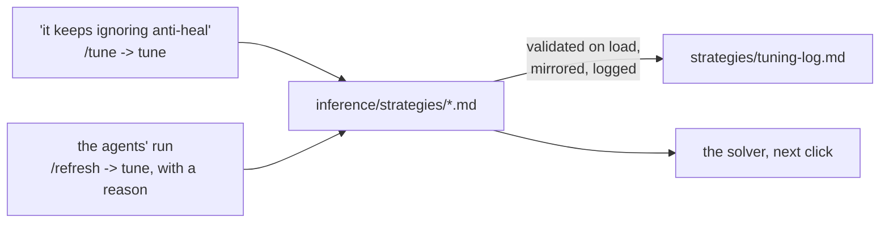

# The INFERENCE LAYER - `inference/`

Facts in, the optimal composition out. The layer owns the right-hand
side of the equation in [architecture.md](architecture.md):

```
STRATEGIES = CONSTRAINTS ∪ HEURISTICS ∪ ASSUMPTIONS   the playbook: markdown files in strategies/
COMP       = ARGMAX[ STRATEGIES( FACTS ) ]  the solver searches; the agent argues
```

Two things infer, and it matters which is which:

- **The solver** is deterministic arithmetic. It reads the strategy files'
  frontmatter, scores every candidate six with the facts layer's metrics,
  and returns the best. No model, no API, no randomness beyond a seeded
  reference sample. It cannot read prose.
- **The agent** is a Claude Code session on the `/comp` skill. It reads
  the same facts and the prose of the same strategies and reconciles them
  where arithmetic cannot. It runs when you ask it to, never on its own,
  and costs nothing beyond your subscription.

## How a strategy file works

Drop a markdown file into `strategies/` and it is live: the solver reads
the directory on every call, the board's playbook panel shows it, the
`strategies` tool and the `strategy://` resources serve it, and
`load_authored` mirrors it into the `strategies` table so the database
knows the catalog's shape. The frontmatter is the whole contract:

```markdown
---
name: Answer every revealed enemy
kind: heuristic                 # constraint | heuristic | assumption
category: matchup
direction: maximize             # heuristics: maximize | minimize
metric: team.coverage_share     # a key from the metrics registry
weight: 3
when: enemy.size >= 1           # optional guard, either kind
---
# Answer every revealed enemy
The share of revealed enemies at least one of our picks answers...
```

| kind | form | frontmatter | what the solver does |
| --- | --- | --- | --- |
| heuristic | | `metric`, `direction`, `weight` | normalises the metric to [0, 1] against a seeded sample of legal sixes for the board (flipped for minimize) and adds `weight x norm` |
| constraint | limit | `require: <expr>`, optionally `soft: true` + `penalty: <number>` | discards a candidate that fails (a soft one subtracts the penalty) |
| constraint | scored | `bonus: <expr>` and/or `penalty: <expr>`, optionally `when` | adds `weight x (bonus - penalty)` while `when` holds |
| assumption | | nothing - prose by definition | nothing: what the solver takes as given and the agent holds a comp to; shown on the board and read by the session |
| constraint or heuristic | draft | name, kind and prose only | nothing yet: shown and served, ignored by the solver, until `/strategy` infers the rest or turns it into an assumption |

A strategy's prose is three sentences at most (`add_strategy` refuses
more): the claim, why and when, what is measured.

**The solver never infers a formula or a weight from prose; a model does**
- the `/strategy` skill on command, or the engine on its own through
`derive.py`. The skill takes three things - a name, a kind, and up to
three sentences of what the strategy means - reads the vocabulary
(`metrics`) and the catalog for the house style, decides the frontmatter
(a heuristic's metric, direction and weight; a constraint's `require`, or
its `when`, `bonus`, `penalty` and `params`; or `kind: assumption` when
nothing is measurable), and stores the file through `add_strategy`, which
validates it against the catalog before it exists, mirrors it into the
`strategies` table, and logs it with a reason that quotes the prose. A
file you drop in yourself with only a name, a kind and prose loads as a
*draft*: the board and the `strategies` tool show it, `infer` results list
it as not yet scored, and `/strategy` completes it through
`infer_strategy`.

**The engine derives drafts on its own, on the subscription.** `derive.py`
asks Claude Code in print mode (`claude -p`, from a neutral directory, no
project settings, no tools) for one JSON answer - the same inference the
skill does, headless - and stores it through the same validated path,
sending the catalog's objection back once if the first answer is refused.
It runs wherever the claude CLI is signed in, which is the host:
`load_authored` derives pending drafts before it mirrors, `orchestrator.py
up` and `status` derive them and re-mirror the stack's database, and the
`derive_strategies` tool does it on demand. Inside the containers the CLI
is absent, so drafts stay pending until the host runs. No API key
anywhere. Sign the CLI in once with `claude login`; until then the engine
says so and leaves the draft as it was.

Expressions are a whitelist, compiled once and validated against the
metrics registry when the catalog loads: the `team`, `enemy`, `matchup`,
`map`, `world` and `params` sections, arithmetic, comparisons, `and`,
`or`, `not`, `x if c else y`, and `min`, `max`, `abs`, `round`, `len`,
`int`, `float`, `bool`. A key that is not in the registry, or a
`params.NAME` not declared under `params:`, is refused at load, so a typo
never scores silently. `params:` (an indented block of NAME: number) are
the dials an expression reads as `params.NAME`.

The catalog - every file, and the full vocabulary a strategy may
reference - is generated into the end of this document.

## How the weights move



Weights do not learn on their own: recording comps and outcomes was
removed, so there is no match signal to learn from, and the backlog holds
what learning would take. The board's sliders (under each heuristic in
the playbook tab) override a weight for one board at a time -
`weight=<id>:<0..10>` on `/board`, `weights` on the `board` tool - and
the file is untouched until the slider's *store*, which is a `tune` call;
every result names the weights it was scored under. One path changes a
file, logged in `strategies/tuning-log.md` with a reason and who asked:
**`tune`**, one validated frontmatter edit - `weight` (0..10),
`direction`, `soft`, `when`, `require`, `bonus`, `penalty`, `metric`, or a
`params.NAME` dial. The edited file is loaded through the catalog before
it is written, so an invalid change never lands. The `/tune` skill is the
conversational front: "it keeps ignoring anti-heal" becomes a `tune` call
and a re-run of the board to show the effect.

## Layout

```
inference/
  __init__.py      the package's map
  experiments/     other playbooks to run the stack on, one folder each,
                   chosen with COUNTER_MATRIX_STRATEGIES (its README says how); none ships
  strategies/      the playbook: one markdown file per constraint, heuristic
                   or assumption, and tuning-log.md
  catalog.py       reads, validates and mirrors the strategy files
  expr.py          the expression language the frontmatter uses
  solver.py        enumerate, prune, normalise, score, refine
  engine.py        infer(), evaluate(), board(): the solver plus citations
  tune.py          one validated, logged edit to a strategy file; add and complete
  derive.py        the engine asking the model for a draft's frontmatter
  serve.py         the HTTP service the compose stack's ui container calls
```

| file | purpose |
| --- | --- |
| `catalog.py` | Parses each file's frontmatter (a flat dialect plus one `params:` block), builds a `Strategy` with `kind`, `form`, compiled expressions and validation against the metrics registry, orders the catalog (constraints - limits, then scored - heuristics, assumptions), mirrors it into the `strategies` table, and writes the catalog at the end of this document. |
| `expr.py` | A safe subset of Python expressions: the AST is checked once, compiled, and evaluated over a scope whose missing keys read as zero, so a metric that does not apply to a board never crashes a score. |
| `solver.py` | For a board: every role shape the hard limits allow around the locked picks; per-role pools of released heroes (an announced hero waits for its release) ranked by a cheap prior; every candidate prepared (namespace, limit check, raw metric values) and scored with the frozen bounds; local search from the best few. The bounds come from a seeded reference sample of legal sixes for that map, side, enemy and bans, so `infer`, `evaluate` and the current comp share one scale and a score means the same thing across calls. |
| `engine.py` | `infer` (the optimal six around the locked picks), `evaluate` (a full six ranked against the field), `current` (the picks as they stand, partial or full), and `board`: at any stage of a draft, blue's optimal as the counter to red's selection, red's optimal as their counter to blue's, both current comps scored on those scales, blue's picks against red's best counter, blue's locked picks with the empty slots filled, red's likely starting comp, the fight odds, the game plan in prose, and the shapes the playbook's limits allow. Its two independent solves, blue's optimal and red's counter, run in two spawned worker processes while the parent solves the fill - a click takes about half the time on a machine with spare cores; `COUNTER_MATRIX_PARALLEL=0` keeps it in one process, as does a single core or a caller-supplied catalog; a dead worker means that board runs sequentially and the pool is rebuilt. Each result carries the picks with reasons and `[F#]` citations into the board's FactSet, the score breakdown per strategy, alternatives, and the assumptions as "ground rules to reconcile against". |
| `tune.py` | `tune(id, field, value, reason)`: one frontmatter edit; `add(id, name, kind, prose, fields, reason)`: a new file from what the user gave and what `/strategy` inferred; `complete(id, fields, reason)`: a draft's frontmatter in one step. Each is validated by loading the catalog with the new text, then written, re-mirrored and logged. |
| `derive.py` | `derive()`: for every draft, the prompt (the three inputs, the vocabulary, one finished file of each form for style), `claude -p` on the subscription, the JSON answer through `tune.complete`, one retry carrying the catalog's objection; at most ten drafts a run. `available()` says whether the CLI is here. |
| `serve.py` | `/board`, `/infer`, `/evaluate`, `/strategies`, `/health` - the same functions, over HTTP, for a board that runs in another container. |

## The skills

`/strategy`, `/comp`, `/tune` and `/up` are this layer's; [skills.md](skills.md)
documents them and [mcp.md](mcp.md) the tools they run on (`infer`,
`evaluate`, `board`, `facts`, `strategies`, `metrics`, `add_strategy`,
`infer_strategy`, `derive_strategies`, `tune`, `tuning_log`), which is what
makes a session and the board see the same numbers.

## The catalog

<!-- generated:catalog -->
5 files in `inference/strategies/`: 2 constraints (2 limits, 0 scored), 2 heuristics and 1 assumptions. Regenerated by `python -m db.mcp call db_docs`.

#### Constraints

##### Never five supports (`never-five-supports`, shape, limit)

`require team.supports <= 4` (hard)

A comp never fields five supports. Five healers leave one pick to make the space and take the fights, so there is nothing for all that healing to protect and the damage never comes; the queue itself allows it, so the playbook forbids it. Read from the picks' roles: at most four supports on the six.

##### At most two tanks (`open-queue-tanks`, shape, limit)

`require team.tanks <= 2` (hard)

The game is 6v6 Open Queue: six picks, any mix of roles, with the one limit the queue
itself enforces - no more than two tanks. The roster holds both teams to it. To search
Role Queue's 2-2-2 instead, tighten this file to
`require: team.tanks == 2 and team.damage == 2 and team.supports == 2`.

#### Heuristics

##### Answer their picks, lightly (`counters-with-salt`, matchup)

`maximize matchup.coverage_share` - share of red answered by blue. weight 0.5; when `enemy.size >= 1`

The counter lists say who answers whom, and a comp that answers more of red's picks is better placed - but the lists are crowd-sourced opinion, not measured, so they weigh lightly. The share of red's picks that at least one of ours answers is read from the counters table. Half a point of weight: a tie-breaker between comps the other rules rate alike, never the reason for a pick.

##### Fliers need hitscan cover (`fliers-need-cover`, matchup)

`maximize team.hitscan` - picks with a hitscan weapon or ability. weight 1; when `matchup.flyers >= 1`

When red fields a hero who flies or hovers, every pick of ours with a hitscan weapon or
ability is one more answer they cannot out-manoeuvre. Flight is tagged from the kit's own
keywords and hitscan from the weapon configs, so this is measured, not judged. It reads
only while a flier is on their side; with none revealed it contributes nothing.

#### Assumptions

##### All players play optimally (`optimal-play`, assumptions)

*assumption* - prose the solver takes as given and the session holds a comp to

Every player on both teams plays their hero to its ceiling, so the score is a comp's
ceiling, not a prediction for a lobby - no comfort-pick discount, no skill gap. Argue
against the optimum, not against a guess about the players. Anything that relaxes this
arrives as data (rank tiers are already facts) and as rules that read it.

#### The vocabulary

Every key a strategy may reference, with its meaning. `enemy.*` are
the `team.*` metrics computed for the red side.

| key | meaning |
| --- | --- |
| `team.size` | picks locked on this team |
| `team.open_slots` | slots still open (6 - size) |
| `team.tanks` | tank count |
| `team.damage` | damage count |
| `team.supports` | support count |
| `team.subrole_diversity` | distinct subroles / size (1.0 = every pick a different job) |
| `team.subroles` (text) | the subroles present |
| `team.shape_flags` (text) | TANKLESS / double tank / triple DPS / NO SUPPORT / solo heal |
| `team.style_counts` (text) | picks per playstyle tag (a hero can carry several) |
| `team.style_top` (text) | the modal playstyle among the picks |
| `team.style_lean` (text) | the playstyle a strict majority of picks carry, else none |
| `team.style_fit` | share of picks tagged with the map's rewarded style (0 without a map) |
| `team.archetype_deviation` | picks over the map's top-style archetype role slots (0 without a map) |
| `team.pool_total` | team effective HP: sum of health + shield + armor |
| `team.pool_min` | the weakest pick's pool - focus fire finds the minimum |
| `team.weakest` (text) | who holds the smallest pool |
| `team.armor_total` | summed armor |
| `team.armor_share` | armor / pool |
| `team.shield_total` | summed recharging shields |
| `team.shield_share` | shields / pool |
| `team.squish_count` | picks at or under 250 pool |
| `team.squishies` (text) | the picks at or under 250 pool |
| `team.overhealth_total` | summed peak overhealth a kit can grant |
| `team.dps_floor` | summed published per-second damage figures (a floor: misses and healing ignored) |
| `team.dps_count` | picks whose kit publishes a per-second damage figure |
| `team.burst_max` | the biggest single damage figure on the team |
| `team.burst_hero` (text) | who holds the biggest single hit |
| `team.ult_damage_total` | summed max damage across the team's damage ultimates |
| `team.dmg_ults` | ultimates that carry a damage figure |
| `team.ult_cost_mean` | mean ultimate charge cost where published |
| `team.hitscan` | picks with a hitscan weapon or ability |
| `team.projectile` | picks whose weapons are projectile |
| `team.beam` | picks with a beam |
| `team.melee` | picks with a melee weapon |
| `team.aoe_count` | kit pieces tagged area of effect |
| `team.range_median` | median of each pick's longest published range |
| `team.range_max` | the longest range on the team |
| `team.range_min` | the shortest longest-range |
| `team.dmg_amp` | picks that amplify someone's damage |
| `team.hps_floor` | summed published per-second healing figures |
| `team.heal_peak_total` | summed peak single heal across all picks, any role |
| `team.heal_peak_supports` | summed peak single heal across the supports |
| `team.heal_peak_max` | the biggest single heal on the team |
| `team.heal_ratio` | support heal peak / the roster's two-support bench |
| `team.heal_amp` | picks that amplify healing |
| `team.antiheal` | picks with anti-heal |
| `team.cleanse` | picks with a cleanse |
| `team.invuln` | picks with an invulnerability |
| `team.lifelines` | picks carrying any healing at all |
| `team.cooldown_median` | median cooldown across every ability on the team |
| `team.cooldown_count` | cooldowns counted |
| `team.cc_count` | picks with crowd control (stun, sleep, immobilize, hinder, knockback) |
| `team.cc_tools` (text) | the crowd-control tools |
| `team.mobility_count` | picks with a movement or evasive ability |
| `team.mobility_tools` (text) | the movement tools |
| `team.flyers` | picks that fly or hover |
| `team.barrier_hp` | summed barrier health the team fields |
| `team.barrier_count` | picks with a barrier |
| `team.barrier_piercers` | picks whose kit ignores barriers |
| `team.deployables` | picks with deployables |
| `team.synergy_edges` | authored synergy pairs among the picks |
| `team.synergy_score` | summed synergy scores among the picks |
| `team.synergy_density` | synergy edges / possible pairs |
| `team.isolated_count` | picks with no authored partner on the team |
| `team.isolated` (text) | the isolated picks |
| `team.core_size` | largest connected group in the team's synergy graph |
| `team.pairs` (text) | the synergy pairs present |
| `team.win_mean` | mean all-ranks win rate |
| `team.pick_mass` | summed all-ranks pick rate |
| `team.availability` | chance every pick survives the ban screen: product of (1 - ban) |
| `team.map_availability` | the same from this map's ban rates (the all-ranks ban where a map publishes none; equal to availability without a map) |
| `team.max_ban_rate` | the highest ban rate on the team |
| `team.max_ban_hero` (text) | who carries the highest ban rate |
| `team.rank_sensitive_count` | picks whose win rate swings 6+ points across ranks |
| `team.trend_sum` | summed win-rate movement since the previous snapshot |
| `team.map_known` | 1 if a map is set |
| `team.map_win_mean` | mean win rate on the map (the all-ranks mean without a map) |
| `team.map_pick_mass` | summed pick rate on the map |
| `team.map_specialists` | picks running 2.5+ points over their own baseline here |
| `team.map_offmap` | picks running 2.5+ points under their own baseline here |
| `team.map_strategy_hits` | picks counterpick lists among their best maps here |
| `team.coverage` | enemies answered by at least one pick |
| `team.coverage_share` | coverage / enemies revealed |
| `team.unanswered` (text) | enemies no pick answers |
| `team.answer_edges` | (enemy, pick) counter edges: picks answering enemies |
| `team.exposure_edges` | (pick, enemy) counter edges: enemies answering picks |
| `team.exposed_count` | picks answered by at least one enemy |
| `team.exposed` (text) | the exposed picks |
| `team.safe_count` | picks no enemy answers |
| `team.net_edges` | answer edges minus exposure edges |
| `team.double_covered` | enemies answered by two or more picks |
| `team.banproof_coverage` | coverage recomputed without the highest-ban answerer |
| `matchup.pool_diff` | blue effective HP minus red |
| `matchup.dps_diff` | blue damage floor minus red |
| `matchup.hps_diff` | blue healing floor minus red |
| `matchup.burst_vs_heal` | blue's biggest hit minus red's biggest single save |
| `matchup.heal_vs_burst` | blue's biggest single save minus red's biggest hit |
| `matchup.chew_time_ours` | seconds of blue's floor damage to chew red's pool (999 if unknown) |
| `matchup.chew_time_theirs` | seconds of red's floor damage to chew blue's pool |
| `matchup.tempo_diff` | red median cooldown minus blue's (positive: blue cycles faster) |
| `matchup.range_diff` | blue median reach minus red's |
| `matchup.net_edges` | blue answer edges minus blue exposure edges |
| `matchup.coverage_share` | share of red answered by blue |
| `matchup.exposure_share` | share of blue answered by red |
| `matchup.double_covered` | red picks answered twice over |
| `matchup.dive_pressure` | red picks with a movement tool |
| `matchup.flyers` | red picks that fly |
| `matchup.barrier_need` | barrier health red fields |
| `matchup.antiheal_need` | red supports' summed peak heal |
| `matchup.ult_threat` | red's summed damage-ultimate ceiling |
| `matchup.ult_answers` | blue invulnerabilities plus cleanses |
| `matchup.style_lean_red` (text) | red's majority playstyle, else none |
| `matchup.style_lean_blue` (text) | blue's majority playstyle, else none |
| `map.known` | 1 if a map is set |
| `map.sided` | 1 if the mode has an attacking and a defending side (Escort, Hybrid) |
| `map.side` (text) | this seat's side on a sided map: attack, defense, or empty |
| `map.style_top` (text) | the playstyle the map rewards most |
| `map.style_margin` | top style score minus the runner-up |
| `map.mode` (text) | the game mode |
| `map.stages` | stage count |
| `world.heal_bench` | 2 x the median peak heal across the support roster |
| `world.roster_size` | heroes in the roster |
<!-- /generated:catalog -->
