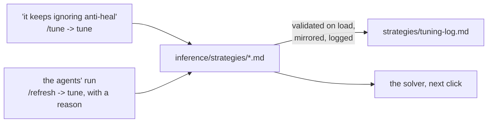

# The INFERENCE LAYER - `inference/`

Facts in, the optimal composition out. The layer owns the right-hand
side of the equation in [architecture.md](architecture.md):

```
STRATEGIES = CONSTRAINTS ∪ HEURISTICS ∪ ASSUMPTIONS   the playbook: markdown files in strategies/
COMP       = ARGMAX[ STRATEGIES( FACTS ) ]  the solver searches; the agent argues
```

Two things infer, and it matters which is which:

- **The solver** is deterministic arithmetic. It reads the strategy files'
  frontmatter, scores every candidate six with the facts layer's metrics,
  and returns the best. No model, no API, no randomness beyond a seeded
  reference sample. It cannot read prose.
- **The agent** is a Claude Code session on the `/comp` skill. It reads
  the same facts and the prose of the same strategies and reconciles them
  where arithmetic cannot. It runs when you ask it to, never on its own,
  and costs nothing beyond your subscription.

## How a strategy file works

Drop a markdown file into `strategies/` and it is live: the solver reads
the directory on every call, the board's playbook panel shows it, the
`strategies` tool and the `strategy://` resources serve it, and
`load_authored` mirrors it into the `strategies` table so the database
knows the catalog's shape. The frontmatter is the whole contract:

```markdown
---
name: Answer every revealed enemy
kind: heuristic                 # constraint | heuristic | assumption
category: matchup
direction: maximize             # heuristics: maximize | minimize
metric: team.coverage_share     # a key from the metrics registry
weight: 3
when: enemy.size >= 1           # optional guard, either kind
---
# Answer every revealed enemy
The share of revealed enemies at least one of our picks answers...
```

| kind | form | frontmatter | what the solver does |
| --- | --- | --- | --- |
| heuristic | | `metric`, `direction`, `weight` | normalises the metric to [0, 1] against a seeded sample of legal sixes for the board (flipped for minimize) and adds `weight x norm` |
| constraint | limit | `require: <expr>`, optionally `soft: true` + `penalty: <number>` | discards a candidate that fails (a soft one subtracts the penalty) |
| constraint | scored | `bonus: <expr>` and/or `penalty: <expr>`, optionally `when` | adds `weight x (bonus - penalty)` while `when` holds |
| assumption | | nothing - prose by definition | nothing: what the solver takes as given and the agent holds a comp to; shown on the board and read by the session |
| constraint or heuristic | draft | name, kind and prose only | nothing yet: shown and served, ignored by the solver, until `/strategy` infers the rest or turns it into an assumption |

A strategy's prose is three sentences at most (`add_strategy` refuses
more): the claim, why and when, what is measured.

**The solver never infers a formula or a weight from prose; a model does**
- the `/strategy` skill on command, or the engine on its own through
`derive.py`. The skill takes three things - a name, a kind, and up to
three sentences of what the strategy means - reads the vocabulary
(`metrics`) and the catalog for the house style, decides the frontmatter
(a heuristic's metric, direction and weight; a constraint's `require`, or
its `when`, `bonus`, `penalty` and `params`; or `kind: assumption` when
nothing is measurable), and stores the file through `add_strategy`, which
validates it against the catalog before it exists, mirrors it into the
`strategies` table, and logs it with a reason that quotes the prose. A
file you drop in yourself with only a name, a kind and prose loads as a
*draft*: the board and the `strategies` tool show it, `infer` results list
it as not yet scored, and `/strategy` completes it through
`infer_strategy`.

**The engine derives drafts on its own, on the subscription.** `derive.py`
asks Claude Code in print mode (`claude -p`, from a neutral directory, no
project settings, no tools) for one JSON answer - the same inference the
skill does, headless - and stores it through the same validated path,
sending the catalog's objection back once if the first answer is refused.
It runs wherever the claude CLI is signed in, which is the host:
`load_authored` derives pending drafts before it mirrors, `orchestrator.py
up` and `status` derive them and re-mirror the stack's database, and the
`derive_strategies` tool does it on demand. Inside the containers the CLI
is absent, so drafts stay pending until the host runs. No API key
anywhere. Sign the CLI in once with `claude login`; until then the engine
says so and leaves the draft as it was.

Expressions are a whitelist, compiled once and validated against the
metrics registry when the catalog loads: the `team`, `enemy`, `matchup`,
`map`, `world` and `params` sections, arithmetic, comparisons, `and`,
`or`, `not`, `x if c else y`, and `min`, `max`, `abs`, `round`, `len`,
`int`, `float`, `bool`. A key that is not in the registry, or a
`params.NAME` not declared under `params:`, is refused at load, so a typo
never scores silently. `params:` (an indented block of NAME: number) are
the dials an expression reads as `params.NAME`.

The catalog - every file, and the full vocabulary a strategy may
reference - is generated into the end of this document.

## How the weights move



Weights do not learn on their own: recording comps and outcomes was
removed, so there is no match signal to learn from, and the backlog holds
what learning would take. The board's sliders (under each heuristic in
the playbook tab) override a weight for one board at a time -
`weight=<id>:<0..10>` on `/board`, `weights` on the `board` tool - and
the file is untouched until the slider's *store*, which is a `tune` call;
every result names the weights it was scored under. One path changes a
file, logged in `strategies/tuning-log.md` with a reason and who asked:
**`tune`**, one validated frontmatter edit - `weight` (0..10),
`direction`, `soft`, `when`, `require`, `bonus`, `penalty`, `metric`, or a
`params.NAME` dial. The edited file is loaded through the catalog before
it is written, so an invalid change never lands. The `/tune` skill is the
conversational front: "it keeps ignoring anti-heal" becomes a `tune` call
and a re-run of the board to show the effect.

## Layout

```
inference/
  __init__.py      the package's map
  experiments/     other playbooks to run the stack on, one folder each,
                   chosen with COUNTER_MATRIX_STRATEGIES (its README says how); none ships
  strategies/      the playbook: one markdown file per constraint, heuristic
                   or assumption, and tuning-log.md
  catalog.py       reads, validates and mirrors the strategy files
  expr.py          the expression language the frontmatter uses
  solver.py        enumerate, prune, normalise, score, refine
  engine.py        infer(), evaluate(), board(): the solver plus citations
  tune.py          one validated, logged edit to a strategy file; add and complete
  derive.py        the engine asking the model for a draft's frontmatter
  serve.py         the HTTP service the compose stack's ui container calls
```

| file | purpose |
| --- | --- |
| `catalog.py` | Parses each file's frontmatter (a flat dialect plus one `params:` block), builds a `Strategy` with `kind`, `form`, compiled expressions and validation against the metrics registry, orders the catalog (constraints - limits, then scored - heuristics, assumptions), mirrors it into the `strategies` table, and writes the catalog at the end of this document. |
| `expr.py` | A safe subset of Python expressions: the AST is checked once, compiled, and evaluated over a scope whose missing keys read as zero, so a metric that does not apply to a board never crashes a score. |
| `solver.py` | For a board: every role shape the hard limits allow around the locked picks; per-role pools of released heroes (an announced hero waits for its release) ranked by a cheap prior; every candidate prepared (namespace, limit check, raw metric values) and scored with the frozen bounds; local search from the best few. The bounds come from a seeded reference sample of legal sixes for that map, side, enemy and bans, so `infer`, `evaluate` and the current comp share one scale and a score means the same thing across calls. |
| `engine.py` | `infer` (the optimal six around the locked picks), `evaluate` (a full six ranked against the field), `current` (the picks as they stand, partial or full), and `board`: at any stage of a draft, blue's optimal as the counter to red's selection, red's optimal as their counter to blue's, both current comps scored on those scales, blue's picks against red's best counter, blue's locked picks with the empty slots filled, red's likely starting comp, the fight odds, the game plan in prose, and the shapes the playbook's limits allow. Its two independent solves, blue's optimal and red's counter, run in two spawned worker processes while the parent solves the fill - a click takes about half the time on a machine with spare cores; `COUNTER_MATRIX_PARALLEL=0` keeps it in one process, as does a single core or a caller-supplied catalog; a dead worker means that board runs sequentially and the pool is rebuilt. Each result carries the picks with reasons and `[F#]` citations into the board's FactSet, the score breakdown per strategy, alternatives, and the assumptions as "ground rules to reconcile against". |
| `tune.py` | `tune(id, field, value, reason)`: one frontmatter edit; `add(id, name, kind, prose, fields, reason)`: a new file from what the user gave and what `/strategy` inferred; `complete(id, fields, reason)`: a draft's frontmatter in one step. Each is validated by loading the catalog with the new text, then written, re-mirrored and logged. |
| `derive.py` | `derive()`: for every draft, the prompt (the three inputs, the vocabulary, one finished file of each form for style), `claude -p` on the subscription, the JSON answer through `tune.complete`, one retry carrying the catalog's objection; at most ten drafts a run. `available()` says whether the CLI is here. |
| `serve.py` | `/board`, `/infer`, `/evaluate`, `/strategies`, `/health` - the same functions, over HTTP, for a board that runs in another container. |

## The skills

`/strategy`, `/comp`, `/tune` and `/up` are this layer's; [skills.md](skills.md)
documents them and [mcp.md](mcp.md) the tools they run on (`infer`,
`evaluate`, `board`, `facts`, `strategies`, `metrics`, `add_strategy`,
`infer_strategy`, `derive_strategies`, `tune`, `tuning_log`), which is what
makes a session and the board see the same numbers.

## The catalog

<!-- generated:catalog -->
105 files in `inference/strategies/`: 21 constraints (2 limits, 19 scored), 83 heuristics and 1 assumptions. Regenerated by `python -m db.mcp call db_docs`.

#### Constraints

##### Never five supports (`never-five-supports`, shape, limit)

`require team.supports <= 4` (hard)

A comp never fields five supports. Five healers leave one pick to make the space and take the fights, so there is nothing for all that healing to protect and the damage never comes; the queue itself allows it, so the playbook forbids it. Read from the picks' roles: at most four supports on the six.

##### At most two tanks (`open-queue-tanks`, shape, limit)

`require team.tanks <= 2` (hard)

The game is 6v6 Open Queue: six picks, any mix of roles, with the one limit the queue
itself enforces - no more than two tanks. The roster holds both teams to it. To search
Role Queue's 2-2-2 instead, tighten this file to
`require: team.tanks == 2 and team.damage == 2 and team.supports == 2`.

##### Barriers block the burst (`barriers-block-burst`, durability, scored)

weight 1; when `matchup.heal_vs_burst < 0`; bonus `min(team.barrier_count, 2) * 0.75`

A barrier is the one kind of sustain that stops a hit before it lands, so against hits too big to heal a comp wants something to hide behind. Reinhardt's and Sigma's barriers eat the shot, the rocket and the ultimate that no heal would have beaten, buying the moment the heal line needs to catch up. Read only while red's biggest single hit exceeds our biggest single heal, and rewarded per barrier pick, two at most.

##### Raise the weakest pool (`raise-the-weakest-pool`, durability, scored)

weight 1; when `matchup.heal_vs_burst < 0`; bonus `min(team.pool_min / params.ONE_SHOT, 2) * 0.5`
params: ONE_SHOT=250

When red's biggest hit is larger than our biggest save, the weakest pool on the six is what focus fire finds first. A 250-pool pick dies to a Widowmaker headshot or a Hanzo arrow before any heal lands, so the picks that survive one hit are the ones still fighting after red's opener. Read only while red's biggest single hit exceeds our biggest single heal, and rewarded per one-shot's worth of the smallest pool on our side, two at most.

##### Brawl has no vertical answer (`brawl-on-dive-map`, map, scored)

weight 1; when `map.style_top == 'dive' and team.style_lean == 'brawl'`; penalty `params.BRAWL_ON_DIVE`
params: BRAWL_ON_DIVE=1

A comp that leans brawl is stuck on the low ground of a map built around verticality. Brawl mobility runs along the floor, a charge or a speed boost, and none of it climbs, so the high ground stays with whoever took it first. The penalty lands when a strict majority of the six carry the brawl tag on a map whose rewarded style is dive.

##### Brawl cannot close a poke map (`brawl-on-poke-map`, map, scored)

weight 1; when `map.style_top == 'poke' and team.style_lean == 'brawl'`; penalty `params.BRAWL_ON_POKE`
params: BRAWL_ON_POKE=1.5

A comp that leans brawl loses on a map of long sightlines before it reaches anyone. Brawl kits win once they close the distance and lack the long-range damage to make the crossing cheap, so on open ground the approach is the whole fight and it is lost. The penalty lands when a strict majority of the six carry the brawl tag on a map whose rewarded style is poke.

##### Lean the way the map leans (`lean-with-the-map`, map, scored)

weight 1; when `map.known >= 1 and team.style_lean != '' and team.style_lean != map.style_top`; penalty `params.MISMATCH_PENALTY`
params: MISMATCH_PENALTY=1

A comp that commits to a style the map does not reward pays for its commitment every fight. Damage supports and snipers thrive where poke is dominant and peel is cheap, and die where a brawl map lets red walk onto them. The penalty lands when the picks' majority style differs from the map's rewarded style.

##### Popular here and losing here (`popular-here-losing-here`, map, scored)

weight 1; when `map.known == 1 and team.map_win_mean < params.TRAP_WIN`; penalty `min(team.map_pick_mass / params.TRAP_MASS, 1) * 1`
params: TRAP_MASS=45, TRAP_WIN=50

A six of heroes the map's lobby picks heavily but loses with is a six of trap picks, popular here for reasons the rates do not reward. The map's pick rate is the crowd's belief about the map and its win rate is the result, and where the two disagree the result is the one to trust. It charges up to a point, scaled by the six's summed pick rate on the map against a dial of 45, while the mean win rate on the map is under 50.

##### Bans target the counters (`bans-target-counters`, matchup, scored)

weight 1; when `team.coverage >= 1`; penalty `(team.coverage - team.banproof_coverage) * 0.5`

Bans remove answers before they remove comps, so every enemy whose only answer is the six's most-banned pick is an answer that vanishes with one vote. A protect-and-ban phase has been seen to reinforce the meta precisely by banning the counters, and the ladder's ban screen does the same by weight of votes. The difference between enemies answered and enemies still answered without the highest-ban answerer is charged, half a point each.

##### Stacked counters force a swap (`stacked-counters-swap`, matchup, scored)

weight 1; penalty `max(0, team.exposure_edges - team.exposed_count) * 0.5`

One counter on a pick is a matchup to play around; a second and a third on the same pick is the enemy team built to delete it, and that is the point where the community says to swap. A Tracer into Cassidy sidesteps the flashbang and keeps farming, but a Tracer into Brigitte, Cassidy, Mercy, Mei and Roadhog kills nobody. Every exposure edge past the first on an already-exposed pick costs half a point, and with no enemy revealed there are no edges.

##### Every unanswered enemy costs (`unanswered-enemy-costs`, matchup, scored)

weight 1; when `enemy.size >= 1`; penalty `max(0, enemy.size - team.coverage) * 0.5`

The one agreed reason to swap is an enemy on a hero that needs a counter when the team holds none, an aerial Pharah into Reaper and Symmetra being the stock example. Each revealed enemy that no pick of ours answers is one such gap, and the gap is a per-head cost rather than a share. Half a point is taken for every revealed enemy outside every pick's counter list.

##### A must-ban is not a plan (`must-ban-no-plan`, meta, scored)

weight 1; when `team.max_ban_rate >= params.MAGNET`; penalty `1.5`
params: MAGNET=20

A pick banned in one lobby in five is absent too often to plan around. Below that line a ban is bad luck, above it a ban is the expectation, so the six pays a flat price for carrying such a pick rather than a sliding one. It applies while the highest ban rate on the six reaches the dial, 20 percent by default.

##### Half a comp each way fails (`commit-to-one-style`, shape, scored)

weight 1; when `team.size >= 4 and team.style_lean == ''`; penalty `params.HYBRID_PENALTY`
params: HYBRID_PENALTY=1.5

A six with no majority playstyle fights as two half-teams. A brawl tank in front of a poke backline cannot peel what is dove and cannot swing on what is far away, so nobody's kit is used at its range. The penalty lands whenever no style is carried by a strict majority of the picks.

##### One support cannot hold a six (`solo-heal-cannot-hold`, shape, scored)

weight 1; when `'solo heal' in team.shape_flags or 'NO SUPPORT' in team.shape_flags`; penalty `max(0, 2 - team.supports) * params.PER_MISSING`
params: PER_MISSING=2

A single support cannot heal six picks through a fight, and red focuses that support first because the whole comp's sustain dies with them. No support at all is worse still, since nothing recovers between engagements. The penalty grows by two per support short of two.

##### A solo healer is a liability (`solo-heal-liability`, shape, scored)

weight 1; when `team.size >= 1`; penalty `max(0, 2 - team.supports) * 1`

A comp with one support or none cannot hold anyone through focus, whatever else it fields. One healer is picked apart by any pressure and has no partner to cover the moment they are forced out, and no healer is a loss before the first fight unless red made the same mistake. Read from the picks' roles: each support short of two is charged one point.

##### Two supports must heal between them (`support-duo-must-heal`, shape, scored)

weight 1; when `team.supports >= 2 and team.heal_ratio < params.HEAL_FLOOR`; penalty `params.DUO_PENALTY`
params: DUO_PENALTY=1.5, HEAL_FLOOR=0.75

Two supports whose healing is both light leave the tanks with nothing to stand on while they take the front. Utility supports are picked for peel, speed and escapes, and pairing two of them means neither can keep a tank up under fire. The penalty lands when the supports' summed peak heal falls under the floor share of the roster's two-support bench.

##### Field two damage picks (`two-damage-minimum`, shape, scored)

weight 1; when `team.size >= 4`; penalty `max(0, params.MIN_DAMAGE - team.damage) * 1.5`
params: MIN_DAMAGE=2

A six needs at least two damage picks, because damage heroes make the pressure that lets a tank take space and that stops red from pushing. Supports can deal damage but cannot focus it or sustain it through their cooldown gaps the way a damage kit does. The penalty grows by one and a half per damage pick short of two.

##### Two tanks hold the front (`two-tanks-up-front`, shape, scored)

weight 1; when `team.size >= 4`; bonus `min(team.tanks, 2) * params.PER_TANK`; penalty `('TANKLESS' in team.shape_flags) * params.PER_TANK`
params: PER_TANK=1

In 6v6 two tanks hold the front and the off angle at once: one takes the space and the other forces the flank away from the backline. A comp with no tank has nobody to walk behind, and one tank alone has to choose between the front and the angle every fight. Scored as one per tank up to two, and one more against a tankless six.

##### Two light healers lose fights (`two-light-healers-lose`, sustain, scored)

weight 1; when `team.supports >= 2`; penalty `max(0, params.HEAL_MARGIN - team.heal_ratio) * 2`
params: HEAL_MARGIN=0.9

Two supports who both heal lightly leave the team unable to hold anyone alive under fire. Lúcio, Mercy, Brigitte and Zenyatta bring utility and a trickle, so a pair drawn from that end of the roster pours everything into one target and still loses it, and one of the two has to be a heavy healer. The support line's summed peak single heal is read against the roster's two-support bench and the shortfall below the margin is charged.

##### Synergy decides between fits (`synergy-decides-between-fits`, synergy, scored)

weight 1; when `map.known == 1 and team.map_offmap == 0`; bonus `min(team.synergy_edges, params.PAIR_CAP) * 0.5`
params: PAIR_CAP=4

Synergy is the deciding factor between picks that already fit the map, never the reason to bring a pick that does not. Once no pick on the six runs under its baseline here, every documented pair is a plan the comp can execute on this ground. Each authored pair earns half a point while the six has no off-map pick, up to 4 pairs.

##### A thin map sample is noise (`thin-map-sample-noise`, uncertainty, scored)

weight 1; when `map.known == 1 and team.map_pick_mass < params.THIN_MAP_MASS`; penalty `1`
params: THIN_MAP_MASS=30

A map win rate built on a few games is noise, and a six of rarely-picked heroes on this map is a six whose map figures cannot be trusted. Pick rate is the sample behind the win rate, so when the summed map pick rate is thin the map verdict is unearned. It charges a flat point while the six's summed pick rate on the map is under the dial, 30 by default.

#### Heuristics

##### Amplify the damage (`amplify-the-damage`, damage)

`maximize team.dmg_amp` - picks that amplify someone's damage. weight 1

A pick that multiplies a teammate's damage adds a kill threat without adding a gun. Mercy's beam, Zenyatta's discord and Ana's nano turn a target that was surviving into one that is not, so a comp low on raw damage is not low at all once a boost is on the right pick. Picks that amplify someone's damage are counted.

##### Area damage punishes grouping (`area-damage-punishes-grouping`, damage)

`maximize team.aoe_count` - kit pieces tagged area of effect. weight 0.75

Damage that hits an area is worth more than its number against a team that stands together. A brawl or bunker line holds by grouping, and splash from Junkrat, Ashe's dynamite and the ultimates that cleave punishes exactly that grouping, while single-target damage has to pick one of them and gets healed. Kit pieces tagged area of effect are counted across the six.

##### Bring a one-shot (`bring-a-one-shot`, damage)

`maximize team.burst_max` - the biggest single damage figure on the team. weight 1

A comp carries one pick whose single hit can delete a 250-pool target, because a kill nobody can react to is the fastest way to win a fight. Widowmaker, Hanzo and Roadhog get value that steady damage never does, since steady damage is healed while the burst is not. The biggest single damage figure on the six is measured.

##### Burst through their saves (`burst-beats-their-saves`, damage)

`maximize matchup.burst_vs_heal` - blue's biggest hit minus red's biggest single save. weight 1.5; when `matchup.chew_time_theirs < 999`

Damage that arrives slower than red's biggest save is healed away, while damage that arrives in one hit larger than that save is a kill. Against a heavy heal line the only shots that count are the ones a Kiriko or an Ana cannot answer, which is why one-shots define fights when healing is strong. Our biggest single hit minus red's biggest single heal is measured, read once red has revealed damage, and a positive margin means their line cannot undo our opener.

##### Damage seals the kills (`damage-seals-kills`, damage)

`maximize team.dps_floor` - summed published per-second damage figures (a floor: misses and healing ignored). weight 1.5

A comp needs enough sustained damage to finish what it starts, since healing alone holds space but never takes it. When the whole line pours out healing and little damage, nobody is bursted down and nobody is held back, so the enemy walks forward through it; every damage pick and at least one support has to add pressure. The sum of each pick's best published per-second damage figure is measured, a floor that ignores misses and healing.

##### Outdamage their floor (`outdamage-their-floor`, damage)

`maximize matchup.dps_diff` - blue damage floor minus red. weight 1; when `matchup.chew_time_theirs < 999`

The side with the higher damage floor forces the other to answer every exchange with healing, and healing plus mitigation eventually loses to more damage. Three damage picks outdamage three supports whatever those supports heal, so the comparison of floors is the comparison of who gets to walk forward. Our summed per-second damage minus red's is measured, read once red has revealed damage.

##### Damage ultimates win fights (`ultimates-win-fights`, damage)

`maximize team.ult_damage_total` - summed max damage across the team's damage ultimates. weight 1

Every comp needs win conditions, and the damage ultimates are the go-buttons that end a fight outright. A team without them has to win neutral over and over on picks alone, while a Graviton Surge with a wipe behind it, a Dragonblade or an Earthshatter decides the fight the moment it lands. The summed maximum damage across the six's damage ultimates is measured.

##### Armor shrugs off spam (`armor-shrugs-off-spam`, durability)

`maximize team.armor_share` - armor / pool. weight 0.75

Armor cuts every small hit that lands on it, so the share of a comp's pool that is armor decides how well it walks through rapid fire and spam. A Brigitte-packed or Reinhardt-fronted line shrugs off Tracer, Reaper and turret fire that would shred plain health, which is why banning the armor makes damage picks worth fielding again. Armor as a share of the team's total pool is measured.

##### Fewer squishies to focus (`fewer-squishies`, durability)

`minimize team.squish_count` - picks at or under 250 pool. weight 1

Every pick at or under 250 pool is a target a dive or a one-shot removes in a second. Four of them is the ordinary 2-2-2 backline the tanks and supports peel for, and five or six is a comp where every fight opens with someone missing, and once picks start falling the rest snowballs. The count of picks at or under 250 pool is measured.

##### Field more hit points (`field-more-hit-points`, durability)

`maximize team.pool_total` - team effective HP: sum of health + shield + armor. weight 0.75

More hit points on the six is more damage absorbed before the first death, and the first death decides most fights. Tank-heavy lines win because they stand in the open and survive the poke that sends a 250-pool pick back to spawn, so a low-pool comp has to trade perfectly to match them. Health, shield and armor summed across the six is measured.

##### Outlast their damage (`outlast-their-damage`, durability)

`maximize matchup.chew_time_theirs` - seconds of red's floor damage to chew blue's pool. weight 1; when `matchup.chew_time_theirs < 999`

When red's damage floor is high enough that no heal line keeps up, the pool has to absorb it instead. A Bastion and Torbjörn hold or a pocketed hitscan outdamages any two supports, so the comp that survives them is the one whose total hit points take longest to chew through. Seconds of red's floor damage needed to chew our whole pool is measured, higher being longer, read once red has revealed damage.

##### Overhealth blunts the burst (`overhealth-blunts-burst`, durability)

`maximize team.overhealth_total` - summed peak overhealth a kit can grant. weight 0.75

Temporary health granted by a kit is insurance against burst that the healing number never sees. Wrecking Ball's adaptive shield, Sigma's grasp, Brigitte's packs and Junker Queen's shout put hit points in front of a hit before it lands, which is the only sustain that arrives faster than a one-shot. The summed peak overhealth the six can grant is measured.

##### Shields recharge themselves (`shields-recharge-themselves`, durability)

`maximize team.shield_share` - shields / pool. weight 0.5

Shield hit points refill on their own, so the share of a comp's pool that is shield is sustain the heal line never has to pay for. Shields start regenerating 3 seconds after the last hit at 30 per second, sooner and faster than plain health, and they stack with the passive regeneration, so Zenyatta, Symmetra, Juno and Domina come back to full behind a corner without a healer's attention. Recharging shields as a share of the team's total pool is measured.

##### Brawl maps reward durability (`brawl-maps-reward-durability`, map)

`maximize team.pool_total` - team effective HP: sum of health + shield + armor. weight 1; when `map.style_top == 'brawl'`

In corridors and chokes the fight is decided by who lasts longer in each other's face. A brawl map gives no room to disengage, so the comp with more health, armor and shield to spend up close wins the scrum. Summed effective hit points across the six is the measure, read on maps whose rewarded style is brawl.

##### Bring the map's specialists (`bring-map-specialists`, map)

`maximize team.map_specialists` - picks running 2.5+ points over their own baseline here. weight 1; when `map.known == 1`

A hero who runs well above their own average on this map is a specialist worth building around. Some kits fit one map's geometry far better than the roster's average shows, a Widowmaker on Circuit Royal, a Winston on Numbani, and the map rates catch the gap. Picks running 2.5 points or more over their own baseline win rate on the selected map are counted.

##### Chokes reward crowd control (`chokes-reward-crowd-control`, map)

`maximize team.cc_count` - picks with crowd control (stun, sleep, immobilize, hinder, knockback). weight 1; when `map.style_top == 'brawl'`

Where a map funnels both teams into a choke, crowd control decides who gets through it. A stun, a wall or a knockback at a doorway takes a pick out of the fight at the one moment the whole team is committed, and enclosed space leaves nowhere to dodge it. Picks with a crowd-control tool are counted, read on maps whose rewarded style is brawl.

##### The counterpick lists know their maps (`counterpick-knows-its-maps`, map)

`maximize team.map_strategy_hits` - picks counterpick lists among their best maps here. weight 0.5; when `map.known == 1`

A pick the counterpick lists file under their best maps here belongs in the comp more than one they do not. The lists are crowd-sourced opinion on where each hero excels, and they agree with the rates often enough to break a tie. Picks whose best-maps list names the selected map are counted, a light weight for a judged source.

##### Pick into what the map rewards (`fit-the-map-style`, map)

`maximize team.style_fit` - share of picks tagged with the map's rewarded style (0 without a map). weight 2; when `map.known == 1`

A six built of the playstyle a map rewards wins the fights that map sets up. The authored map notes tag each map with the style its geometry favours, brawl in corridors and chokes, poke across long sightlines, dive where high ground stacks, and a hero carries the style tags its kit earns. The share of the six tagged with the map's rewarded style is the measure, and it reads as 0 without a map.

##### Leave off-map picks at home (`leave-off-map-picks`, map)

`minimize team.map_offmap` - picks running 2.5+ points under their own baseline here. weight 1; when `map.known == 1`

A hero who runs well below their own average here is a liability the rest of the comp has to carry. A counterpick that is wrong for the ground trades one problem for another, and the map rates show the cost before the fight does. Picks running 2.5 points or more under their own baseline win rate on the selected map are counted, and fewer is better.

##### Each map has its own meta (`map-has-own-meta`, map)

`maximize team.map_pick_mass` - summed pick rate on the map. weight 0.5; when `map.known == 1`

What a lobby fields changes with the map, so the map's own pick rates are the meta that matters once the map is known. Sightlines, high ground and the mode decide which kits get picked here, and the ladder's global pick rate hides that. The summed pick rate of the six on the selected map is read.

##### One hero is not a style (`one-hero-no-style`, map)

`minimize team.archetype_deviation` - picks over the map's top-style archetype role slots (0 without a map). weight 0.75; when `map.known == 1 and map.style_margin >= 2`

A single hero of the map's style inside a comp shaped for another does not play that style. Each rewarded style has an archetype of role slots, two tanks who hold or engage, two damage who fight at its range, two supports who survive its commit, and picks stacked past those slots leave the style's plan without the roles it needs. The count of picks over the map's top-style archetype slots is the measure, read where the map's style score reaches 2.

##### Short reach fails on poke maps (`short-reach-fails-poke`, map)

`maximize team.range_min` - the shortest longest-range. weight 1; when `map.style_top == 'poke'`

On a poke map the pick with the shortest reach is the one who spends the fight unable to shoot back. Beams and shotguns that own a corridor are helpless across a canyon, so a comp is judged there by its shortest longest-range, not its longest. The smallest of the picks' longest published ranges is the measure, read on maps whose rewarded style is poke.

##### Sightlines want hitscan (`sightlines-want-hitscan`, map)

`maximize team.hitscan` - picks with a hitscan weapon or ability. weight 1; when `map.style_top == 'poke'`

Long sightlines belong to hitscan weapons, which land at any distance the map offers while projectiles arc and slow. On a poke map the fight opens at the range where a Soldier: 76, Ashe or Widowmaker is already hitting and a projectile kit is still hoping. Picks with a hitscan weapon or ability are counted, read on maps whose rewarded style is poke.

##### Win on this ground (`win-on-this-ground`, map)

`maximize team.map_win_mean` - mean win rate on the map (the all-ranks mean without a map). weight 2; when `map.known == 1`

A comp that wins on this map is measured by what its picks have already won here. Per-map win rates are the closest measured thing to a hero's fit for the ground, and they catch what the geometry notes miss, a long walk back, a well, a bridge. The mean of the six's win rates on the selected map is the measure, read only while a map is set.

##### Amplify damage into thin healing (`amplify-thin-heals`, matchup)

`maximize team.dmg_amp` - picks that amplify someone's damage. weight 0.75; when `matchup.antiheal_need < world.heal_bench`

When red's supports heal below the roster's bench, their tanks are outdamaged before they are outhealed, and the pick for that board is the amplifier: Zenyatta's discord on a tank the enemy cannot heal back ends the tank duel early. Damage amplification is worth most exactly where there is little healing to fight through. Measured as the count of picks that amplify someone's damage, read while red's support heal peak is under the world's heal bench.

##### Answer more than they answer (`answer-more-than-exposed`, matchup)

`maximize matchup.net_edges` - blue answer edges minus blue exposure edges. weight 1

A comp comes out ahead when its counter edges onto red outnumber red's edges onto it, because each edge is a duel one side opens with a kit advantage. Being strong into three of their picks while two of theirs are strong into one of ours is still a winning ledger as long as the countered pick avoids its counters. Measured as blue's answer edges minus blue's exposure edges from the counters table, 0 until red reveals a pick.

##### Invulnerability answers their ultimates (`answer-their-ults`, matchup)

`maximize matchup.ult_answers` - blue invulnerabilities plus cleanses. weight 1; when `matchup.ult_threat >= 600`

A comp facing heavy damage ultimates survives them with invulnerabilities and cleanses, not with health: a double gravity and double bomb kills nobody when everyone is inside a sound barrier or a transcendence. The answer fires once and covers the team, which is why a lower-tempo comp lives through a higher-tempo team's spike. Measured as our invulnerabilities plus cleanses, read while red's summed damage-ultimate ceiling is 600 or more.

##### Anti-heal a heavy heal line (`antiheal-heavy-heal-line`, matchup)

`maximize team.antiheal` - picks with anti-heal. weight 1.5; when `matchup.antiheal_need >= world.heal_bench * 1.25`

Against a support line that heals well above the roster's bench, a landed anti-heal is the one cooldown the community calls an instant fight win, because 4 seconds without healing turns a pocketed tank into a kill. Moira, Mauga and a double pocket are all played around Ana's grenade for that reason, and no damage pick replaces it. Measured as the count of picks with a negative healing modifier, read while red's supports' summed peak heal is at least 1.25 times the world's heal bench.

##### Answers that survive the ban (`ban-proof-answers`, matchup)

`maximize team.banproof_coverage` - coverage recomputed without the highest-ban answerer. weight 0.75

An answer that hangs on one high-ban hero is an answer the ban screen removes before the match starts: the only counter to a bunker is Sombra and Sombra is permabanned, and a good Mauga bans Ana. Coverage that stands without the most-banned answerer is coverage the lobby cannot take away. Measured as the red picks still answered when our highest-ban-rate answerer is removed from the count, 0 with none revealed.

##### A barrier blunts their hitscan (`barrier-blunts-hitscan`, matchup)

`maximize team.barrier_hp` - summed barrier health the team fields. weight 0.75; when `enemy.hitscan >= 2`

Hitscan damage has no travel time to dodge, so the soft counter to it is a barrier in the line of fire: a shield tank turns a Widowmaker duel into a shoot-the-barrier duel and gives the squishies safe cover to cross a sightline. Barrier health is how long that cover lasts against sustained hitscan fire. Measured as the summed barrier health the team fields, read while 2 or more red picks have a hitscan weapon.

##### A barrier eats the big ultimate (`barrier-eats-ults`, matchup)

`maximize team.barrier_hp` - summed barrier health the team fields. weight 0.75; when `matchup.ult_threat >= 600`

Earthshatter, Self-Destruct and a Deadeye all stop at a barrier, and the first counter to a Reinhardt ultimate is a Reinhardt barrier of one's own. Barrier health is what lets that block survive the hit instead of breaking under it. Measured as the summed barrier health the team fields, read while red's summed damage-ultimate ceiling is 600 or more.

##### Brawl outlasts a dive (`brawl-outlasts-dive`, matchup)

`maximize team.pool_total` - team effective HP: sum of health + shield + armor. weight 1; when `matchup.style_lean_red == 'dive'`

Brawl beats dive: a dive comp trades durability for mobility, so a team that groups up with a big health pool and swings back is not killed in the seconds the dive has before its cooldowns end. Reinhardt with Brigitte and Lúcio gives a Winston dive nothing to land on. Measured as the team's summed effective health, read only while red's majority playstyle is dive.

##### Break a heavy barrier line (`break-heavy-barriers`, matchup)

`maximize team.dps_floor` - summed published per-second damage figures (a floor: misses and healing ignored). weight 1; when `matchup.barrier_need >= 1200`

A Reinhardt or Ramattra barrier line only moves when something melts it, and the shield busters are the picks with a high sustained damage figure: Bastion and Junkrat chew barriers that hitscan poke never dents. Damage per second decides whether the barrier is down before their fire finishes ours. Measured as the summed published per-second damage of the team, read while red fields 1200 or more barrier health.

##### Burst through their biggest save (`burst-through-heals`, matchup)

`maximize matchup.burst_vs_heal` - blue's biggest hit minus red's biggest single save. weight 0.75; when `matchup.antiheal_need >= world.heal_bench`

Healing that brings a pick from low to full in seconds makes chip damage worthless, so a comp facing a strong heal line needs single hits that outsize the biggest save they can answer with. A Widowmaker headshot or a Hanzo storm arrow volley cannot be healed after the fact, which is why a sustain comp is answered with burst rather than sustained fire. Measured as our biggest single hit minus red's biggest single heal, read while red's support heal peak is at or above the world's heal bench.

##### Crowd control interrupts ultimates (`cc-interrupts-ults`, matchup)

`maximize team.cc_count` - picks with crowd control (stun, sleep, immobilize, hinder, knockback). weight 0.5; when `matchup.ult_threat >= 600`

A channelled or wound-up ultimate dies to a stun or a sleep on the way out: a sleeping Reaper blossoms nobody and Orisa's javelin ends a charge mid-cast. Against a team whose damage ultimates decide fights, one more hard crowd-control tool is one more chance to cancel the play. Measured as the count of picks with crowd control, read while red's damage-ultimate ceiling is 600 or more.

##### Counters get countered (`counters-get-countered`, matchup)

`minimize matchup.exposure_share` - share of blue answered by red. weight 0.5

The picks that answer a comp are themselves answered, so a six built purely from counters walks into the counters to the counters. The meta comp is the one least exposed to that chain, not the one with the longest list of answers. The share of our picks that some revealed enemy answers is read, at half weight because the lists are opinion.

##### Answer their picks, lightly (`counters-with-salt`, matchup)

`maximize matchup.coverage_share` - share of red answered by blue. weight 0.5; when `enemy.size >= 1`

The counter lists say who answers whom, and a comp that answers more of red's picks is better placed - but the lists are crowd-sourced opinion, not measured, so they weigh lightly. The share of red's picks that at least one of ours answers is read from the counters table. Half a point of weight: a tie-breaker between comps the other rules rate alike, never the reason for a pick.

##### A dive finds the weakest pool (`dive-finds-weakest`, matchup)

`maximize team.pool_min` - the weakest pick's pool - focus fire finds the minimum. weight 0.75; when `matchup.dive_pressure >= 4`

A dive tank sorts the enemy into diveable and not diveable, and the pick it lands on first is the one with the smallest health pool. A 175 HP Tracer or a 225 HP support is a one-commit kill for a Winston and D.Va pair, so the floor of the team's health matters more than its total against a mobile team. Measured as the smallest effective pool on the team, read while 4 or more red picks carry a movement tool.

##### Fliers need hitscan cover (`fliers-need-cover`, matchup)

`maximize team.hitscan` - picks with a hitscan weapon or ability. weight 1; when `matchup.flyers >= 1`

When red fields a hero who flies or hovers, every pick of ours with a hitscan weapon or
ability is one more answer they cannot out-manoeuvre. Flight is tagged from the kit's own
keywords and hitscan from the weapon configs, so this is measured, not judged. It reads
only while a flier is on their side; with none revealed it contributes nothing.

##### Fly over a projectile team (`fly-over-projectiles`, matchup)

`maximize team.flyers` - picks that fly or hover. weight 1; when `enemy.hitscan <= 2`

A Pharah or Echo is contested by hitscan and by almost nothing else, so a red team whose hitscan is at most a tank's gun and one rifle leaves the air contestable. Reaper and Symmetra cannot touch an aerial pick at all, and Torbjörn's turret is bombed from a range he cannot answer. Measured as the count of picks that fly or hover, read while red fields at most 2 picks with a hitscan weapon or ability.

##### An invulnerability survives the dive (`invuln-against-dive`, matchup)

`maximize team.invuln` - picks with an invulnerability. weight 0.75; when `matchup.dive_pressure >= 4`

A diver's burst is timed to land inside one cooldown window, and an invulnerability on the target wastes it: Suzu dodges 120 damage with one press, Immortality Field holds the backline through the commit, and the diver leaves with nothing. The dive's own play is to bait those cooldowns first, which is a measure of how much they cost it. Measured as the count of picks with an invulnerability, read while 4 or more red picks carry a movement tool.

##### Outrange them (`outrange-them`, matchup)

`maximize matchup.range_diff` - blue median reach minus red's. weight 0.75; when `enemy.size >= 1`

Whoever outranges the other chooses when the fight starts and takes free damage during the approach, and a Reinhardt with one of the lowest effective ranges in the game is at a disadvantage against everyone until the gap is closed. Ashe loses to a Widowmaker at range for the same reason: falloff decides the duel before aim does. Measured as our median longest reach minus red's.

##### Peel a dive with crowd control (`peel-against-dive`, matchup)

`maximize team.cc_count` - picks with crowd control (stun, sleep, immobilize, hinder, knockback). weight 1; when `matchup.dive_pressure >= 4`

A dive lands on the backline with movement tools, and the answer to it is crowd control up close: a hinder, a sleep or a hook on the diver ends the engage before the kill. Stuns are useless into a Widowmaker at 60 m and decisive into a Tracer or Doomfist at 5 m, so their value scales with how many enemy picks carry a movement tool. Measured as the count of picks with crowd control, read while 4 or more red picks carry a movement tool.

##### Pierce what they hide behind (`pierce-their-barriers`, matchup)

`maximize team.barrier_piercers` - picks whose kit ignores barriers. weight 0.5; when `matchup.barrier_need >= 1200`

Against a comp that holds a choke behind barriers, damage that ignores the barrier reaches the supports standing behind it: Moira's beam passes the shield, a grenade lobbed over it lands on the backline, and Zenyatta's orbs take an angle the barrier does not cover. Piercing damage is the alternative to breaking the barrier first. Measured as the count of picks whose kit ignores barriers, read while red fields 1200 or more barrier health.

##### Answer their key picks twice (`two-answers-each`, matchup)

`maximize matchup.double_covered` - red picks answered twice over. weight 0.5

An enemy answered by two of our picks stays answered when one answerer is banned, dies first or is busy elsewhere, and a tank like Mauga is never solved by a single counter pick. A whole team counter-picks, not one player, so a second answer on their strongest pick is a plan rather than a hope. Measured as the count of revealed enemies answered by two or more of our picks, 0 with none revealed.

##### Field picks they cannot answer (`unexposed-picks`, matchup)

`maximize team.safe_count` - picks no enemy answers. weight 1

A pick that no revealed enemy is listed as answering plays its own game all match, while an answered one plays around a counter from the first fight. One or two counters on the field do not force a swap, but a six built so that most of its picks sit outside every counter list never has to make that call. Measured as the number of picks that no revealed enemy answers in the counters table, which is 0 until red reveals a pick.

##### The meta drifts toward mobility (`meta-drifts-to-mobility`, meta)

`maximize team.mobility_count` - picks with a movement or evasive ability. weight 0.75

Metas drift toward dive as they mature because mobility is what contests the map's key spaces first. A movement tool lets a pick arrive on the high ground, take the off-angle and leave before the trade turns, which is why mobile kits keep returning to the top of the lists after every patch. The count of picks with a movement or evasive ability is read.

##### The meta drifts toward range (`meta-drifts-to-range`, meta)

`maximize team.range_median` - median of each pick's longest published range. weight 0.75

Metas drift toward poke as they mature because long range is what controls the map's key spaces from safety. A six that reaches further opens every fight on its own terms, and the community's read is that poke holds up into both dive and brawl. The median of each pick's longest published range is read, in metres.

##### Never hinge on a ban magnet (`never-hinge-ban-magnet`, meta)

`minimize team.max_ban_rate` - the highest ban rate on the team. weight 1

A comp built around one hero the lobby bans is a comp built around a coin flip. Meta comps have leaned on one or two keystones, and removing the keystone at the ban screen removes the plan, so the most-banned pick on the six is its weakest joint. The highest all-ranks ban rate among the six is read, in percentage points.

##### Pick rate is what lobbies field (`pick-rate-is-field`, meta)

`maximize team.pick_mass` - summed all-ranks pick rate. weight 0.75

A hero the whole ladder picks slots into any six, and its rates rest on a deep sample. Pick rate is the lobby's revealed verdict on which kits fit beside anything, which is why the most-picked heroes are the ones with no comp they cannot join. The summed all-ranks pick rate across the six is read.

##### Play what wins right now (`play-what-wins-now`, meta)

`maximize team.win_mean` - mean all-ranks win rate. weight 1.5

A six of heroes that are winning at the latest capture starts ahead of a six of heroes that are losing. The win rate is the game's own record of which kits are ahead of the current patch, and it holds on every map when nothing else about the board is known. The mean all-ranks win rate across the six is read, in percentage points.

##### Survive this map's ban screen (`survive-map-bans`, meta)

`maximize team.map_availability` - the same from this map's ban rates (the all-ranks ban where a map publishes none; equal to availability without a map). weight 1.5; when `map.known == 1`

On a known map the ban screen is the map's own, and a hero that is safe on the ladder can be the first vote here. The map's ban rates replace the all-ranks ones pick by pick, so the chance the six survives is the map's chance, not the average. The product of one minus each pick's ban rate on the map is read.

##### Brawl wins by outlasting (`brawl-outsustains`, shape)

`maximize team.hps_floor` - summed published per-second healing figures. weight 1.5; when `team.style_lean == 'brawl'`

A brawl comp wins the scrum by healing through it: the six ball up at melee range and outlast whatever walks in. Without heavy area healing inside the fight the close range that brawl chooses is where it bleeds first. Measured as summed published healing per second, read only while brawl is the majority style.

##### Brawl stacks fight-winning ultimates (`brawl-stacks-win-conditions`, shape)

`maximize team.dmg_ults` - ultimates that carry a damage figure. weight 1; when `team.style_lean == 'brawl'`

A brawl comp forces team fights often, so it wants as many fight-winning ultimates as it can farm. Poke can wait for neutral to tilt, but brawl commits every fight and needs a go button when it does. Measured as the count of ultimates carrying a damage figure, read only while brawl is the majority style.

##### A dive comp moves as one (`dive-needs-mobility`, shape)

`maximize team.mobility_count` - picks with a movement or evasive ability. weight 2; when `team.style_lean == 'dive'`

A comp that leans dive lives on movement: every pick has to arrive on the target with the tanks and leave when the cooldowns are spent. One immobile pick in a dive six is the straggler red turns around on. Measured as picks with a movement or evasive ability, read only while dive is the majority style.

##### Dive still needs forward healing (`dive-still-needs-heals`, shape)

`maximize team.hps_floor` - summed published per-second healing figures. weight 1; when `team.style_lean == 'dive'`

A dive comp that stacks mobile supports with thin healing leaves its divers to trade on health packs. The engage lands with the tanks at the front, so the healing has to travel forward with them or the commit is a feed. Measured as summed published healing per second, read only while dive is the majority style.

##### Every pick should shoot (`everyone-shoots`, shape)

`maximize team.dps_count` - picks whose kit publishes a per-second damage figure. weight 1

A comp where every pick can put damage on a target secures kills faster and gives red more angles to clear. Two supports who bring no damage at all leave the six unable to keep pace with red's pressure or finish what the damage picks start. Measured as picks whose kit publishes a per-second damage figure.

##### One hitscan, one flex (`one-hitscan-one-flex`, shape)

`maximize team.subrole_diversity` - distinct subroles / size (1.0 = every pick a different job). weight 1

A damage line of one hitscan and one flex pick covers both the long sightline and the off-angle, and two of the same job cover one. The same holds across roles, a main and a flex support, an anchor and a diver, because each subrole answers a different part of the map. Distinct subroles divided by picks on the six is read.

##### Poke holds ground behind barriers (`poke-holds-behind-barriers`, shape)

`maximize team.barrier_hp` - summed barrier health the team fields. weight 1; when `team.style_lean == 'poke'`

A poke comp holds an angle for the whole poke phase, and barriers are what let it stand in a sightline while it chips. Without barrier health the poke six is forced off its angle by the first burst it takes. Measured as summed barrier health the team fields, read only while poke is the majority style.

##### Poke needs reach (`poke-needs-reach`, shape)

`maximize team.range_median` - median of each pick's longest published range. weight 1.5; when `team.style_lean == 'poke'`

A poke comp wins the chip war before the fight closes, and it can only chip what it can reach. A short-range pick in a poke six is either idle during the poke phase or walking forward alone. Measured as the median of each pick's longest published range, read only while poke is the majority style.

##### Third damage picks must be sturdy (`sturdy-third-damage`, shape)

`minimize team.squish_count` - picks at or under 250 pool. weight 1.5; when `team.damage >= 3`

A comp that runs three damage picks gives up a tank or a support, so the extra damage pick has to be one that survives the front it now shares. Three glass cannons behind one tank are three targets red's dive finds first. Measured as picks at or under 250 pool, read only while three or more damage picks are on the six.

##### Three supports must still shoot (`three-supports-must-shoot`, shape)

`maximize team.dps_floor` - summed published per-second damage figures (a floor: misses and healing ignored). weight 1.5; when `team.supports >= 3`

A comp that fields three or more supports only works when the supports themselves bring the damage the missing damage pick would have. Healing past the point of need adds nothing, so the third support must be one who never stops shooting to heal. Measured as the summed published per-second damage of the six while three or more supports are picked.

##### Two per role is the baseline (`two-two-two-baseline`, shape)

`minimize team.archetype_deviation` - picks over the map's top-style archetype role slots (0 without a map). weight 1.5; when `map.known >= 1`

Two tanks, two damage and two supports is the shape every archetype starts from, and every pick past two in a role is a pick the archetype did not want. Extra supports trade burst for sustain nobody needs, extra damage trades the front line and the healing that keep a fight going. Measured as picks over the role slots of the map's top-style archetype, so it reads only with a map set.

##### Attackers bring engage tools (`attackers-bring-engage-tools`, side)

`maximize team.mobility_count` - picks with a movement or evasive ability. weight 1.5; when `map.side == 'attack'`

Attackers have to break a position the defenders chose, and engage tools are how a comp arrives on it instead of walking into it. A jump, a dash or a teleport takes the high ground or the flank the defence is not watching, and the choke stops being the only way in. Picks carrying a movement or evasive ability are counted, read on the attacking side of an Escort or Hybrid map.

##### Defenders set deployables (`defenders-set-deployables`, side)

`maximize team.deployables` - picks with deployables. weight 1; when `map.side == 'defense'`

Defenders arrive first and get to build the ground they hold. Turrets, walls and lamps placed before the attackers reach the choke turn a position into a fortification, and a kit with a deployable is worth more when it starts set up than when it has to place under fire. Picks with deployables are counted, read on the defending side of an Escort or Hybrid map.

##### Deployables die on attack (`deployables-die-on-attack`, side)

`minimize team.deployables` - picks with deployables. weight 0.5; when `map.side == 'attack'`

A deployable placed under fire is a deployable already lost. On attack the team moves through chokes the defence has sighted, so a turret or a wall goes down before it earns its cooldown, and the pick that carries it is playing a defender's kit on the wrong side. Picks with deployables are counted, read on the attacking side of an Escort or Hybrid map, and fewer is better.

##### Amplified healing saves more (`amplified-healing`, sustain)

`maximize team.heal_amp` - picks that amplify healing. weight 0.5

A kit that multiplies incoming healing turns an ordinary heal line into a heavy one for a few seconds at a time. Ana's grenade on her own team and Baptiste's matrix double what every other healer is already putting out, which is the moment a fight that was slipping gets held. Picks that amplify healing are counted.

##### Healing beyond the supports (`healing-beyond-supports`, sustain)

`maximize team.lifelines` - picks carrying any healing at all. weight 0.5

A pick that can heal itself or a neighbour lightens the support line's load. Roadhog, Mauga, Mei and Reaper carry their own sustain, so the supports spend less on them and more on the picks that have none, while a comp whose tanks cannot sustain themselves feeds and drains its healers. The number of picks carrying any healing figure at all, in any role, is measured.

##### Outsustain them in long fights (`outsustain-the-enemy`, sustain)

`maximize matchup.hps_diff` - blue healing floor minus red. weight 1; when `matchup.chew_time_theirs < 999`

The comp with the higher healing floor wins any fight that runs long, because whatever damage the other side lands is refilled faster than it is dealt. The side that heals less has to end the fight quickly and is punished for every second it fails to, while the side that heals more wants the fight to drag and gets its wish once the openers are spent. Our summed per-second healing minus red's is measured, read once red has revealed damage.

##### Carry one big burst heal (`peak-single-save`, sustain)

`maximize team.heal_peak_max` - the biggest single heal on the team. weight 1

Every comp wants one support whose single heal is big enough to undo a hit at once. Slow or passive healing tops a target off between fights, while the burst heal is what keeps a tank standing through the stomp and a Lifeweaver line standing at all, which is why a light healer is paired with Ana, Kiriko or Baptiste. The biggest single heal figure on the six is measured.

##### Saves must outpace their burst (`saves-outpace-burst`, sustain)

`maximize matchup.heal_vs_burst` - blue's biggest single save minus red's biggest hit. weight 1.5; when `matchup.chew_time_theirs < 999`

Against a comp that lands big single hits, the heal line needs a single save at least as big, or every pick they focus dies between two heals. Ana's grenade, Kiriko's ofuda and Baptiste's burst undo a hit that a Mercy beam or a Lúcio aura cannot, and that gap decides whether red's opener is a kill. Our biggest single heal minus red's biggest single hit is measured, read once red has revealed damage, and a positive margin means their burst is survivable.

##### Bring sustained healing (`sustained-healing-floor`, sustain)

`maximize team.hps_floor` - summed published per-second healing figures. weight 1.5

A comp needs healing that runs every second of a fight, not only in bursts. Tanks trade their pool for space and that pool has to be refilled while they hold it, so a six with no steady heal line loses the first extended exchange it takes. The sum of each pick's best published per-second healing figure is measured, beams and streams and auras alike.

##### Every pair should have a plan (`every-pair-has-plan`, synergy)

`maximize team.synergy_density` - synergy edges / possible pairs. weight 0.5

The share of the six's fifteen pairs that are documented partners says how much of the comp was designed rather than assembled. A whole team built around one hero is the strongest form of this, and a comp where only one pair has a reason is the weakest. Authored synergy pairs divided by possible pairs among the six is read.

##### No pick fights alone (`no-pick-fights-alone`, synergy)

`minimize team.isolated_count` - picks with no authored partner on the team. weight 1

A pick with no documented partner on the six fights its own game while the other five fight theirs. A close-range flanker beside four long-range heroes, or a pocket support beside no one who wants a pocket, is a comp that never plays as a unit. The count of picks with no authored partner on the team is read.

##### One connected core, not two cliques (`one-connected-core`, synergy)

`maximize team.core_size` - largest connected group in the team's synergy graph. weight 1

A six whose synergy pairs chain into one group plays one fight, while two separate pairs and two loners play three. The comps that have defined a meta were built from one interlocking core, three supports whose kits complete each other, or a tank pair and the support who enables both. The size of the largest connected group in the six's synergy graph is read.

##### Play documented partners (`play-documented-partners`, synergy)

`maximize team.synergy_score` - summed synergy scores among the picks. weight 1.5

A six whose picks have documented interactions is a comp with a plan, and the strength of a comp is the synergy between its heroes more than any one pick. A nano on the dive tank, speed on the brawl core or a pocket on the flier is an authored pair with a reason, not a vibe. The summed scores of authored synergy pairs among the six are read.

##### Cheap ultimates come often (`cheap-ultimates-come-often`, tempo)

`minimize team.ult_cost_mean` - mean ultimate charge cost where published. weight 0.5

An ultimate that costs less charge is on the field more often, and the side with more ultimates in hand wins more fights. Baptiste and the fast-farming offensive ultimates build a snowball out of one won fight, while an expensive ultimate arrives once and has to be perfect. The mean ultimate charge cost across the six, where published, is measured, lower being sooner.

##### Chew through them first (`chew-through-them-first`, tempo)

`minimize matchup.chew_time_ours` - seconds of blue's floor damage to chew red's pool (999 if unknown). weight 1; when `matchup.chew_time_ours < 999`

The comp that can burn through the other side's total pool fastest wins the race that every fight is. A low-sustain line has to decide the fight before the enemy's healing matters, and it does that with more floor damage against fewer hit points, because six guns on one target kill it before a save lands. Seconds of our floor damage needed to chew red's whole pool is measured, lower being faster, read once both sides have numbers.

##### Cycle cooldowns faster than they do (`cycle-faster`, tempo)

`maximize matchup.tempo_diff` - red median cooldown minus blue's (positive: blue cycles faster). weight 0.75; when `enemy.size >= 1`

A team whose abilities return sooner re-engages first: shorter cooldowns are why damage picks hold angles that supports are forced off, and a lower-variance comp strikes while the other side waits for its long cooldowns to replenish. The side that cycles faster sets the fight's frequency. Measured as red's median cooldown minus ours, positive when we cycle faster.

##### Shorter cooldowns, more uptime (`shorter-cooldowns-more-uptime`, tempo)

`minimize team.cooldown_median` - median cooldown across every ability on the team. weight 1

A comp whose abilities come back quickly is fighting more of the time. Long cooldowns mean a pick forced off an angle sits out until they return, while short ones let a damage pick contest again in seconds, and the same holds for tanks, where a high-uptime brawler beats one who needs a window. The median cooldown across every ability on the six is measured, lower being faster.

##### Survive their high-tempo spike (`survive-their-spike`, tempo)

`maximize team.overhealth_total` - summed peak overhealth a kit can grant. weight 0.75; when `matchup.tempo_diff >= 2`

A comp built on long cooldowns spends them together and is at its strongest for a few seconds, then weakest until they return, so the team with faster cooldowns wins by living through that spike and striking in the lull. Overhealth is what absorbs the spike: Sound Barrier, Rally and a Zarya bubble add a pool that the burst has to chew through before the real health. Measured as the summed peak overhealth the team's kits can grant, read while red's median cooldown exceeds ours by 2 seconds or more.

##### Win the cooldown war (`win-the-cooldown-war`, tempo)

`maximize matchup.tempo_diff` - red median cooldown minus blue's (positive: blue cycles faster). weight 1; when `matchup.chew_time_theirs < 999`

Fights turn on which side has cooldowns left when the other does not. A comp that cycles faster than red comes out of every trade with abilities in hand while theirs are still charging, which is the cooldown advantage a Wrecking Ball baits and a Winston exploits. Red's median cooldown minus ours is measured, positive meaning we cycle faster, read once red has revealed damage.

##### A rank-swinging rate is noise (`rank-swing-is-noise`, uncertainty)

`minimize team.rank_sensitive_count` - picks whose win rate swings 6+ points across ranks. weight 0.75

A pick whose win rate moves 6 or more points between ranks carries an all-ranks mean that describes no rank at all. Kits that live on one mechanic, a scoped headshot, a hooked target, a pocketed flier, are the ones whose value swings with who is playing, so their averaged rate is the least trustworthy number on the board. The count of picks with a 6-point or larger swing across ranks is read.

#### Assumptions

##### All players play optimally (`optimal-play`, assumptions)

*assumption* - prose the solver takes as given and the session holds a comp to

Every player on both teams plays their hero to its ceiling, so the score is a comp's
ceiling, not a prediction for a lobby - no comfort-pick discount, no skill gap. Argue
against the optimum, not against a guess about the players. Anything that relaxes this
arrives as data (rank tiers are already facts) and as rules that read it.

#### The vocabulary

Every key a strategy may reference, with its meaning. `enemy.*` are
the `team.*` metrics computed for the red side.

| key | meaning |
| --- | --- |
| `team.size` | picks locked on this team |
| `team.open_slots` | slots still open (6 - size) |
| `team.tanks` | tank count |
| `team.damage` | damage count |
| `team.supports` | support count |
| `team.subrole_diversity` | distinct subroles / size (1.0 = every pick a different job) |
| `team.subroles` (text) | the subroles present |
| `team.shape_flags` (text) | TANKLESS / double tank / triple DPS / NO SUPPORT / solo heal |
| `team.style_counts` (text) | picks per playstyle tag (a hero can carry several) |
| `team.style_top` (text) | the modal playstyle among the picks |
| `team.style_lean` (text) | the playstyle a strict majority of picks carry, else none |
| `team.style_fit` | share of picks tagged with the map's rewarded style (0 without a map) |
| `team.archetype_deviation` | picks over the map's top-style archetype role slots (0 without a map) |
| `team.pool_total` | team effective HP: sum of health + shield + armor |
| `team.pool_min` | the weakest pick's pool - focus fire finds the minimum |
| `team.weakest` (text) | who holds the smallest pool |
| `team.armor_total` | summed armor |
| `team.armor_share` | armor / pool |
| `team.shield_total` | summed recharging shields |
| `team.shield_share` | shields / pool |
| `team.squish_count` | picks at or under 250 pool |
| `team.squishies` (text) | the picks at or under 250 pool |
| `team.overhealth_total` | summed peak overhealth a kit can grant |
| `team.dps_floor` | summed published per-second damage figures (a floor: misses and healing ignored) |
| `team.dps_count` | picks whose kit publishes a per-second damage figure |
| `team.burst_max` | the biggest single damage figure on the team |
| `team.burst_hero` (text) | who holds the biggest single hit |
| `team.ult_damage_total` | summed max damage across the team's damage ultimates |
| `team.dmg_ults` | ultimates that carry a damage figure |
| `team.ult_cost_mean` | mean ultimate charge cost where published |
| `team.hitscan` | picks with a hitscan weapon or ability |
| `team.projectile` | picks whose weapons are projectile |
| `team.beam` | picks with a beam |
| `team.melee` | picks with a melee weapon |
| `team.aoe_count` | kit pieces tagged area of effect |
| `team.range_median` | median of each pick's longest published range |
| `team.range_max` | the longest range on the team |
| `team.range_min` | the shortest longest-range |
| `team.dmg_amp` | picks that amplify someone's damage |
| `team.hps_floor` | summed published per-second healing figures |
| `team.heal_peak_total` | summed peak single heal across all picks, any role |
| `team.heal_peak_supports` | summed peak single heal across the supports |
| `team.heal_peak_max` | the biggest single heal on the team |
| `team.heal_ratio` | support heal peak / the roster's two-support bench |
| `team.heal_amp` | picks that amplify healing |
| `team.antiheal` | picks with anti-heal |
| `team.cleanse` | picks with a cleanse |
| `team.invuln` | picks with an invulnerability |
| `team.lifelines` | picks carrying any healing at all |
| `team.cooldown_median` | median cooldown across every ability on the team |
| `team.cooldown_count` | cooldowns counted |
| `team.cc_count` | picks with crowd control (stun, sleep, immobilize, hinder, knockback) |
| `team.cc_tools` (text) | the crowd-control tools |
| `team.mobility_count` | picks with a movement or evasive ability |
| `team.mobility_tools` (text) | the movement tools |
| `team.flyers` | picks that fly or hover |
| `team.barrier_hp` | summed barrier health the team fields |
| `team.barrier_count` | picks with a barrier |
| `team.barrier_piercers` | picks whose kit ignores barriers |
| `team.deployables` | picks with deployables |
| `team.synergy_edges` | authored synergy pairs among the picks |
| `team.synergy_score` | summed synergy scores among the picks |
| `team.synergy_density` | synergy edges / possible pairs |
| `team.isolated_count` | picks with no authored partner on the team |
| `team.isolated` (text) | the isolated picks |
| `team.core_size` | largest connected group in the team's synergy graph |
| `team.pairs` (text) | the synergy pairs present |
| `team.win_mean` | mean all-ranks win rate |
| `team.pick_mass` | summed all-ranks pick rate |
| `team.availability` | chance every pick survives the ban screen: product of (1 - ban) |
| `team.map_availability` | the same from this map's ban rates (the all-ranks ban where a map publishes none; equal to availability without a map) |
| `team.max_ban_rate` | the highest ban rate on the team |
| `team.max_ban_hero` (text) | who carries the highest ban rate |
| `team.rank_sensitive_count` | picks whose win rate swings 6+ points across ranks |
| `team.trend_sum` | summed win-rate movement since the previous snapshot |
| `team.map_known` | 1 if a map is set |
| `team.map_win_mean` | mean win rate on the map (the all-ranks mean without a map) |
| `team.map_pick_mass` | summed pick rate on the map |
| `team.map_specialists` | picks running 2.5+ points over their own baseline here |
| `team.map_offmap` | picks running 2.5+ points under their own baseline here |
| `team.map_strategy_hits` | picks counterpick lists among their best maps here |
| `team.coverage` | enemies answered by at least one pick |
| `team.coverage_share` | coverage / enemies revealed |
| `team.unanswered` (text) | enemies no pick answers |
| `team.answer_edges` | (enemy, pick) counter edges: picks answering enemies |
| `team.exposure_edges` | (pick, enemy) counter edges: enemies answering picks |
| `team.exposed_count` | picks answered by at least one enemy |
| `team.exposed` (text) | the exposed picks |
| `team.safe_count` | picks no enemy answers |
| `team.net_edges` | answer edges minus exposure edges |
| `team.double_covered` | enemies answered by two or more picks |
| `team.banproof_coverage` | coverage recomputed without the highest-ban answerer |
| `matchup.pool_diff` | blue effective HP minus red |
| `matchup.dps_diff` | blue damage floor minus red |
| `matchup.hps_diff` | blue healing floor minus red |
| `matchup.burst_vs_heal` | blue's biggest hit minus red's biggest single save |
| `matchup.heal_vs_burst` | blue's biggest single save minus red's biggest hit |
| `matchup.chew_time_ours` | seconds of blue's floor damage to chew red's pool (999 if unknown) |
| `matchup.chew_time_theirs` | seconds of red's floor damage to chew blue's pool |
| `matchup.tempo_diff` | red median cooldown minus blue's (positive: blue cycles faster) |
| `matchup.range_diff` | blue median reach minus red's |
| `matchup.net_edges` | blue answer edges minus blue exposure edges |
| `matchup.coverage_share` | share of red answered by blue |
| `matchup.exposure_share` | share of blue answered by red |
| `matchup.double_covered` | red picks answered twice over |
| `matchup.dive_pressure` | red picks with a movement tool |
| `matchup.flyers` | red picks that fly |
| `matchup.barrier_need` | barrier health red fields |
| `matchup.antiheal_need` | red supports' summed peak heal |
| `matchup.ult_threat` | red's summed damage-ultimate ceiling |
| `matchup.ult_answers` | blue invulnerabilities plus cleanses |
| `matchup.style_lean_red` (text) | red's majority playstyle, else none |
| `matchup.style_lean_blue` (text) | blue's majority playstyle, else none |
| `map.known` | 1 if a map is set |
| `map.sided` | 1 if the mode has an attacking and a defending side (Escort, Hybrid) |
| `map.side` (text) | this seat's side on a sided map: attack, defense, or empty |
| `map.style_top` (text) | the playstyle the map rewards most |
| `map.style_margin` | top style score minus the runner-up |
| `map.mode` (text) | the game mode |
| `map.stages` | stage count |
| `world.heal_bench` | 2 x the median peak heal across the support roster |
| `world.roster_size` | heroes in the roster |
<!-- /generated:catalog -->
