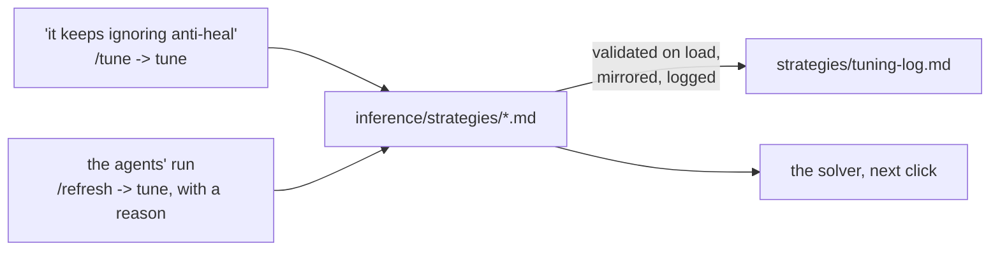

# The INFERENCE LAYER - `inference/`

Facts in, the optimal composition out. The layer owns the right-hand
side of the equation in [architecture.md](architecture.md):

```
STRATEGIES = CONSTRAINTS ∪ HEURISTICS ∪ ASSUMPTIONS   the playbook: markdown files in strategies/
COMP       = ARGMAX[ STRATEGIES( FACTS ) ]  the solver searches; the agent argues
```

Two things infer:

- **The solver**: deterministic arithmetic. It reads the strategy files'
  frontmatter, scores every candidate six with the facts layer's metrics,
  and returns the best. No model, no API, no randomness beyond a seeded
  reference sample. It cannot read prose.
- **The agent**: a Claude Code session on the `/comp` skill. It reads the
  same facts and the prose of the same strategies and reconciles them
  where arithmetic cannot. It runs when you ask it to, never on its own,
  on your subscription.

## How a strategy file works

Drop a markdown file into `strategies/` and it is live: the solver reads
the directory on every call, the board's playbook panel shows it, the
`strategies` tool and the `strategy://` resources serve it, and
`load_authored` mirrors it into the `strategies` table so the database
knows the catalog's shape. The frontmatter is the whole contract:

```markdown
---
name: Answer every revealed enemy
kind: heuristic                 # constraint | heuristic | assumption
category: matchup
direction: maximize             # heuristics: maximize | minimize
metric: team.coverage_share     # a key from the metrics registry
weight: 3
when: enemy.size >= 1           # optional guard, either kind
---
# Answer every revealed enemy
The share of revealed enemies at least one of our picks answers...
```

| kind | form | frontmatter | what the solver does |
| --- | --- | --- | --- |
| heuristic | | `metric`, `direction`, `weight` | normalises the metric to [0, 1] against a seeded sample of legal sixes for the board (flipped for minimize) and adds `weight x norm`; guarded on the six's own state (`team.*`, or a `matchup.*` key blue decides) it is a need and adds `weight x (norm - 1)` - met it costs nothing, unmet its weight - and the needs on one guard are scaled to cost `NEED_BUDGET` (2) together at most; bounds come from the reference sixes the guard holds on, and with no spread there a reward reads 0.5 and a need costs nothing |
| constraint | limit | `require: <expr>`, optionally `soft: true` + `penalty: <number>` | discards a candidate that fails (a soft one subtracts the penalty) |
| constraint | scored | `bonus: <expr>` and/or `penalty: <expr>`, optionally `when` | adds `weight x (bonus - penalty)` while `when` holds |
| assumption | | nothing - prose by definition | nothing: what the solver takes as given and the agent holds a comp to; shown on the board and read by the session |
| constraint or heuristic | draft | name, kind and prose only | nothing yet: shown and served, ignored by the solver, until `/strategy` infers the rest or turns it into an assumption |

A strategy's prose is three sentences at most (`add_strategy` refuses
more): the claim, why and when, what is measured.

**The solver never infers a formula or a weight from prose; a model does**
- the `/strategy` skill on command, or the engine on its own through
`derive.py`. The skill takes three things - a name, a kind, and up to
three sentences of what the strategy means - reads the vocabulary
(`metrics`) and the catalog for the house style, decides the frontmatter
(a heuristic's metric, direction and weight; a constraint's `require`, or
its `when`, `bonus`, `penalty` and `params`; or `kind: assumption` when
nothing is measurable), and stores the file through `add_strategy`, which
validates it against the catalog before it exists, mirrors it into the
`strategies` table, and logs it with a reason that quotes the prose. A
file you drop in yourself with only a name, a kind and prose loads as a
*draft*: the board and the `strategies` tool show it, `infer` results list
it as not yet scored, and `/strategy` completes it through
`infer_strategy`.

**The engine derives drafts on its own, on the subscription.** `derive.py`
asks Claude Code in print mode (`claude -p`, from a neutral directory, no
project settings, no tools) for one JSON answer - the same inference the
skill does, headless - and stores it through the same validated path,
sending the catalog's objection back once if the first answer is refused.
It runs wherever the claude CLI is signed in, which is the host:
`load_authored` derives pending drafts before it mirrors, `orchestrator.py
up` and `status` derive them and re-mirror the stack's database, and the
`derive_strategies` tool does it on demand. Inside the containers the CLI
is absent, so drafts stay pending until the host runs. No API key
anywhere. Sign the CLI in once with `claude login`; until then the engine
says so and leaves the draft as it was.

Expressions are a whitelist, compiled once and validated against the
metrics registry when the catalog loads: the `team`, `enemy`, `matchup`,
`map`, `world` and `params` sections, arithmetic, comparisons, `and`,
`or`, `not`, `x if c else y`, and `min`, `max`, `abs`, `round`, `len`,
`int`, `float`, `bool`. A key that is not in the registry, or a
`params.NAME` not declared under `params:`, is refused at load, so a typo
never scores silently. `params:` (an indented block of NAME: number) are
the dials an expression reads as `params.NAME`.

The catalog - every file, and the full vocabulary a strategy may
reference - is generated into the end of this document.

## How the weights move



Weights do not learn on their own: no match signal is recorded, and the
backlog holds what learning would take. The board's sliders (under each
heuristic in the playbook tab) override a weight for one board at a time -
`weight=<id>:<0..10>` on `/board`, `weights` on the `board` tool - and
the file is untouched until the slider's *store*, which is a `tune` call;
every result names the weights it was scored under. One path changes a
file, logged in `strategies/tuning-log.md` with a reason and who asked:
**`tune`**, one validated frontmatter edit - `weight` (0..10),
`direction`, `soft`, `when`, `require`, `bonus`, `penalty`, `metric`, or a
`params.NAME` dial. The edited file is loaded through the catalog before
it is written, so an invalid change never lands. The `/tune` skill is the
conversational front: "it keeps ignoring anti-heal" becomes a `tune` call
and a re-run of the board to show the effect.

## Layout

```
inference/
  __init__.py      the package's map
  README.md        a citation for every strategy: the community threads a rule
                   was drawn from, or the user's word for an assumption
  strategies/      the playbook: one markdown file per constraint, heuristic
                   or assumption, and tuning-log.md
  catalog.py       reads, validates and mirrors the strategy files
  expr.py          the expression language the frontmatter uses
  solver.py        enumerate, prune, normalise, score, refine
  engine.py        infer(), evaluate(), board(): the solver plus citations
  reach.py         a board on which a hero is the optimal pick
  tune.py          one validated, logged edit to a strategy file; add and complete
  derive.py        the engine asking the model for a draft's frontmatter
  serve.py         the HTTP service the compose stack's ui container calls
```

| file | purpose |
| --- | --- |
| `catalog.py` | Parses each file's frontmatter (a flat dialect plus one `params:` block), builds a `Strategy` with `kind`, `form`, compiled expressions and validation against the metrics registry, orders the catalog (constraints - limits, then scored - heuristics, assumptions), mirrors it into the `strategies` table, and writes the catalog at the end of this document. |
| `expr.py` | A safe subset of Python expressions: the AST is checked once, compiled, and evaluated over a scope whose missing keys read as zero, so a metric that does not apply to a board never crashes a score. |
| `solver.py` | For a board: every role shape the hard limits allow around the locked picks; per-role pools of released heroes (an announced hero waits for its release) ranked by standing (a hero's mean score across the reference sixes it is in, plus 0.5 per locked partner), the prior breaking ties and ranking alone when nothing has scored; every candidate prepared (namespace, limit check, raw metric values), scored with the frozen bounds and slimmed to its score and tie-break, so a search of thousands holds only verdicts; local search from the best six sixes and the best of every shape within 4 points of the best, swapping any open slot for any same-role released hero on the roster, then bringing each of the wiki's synergy pairs into the best sixes two slots at a time; the winners hydrated again with their breakdown. The bounds come from a seeded reference sample of legal sixes for that map, side, enemy and bans, so `infer`, `evaluate` and the current comp share one scale and a score means the same thing across calls. |
| `engine.py` | `infer` (the optimal six around the locked picks), `evaluate` (a full six ranked against the field), `current` (the picks as they stand, partial or full), and `board`: at any stage of a draft, blue's optimal as the counter to red's selection, red's optimal as their counter to blue's, both current comps scored on those scales, blue's picks against red's best counter, blue's locked picks with the empty slots filled, red's likely starting comp, the fight odds, the game plan in prose, and the shapes the playbook's limits allow. Its four searches - blue's optimal, red's counter, the fill, the countered case - are each split across a pool of spawned workers in four rounds: the reference sample, the sample again for each hero's standing (its mean score across the reference sixes it is in, which ranks each role's pool of six), the enumeration, then the ranking and the local search. Only verdicts cross (hero ids, score, tie-break) and slices partition their round, so the answer does not depend on the split. The pool is `max(6, min(cores, 12))` workers; `COUNTRIX_WORKERS` overrides; `COUNTRIX_PARALLEL=0`, a single core or a caller-supplied catalog keeps it in one process; a dead worker means that board runs sequentially and the pool is rebuilt. Each result carries the picks with reasons and `[F#]` citations into the board's FactSet, the score breakdown per strategy, alternatives, and the assumptions as "ground rules to reconcile against". |
| `reach.py` | Every hero is the right pick somewhere: for a hero, a board that suits it (its maps, a red it answers, a side, the match's bans spent on the rivals holding its seat) on which it is in the optimal six, or the closest it came. The `reach` tool runs it; `tests/fixtures/reach.json` records a board per released hero and the suite checks none is lost. A hero no board seats is one the facts or the strategies cannot see. |
| `tune.py` | `tune(id, field, value, reason)`: one frontmatter edit; `add(id, name, kind, prose, fields, reason)`: a new file from what the user gave and what `/strategy` inferred; `complete(id, fields, reason)`: a draft's frontmatter in one step. Each is validated by loading the catalog with the new text, then written, re-mirrored and logged. |
| `derive.py` | `derive()`: for every draft, the prompt (the three inputs, the vocabulary, one finished file of each form for style), `claude -p` on the subscription, the JSON answer through `tune.complete`, one retry carrying the catalog's objection; at most ten drafts a run. `available()` says whether the CLI is here. |
| `serve.py` | `/board`, `/infer`, `/evaluate`, `/strategies`, `/health` - the same functions, over HTTP, for a board that runs in another container. |

## The skills

`/strategy`, `/comp`, `/tune` and `/up` are this layer's; [skills.md](skills.md)
documents them and [mcp.md](mcp.md) the tools they run on (`infer`,
`evaluate`, `board`, `reach`, `facts`, `strategies`, `metrics`,
`add_strategy`, `infer_strategy`, `derive_strategies`, `tune`,
`tuning_log`), which is what
makes a session and the board see the same numbers.

## The catalog

<!-- generated:catalog -->
5 files in `inference/strategies/`: 0 constraints (0 limits, 0 scored), 0 heuristics and 5 assumptions. Regenerated by `python -m db.mcp call db_docs`.

#### Assumptions

##### This is Open Queue Ranked (`open-queue-ranked`, assumptions)

*assumption* - prose the solver takes as given and the session holds a comp to

The mode is Competitive Open Queue, 6v6: six picks per side in any mix of roles under the queue's own limit of two tanks. Rules written for Role Queue's 2-2-2 or for Quick Play do not bind here. Nothing is measured; the shape rules read from this.

##### All players play optimally (`players-play-optimally`, assumptions)

*assumption* - prose the solver takes as given and the session holds a comp to

Every player on both teams plays their hero as well as it can be played. A strategy therefore encodes the game - kits, ranges, cooldowns, maps, roles - and never a lobby's habits or a rank's tendencies. Nothing is measured; the session holds every comp to it.

##### The rates are a console pull (`console-pull`, uncertainty)

*assumption* - prose the solver takes as given and the session holds a comp to

The pick, win and ban rates the board reads were captured for console play, not PC. A comp is built for console hands, and a PC figure is never assumed in its place. Nothing is measured.

##### Not rank specific (`rank-agnostic`, uncertainty)

*assumption* - prose the solver takes as given and the session holds a comp to

The playbook applies at every rank alike: the rates are the all-ranks figures and no rule turns on a rank. A hero whose value swings by rank is noted as uncertainty, never as a rank's rule. Nothing is measured.

##### Region agnostic (`region-agnostic`, uncertainty)

*assumption* - prose the solver takes as given and the session holds a comp to

The playbook applies in every region alike. The rates it reads are one region's capture, a stated proxy for direction and never for decimals, and no rule turns on where a match is played. Nothing is measured.

#### The vocabulary

Every key a strategy may reference, with its meaning. `enemy.*` are
the `team.*` metrics computed for the red side.

| key | meaning |
| --- | --- |
| `team.size` | picks locked on this team |
| `team.open_slots` | slots still open (6 - size) |
| `team.tanks` | tank count |
| `team.damage` | damage count |
| `team.supports` | support count |
| `team.subrole_diversity` | distinct subroles / size (1.0 = every pick a different job) |
| `team.subroles` (text) | the subroles present |
| `team.shape_flags` (text) | TANKLESS / double tank / triple DPS / NO SUPPORT / solo heal |
| `team.style_counts` (text) | picks per playstyle tag (a hero can carry several) |
| `team.style_top` (text) | the modal playstyle among the picks |
| `team.style_lean` (text) | the playstyle a strict majority of picks carry, else none |
| `team.style_fit` | share of picks tagged with the map's rewarded style (0 without a map) |
| `team.archetype_deviation` | picks over EXPECTED_SHAPE's two per role (0 without a map) |
| `team.pool_total` | team effective HP: sum of health + shield + armor, plus a form's armor by its uptime |
| `team.pool_min` | the weakest pick's pool - focus fire finds the minimum |
| `team.weakest` (text) | who holds the smallest pool |
| `team.armor_total` | summed armor, a form's by its uptime |
| `team.armor_share` | armor / pool |
| `team.shield_total` | summed recharging shields |
| `team.shield_share` | shields / pool |
| `team.squish_count` | picks at or under 250 pool |
| `team.squishies` (text) | the picks at or under 250 pool |
| `team.overhealth_total` | summed peak overhealth a kit can grant |
| `team.dps_floor` | summed published per-second damage figures (a floor: misses and healing ignored) |
| `team.dps_count` | picks whose kit publishes a per-second damage figure |
| `team.burst_max` | the biggest single hit on the team, a headshot where one counts |
| `team.one_shots` | picks whose biggest hit, not a melee swing, kills a 250-pool hero |
| `team.burst_hero` (text) | who holds the biggest single hit |
| `team.burst_ranged` | the biggest single hit from a pick that is not melee-only |
| `team.ult_damage_total` | summed max damage across the team's damage ultimates |
| `team.dmg_ults` | ultimates that carry a damage figure |
| `team.ult_cost_mean` | mean ultimate charge cost where published |
| `team.hitscan` | picks with a hitscan weapon or ability |
| `team.hitscan_reach` | hitscan picks whose weapon publishes a reach of 30 m or more |
| `team.projectile` | picks whose weapons are projectile |
| `team.beam` | picks with a damaging beam |
| `team.melee` | picks with a melee weapon |
| `team.aoe_count` | kit pieces tagged area of effect or shockwave |
| `team.aoe_damage` | kit pieces that damage an area |
| `team.range_median` | median of each pick's longest published range |
| `team.range_max` | the longest range on the team |
| `team.range_min` | the shortest longest-range |
| `team.dmg_amp` | picks that amplify someone's damage |
| `team.hps_floor` | summed sustained healing onto teammates, hp per second, reloads in |
| `team.heal_peak_total` | summed biggest single heal per pick, its own self-heal included |
| `team.heal_peak_supports` | summed biggest single heal (one cast, hp) across the supports |
| `team.heal_peak_max` | the biggest single heal a teammate can receive |
| `team.heal_ratio` | support heal peak / the roster's two-support bench |
| `team.hps_supports` | summed sustained healing across the supports, hp per second |
| `team.hps_ratio` | support sustained healing / the roster's two-support bench |
| `team.heal_amp` | picks that amplify healing |
| `team.antiheal` | picks with anti-heal |
| `team.cleanse` | picks with a cleanse |
| `team.invuln` | picks with an invulnerability or a death-prevention |
| `team.team_cleanse` | picks with a cleanse that lands on a teammate |
| `team.team_saves` | picks with an invulnerability, death-prevention or cleanse that lands on a teammate |
| `team.lifelines` | picks carrying any healing at all, their own and lifesteal included |
| `team.cooldown_median` | median cooldown across every ability on the team |
| `team.cooldown_count` | cooldowns counted |
| `team.cc_count` | picks with crowd control (stun, sleep, immobilize, hinder, knockback) |
| `team.cc_tools` (text) | the crowd-control tools |
| `team.mobility_count` | picks with a movement or evasive ability |
| `team.mobility_tools` (text) | the movement tools |
| `team.flyers` | picks that fly or hover |
| `team.light_flyers` | picks that fly or hover, tanks aside |
| `team.barrier_hp` | summed barrier health the team fields |
| `team.barrier_count` | picks with a barrier |
| `team.barrier_piercers` | picks whose kit ignores barriers |
| `team.pierce_dps` | summed damage of the picks whose kit ignores barriers |
| `team.deployables` | picks with deployables |
| `team.synergy_edges` | the wiki's synergy pairs among the picks |
| `team.synergy_score` | summed synergy scores among the picks |
| `team.synergy_density` | synergy edges / possible pairs |
| `team.isolated_count` | picks with a documented partner somewhere and none on the team |
| `team.isolated` (text) | the isolated picks |
| `team.core_size` | largest connected group in the team's synergy graph |
| `team.pairs` (text) | the synergy pairs present |
| `team.win_mean` | mean all-ranks win rate |
| `team.pick_mass` | summed all-ranks pick rate |
| `team.availability` | chance every pick survives the ban screen: product of (1 - ban) |
| `team.map_availability` | the same from this map's ban rates (the all-ranks ban where a map publishes none; equal to availability without a map) |
| `team.max_ban_rate` | the highest ban rate on the team |
| `team.max_ban_hero` (text) | who carries the highest ban rate |
| `team.rank_sensitive_count` | picks whose win rate swings 6+ points across ranks |
| `team.trend_sum` | summed win-rate movement since the rates last changed |
| `team.map_known` | 1 if a map is set |
| `team.map_win_mean` | mean win rate on the map (the all-ranks mean without a map) |
| `team.map_pick_mass` | summed pick rate on the map |
| `team.map_specialists` | picks running 2.5+ points over their own baseline here |
| `team.map_offmap` | picks running 2.5+ points under their own baseline here |
| `team.map_strategy_hits` | picks whose three best maps by rate include this map |
| `team.coverage` | enemies answered by at least one pick |
| `team.coverage_share` | coverage / enemies revealed |
| `team.unanswered` (text) | enemies no pick answers |
| `team.answer_edges` | (enemy, pick) counter edges: picks answering enemies |
| `team.exposure_edges` | (pick, enemy) counter edges: enemies answering picks |
| `team.exposed_count` | picks answered by at least one enemy |
| `team.exposed` (text) | the exposed picks |
| `team.safe_count` | picks no enemy answers |
| `team.net_edges` | answer edges minus exposure edges |
| `team.double_covered` | enemies answered by two or more picks |
| `team.banproof_coverage` | coverage recomputed without the highest-ban answerer |
| `matchup.pool_diff` | blue effective HP minus red |
| `matchup.dps_diff` | blue damage floor minus red |
| `matchup.hps_diff` | blue healing floor minus red |
| `matchup.burst_vs_heal` | blue's biggest hit minus red's biggest single save |
| `matchup.heal_vs_burst` | blue's biggest single save minus red's biggest hit |
| `matchup.chew_time_ours` | seconds of blue's floor damage to chew red's pool (999 if unknown) |
| `matchup.chew_time_theirs` | seconds of red's floor damage to chew blue's pool |
| `matchup.tempo_diff` | red median cooldown minus blue's (positive: blue cycles faster) |
| `matchup.range_diff` | blue median reach minus red's |
| `matchup.exposure_share` | share of blue answered by red |
| `matchup.dive_pressure` | red picks with a movement tool |
| `matchup.flyers` | red picks that fly, tanks aside |
| `matchup.barrier_need` | barrier health red fields |
| `matchup.antiheal_need` | red supports' summed peak heal |
| `matchup.ult_threat` | red's summed damage-ultimate ceiling |
| `matchup.ult_answers` | blue invulnerabilities plus cleanses |
| `matchup.style_lean_red` (text) | red's majority playstyle, else none |
| `map.known` | 1 if a map is set |
| `map.sided` | 1 if the mode has an attacking and a defending side (Escort, Hybrid) |
| `map.side` (text) | this seat's side on a sided map: attack, defense, or empty |
| `map.style_top` (text) | the playstyle the map rewards most: the rates' lift plus the terrain's lean |
| `map.style_margin` | top style score minus the runner-up, in sd |
| `map.mode` (text) | the game mode |
| `map.stages` | separate arenas, one played at a time: Control's 3, Flashpoint's 5; else 0 |
| `map.phases` | named parts of one route, played in order: Hybrid's 2, an Escort map's named stretches; else 0 |
| `map.bans` | bans already made in this match: a ban rate is a risk only before them |
| `map.chokes` | chokepoints, narrow streets, corridors, tunnels, gates and doorways: the wiki article's mentions per thousand words, in sd from the mean of the maps with text (0 with no text) |
| `map.interiors` | rooms, caves and other indoor ground: the wiki article's mentions per thousand words, in sd from the mean of the maps with text (0 with no text) |
| `map.high_ground` | high ground, rooftops, balconies and other vertical ground: the wiki article's mentions per thousand words, in sd from the mean of the maps with text (0 with no text) |
| `map.flanks` | flank routes and side paths: the wiki article's mentions per thousand words, in sd from the mean of the maps with text (0 with no text) |
| `map.sightlines` | long sightlines: the wiki article's mentions per thousand words, in sd from the mean of the maps with text (0 with no text) |
| `map.open_ground` | open ground and ground said to lack cover: the wiki article's mentions per thousand words, in sd from the mean of the maps with text (0 with no text) |
| `map.hazards` | drops, pits and other environmental hazards: the wiki article's mentions per thousand words, in sd from the mean of the maps with text (0 with no text) |
| `map.cover` | cover: the wiki article's mentions per thousand words, in sd from the mean of the maps with text (0 with no text) |
| `world.heal_bench` | 2 x the median peak heal across the released supports |
| `world.hps_bench` | 2 x the median sustained healing across the released supports |
| `world.roster_size` | heroes in the roster |
<!-- /generated:catalog -->
